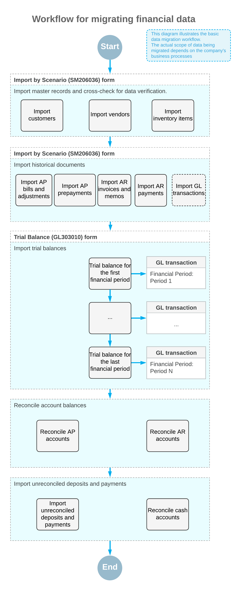

# Data Migration Process: Migration of Financial Data {#_1167e761-cddb-476b-bd12-291287c6cad4 .concept}

This topic describes the general process of migrating data from a legacy system to Acumatica ERP.

**Attention:** The complete list of data to be imported depends on company's business processes.

## Migration of Financial Data { .section}

To import the data completely and accurately and to minimize import errors, you import documents and balances by performing the following general steps in the listed order:

1.  You import the following master records:
    -   Customers
    -   Vendors
    -   Non-stock items
2.  You import financial documents. For each type of document, you use the same import scenario to import both closed documents and documents with an open balance.

    To import accounts receivable or accounts payable documents to Acumatica ERP, you need to activate migration mode in the accounts receivable subledger and accounts payable subledger, respectively. The documents that are created when migration mode is activated do not update the general ledger.

3.  You upload and release the trial balances for the needed financial periods. When this process is complete, you make sure that the final trial balance in Acumatica ERP matches the trial balance in the legacy system.

    **Attention:** Though you can import historical GL transactions instead of importing trial balances, the import of trial balances is the preferable way of migrating financial data. Importing the trial balances helps to limit the number of historical transactions in the database.

4.  You perform the reconciliation of account balances for the accounts receivable and accounts payable subledger.
5.  You import outstanding checks and deposits in progress and then reconcile the cash account balance.

The following diagram illustrates the basic workflow for migrating financial data for a company with one branch.

**Parent topic:**[Preparing System to Migrating Data](../UserGuide/DataMigration_DM_Process_Mapref.md)

