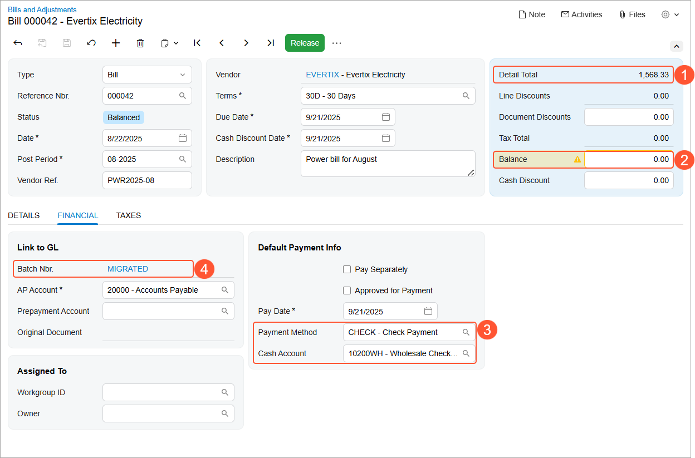
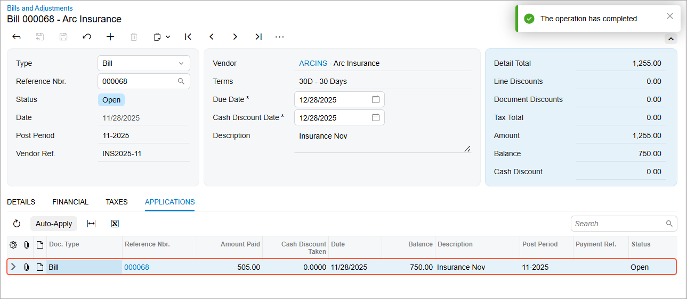
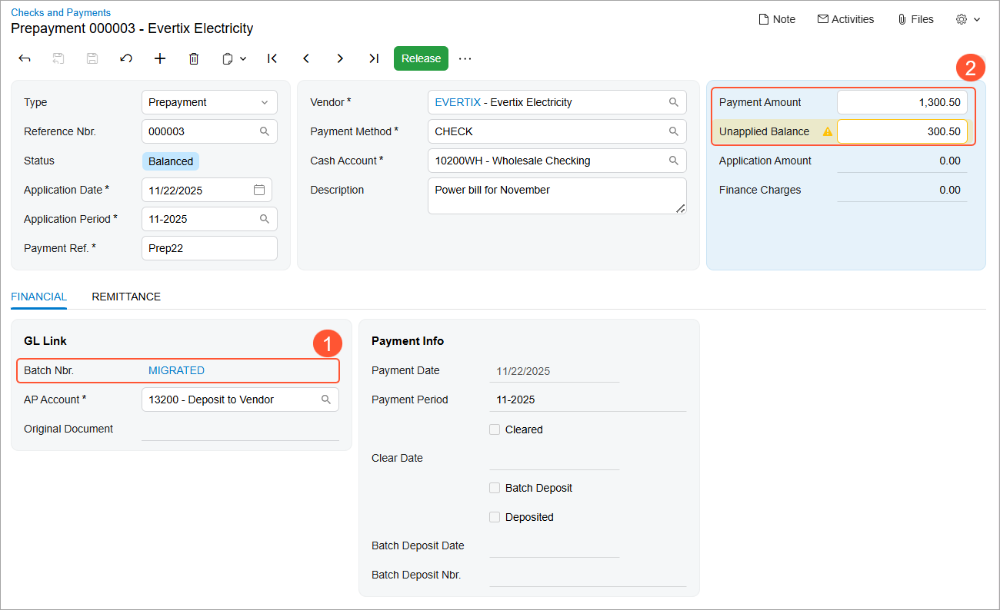
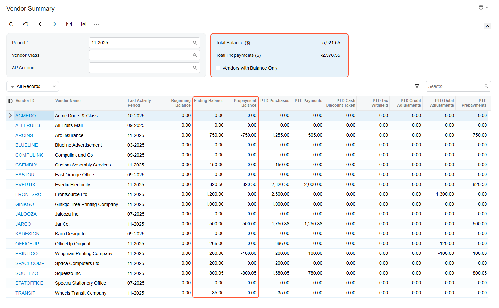

# Migration of Financial Documents: To Import AP Documents {#_f25802aa-c20f-427d-af6d-a4024e827ab2 .task}

The following activity will walk you through the process of importing AP documents to Acumatica ERP.

**Attention:** This activity is based on the *U100 Basic Company* dataset. If you are using another dataset, or if any system settings have been changed in *U100 Basic Company*, these changes can affect the workflow of the activity and the results of the processing. To avoid any issues, restore the *U100 Basic Company* dataset to its initial state.

## Story { .section}

Suppose that you are an implementation consultant of the SweetLife Fruits &amp; Jams company, and you are performing data migration from the legacy ERP system to Acumatica ERP. You have imported the following master records: customer, vendors, and non-stock items.

Now you need to import accounts payable documents. Specifically, you will import open and closed bills, along with prepayments with an open balance.

## Configuration Overview {#section_tz4_djx_cnb .section}

In the *U100 Basic Company* dataset, the following tasks have been performed for the purposes of this activity:

-   On the [Enable/Disable Features](CS_10_00_00.md) \(CS100000\) form, the minimum set of financial features has been enabled.
-   On the [Companies](CS_10_15_00.md) \(CS101500\) form, the SweetLife company without branches has been configured by performing the steps described in [Company Without Branches: To Configure a Company Without Branches](../ImplementationGuide/config_Basic_Company_Implem_Activity_Enabling_Features.md).
-   On multiple forms, the required financial configuration has been performed, as described in the [Implementing Basic Financials](../ImplementationGuide/config_GL_Mapref.md) chapter of the Implementation Guide.

## Process Overview { .section}

You will review the Excel file with the open and closed bills to be imported. On the [Import by Scenario](SM_20_60_36.md) \(SM206036\) form, you will import the prepared bills. You will release the imported bills on the [Bills and Adjustments](AP_30_10_00.md) \(AP301000\) and [Release AP Documents](AP_50_10_00.md) \(AP501000\) forms.

After that, you will review the Excel file with the prepayments to be imported. You will import prepayments on the [Import by Scenario](SM_20_60_36.md) form. You will release the imported prepayments on the [Checks and Payments](AP_30_20_00.md) \(AP302000\) and the [Release AP Documents](AP_50_10_00.md) forms. After all documents have been imported, you will verify imported vendor balances on the [Vendor Summary](AP_40_10_00.md) \(AP401000\) inquiry form. Finally, you will deactivate migration mode for the AP subledger on the [Accounts Payable Preferences](AP_10_10_00.md) \(AP101000\) form.

## System Preparation { .section}

To prepare to perform the instructions of this activity, do the following:

1.  Download the `SweetLifeAPDocumentLines2025.xlsx` and `SweetLifeAPPrepayments2025.xlsx` files provided with the course.
2.  As a prerequisite activity, complete [Migration of Master Records: To Import Master Records](DataMigration_Import_Master_Records_Activity.md) to import non-stock items and vendors into the system.
3.  On the **General** tab \(**Posting Settings** section\) of the [Accounts Payable Preferences](AP_10_10_00.md) \(AP101000\) form, select the **Activate Migration Mode** check box, and save changes.
4.  In the **Data Entry Settings** section on the same tab, make sure that the **Validate Document Totals on Entry** check box is cleared.

    **Tip:** This check box is generally selected to minimize errors during manual data entry of the documents received from vendors. You do not need to verify the control totals when importing the documents by using import scenarios.

## Step 1: Migrating AP Bills { .section}

To migrate AP bills, do the following:

1.  Open and review the `SweetLifeAPDocumentLines2025.xlsx` file, which contains the AP documents to be imported. The file has one spreadsheet with the bill information required for the import scenario, which includes the document type, vendor ID, date and post period of the document, document description, and inventory ID \(if applicable\). Notice that the line amount is specified in the **Amount** column, while the open balance is specified in the **Balance** column. The documents that have an open balance of *0* will be closed on release.
2.  On the [Import by Scenario](SM_20_60_36.md) \(SM206036\) form, select the *ACU Import AP Bills* scenario.
3.  On the More menu, click **Upload File Version**. The **Upload New Revision** dialog box opens.
4.  In the dialog box, click **Choose File**, select the `SweetLifeAPDocumentLines2025.xlsx` file and click **Upload**. The system uploads the file and closes the dialog box.
5.  On the form toolbar, click **Prepare** to upload the data from the file.
6.  On the form toolbar, click **Import** to import the document data listed on the **Prepared Data** tab into the system; wait until the processing completes. On the Bills and Adjustments \(AP3010PL\) list of records, review the uploaded records. Ensure that the table footer indicates that 69 records have been imported.
7.  On the [Bills and Adjustments](AP_30_10_00.md) \(AP301000\) form, open the imported bill with the *000042* reference number and review its details. The bill has the *Balanced* status. The total amount of the bill lines before deductions \($1,568.33\) is shown in the **Detail Total** box \(Item 1 in the screenshot below\) of the Summary area. The balance of the bill is $0 \(Item 2\), which means that the bill will be closed on release.

    **Tip:** You can review the amount of the document after application of taxes and discounts in the **Amount** column on the Bills and Adjustments \(AP3010PL\) list of records. This amount will appear in the Summary area of the [Bills and Adjustments](AP_30_10_00.md) \(AP301000\) form after the bill release.

    On the **Financial** tab, notice that the system has inserted the default payment method and cash account \(Item 3\) that are specified for the vendor selected in the bill \(the *CHECK* payment method and the *10200WH* cash account\). Also, on the same tab, notice that *MIGRATED* \(Item 4\) is specified in the **Batch Nbr.** box, indicating that this document has been imported in migration mode.

    

8.  On the same form, open the bill with the *000068* reference number and review its details. The **Detail Total** is $1,255.00, while the open balance of the bill is $750.00.
9.  On the form toolbar, click **Release**. On release of the bill, the system assigns it the *Open* status. On the **Applications** tab, review the application that the system has created to record the partial payment of the bill. The amount of *505.00* has been paid, while the balance of *750.00* is still open. On release of the bill, the system has updated the vendor balance without producing any general ledger transactions.

    

    **Tip:** The open balance of the imported bill is also shown in the **Migrated Balance** box on the **Financial** tab of the form.

10. On the form toolbar of the [Release AP Documents](AP_50_10_00.md) \(AP501000\) form, click **Release All** to release the other imported bills at once.

## Step 2: Migrating Open AP Prepayments { .section}

To import the vendor prepayments with open balances, do the following:

1.  Open and review the `SweetLifeAPPrepayments.xlsx` file, which contains the open AP prepayments to be imported. The file has one spreadsheet with the prepayment information required for the import scenario, including the payment reference number, vendor, payment method, cash account, and payment date and period. Notice that the prepayment amount is specified in the **Payment Amount** column, while the open balance is specified in the **Unapplied Balance** column.

    **Attention:** The payment reference number may be required for a payment method; if an imported prepayment does not have a payment reference number, the system will not be able to save it during import.

2.  On the [Import by Scenario](SM_20_60_36.md) \(SM206036\) form, select the *ACU Import AP Prepayments* scenario.
3.  On the More menu, click **Upload File Version**. The **Upload New Revision** dialog box opens.
4.  In the dialog box, click **Choose File**, select the `SweetLifeAPPrepayments2025.xlsx` file, and click **Upload**. The system uploads the file and closes the dialog box.
5.  On the form toolbar, click **Prepare** to upload the data from the file.
6.  On the form toolbar, click **Import** to import the document data from the **Prepared Data** tab into the system; wait until the processing completes. You have imported six documents.
7.  On the [Checks and Payments](AP_30_20_00.md) \(AP302000\) form, open the imported prepayment with the *000003* reference number, and review its details. The prepayment has the *Balanced* status. Notice that on the **Financial** tab, *MIGRATED* is shown in the **Batch Nbr.** box \(Item 1 in the following screenshot\), which indicates that this document has been imported in migration mode. In the Summary area, the **Unapplied Balance** box shows the open balance of the prepayment, which is $300.50. The **Payment Amount** box shows the total amount of the prepayment, which is $1,300.50 \(Item 2\).

    

8.  On the form toolbar of the [Release AP Documents](AP_50_10_00.md) \(AP501000\) form, click **Release All** to release all the imported prepayments at once.

## Step 3: Reviewing Vendor Balances { .section}

To review how imported documents affected vendor balances, do the following:

1.  On the [Vendor Summary](AP_40_10_00.md) \(AP401000\) inquiry form, clear the **Vendors with Balance Only** check box, select the 11-2025 financial period and review the list of vendors. The vendor balances have been initialized for the vendors for which you have imported documents, as the **Ending Balance** and **Prepayment Balance** columns indicate. In the Selection area, make sure that the total amount of the imported prepayments is –$2,970.55 and the total vendor balance is $5,921.55.

    

2.  On the [Accounts Payable Preferences](AP_10_10_00.md) \(AP101000\) form, clear the **Activate Migration Mode** check box. You are done migrating AP documents, so this mode no longer needs to be used.
3.  In the **Data Entry Settings** section, select the **Validate Document Totals on Entry** check box to make the system require the control total to be entered for every manually entered AP document, such as bills, credit adjustments, and debit adjustments.
4.  Save your changes to the form.

You have finished importing AP documents in migration mode.

**Parent topic:**[Migrating Financial Documents](../UserGuide/DataMigration_Import_Financial_Documents_Mapref.md)

