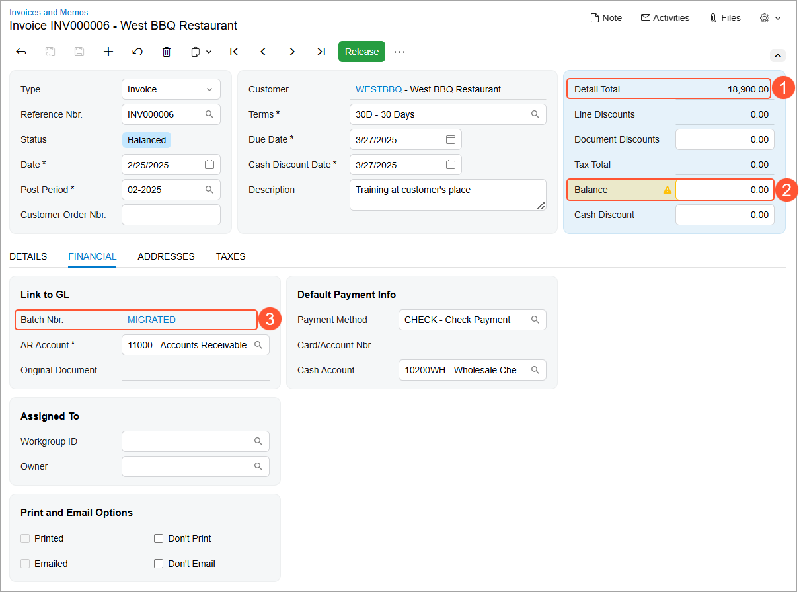
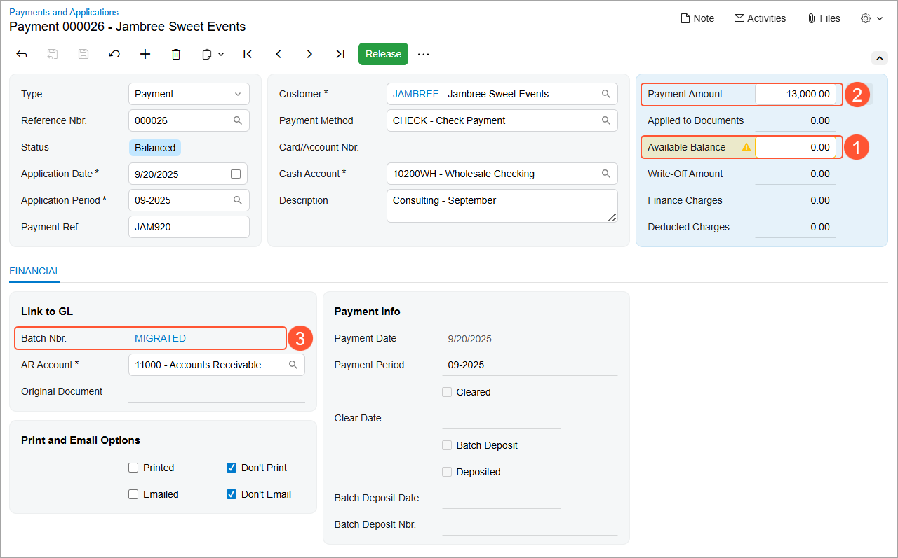
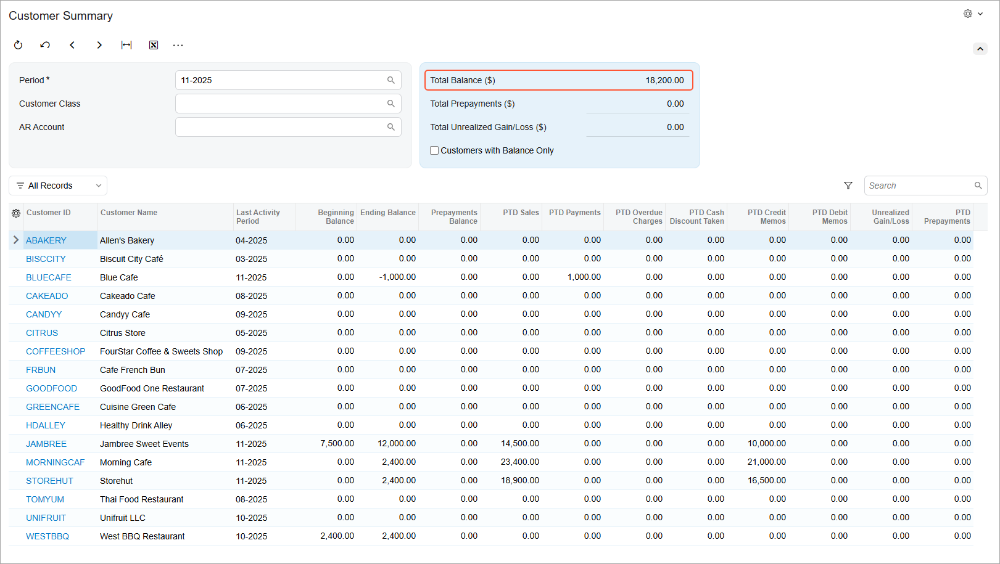

# Migration of Financial Documents: To Import AR Documents {#_f4adb2e1-c963-4c11-81ef-a6fdba47320b .task}

The following activity will walk you through the process of importing AR documents to Acumatica ERP.

**Attention:** This activity is based on the *U100 Basic Company* dataset. If you are using another dataset, or if any system settings have been changed in *U100 Basic Company*, these changes can affect the workflow of the activity and the results of the processing. To avoid any issues, restore the *U100 Basic Company* dataset to its initial state.

## Story { .section}

Suppose that you are an implementation consultant of the SweetLife Fruits &amp; Jams company, and you are performing data migration from the legacy ERP system to Acumatica ERP. You have imported the following master records: customers, vendors, and non-stock items.

Now you need to import accounts receivable documents: open and closed invoices, along with open and closed AR payments. Also suppose that you have decided to import all AR invoices with their original reference numbers and then continue numbering new invoices starting with the reference number that follows the number of the last imported document.

## Configuration Overview {#section_tz4_djx_cnb .section}

In the *U100 Basic Company* dataset, the following tasks have been performed for the purposes of this activity:

-   On the [Enable/Disable Features](CS_10_00_00.md) \(CS100000\) form, the minimum set of financial features has been enabled.
-   On the [Companies](CS_10_15_00.md) \(CS101500\) form, the SweetLife company without branches has been configured by performing the steps described in [Company Without Branches: To Configure a Company Without Branches](../ImplementationGuide/config_Basic_Company_Implem_Activity_Enabling_Features.md).
-   On multiple forms, the required financial configuration has been performed, as described in the [Implementing Basic Financials](../ImplementationGuide/config_GL_Mapref.md) chapter of the Implementation Guide.

## Process Overview { .section}

You will review the Excel file with the open and closed invoices to be imported. On the [Import by Scenario](SM_20_60_36.md) \(SM206036\) form, you will import the prepared invoices. You will release the imported invoices on the [Release AR Documents](AR_50_10_00.md) \(AR501000\) forms. Then on the [Numbering Sequences](CS_20_10_10.md) \(CS201010\) form, you will update the settings of the numbering sequences for invoices so that they are numbered automatically.

After that, you will review the Excel file with the payments to be imported. You will import open and closed payments on the [Import by Scenario](SM_20_60_36.md) form. You will release the imported payments on the [Release AR Documents](AR_50_10_00.md) forms. After all documents are imported, you will review imported customer balances on the [Customer Summary](AR_40_10_00.md) \(AR401000\) inquiry form. Finally, you will deactivate migration mode for the AR subledger on the [Accounts Receivable Preferences](AR_10_10_00.md) form.

## System Preparation { .section}

To prepare to perform the instructions of this activity, do the following:

1.  Download the `SweetLifeARInvoiceLines2025.xlsx` and `SweetLifeARPayments2025.xlsx` files provided with the course.
2.  As a prerequisite activity, complete [Migration of Master Records: To Import Master Records](DataMigration_Import_Master_Records_Activity.md) to import non-stock items and customers into the system.
3.  On the [Accounts Receivable Preferences](AR_10_10_00.md) \(AR101000\) form, select the **Activate Migration Mode** check box, and save this change.
4.  On the [Numbering Sequences](CS_20_10_10.md) \(CS201010\) form, do the following:
    -   Select the **Manual Numbering** check box for the *ARINVOICE* numbering sequence.

        The *ARINVOICE* numbering sequence is specified for the auto-numbering of invoices on the [Accounts Receivable Preferences](AR_10_10_00.md) form.

    -   In the table, delete the only row with the subsequence from the table.
    -   Save your changes. With these settings, the documents will be imported with the reference number from the legacy system.

## Step 1: Migrating AR Invoices { .section}

To import AR invoices into the system, do the following:

1.  Open and review the `SweetLifeARInvoiceLines2025.xlsx` file, which contains the AR documents to be imported. The file has one spreadsheet with the invoice information that is required for the import scenario, which includes the document type, customer ID, date and post period of the document, document description, and inventory ID \(if applicable\). Notice that the line amount is specified in the **Ext. Price** column, while the open balance of the document is specified in the **Balance** column. The documents that have an open balance of *0* will be closed on release.
2.  On the [Import by Scenario](SM_20_60_36.md) \(SM206036\) form, select the *ACU Import AR Invoices* scenario.
3.  On the form toolbar, click **Upload File Version**. The **Upload New Revision** dialog box opens.
4.  In the dialog box, click **Choose File**, select the `SweetLifeARInvoiceLines2025.xlsx` file and click **Upload**. The system uploads the file and closes the dialog box.
5.  On the form toolbar, click **Prepare** to upload the data from the file.
6.  On the form toolbar, click **Import** to import the documents listed on the **Prepared Data** tab into the system. You have imported 33 invoices.
7.  On the [Invoices and Memos](AR_30_10_00.md) \(AR301000\) form, open the imported invoice with the *INV000006* reference number and review its details. The invoice has the *Balanced* status. The total amount of the invoice lines before deductions \($18,900.00\) is shown in the **Detail Total** box of the Summary area \(Item 1 in the following screenshot\). The open balance of the invoice is $0 \(Item 2\), which means that the invoice will be closed when it is released.

    Notice that on the **Financial** tab, *MIGRATED* is shown in the **Batch Nbr.** box \(Item 3\), which indicates that this document has been imported in migration mode.

    

8.  On the same form, open the invoice with the *INV000033* reference number and review its details. The total amount of the invoice in the **Detail Total** box of the Summary area is $23,400.00, while the open balance of the invoice is $2,400. On release of the invoice, the system will assign it the *Open* status and update the customer balance without producing any general ledger transactions.
9.  On the form toolbar of the [Release AR Documents](AR_50_10_00.md) \(AR501000\) form, click **Release All** to release all the imported documents at once.

    You have finished importing invoices, so now you need to enable the auto-numbering of new invoices starting from *INV000034*.

10. On the [Numbering Sequences](CS_20_10_10.md) \(CS201010\) form, select the *ARINVOICE* numbering sequence.
11. In the table, add a row for a subsequence, and specify the following settings in the row:
    -   **Start Number**: `INV000001`
    -   **End Number**: `INV999999`
    -   **Last Number**: `INV000033`

        The last number is the reference number of the last imported invoice.

12. In the Summary area, clear the **Manual Numbering** check box to enable auto-numbering.
13. Save your changes.
14. On the [Invoices and Memos](AR_30_10_00.md) form, click **Add New Row**. Make sure that *&lt;NEW&gt;* is displayed in the **Reference Nbr.** box.

    This indicates that the next invoice will be automatically assigned a number based on the *ARINVOICE* numbering sequence that you have configured.

## Step 2: Migrating AR Payments { .section}

To import the accounts receivable payments with open balances, proceed as follows:

1.  Open and review the `SweetLifeARPayments.xlsx` file, which contains the open and closed AR payments to be imported. The file has one spreadsheet with the payment information that is required for the import scenario, including the payment reference number, customer, payment method, cash account, and payment date and period. Notice that the full payment amount is specified in the **Payment Amount** column, while the open payment balance is specified in the **Available Balance** column.
2.  On the [Import by Scenario](SM_20_60_36.md) \(SM206036\) form, select the *ACU Import AR Payments* scenario.
3.  On the form toolbar, click **Upload File Version**. The **Upload New Revision** dialog box opens.
4.  In the dialog box, click **Choose File**, select the `SweetLifeARPayments2025.xlsx` file, and click **Upload**. The system uploads the file and closes the dialog box.
5.  On the form toolbar, click **Prepare** to upload the data from the file.
6.  On the form toolbar, click **Import** to import the documents from the **Prepared Data** tab into the system. You have imported 28 payments.
7.  On the [Payments and Applications](AR_30_20_00.md) \(AR302000\) form, open the payment with the *000026* reference number and review its details. The payment has the *Balanced* status. The unapplied balance of the payment in the **Available Balance** box of the Summary area is $0 \(Item 1 in the following screenshot\), which means that the payment will be closed on release. The total amount of the payment \($13,000\) is shown in the **Payment Amount** box \(Item 2\).

    Notice that on the **Financial** tab, *MIGRATED* is shown in the **Batch Nbr.** box \(Item 3\), which indicates that this document has been imported in migration mode.

    

8.  On the form toolbar of the [Release AR Documents](AR_50_10_00.md) \(AR501000\) form, click **Release All** to release all the imported payments at once.

## Step 3: Reviewing Customer Balances { .section}

To review how imported documents affected customer balances, do the following:

1.  On the [Customer Summary](AR_40_10_00.md) \(AR401000\) inquiry form, select the 11-2025 financial period, clear the **Customers with Balance Only** check box, and review the list of customers and customer balances that have been initialized after you imported the documents. In the Selection area, make sure that the total customer balance is $18,200, as shown in the following screenshot.

    

2.  On the [Accounts Receivable Preferences](AR_10_10_00.md) \(AR101000\) form, clear the **Activate Migration Mode** check box. You are done migrating the AR documents, so this mode is no longer needed.
3.  Save your changes to the form.

You have finished importing AR documents.

**Parent topic:**[Migrating Financial Documents](../UserGuide/DataMigration_Import_Financial_Documents_Mapref.md)

