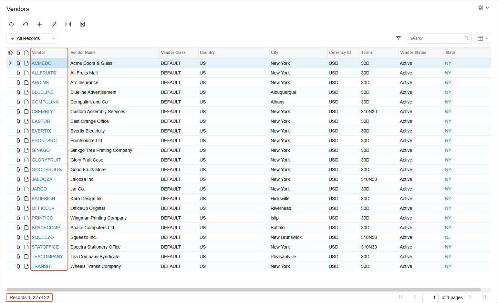
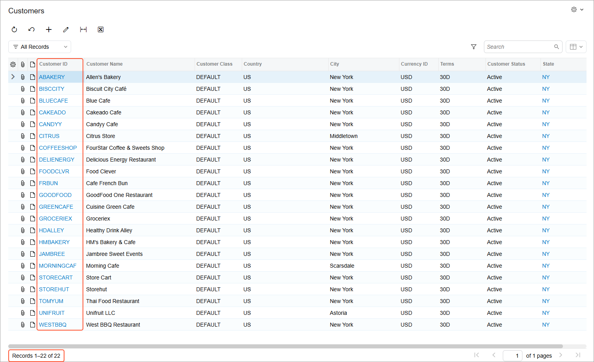
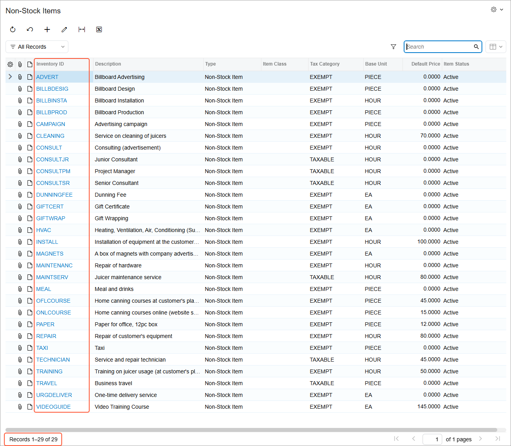

# Migration of Master Records: To Import Master Records {#_555f607d-30b2-434b-99a1-d27cf9939155 .task}

The following activity will walk you through the process of importing master records to Acumatica ERP.

**Attention:** This activity is based on the *U100 Basic Company* dataset. If you are using another dataset, or if any system settings have been changed in *U100 Basic Company*, these changes can affect the workflow of the activity and the results of the processing. To avoid any issues, restore the *U100 Basic Company* dataset to its initial state.

## Story { .section}

Suppose that you are an implementation consultant of the SweetLife Fruits &amp; Jams company, and you will be performing data migration from the legacy ERP system to Acumatica ERP. You have configured the tenant, activated the license, and performed the basic financial configuration so that the system is ready for data migration. Now you need to import the following master records: vendors, customers, and non-stock items.

## Configuration Overview {#section_tz4_djx_cnb .section}

In the *U100 Basic Company* dataset, the following tasks have been performed for the purposes of this activity:

-   On the [Enable/Disable Features](CS_10_00_00.md) \(CS100000\) form, the minimum set of financial features has been enabled.
-   On the [Companies](CS_10_15_00.md) \(CS101500\) form, the SweetLife company without branches has been configured by performing the steps described in [Company Without Branches: To Configure a Company Without Branches](../ImplementationGuide/config_Basic_Company_Implem_Activity_Enabling_Features.md).
-   On multiple forms, the required financial configuration has been performed, as described in the [Implementing Basic Financials](../ImplementationGuide/config_GL_Mapref.md) chapter of the Implementation Guide.
-   On the [Vendor Classes](AP_20_10_00.md) \(AP201000\) form, the *DEFAULT* vendor class has been created.
-   On the [Customer Classes](AR_20_10_00.md) \(AR201000\) form, the *DEFAULT* customer class has been created.

## Process Overview { .section}

On the [Import by Scenario](SM_20_60_36.md) \(SM206036\) form, you will import vendors by using a predefined import scenario. During the import, you will correct the errors that have occurred in the data being imported. Then you will review the list of imported vendors on the Vendors \(AP3030PL\) list of records and make sure that all records are presented.

After that, you will import customers by using the predefined import scenario and review the list of customers on the Customer \(AR3030PL\) list of records. Finally, you will import the non-stock items by using an import scenario provided with the course and review the results of the import on the Non-Stock Items \(IN2020PL\) list of records.

## System Preparation {#section_vq2_xhy_fdc .section}

To prepare to perform the instructions of this activity, do the following:

1.  Launch the Acumatica ERP website with the *U100 Basic Company* dataset preloaded.
2.  Sign in to the system by using the *gibbs* username and the *123* password.
3.  Download the `SweetLifeCustomersList.xlsx`, `SweetLifeVendorsList.xlsx`, and `SweetLifeNonStockItemsList.xlsx` files, which are supplied with the course.

**Attention:** For training purposes, a few errors were intentionally made in the `SweetLifeVendorsList.xlsx` file so that you can gain experience correcting data.

## Step 1: Importing Vendors { .section}

To import vendors into the system, do the following:

1.  On the [Import by Scenario](SM_20_60_36.md) \(SM206036\) form, select the *ACU Import Vendors* scenario.
2.  On the More menu, click **Upload File Version**. The **Upload New Revision** dialog box opens.
3.  In the dialog box, click **Choose File**, select the `SweetLifeVendorsList.xlsx` file and click **Upload**. The system uploads the file and closes the dialog box.
4.  On the form toolbar, click **Prepare** to upload the data from the file.

    **Tip:** Before you import data into the system, you can review the uploaded data on the **Prepared Data** tab and change any value.

5.  On the form toolbar, click **Import** to import the vendor records listed on the **Prepared Data** tab into the system. For the imported rows, the system selects the check box in the **Processed** column. For the rows that the system could not import, the **Processed** check box is cleared, and an error icon appears in the leftmost column.
6.  To correct errors in the prepared data in the table, do the following:
    1.  In the line with the *4* line number, enter `DEFAULT` in the **Vendor Class** column \(because this is the only predefined vendor class currently available in the system\). Save your changes.

        **Tip:** The system will continue to display an error next to the column until you complete the next step of these instructions, which is to initiate error clearing.

    2.  In the line numbered *14*, enter `CASH` in the **Payment Method** column \(because this is the payment method that should be used\). Save your changes.

        **Important:** After correcting a value, you must click **Save** before running the import process. Otherwise, the changes to the prepared data will not be saved, and the system will attempt to import the old value.

7.  On the table toolbar, click **Clear Errors**.
8.  Save your changes.
9.  On the form toolbar, click **Import** to rerun the import.

    The system will upload the remaining records that have not been processed yet \(that is, those with the **Active** check box selected and the **Processed** check box cleared\).

10. On the Vendors \(AP3030PL\) list of records, review the list of the uploaded vendor records. Make sure that the table footer indicates that 22 vendor records are available in the table, which means that all vendors have been imported successfully. The vendors have been imported with their IDs from the legacy system \(as shown in the following screenshot\).

    

    **Attention:** The vendors' balances have not yet been initialized in the system. The first vendor document that you create or import into the system for each vendor initializes the vendor balance, and after that, the vendor appears on inquiries and in reports.

## Step 2: Importing Customers { .section}

To import customers into the system, do the following:

1.  On the [Import by Scenario](SM_20_60_36.md) \(SM206036\) form, select the *ACU Import Customers* scenario.
2.  On the More menu, click **Upload File Version**. The **Upload New Revision** dialog box opens.
3.  In the dialog box, click **Choose File**, select the `SweetLifeCustomersList.xlsx` file, and click **Upload**. The system uploads the file and closes the dialog box.
4.  On the form toolbar, click **Prepare** to upload the data from the file.
5.  On the form toolbar, click **Import** to import the customer records from the table on the **Prepared Data** tab into the system. The system uploads all the records. For the imported rows, on the **Prepared Data** tab, the system selects the check box in the **Processed** column.
6.  On the Customers \(AR3030PL\) list of records, review the list of uploaded customer records. Make sure that the table footer indicates that 22 customer records are available in the table, which means that all customers have been imported successfully. The customer have been imported with their IDs from the legacy system \(as shown in the following screenshot\).

    

    **Attention:** The customers' balances have not yet been initialized in the system. The first customer document that you create or import into the system for each customer initializes the customer balance, and after that, the customer appears on inquiries and in reports.

## Step 3: Importing Non-Stock Items { .section}

To import non-stock items into the system, do the following:

1.  On the [Import by Scenario](SM_20_60_36.md) \(SM206036\) form, select the *DM Import Non-Stock Items* import scenario.
2.  On the More menu, click **Upload File Version**. The **Upload New Revision** dialog box opens.
3.  In the dialog box, click **Choose File**, select the `SweetLifeNonStockItemsList.xlsx` file, and click **Upload**. The system uploads the file and closes the dialog box.
4.  On the form toolbar, click **Prepare** to upload the data from the file.
5.  On the form toolbar, click **Import** to import the non-stock item records from the table on the **Prepared Data** tab into the system. The system will upload all the records. For the imported rows, on the **Prepared Data** tab, the system selects the check box in the **Processed** column.
6.  On the Non-Stock Items \(IN2020PL\) list of records, review the list of uploaded non-stock item records and make sure that all items have been imported. Make sure that the table footer shows that 29 records are available in the table, which means that all non-stock items have been imported successfully. The non-stock items have been imported with their IDs from the legacy system \(as shown in the following screenshot\).

    

You have finished importing master records.

**Parent topic:**[Migrating Master Records](../UserGuide/DataMigration_Import_Master_Records_Mapref.md)

