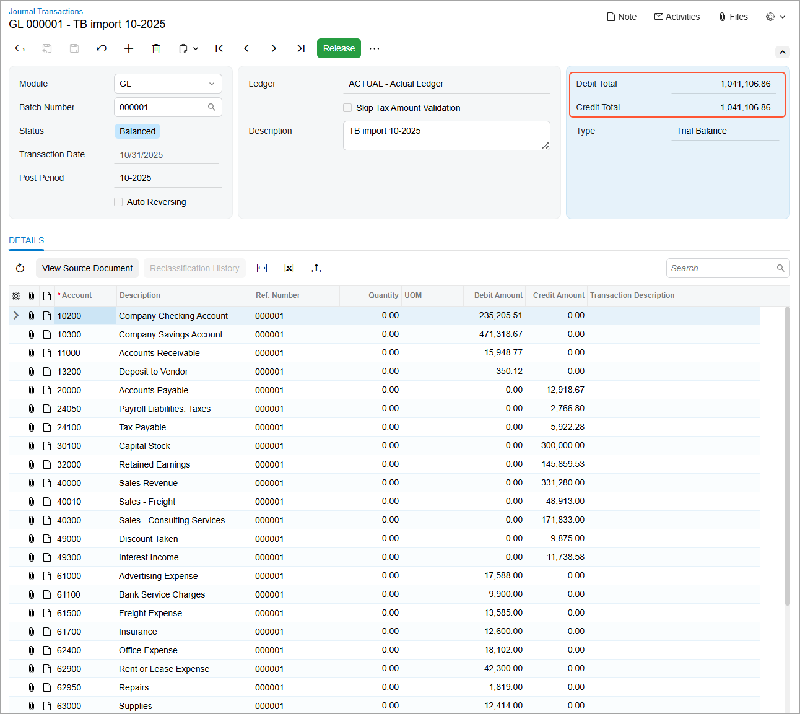
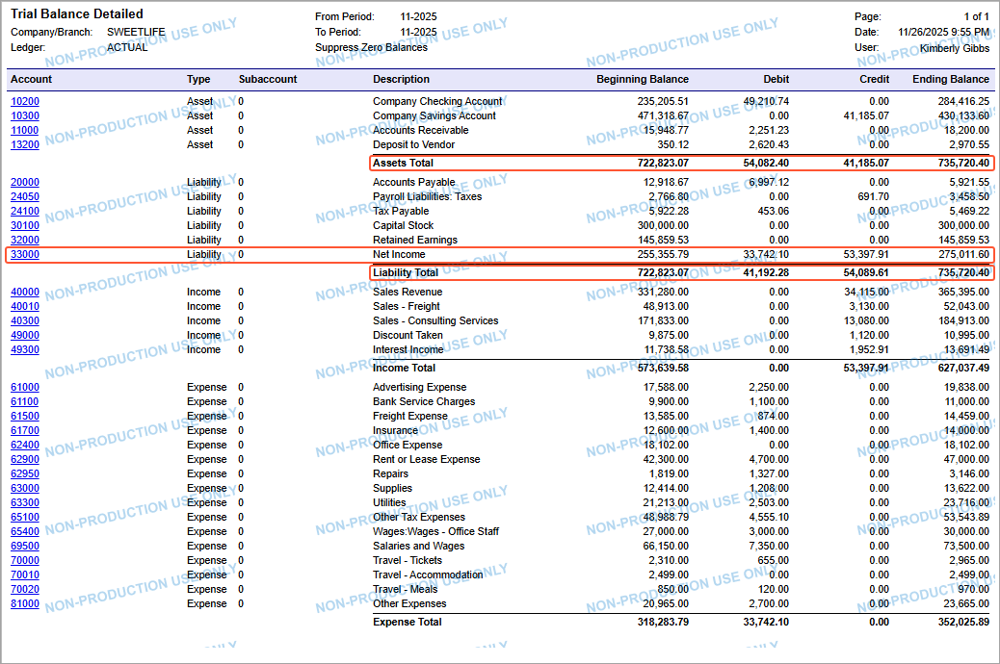

# Migration of Trial Balances: To Import Trial Balances {#_748dd5f4-7932-491c-bec4-c6dca8e8f6e7 .task}

The following activity will walk you through the process of importing trial balances into the system.

**Attention:** This activity is based on the *U100 Basic Company* dataset. If you are using another dataset, or if any system settings have been changed in *U100 Basic Company*, these changes can affect the workflow of the activity and the results of the processing. To avoid any issues, restore the *U100 Basic Company* dataset to its initial state.

## Story { .section}

Suppose that you are an implementation consultant who is performing data migration from the legacy system to Acumatica ERP. You have imported master records and historical documents.

Now you need to upload the actual balances of the general ledger accounts to the system. You have decided to upload the trial balances for the last two financial periods in which the company has operated in the legacy system \(October and November 2025\).

## Configuration Overview {#section_tz4_djx_cnb .section}

In the *U100 Basic Company* dataset, the following tasks have been performed for the purposes of this activity:

-   On the [Enable/Disable Features](CS_10_00_00.md) \(CS100000\) form, the minimum set of financial features has been enabled.
-   On the [Companies](CS_10_15_00.md) \(CS101500\) form, the SweetLife company without branches has been configured by performing the steps described in [Company Without Branches: To Configure a Company Without Branches](../ImplementationGuide/config_Basic_Company_Implem_Activity_Enabling_Features.md).
-   On multiple forms, the required financial configuration has been performed, as described in the [Implementing Basic Financials](../ImplementationGuide/config_GL_Mapref.md) chapter of the Implementation Guide, including the chart of accounts uploaded on the [Chart of Accounts](GL_20_25_00.md) \(GL202500\) form.

## Process Overview { .section}

You will upload the company’s trial balance for October and November on the [Trial Balance](GL_30_30_10.md) \(GL303010\) form. You will validate the trial balances, correct the error you find, and release the trial balances. Then you will review and release the generated GL transactions on the [Journal Transactions](GL_30_10_00.md#) \(GL301000\) form. On the [Trial Balance Detailed](GL_63_25_00.md) \(GL632500\) form, you will prepare the trial balance report to verify the results of the import.

## System Preparation { .section}

To prepare to perform the instructions of this activity, do the following:

1.  As a prerequisite activity, complete [Migration of Financial Documents: To Import AR Documents](DataMigration_Import_Financial_Documents_Activity_ImportAR.md) and [Migration of Financial Documents: To Import AP Documents](DataMigration_Import_Financial_Documents_Activity_ImportAP.md).
2.  Download the `SweetLife_TrialBalance2025.xlsx` file with the trial balances provided with the course.
3.  On the [General Ledger Preferences](GL_10_20_00.md) \(GL102000\) form, in the **Chart of Accounts Settings** section, make sure the **Sign of the Trial Balance** option is set to *Normal*.

    **Tip:** If the sign of the trial balance does not correspond to the option that is selected on the [General Ledger Preferences](GL_10_20_00.md) form, after you validate the trial balance, the **Credit Total** box will contain the value in the **Debit Total** box, but with the opposite sign. In this case, you need to change the **Sign of the Trial Balance** option value and upload the trial balance again.

## Step 1: Importing the First Trial Balance { .section}

Import the trial balance for October 2025 by doing the following:

1.  On the [Trial Balance](GL_30_30_10.md) \(GL303010\) form, create a trial balance import entry and specify the following settings in the Summary area:
    -   **Import Date**: *10/31/2025*
    -   **Period**: *10-2025*
    -   **Description:** `TB import 10-2025`
2.  On the table toolbar of the **Transaction Details** tab, click **Load Records from File**.
3.  In the **Import Data** dialog box, which opens, click **Upload File** and select the `SweetLife_TrialBalance2025.xlsx` file. Leave the default settings and click **Next**.
4.  In the **Step 2 of 3: Specify Common Settings** dialog box, click **Next**.
5.  In the **Step 3 of 3: Map Properties to Columns** dialog box, map the source columns to the destination columns as follows:
    -   **Account** to **Account**
    -   **YTD Balance October** to **YTD Balance**
6.  Click **Finish**. The system uploads the data from the file to the table.
7.  On the table toolbar of the **Transaction Details** tab, select the unlabeled check box to select all records in the table.
8.  Click **Validate**.
9.  Find the line, which has *Error* in the **Status** column, and change the *44030* account to *40300*. Save your changes.
10. Again click **Validate** on the table toolbar. After all records have been validated successfully, the **Debit Total** in the Summary area must be the same as the **Credit Total** \($1,041,106.86\) so that the trial balance can be released.
11. On the form toolbar, click **Remove Hold** to remove the trial balance entry from hold and then **Release** to release the trial balance.

    On release of the trial balance, the system generates a batch of general ledger transactions and opens it on the [Journal Transactions](GL_30_10_00.md#) \(GL301000\) form. The credit and debit totals, which are the totals of debit and credit amounts for all transactions in the batch, are $1,041,106.86 \(as shown in the following screenshot\).

    

12. On the form toolbar, click **Release** to release the batch of GL transactions.

## Step 2: Importing the Second Trial Balance {#section_mk3_42k_tq .section}

Now you need to import the trial balance for November 2025 by doing the following:

1.  On the [Trial Balance](GL_30_30_10.md) \(GL303010\) form, create a trial balance entry and specify the following settings in the Summary area:
    -   **Import Date**: *11/30/2025*
    -   **Period**: *11-2025*
    -   **Description:** `TB import 11-2025`
2.  On the table toolbar of the **Transaction Details** tab, click **Load Records from File**.
3.  In the **Import Data** dialog box, again upload the `SweetLife_TrialBalance2025.xlsx` file and map the source columns to the destination columns as follows:
    -   **Account** to **Account**
    -   **YTD Balance November** to **YTD Balance**
4.  Select all records in the table and click **Validate**.
5.  In the line with the incorrect account, change the *44030* account to *40300*. Save your changes.
6.  Again validate the records in the table. After all records have been validated, the **Debit Total** in the Summary area must be the same as the **Credit Total** \($1,087,746.29\) so that the trial balance can be released.

    On the **Exceptions** tab, notice that there are no lines. This means that all accounts that have a nonzero balance in the system for the period are listed on the **Transaction Details** tab for import.

7.  On the form toolbar, click **Remove Hold** to remove the trial balance from hold and then **Release** to release the trial balance.
8.  On the [Journal Transactions](GL_30_10_00.md#) \(GL301000\) form that opens, review the batch generated on release of the trial balance entry. Make sure that **Debit Total** and **Credit Total** in the Summary area contain *95,274.68*. Notice that the debit and credit total of the generated batch are not equal to the debit and credit total of the trial balance. For each account, the system calculates the difference between the balance in the system and the balance being imported and debits or credits the account based on the sign of the difference and the account type.
9.  On the form toolbar, click **Release** to release the GL transaction.
10. On the [Trial Balance Detailed](GL_63_25_00.md) \(GL632500\) report form, specify *11-2025* in the **From Period** and **To Period** boxes.
11. On the report form toolbar, click **Run Report**.

    The generated report \(see the following screenshot\) shows the normal balance representation of accounts. The trial balance shows the balance of the *33000 \(Net Income\)* account, which has been calculated based on the imported data and is $275,011.60. The total YTD Net Income is included in the **Liability Total**; therefore, the **Assets Total** is equal to the **Liability Total** in the report.

    

You have finished the import of trial balances into the system.

**Parent topic:**[Importing Trial Balances](../UserGuide/DataMigration_Import_Trial_Balances_Mapref.md)

