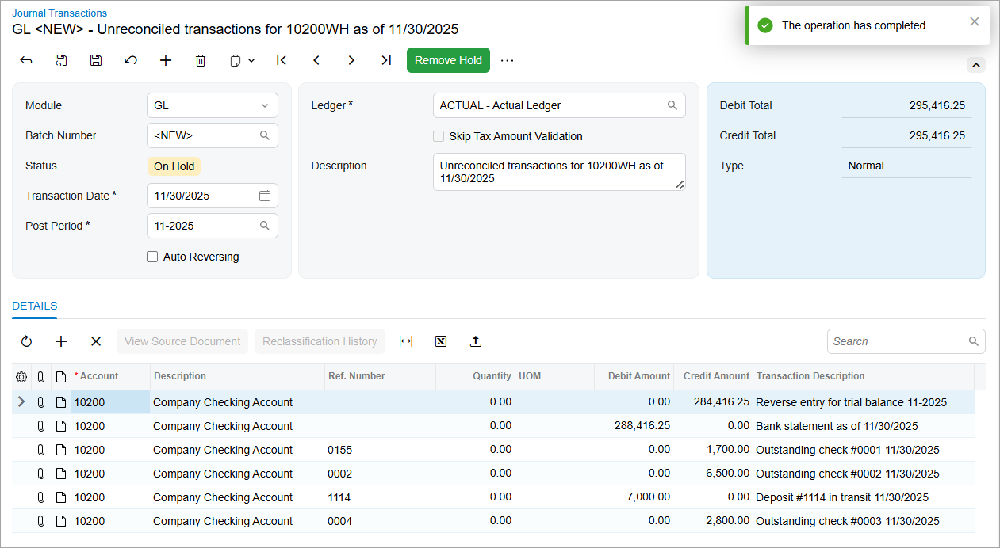
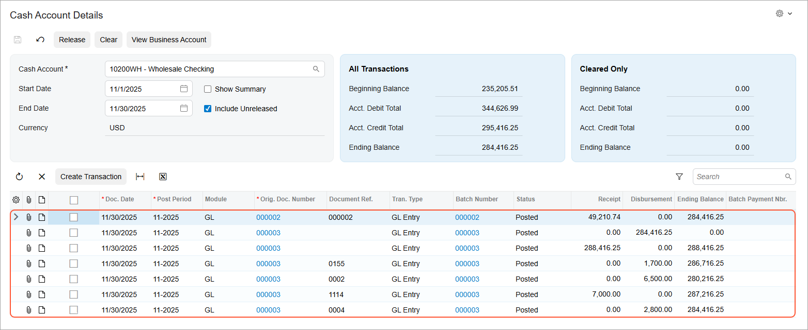
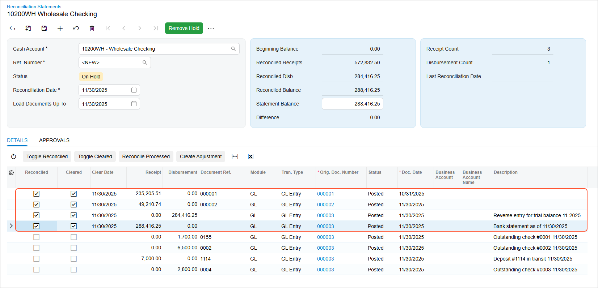
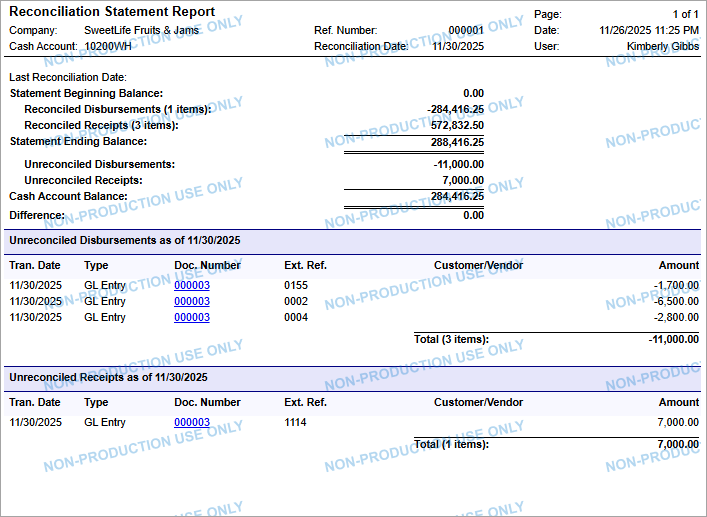

# Migration of Unreconciled Payments: To Import Payments and Reconcile a Cash Account {#_7e7df755-bb9f-462b-be28-b5059729376a .task}

The following activity will walk you through the process of importing to Acumatica ERP unreconciled payments \(outstanding checks or deposits in transit\) and then reconciling the cash account balance.

**Attention:** This activity is based on the *U100 Basic Company* dataset. If you are using another dataset, or if any system settings have been changed in *U100 Basic Company*, these changes can affect the workflow of the activity and the results of the processing. To avoid any issues, restore the *U100 Basic Company* dataset to its initial state.

## Story { .section}

Suppose that on 11/30/2025, the accountant received a bank statement with an ending balance of $288,416.25 for the *10200WH* checking account. The ending balance of the checking account for *11-2025* is $284,416.25. After the review of the bank statement dated *11/30/2025*, the accountant realized that the amounts of three outstanding checks are not included in the bank statement and that a deposit in transit has not yet arrived at the bank account. They will appear in the next bank statement, which the accountant will receive on 12/31/2025.

You need to create the transactions for currently unreconciled documents in the *10200WH* cash account in the system and create the first reconciliation statement corresponding to the bank statement dated *11/30/2025*.

## Configuration Overview {#section_tz4_djx_cnb .section}

In the *U100 Basic Company* dataset, the following tasks have been performed for the purposes of this activity:

-   On the [Enable/Disable Features](CS_10_00_00.md) \(CS100000\) form, the minimum set of financial features has been enabled.
-   On the [Companies](CS_10_15_00.md) \(CS101500\) form, the SweetLife company without branches has been configured by performing the steps described in [Company Without Branches: To Configure a Company Without Branches](../ImplementationGuide/config_Basic_Company_Implem_Activity_Enabling_Features.md).
-   On multiple forms, the required financial configuration has been performed, as described in the [Implementing Basic Financials](../ImplementationGuide/config_GL_Mapref.md) chapter of the Implementation Guide, including the creation of the *10200WH* cash account on the [Cash Accounts](CA_20_20_00.md) \(CA202000\) form.

    **Attention:** In the provided dataset, multiple cash accounts have been configured for the SweetLife company. For training purposes, you will perform the reconciliation procedure for only one cash account \(*10200WH*\).

## Process Overview { .section}

You will review the prepared Excel file with the data. Then on the [Journal Transactions](GL_30_10_00.md) \(GL301000\) form, you will create and release a GL transaction that represents the unreconciled payments. On the [Reconciliation Statements](CA_30_20_00.md) \(CA302000\) form, you will create the first reconciliation statement for the checking account and reconcile its balance.

## System Preparation { .section}

1.  As a prerequisite activity, complete [Migration of Financial Documents: To Import AR Documents](DataMigration_Import_Financial_Documents_Activity_ImportAR.md) and [Migration of Financial Documents: To Import AP Documents](DataMigration_Import_Financial_Documents_Activity_ImportAP.md).
2.  Download the `SweetLifeUnreconciledTransactions2025.xlsx` file with the list of unreconciled transactions provided with the course.

## Step 1: Importing Outstanding Checks and Deposits { .section}

To create the needed batch of transactions for the outstanding checks and the deposit in transit, do the following:

1.  On the [Journal Transactions](GL_30_10_00.md) \(GL301000\) form, create a new transaction batch and specify the following settings in the Summary area:
    -   **Module**: *GL*
    -   **Transaction Date:** *11/30/2025*
    -   **Post Period:** *11-2025*
    -   **Description:** `Unreconciled transactions for 10200WH as of 11/30/2025`
2.  On the table toolbar, click **Load Records From File** and upload the transactions from the `SweetLifeUnreconciledTransactions2025.xlsx` file. In the **Import Data** dialog box, leave the default settings, and click **Next**, **Next**, and **Finish**.

    Make sure that the batch has the rows shown in the following screenshot.

    

3.  In the Summary area, make sure the batch total \(in the **Debit Total** and **Credit Total** boxes\) is $295,416.25.
4.  On the form toolbar, click **Remove Hold** and then **Release**.
5.  On the [Cash Account Details](CA_30_30_00.md) \(CA303000\) form, select the *10200WH* cash account, and specify start and end dates of *11/1/2025* and *11/30/2025*, respectively. Review the transactions for the cash account and the date range. \(See the following screenshot.\)

    

6.  Save your changes to the form.

## Step 2: Reconciling the Cash Account Balance with the Bank Statement { .section}

To create the reconciliation statement for the *10200WH* cash account in the system for the November bank statement, do the following:

1.  On the [Reconciliation Statements](CA_30_20_00.md) \(CA302000\) form, create a reconciliation statement and specify the following settings in the Summary area:

    -   **Cash Account**: *10200WH*
    -   **Reconciliation Date**: *11/30/2025*
    -   **Load Documents Up To**: *11/30/2025*
    -   **Statement Balance**: `288,416.25`
    On this form, you reconcile the total amount of the transactions in the cash account in the system with the balance shown in the bank statement for this period. By selecting a transaction or multiple transactions in the table, you reconcile the total amount of the transactions for the *10200WH* cash account in the system with the balance of the bank statement for 11/30/2025.

2.  In the table, select the **Reconciled** check box for the following rows:
    -   The row with the 10/31/2025 date and the 235,205.51 amount in the **Receipt** column. This is the result of the trial balance import for 10-2025.
    -   The row with the 11/30/2025 date and the 49,210.74 amount in the **Receipt** column. This is the result of the trial balance import for 11-2025.
    -   The row with the 11/30/2025 date and the 284,416.25 amount in the **Disbursement** column. This is the offset entry for the bank statement balance for 11-2025, which you have imported with the list of unreconciled transactions.
    -   The row with the 11/30/2025 date and the 288,416.25 amount in the **Receipt** column. This is the bank statement balance for 11-2025, which you have imported with the list of unreconciled transactions.
3.  Make sure the **Cleared** check box is cleared for the other listed transactions \(see the following screenshot\). These transactions are the outstanding checks and the deposit in transit that you have imported; they will probably be available for reconciliation with the bank statement for December 2025.

    

4.  Save your changes.
5.  On the form toolbar, click **Remove Hold** and then click **Release** to release the reconciliation statement.

    **Attention:** If you find an error in the last released statement for a cash account, you can void this statement. This removes the reconciliation marks from the documents and makes the documents available again for proper reconciliation.

6.  On the [Reconciliation Statement](CA_62_70_00.md) \(CA627000\) report form, select *10200WH* as the cash account and *000001* \(the reference number of the reconciliation statement that you have just released\) as the **Ref. Number**.
7.  Click **Run Report** on the report form toolbar.

    As the following screenshot shows, the reconciled balance of the *10200WH* cash account for the *11-2025* period is $284,416.25; this balance is the same as the account’s balance in the general ledger. Four GL transactions related to outstanding checks and deposits in transit have not yet appeared in the bank statement and remain unreconciled. The balance difference is –$4,000. These transactions will most likely show up in the bank statement for the next period.

    

You have imported unreconciled transactions for the cash account and reconciled its balance with the bank statement.

**Parent topic:**[Importing Unreconciled Payments](../UserGuide/DataMigration_Import_Unreconciled_Payments_Mapref.md)

