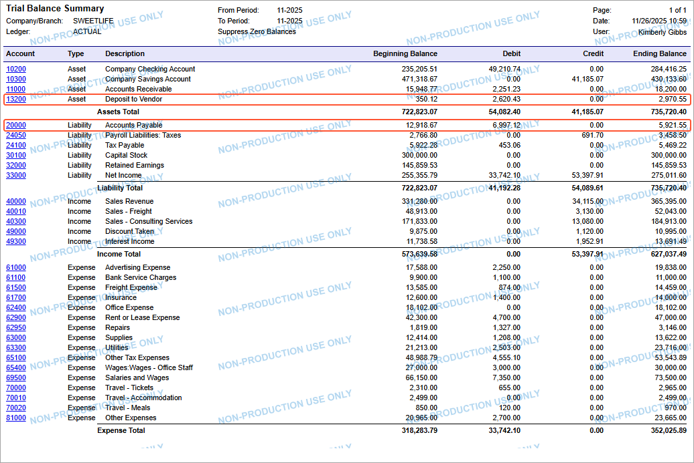
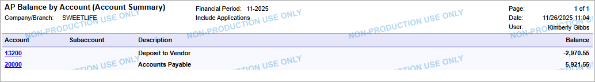
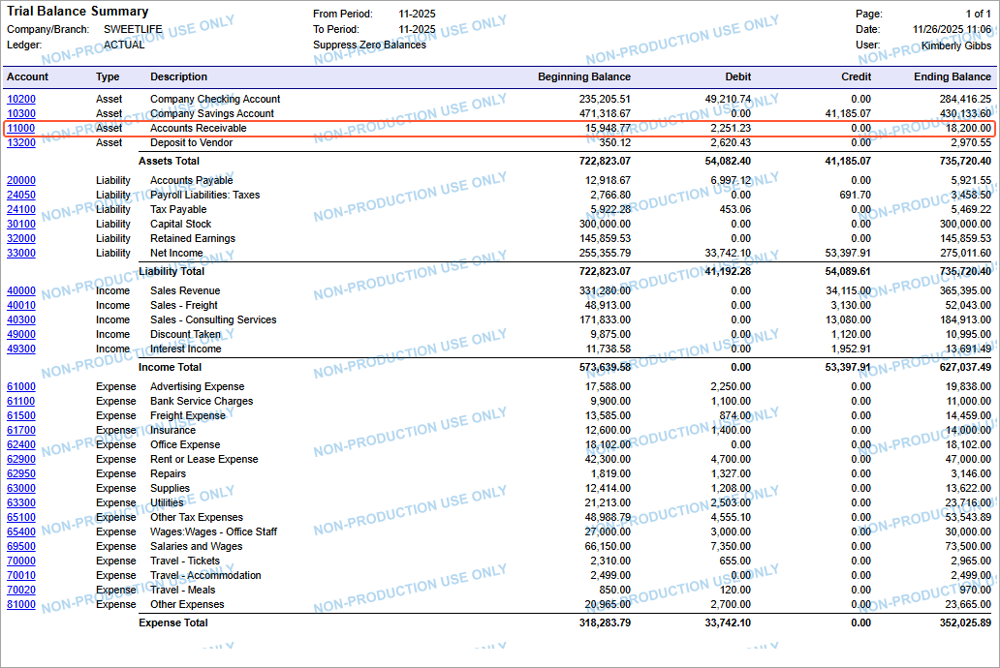
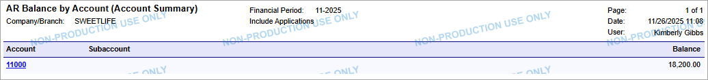

# Balance Reconciliation: To Reconcile Balances After Data Migration {#_5a5ce836-c7f6-40b2-bc91-e1523e55377a .task}

The following activity will walk you through the process of reconciling account balances after data import.

**Attention:** This activity is based on the *U100 Basic Company* dataset. If you are using another dataset, or if any system settings have been changed in *U100 Basic Company*, these changes can affect the workflow of the activity and the results of the processing. To avoid any issues, restore the *U100 Basic Company* dataset to its initial state.

## Story { .section}

Suppose that you are an implementation consultant, and you have finished data migration from the legacy system to Acumatica ERP. That is, you have imported vendors, customers, non-stock items, accounts payable documents, and accounts receivable documents. Also, you have imported trial balances.

Now you need to reconcile the balances of the accounts payable and accounts receivable subledgers with the balances of the corresponding GL accounts to make sure that the balances of imported documents match the account balances.

## Configuration Overview {#section_tz4_djx_cnb .section}

In the *U100 Basic Company* dataset, the following tasks have been performed for the purposes of this activity:

-   On the [Enable/Disable Features](CS_10_00_00.md) \(CS100000\) form, the minimum set of financial features has been enabled.
-   On the [Companies](CS_10_15_00.md) \(CS101500\) form, the SweetLife company without branches has been configured by performing the steps described in [Company Without Branches: To Configure a Company Without Branches](../ImplementationGuide/config_Basic_Company_Implem_Activity_Enabling_Features.md).
-   On multiple forms, the required financial configuration has been performed, as described in the [Implementing Basic Financials](../ImplementationGuide/config_GL_Mapref.md) chapter of the Implementation Guide.

## Process Overview { .section}

You will reconcile the balance of the Prepaid Expenses, Accounts Payable, and Accounts Receivable accounts by using the [Trial Balance Summary](GL_63_20_00.md) \(GL632000\), [AP Balance by GL Account](AP_63_20_00.md) \(AP632000\), and [AR Balance by GL Account](AR_63_20_00.md) \(AR632000\) reports.

## System Preparation {#section_vl2_mcy_fdc .section}

As a prerequisite activity, complete [Migration of Unreconciled Payments: To Import Payments and Reconcile a Cash Account](DataMigration_Import_Unreconciled_Payments_Activity.md).

## Step 1: Reconciling Accounts Payable with the General Ledger {#_6163614a-621e-4312-9156-3ef375b9b685 .section}

To reconcile the AP balances, do the following:

1.  On the [Trial Balance Summary](GL_63_20_00.md) \(GL632000\) report form, specify the following report parameters:
    -   **Ledger:** *ACTUAL*
    -   **From Period**: *11-2025*
    -   **To Period**: *11-2025*
2.  On the report form toolbar, click **Run Report**.

    In the report, review the ending balances of the *13200 \(Deposit to Vendor\)* and *20000 \(Accounts Payable\)* accounts. The ending balance of the *20000 \(Accounts Payable\)* account for the period is $5,921.55. The ending balance of the *13200 \(Deposit to Vendor\)* account for the period is $2,970.55, as shown in the following screenshot.

    

3.  On the [AP Balance by GL Account](AP_63_20_00.md) \(AP632000\) report form, specify the following parameters:
    -   **Report Format**: *Account Summary*
    -   **Financial Period**: *11-2025*
4.  On the report form toolbar, click **Run Report**.

    In the report, review the total balance of the open accounts payable documents that you have imported.

    The total balance of the open documents posted to the *20000 \(Accounts Payable\)* account for the period is $5,921.55; the total balance of open documents posted to the *13200 \(Deposit to Vendor\)* account for the period is –$2,970.55. \(See the following screenshot.\)

    

    The balances are equal to the balances of the accounts in the general ledger, and thus are reconciled.

## Step 2: Reconciling Accounts Receivable with the General Ledger {#_368ddec4-7c5a-45bc-a719-f24a5129513d .section}

To reconcile the AR balances, do the following:

1.  On the [Trial Balance Summary](GL_63_20_00.md) \(GL632000\) report form, specify the following report parameters:
    -   **Ledger:** *ACTUAL*
    -   **From Period**: *11-2025*
    -   **To Period**: *11-2025*
2.  On the report form toolbar, click **Run Report**.

    In the report, review the balance of the *11000 \(Accounts Receivable\)* account. The ending balance of this account is $18,200.00. \(See the following screenshot.\)

    

3.  On the [AR Balance by GL Account](AR_63_20_00.md) \(AR632000\) report form, specify the following parameters:
    -   **Report Format**: *Account Summary*
    -   **Financial Period**: *11-2025*
4.  On the report form toolbar, click **Run Report**.

    Review the total of open accounts receivable documents posted to the *11000 \(Accounts Receivable\)* account.

    This total balance is $18,200.00. \(See the following screenshot.\)

    

    The balance is equal to the balance of the account in the general ledger, and thus the balances are reconciled.

You have finalized balance reconciliation and ensured that all data has been migrated correctly.

**Parent topic:**[Reconciling Financial Balances](../UserGuide/DataMigration_Reconcile_Balances_Mapref.md)

