# To Create a System Email Account for Gmail with OAuth 2.0 {#_c10df548-1207-468a-ad82-887ff6b02148 .task}

To mitigate the possibility of access being turned off for less secure apps \(LSAs\) in Google Suite, Acumatica ERP supports Modern Authentication \(OAuth 2.0\) for the IMAP, POP3, and SMTP protocols.

We recommend that users change their settings to the OAuth 2.0 method if they have configured email processing for Google services by using the username and password authentication method.

By using the [Email Accounts](SM_20_40_02.md) \(SM204002\) form, you can create an email account in Acumatica ERP that will be associated with the Google Workspace or Gmail account that uses OAuth 2.0.

**Attention:** This topic describes the configuration of third-party software. Please note the following:

-   The procedure below is designed for the most common usage scenarios. If you are implementing a more complicated scenario and you encounter difficulties, contact Acumatica ERP Support.
-   The vendor of the third-party software may change the user interface and settings. Therefore, the form elements and setting names you see may differ from the ones described in the procedure.
-   The procedure will be updated each time information is made available about new common scenarios and changes in the user interface and settings.

## Step 1: To Register an OAuth Application with Google {#section_hjv_gly_l5b .section}

To create an OAuth application, do the following:

1.  Open Google Cloud Platform Console and navigate to the [OAuth Overview](https://console.cloud.google.com/auth/overview) page.

    **Tip:** You may be prompted to sign in to your Google account. If you don’t have one, create an account first.

2.  If you have at least one project created, proceed to the next step. Otherwise, do the following:
    1.  Click **Create Project**.

        This will open the *New Project* page.

    2.  Enter a project name.
    3.  Click **Create**.
3.  On the **OAuth Overview** page, click **Get Started** \(see below\).

    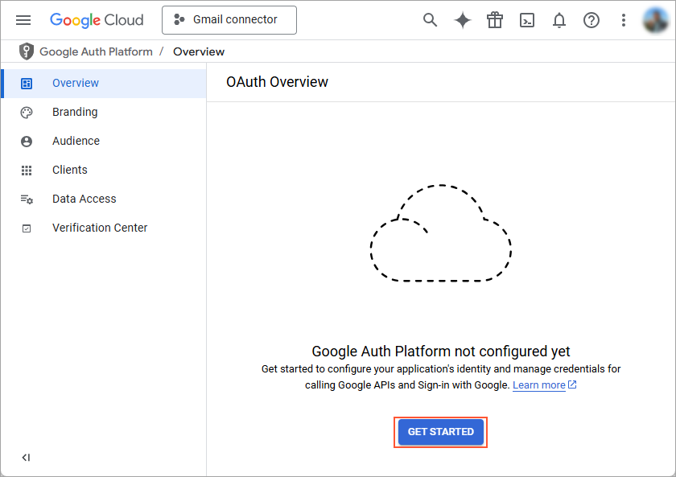

4.  On the **Project configuration** page, which opens, do the following:
    1.  Enter your app name and support email, as shown below.

        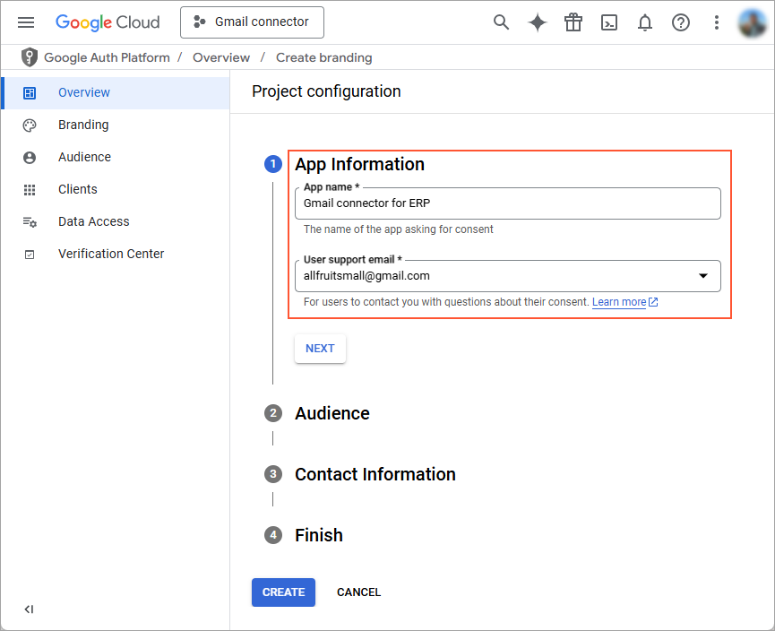

    2.  Enter the email address that will be displayed to users on the consent screen.
    3.  Click **Next**.
    4.  Select the *Internal* or *External* user type, depending on your needs.
    5.  Click **Next**.
    6.  Enter the developer's email address, as shown below.

        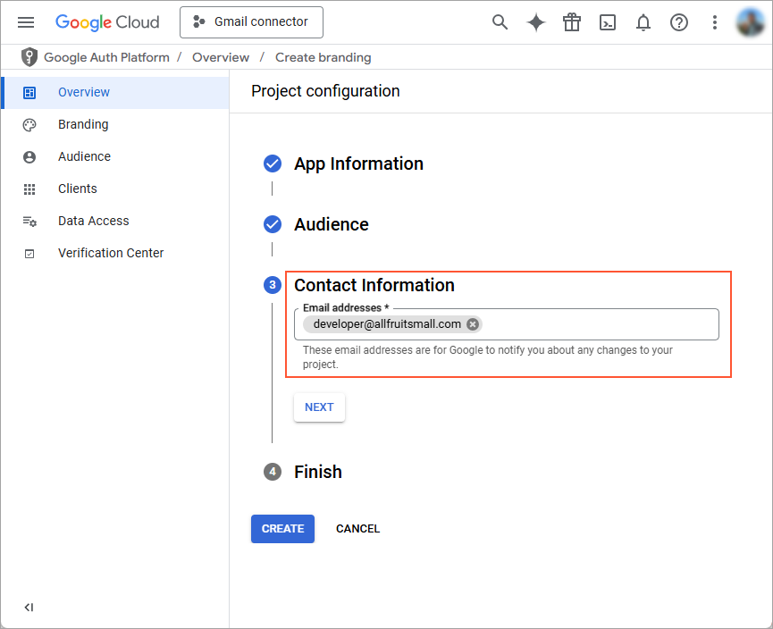

    7.  Click **Next**.
    8.  Confirm the user data policy of the Google API Services and click **Create**.
5.  On the *Data Access* page of the registered application, click **Add or Remove Scopes**.
6.  In the **Update selected scopes** pane, do the following:

    1.  Select the following scopes:
        -   *userinfo.email*
        -   *userinfo.profile*
        -   *openid*
    2.  Click **Update**
    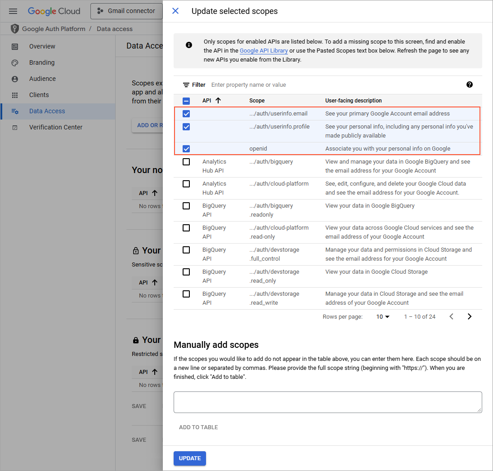

7.  Click **Save**.
8.  On the **Audience** page of the registered application, click **Add Users** and specify all the users you want to be authorized to use this app \(see below\). Click **Save**.

    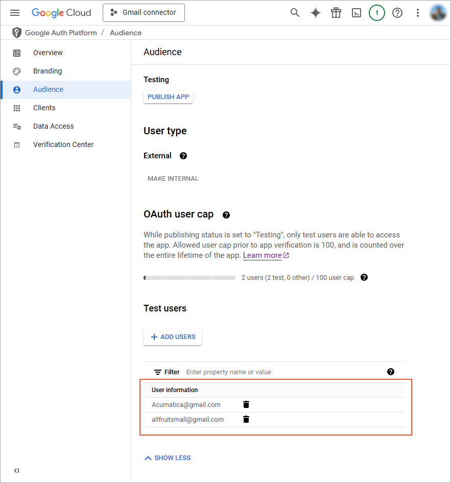

9.  On the **Audience** page, click **Publish App** \(shown below\) and confirm the publish.

    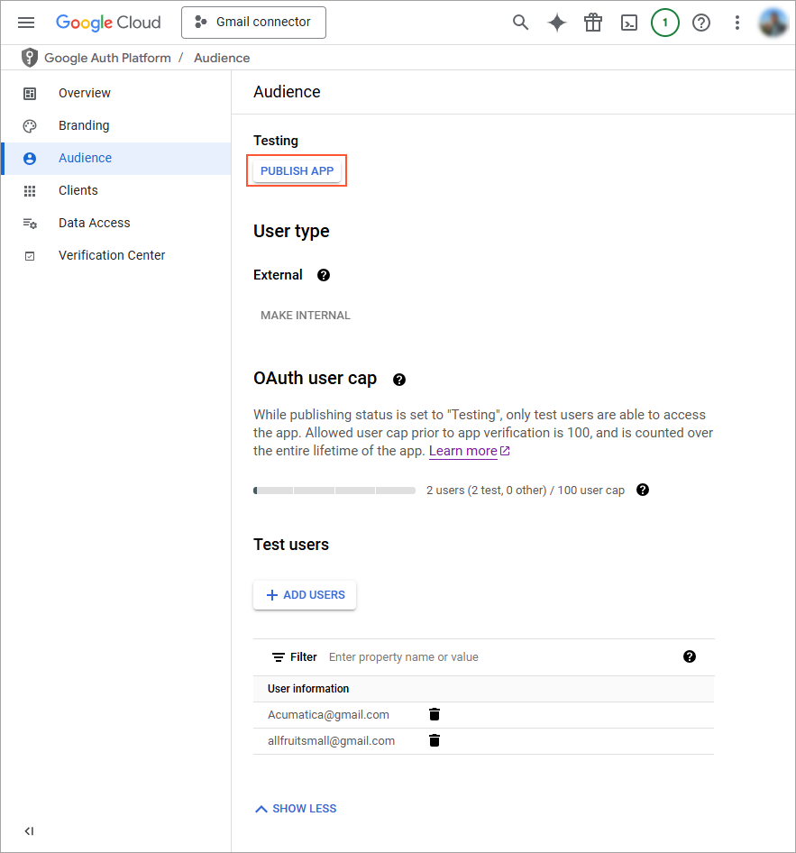

10. Verify that the **Publishing status** changed to *In production* \(shown below\).

    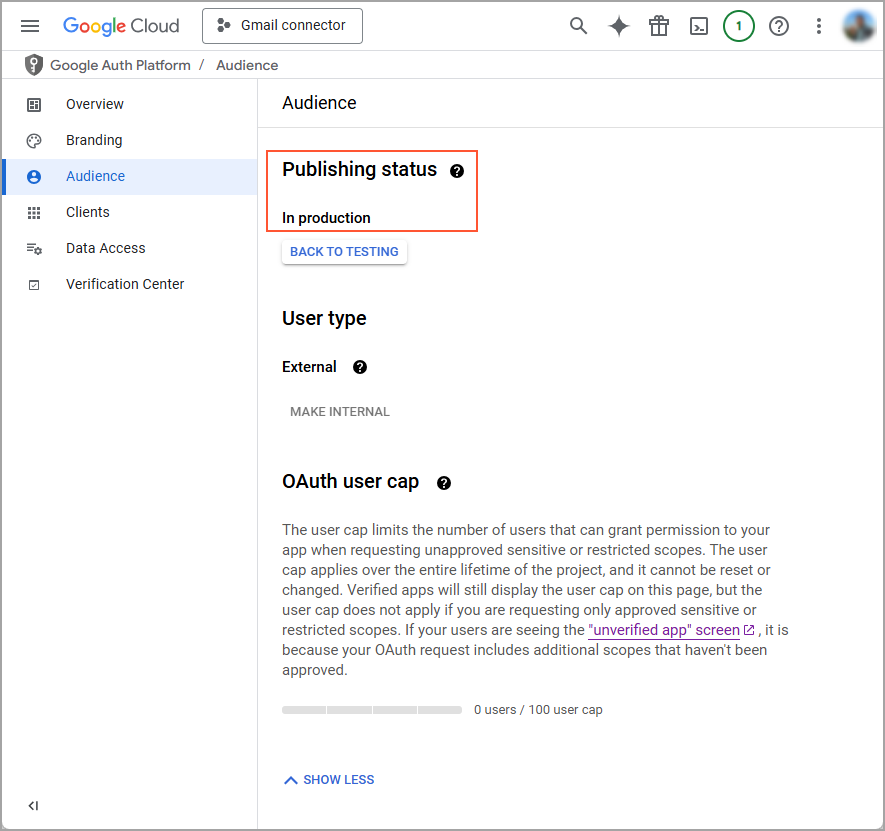

## Step 2: To Obtain OAuth 2.0 Credentials from Google {#section_mtx_j1c_l5b .section}

After you registered the application with Google, you set up OAuth 2.0 credentials:

1.  While you are still have the Google Cloud Platform Console opened, go to the **Clients** page and click **Create Client** \(see below\).

    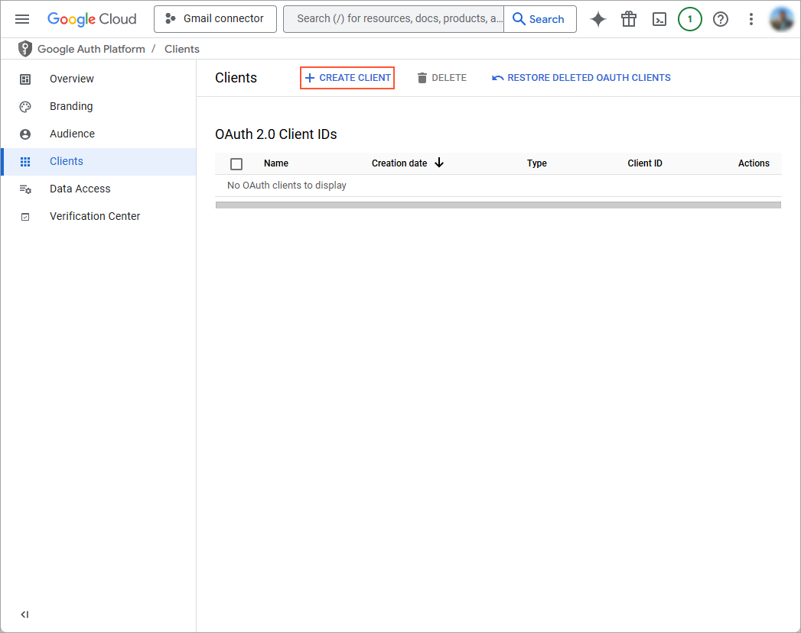

2.  On the *Create OAuth client ID* page which opens, do the following:

    1.  In the **Application type** box, select *Web application*.
    2.  In the **Name** box, type in a meaningful application name.
    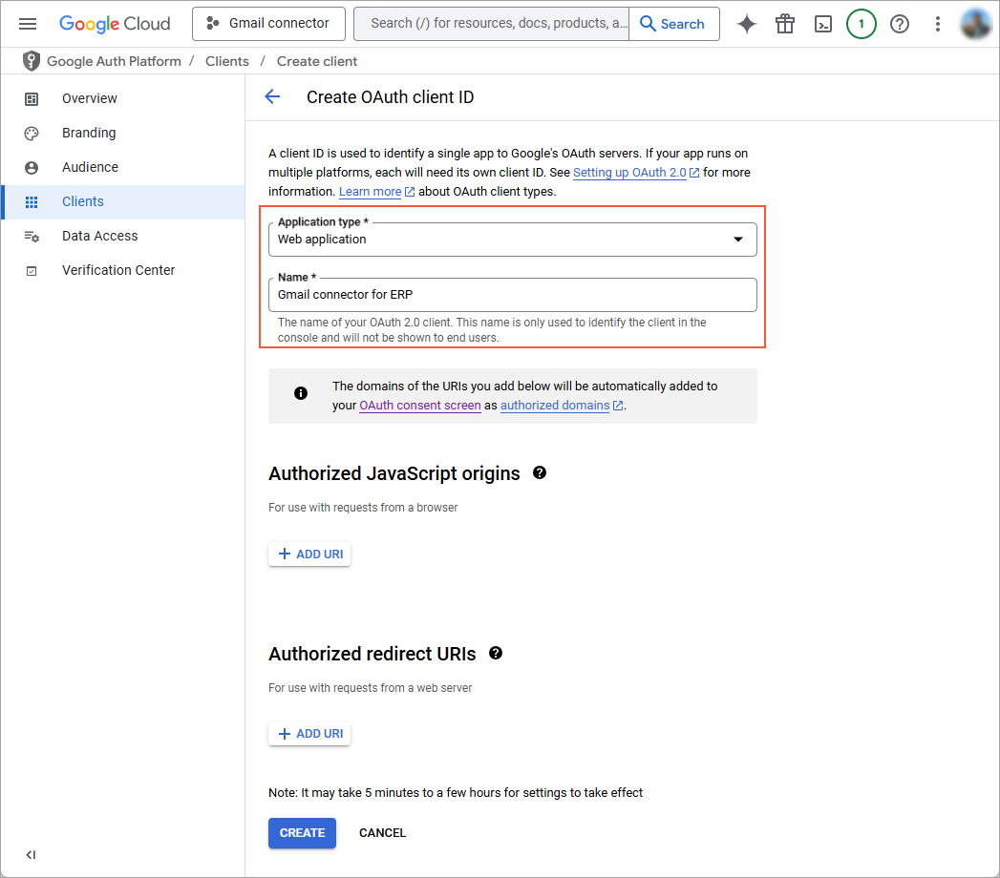

3.  In the **Authorized redirect URIs** section, click **Add URI** and type a redirect URI, as shown below. This value can be found by clicking **View Redirect URI** on the [External Applications](SM_30_10_00.md) \(SM301000\) form in Acumatica ERP.

    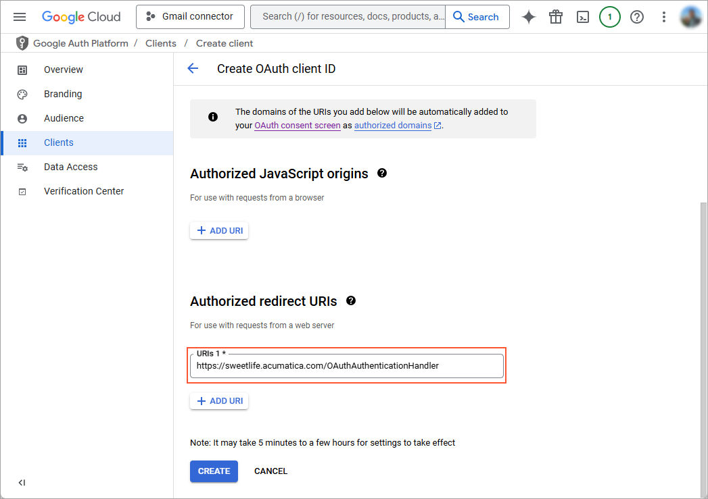

4.  Click **Create**.
5.  On the *OAuth client created* dialog box which opens, copy the following values which will be used for registering an external application in Acumatica ERP.

    1.  *Client ID*
    2.  *Client Secret*
    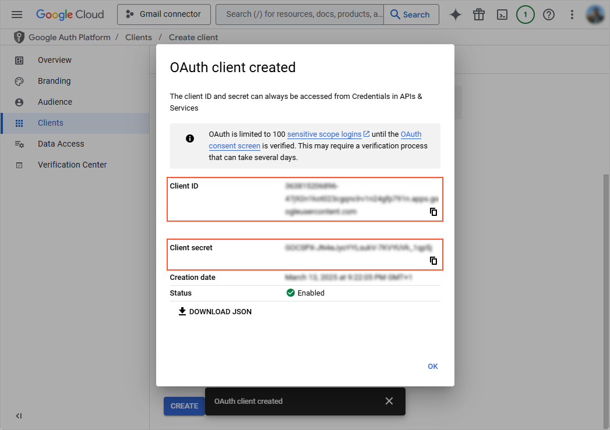

    **Tip:** You can keep the browser page with the *OAuth client created* dialog box open and copy the values directly to Acumatica ERP when you will register the application on the [External Applications](SM_30_10_00.md) \(SM301000\) form.

## Step 3: To Specify the General Settings of the Email Account {#section_jtx_j1c_l5b .section}

To specify the general settings of the account, do the following in Acumatica ERP:

1.  Open the [Email Accounts](SM_20_40_02.md) \(SM204002\) form.
2.  On the form toolbar, click **Add New Record**.
3.  In the Summary area of the form, do the following:
    1.  In the **Account Name** box, type the name of the system email account.
    2.  In the **Email Address** box, type the email address of the account that will be used as the system email account.
    3.  Optional: In the **Reply Address** box, type the email address that will be used for automatic replies.

## Step 4: To Specify the Servers {#section_ktx_j1c_l5b .section}

To specify the settings of the servers, do the following:

1.  While you are still on the [Email Accounts](SM_20_40_02.md) \(SM204002\) form with the account you have created, be sure the **Service** tab of the form is opened.
2.  In the **Protocol** box \(**Incoming Mail Server** section\), select the protocol to be used to connect to the incoming server.

    **Note:** If you have selected *IMAP*, every email that has been successfully collected from the server will be marked as read on the server.

    If you have selected the *IMAP* protocol, in the **Root Folder** box, you need to type the path to the folder that will be used as the root folder for storing emails.

3.  In the **Incoming Mail Server** box, type `imap.gmail.com`.
4.  In the **Outgoing Mail Server** box, type `smtp.gmail.com`.
5.  On the form toolbar, click **Save**.

## Step 5: To Configure Authentication Through OAuth 2.0 {#section_w2l_csz_l5b .section}

To configure authentication through OAuth 2.0, do the following:

1.  While you are still working with the account on the [Email Accounts](SM_20_40_02.md) \(SM204002\) form, in the **Authentication Method** box, select *OAuth 2.0 for Gmail*.
2.  Click the magnifier button in the **External Application** box. The system opens the **External Application** lookup table.
3.  Click the Plus icon on the table toolbar. The system opens the [External Applications](SM_30_10_00.md) \(SM301000\) form in a new browser window.
4.  On the [External Applications](SM_30_10_00.md) form, click **Add New Record**.
5.  In the **Type** box, select *OAuth 2.0*.
6.  In the **Application Name** box, type the name of the application, for example, `Gmail Connector`.
7.  In the **Client ID** and **Client Secret** boxes, insert credentials for the OAuth client you have configured using Google console.
8.  In the **Authorization Endpoint** box, type `https://accounts.google.com/o/oauth2/v2/auth`.
9.  In the **Token Endpoint** box, type `https://oauth2.googleapis.com/token`.
10. On the [External Applications](SM_30_10_00.md) form, click **Save and Close** on the form toolbar. The system closes the window with the form and specifies the configured application in the **External Application** box on the [Email Accounts](SM_20_40_02.md) form.

## Step 6: To Configure Port Numbers {#section_ntx_j1c_l5b .section}

Finally, you need to specify the advanced settings email account. Do the following:

1.  While you are still working with the account on the [Email Accounts](SM_20_40_02.md) \(SM204002\) form, configure port numbers on the **Service** tab.
2.  In the **Incoming Mail Port** box of the **Incoming Mail Server** section, type the number of the port to be used for incoming mail server.
3.  In the **Incoming Connection Encryption** box, select *Implicit TLS*.
4.  In the **Outgoing Mail Port** box of the **Outgoing Mail Server** section, type the number of the port to be used for outgoing mail server.
5.  In the **Outgoing Connection Encryption** box, select *Explicit TLS*.
6.  On the form toolbar, click **Save** and then click **Sign In** to test the settings of the email account.

**Parent topic:**[Configuring Email Accounts](../UserGuide/EM__con_Configuring_Email_Accounts.md)

