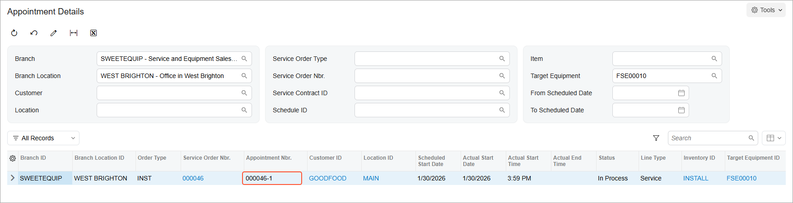

# Target Equipment: To Create a Service Appointment {#_d8dc3daf-0ae3-47cf-9d1d-3f81624c3418 .task}

In this activity, you will create an appointment to deliver setup services for target equipment located at the customer's premises.

## Story {#section_dnc_t1q_jdc .section}

Suppose that the *GOODFOOD \(GoodFood One Restaurant\)* customer wants the SweetLife Service and Equipment Sales Center to perform installation and repair services at the customer's location on the cold press and centrifugal juicers it has purchased. Acting as a service manager, you will receive the request and create and process an appointment.

## Process Overview {#section_lqv_jf3_jdc .section}

On the [Appointments](FS_30_02_00.md) \(FS300200\) form, you will create a new appointment. In this appointment, you will specify the services and the target equipment that will be serviced. You will also assign a staff member with the appropriate skills and, on behalf of a staff member, process the appointment.

## System Preparation {#section_ejp_d23_jdc .section}

Before you begin performing the steps of this activity, do the following:

1.  On the Acumatica ERP website, sign in to a company with the *U100* dataset preloaded. You should sign in as a service manager by using the *davis* username and the *123* password.
2.  In the info area, in the upper-right corner of the top pane of the Acumatica ERP screen, set the business date to *1/30/2026*. For simplicity, in this activity, you will create and process all documents in the system on this business date.

## Step: Creating an Appointment for the Servicing of Target Equipment {#section_lnc_w1q_jdc .section}

Do the following:

1.  On the [Appointments](FS_30_02_00.md) \(FS300200\) form, click **Add New Record**.
2.  Specify the following settings in the Summary area:
    -   **Service Order Type**: *INST*
    -   **Customer**: *GOODFOOD - GoodFood One Restaurant*
    -   **Description**: `Installation and training services`
3.  On the form toolbar, click **Save**.
4.  On the **Details** tab, click **Add Row** and specify the following settings in the row:
    -   **Inventory ID**: *INSTALL*
    -   **Target Equipment ID**: *FSE00010* \(this target equipment is the *Multifruit Centrifugal Juicer J22C* stock item\)
5.  On the form toolbar, click **Save**.
6.  Click **Add Row** again and specify the following settings in the row:
    -   **Inventory ID**: *REPAIR*
    -   **Target Equipment ID**: *FSE00011* \(this target equipment is the *Cold Press Juicer H30J* stock item\)
7.  On the form toolbar, click **Save**.
8.  On the **Staff** tab, click **Add Row**, and in the **Staff Member** column, select *EP00000003 - Jon Waite*. This staff member has the *INSTALLING - Juicer installation skills* and *REPAIRING - Repair of juicers* skills assigned on the **Skills** tab on the [Employees](EP_20_30_00.md) \(EP203000\) form.
9.  On the form toolbar, click **Save**.
10. On the form toolbar, click **Start**. In this instruction, you are acting as Jon Waite arriving at the appointment.
11. On the **Details** tab, click the *FSE00010* link in the **Target Equipment ID** column.

    The system has opened the [Equipment](FS_20_50_00.md) \(FS205000\) form, where the staff member attending the appointment can view the settings of the equipment scheduled for service.

12. On the More menu \(under **Inquiries**\), click **Target Equipment History**.

    The system opens the [Appointment Details](FS_40_05_00.md) \(FS400500\) form. You can see the appointment created for the selected piece of equipment. \(See the following screenshot.\)

    

13. Return to the [Appointments](FS_30_02_00.md) \(FS300200\) form.
14. On the **Details** tab, click the *FSE00011* link in the **Target Equipment ID** column to view the settings of the *Cold Press Juicer H30J* to be assembled.
15. On the [Equipment](FS_20_50_00.md) form, which the system opens, click the **Components** tab.
16. In the **Serial Nbr.** column of the components table, enter `12345` for the *DRUM* component \(which has a warning indicating that the serial number is missing\).
17. On the form toolbar, click **Save**.
18. Close the window with the [Equipment](FS_20_50_00.md) form and return to the [Appointments](FS_30_02_00.md) form.
19. On the **Settings** tab, in the **Actual Date and Time** section, enter the actual start and end times \(for simplicity in this training, set them to match the scheduled start and end times\). Select the **Finished** check box.
20. On the form toolbar, click **Complete** and then **Close**.

    Now an accountant can run billing for the appointment.

**Parent topic:**[Creating Target Equipment](../UserGuide/EquipMgmt_Creating_Target_Equipment_Mapref.md)

