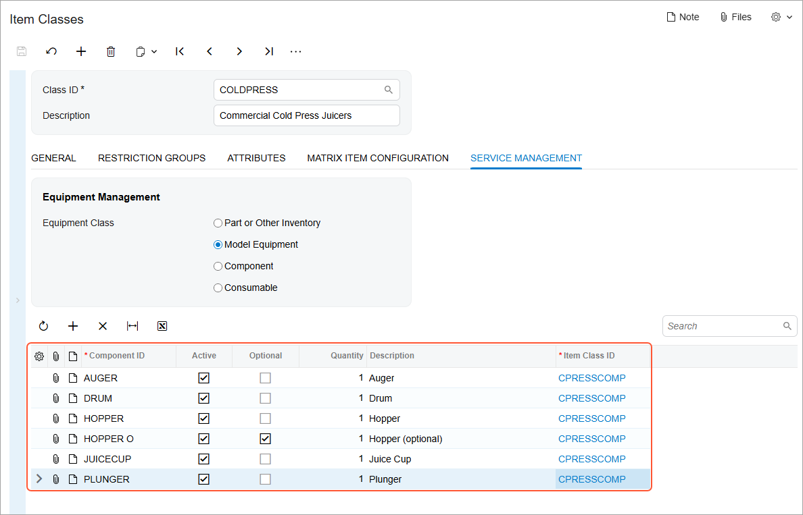
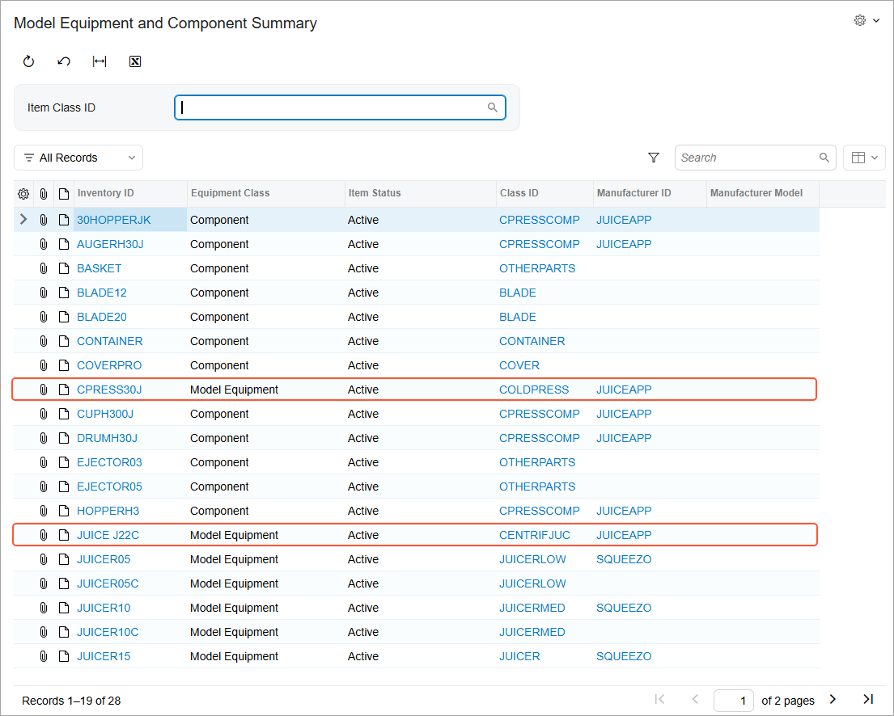

# Stock Items to Be Tracked Post-Sale: To Create Stock Items with Components {#_1e15adeb-4a36-4d65-a19f-e16662965bf8 .task}

In this activity, you will create a piece of equipment with components that will be tracked after the equipment is sold. To accomplish this, you will first create an item class to group similar equipment with components. For the item class, you will define the components, including one optional component \(that is, the equipment can be sold without this particular component\). You will also specify the quantity required for each component in each piece of equipment.

You will then create a stock item for a piece of equipment with components, based on the newly created item class.

## Story {#section_e2v_xns_kdc .section}

Suppose the SweetLife Service and Equipment Sales Center plans to sell commercial cold press juicers with various components and to track these juicers after they are sold. As the administrative user, you will create the *COLDPRESS - Commercial Cold Press Juicers* item class for model equipment; this class is specifically designed to manage equipment with components. Next, you will create the *CPRESS30J - Cold Press Juicer H30J* stock item based on this item class and define the components included with this piece of equipment.

## Process Overview {#section_btb_pzv_3dc .section}

On the [Item Classes](IN_20_10_00.md) \(IN201000\) form, you will create an item class with the **Model Equipment** setting and specify the necessary components for this class. Then on the [Stock Items](IN_20_25_00.md) \(IN202500\) form, you will create a piece of equipment with components based on the newly created item class.

## System Preparation {#section_z4x_b2b_ldc .section}

Before you begin performing the steps of this lesson, do the following:

1.  On the Acumatica ERP website, sign in to a company with the *U100* dataset preloaded. You should sign in as a system administrator by using the *gibbs* username and the *123* password.
2.  In the info area, in the upper-right corner of the top pane of the Acumatica ERP screen, set the business date to *1/30/2026*. For simplicity, in this activity, you will create and process all documents in the system on this business date.
3.  To perform this activity, make sure that you have performed the following prerequisite activity: [Stock Items to Be Tracked Post-Sale: To Create Components](EquipMgmt_Creating_Components_Process_Activity.md).

## Step 1: Creating an Item Class for Equipment with Components {#section_qgj_3zv_3dc .section}

To create an item class for equipment that has components, do the following:

1.  On the [Item Classes](IN_20_10_00.md) \(IN201000\) form, add a new record and specify the following settings in the Summary area:
    -   **Class ID**: `COLDPRESS`
    -   **Description**: `Commercial Cold Press Juicers`
2.  On the **General** tab \(**General Settings** section\), specify the following settings:
    -   **Stock Item**: Selected
    -   **Item Type**: *Finished Good*
    -   **Tax Category**: *EXEMPT*
    -   **Posting Class**: *AOL*
    -   **Default Warehouse**: *EQUIPHOUSE*
    -   **Availability Calculation Rule**: *ALLOTHER*
3.  In the **Unit of Measure** section of the tab, specify the following settings:
    -   **Base Unit**: *ITEM*
    -   **Sales Unit**: *ITEM*
    -   **Purchase Unit**: *ITEM*
4.  On the **Service Management** tab, select **Model Equipment** under **Equipment Class**.
5.  On the form toolbar, click **Save**.
6.  On the table toolbar of the table on the **Service Management** tab, click **Add Row**, and specify the following settings in the added row to add a component to the item class:
    -   **Component ID**: `JUICECUP`
    -   **Active**: Selected
    -   **Optional**: Cleared
    -   **Quantity**: `1`
    -   **Description**: `Juice Cup`
    -   **Item Class ID**: *CPRESSCOMP*
7.  On the table toolbar, click **Add Row** again, and specify the following settings in the added row to add another component to the item class:
    -   **Component ID**: `HOPPER`
    -   **Active**: Selected
    -   **Optional**: Cleared
    -   **Quantity**: `1`
    -   **Description**: `Hopper`
    -   **Item Class ID**: *CPRESSCOMP*
8.  On the table toolbar, click **Add Row** again, and specify the following settings in the added row to add the third component to the item class:
    -   **Component ID**: `HOPPER_O`
    -   **Active**: Selected
    -   **Optional**: Selected

        With this check box selected, you can sell equipment of the class without this component.

    -   **Quantity**: `1`
    -   **Description**: `Hopper (optional)`
    -   **Item Class ID**: *CPRESSCOMP*
9.  On the table toolbar, click **Add Row** again, and specify the following settings in the row to add the fourth component to the item class:
    -   **Component ID**: `PLUNGER`
    -   **Active**: Selected
    -   **Optional**: Cleared
    -   **Quantity**: `1`
    -   **Description**: `Plunger`
    -   **Item Class ID**: *CPRESSCOMP*
10. Click **Add Row**, and specify the following settings in the row to add the fifth component to the item class:
    -   **Component ID**: `AUGER`
    -   **Active**: Selected
    -   **Optional**: Cleared
    -   **Quantity**: `1`
    -   **Description**: `Auger`
    -   **Item Class ID**: *CPRESSCOMP*
11. Click **Add Row**, and specify the following settings to add the sixth component to the item class:
    -   **Component ID**: `DRUM`
    -   **Active**: Selected
    -   **Optional**: Cleared
    -   **Quantity**: `1`
    -   **Description**: `Drum`
    -   **Class ID**: *CPRESSCOMP*
12. On the form toolbar, click **Save**.

    You have added the components to the *COLDPRESS* item class, as shown in the following screenshot.

    

## Step 2: Creating a Piece of Equipment with Components {#section_gqg_14s_kdc .section}

To create a piece of model equipment with components, do the following:

1.  On the [Stock Items](IN_20_25_00.md) \(IN202500\) form, add a new record and specify the following settings in the Summary area:
    -   **Inventory ID**: `CPRESS30J`
    -   **Item Status**: *Active*
    -   **Description**: `Cold Press Juicer H30J`
2.  On the **General** tab, select *COLDPRESS* as the **Item Class**.

    The **Type**, **Tax Category**, **Posting Class**, and **Default Warehouse** boxes, as well as the boxes in the **Unit of Measure** section, have been populated with the values from the selected item class.

3.  On the **Price/Cost** tab, set the **Default Price** to `800`.
4.  On the **Service Management** tab, do the following:
    -   In the **Manufacturer** box, select *JUICEAPP*.
    -   In the **Company Warranty** box, specify `12` *Months*, and in the **Vendor Warranty** box, specify `6` *Months*.

        Notice that the **Model Equipment** option button has been selected based on the settings of the item class, and you cannot change this setting.

5.  On the form toolbar, click **Save**.
6.  In the table of the **Service Management** tab, specify the following identifiers in the **Inventory ID** column for the rows with the mentioned **Component ID** values, so that you are specifying the stock items corresponding to the required components:

    -   *AUGERH30J* in the row with the *AUGER* component
    -   *DRUMH30J* in the row with the *DRUM* component
    -   *HOPPERH3* in the row with the *HOPPER* component
    -   *30HOPPERJK* in the row with the *HOPPER\_O* component
    -   *CUPH300J* in the row with the *JUICECUP* component
    -   *PLUNGERH30J* in the row with the *PLUNGER* component
    Notice that as you select the inventory IDs, the system updates the warranty settings.

7.  Clear the **Requires Serial** check box in all rows except the row with the *DRUM* component.
8.  In the row with the *AUGERH30J* component, select *SQUEEZO* in the **Vendor ID** column.
9.  On the form toolbar, click **Save**.
10. Navigate to the [Model Equipment and Component Summary](FS_40_04_00.md) \(FS400400\) form, and verify that both pieces of model equipment that you have created are listed. Notice that all the components you have created are also listed here.

    

**Parent topic:**[Configuring Stock Items to Be Tracked Post-Sale](../UserGuide/EquipMgmt_Configuration_of_Equipment_to_Be_Tracked_Post_Sale_Mapref.md)

