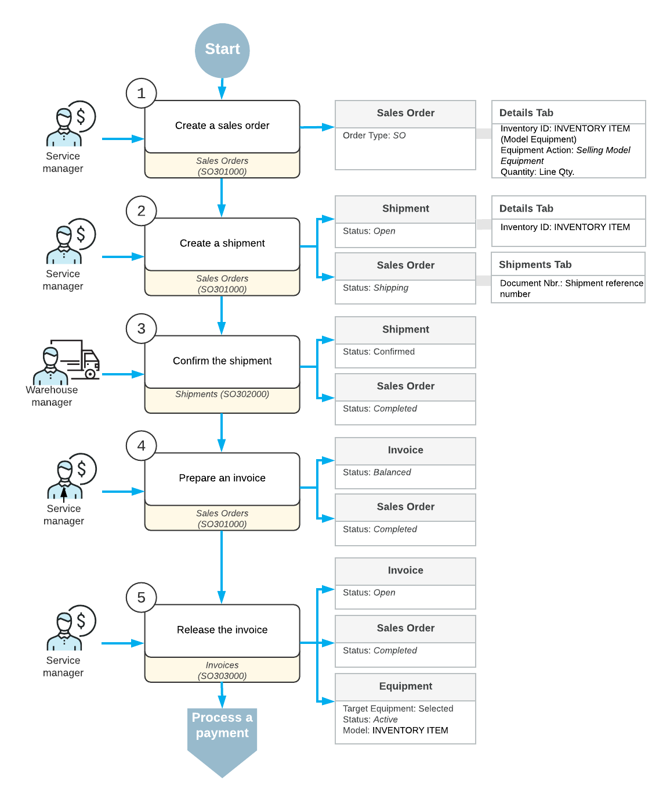

# Target Equipment: General Information {#_8e84e36a-a24f-4ad9-9788-459ef76ce7be .concept}

In this lesson, you will learn how to work with target equipment in Acumatica ERP. Target equipment refers to items that your company tracks for maintenance, service, or warranty purposes. This includes equipment sold directly to customers and equipment purchased from third parties but serviced by your company.

## Learning Objectives {#section_px5_xsp_jdc .section}

In this lesson, you will learn how to do the following:

-   Create a sales order and an invoice to record the sale of a stock item. On release of the invoice related to the sales order, the system automatically creates a target equipment record.
-   Create a piece of target equipment manually.
-   Create an appointment for services performed on the customer's target equipment.

## Applicable Scenarios { .section}

You create target equipment in the following scenarios:

-   A customer requests to purchase equipment along with installation services, with plans for ongoing regular maintenance services on this equipment.
-   Your company needs to service equipment that was originally purchased from a third party, requiring the entry of the equipment record in Acumatica ERP to enable tracking, scheduling, and servicing.

## Target Equipment Creation {#section_ld2_b23_jdc .section}

You can create target equipment in the following ways:

-   By selling a stock item with the **Model Equipment** equipment class, which causes the system to create the corresponding target equipment record on the [Equipment](FS_20_50_00.md) \(FS205000\) form. The record is created when you release the invoice associated with this sale on the [Invoices](SO_30_30_00.md) \(SO303000\) form.
-   By creating a target equipment record directly on the [Equipment](FS_20_50_00.md) form \(when your company plans to provide services for equipment purchased by a customer from another company\).
-   By modifying the item class of the stock items that you have already sold to indicate that these stock items will now be handled as model equipment, and then converting these stock items into target equipment on the [Create Equipment for Sold Items](FS_50_09_00.md) \(FS500900\) form.

## Workflow of Sales Order Processing {#section_dhr_btp_jdc .section}

The diagram illustrates the end-to-end workflow for selling model equipment through a sales order. As a result of this process, when the sales invoice is released, the system automatically creates the corresponding target equipment for the sold stock item on the [Equipment](FS_20_50_00.md) \(FS205000\) form.

The service manager initiates the process by creating a sales order for the model equipment on the [Sales Orders](SO_30_10_00.md) \(SO301000\) form. In the sales order, they specify the inventory item, select the *Selling Model Equipment* action, and enter the required item quantity.

Then, they create a shipment from the sales order on the [Sales Orders](SO_30_10_00.md) form. The shipment is assigned the *Open* status, and the sales order status changes to *Shipping*.

The warehouse manager confirms the shipment on the [Shipments](SO_30_20_00.md) \(SO302000\) form to finalize the shipment and move the sales order to the *Completed* status. The shipment status changes to *Confirmed*.

After the shipment is confirmed, the service manager prepares an invoice on the [Shipments](SO_30_20_00.md) form and then releases it on the [Invoices](SO_30_30_00.md) \(SO303000\) form.

When the sale is finalized, the system automatically generates a corresponding target equipment record on the [Equipment](FS_20_50_00.md) \(FS205000\) form.

**Parent topic:**[Creating Target Equipment](../UserGuide/EquipMgmt_Creating_Target_Equipment_Mapref.md)

