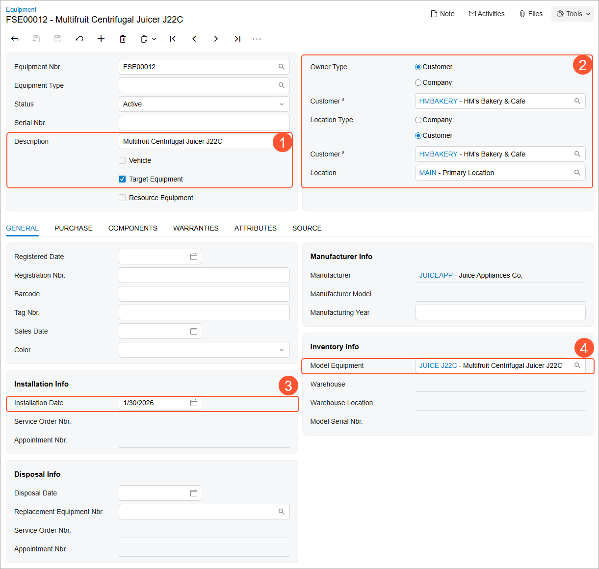
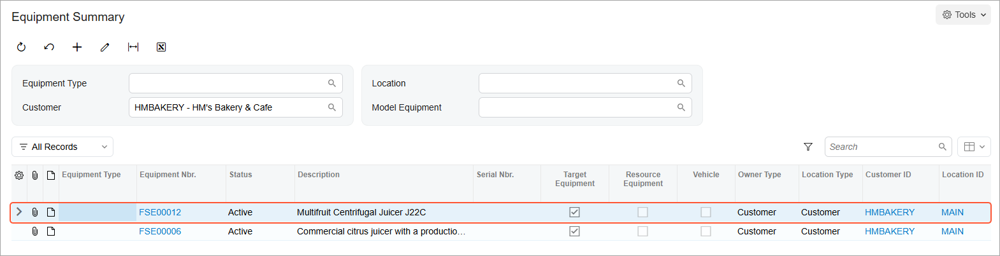

# Target Equipment: To Manually Create Equipment {#_5ef5d680-092c-4dbd-86dd-0523ff7b367c .task}

In this activity, you will create in the system a piece of equipment that the customer already has and that SweetLife will be servicing.

## Story {#section_ivl_11q_jdc .section}

Suppose that the SweetLife Service and Equipment Sales Center needs to perform services on the equipment that was sold to the *HMBAKERY - HM's Bakery &amp; Cafe* customer by a third party. Acting as a service manager, you will enter this equipment record in Acumatica ERP.

## Process Overview {#section_lqv_jf3_jdc .section}

On the [Equipment](FS_20_50_00.md) \(FS205000\) form, you will add a new piece of equipment to be serviced.

## System Preparation {#section_ejp_d23_jdc .section}

Before you begin performing the steps of this activity, do the following:

1.  On the Acumatica ERP website, sign in to a company with the *U100* dataset preloaded. You should sign in as a service manager by using the *davis* username and the *123* password.
2.  In the info area, in the upper-right corner of the top pane of the Acumatica ERP screen, set the business date to *1/30/2026*. For simplicity, in this activity, you will create and process all documents in the system on this business date.

## Step: Creating Target Equipment {#section_cr5_d1q_jdc .section}

To create this piece of target equipment, perform the following instructions:

1.  On the [Equipment](FS_20_50_00.md) \(FS205000\) form, add a new record and specify the following settings in the Summary area \(Item 1 in the following screenshot\):
    -   **Description**: `Multifruit Centrifugal Juicer J22C`
    -   **Target Equipment**: Selected
2.  Under **Owner Type**, select **Customer**, and in the **Customer** box, select *HMBAKERY - HM's Bakery &amp; Cafe* \(Item 2\).
3.  Under **Location Type**, in the **Customer** box, select *HMBAKERY - HM's Bakery &amp; Cafe*.
4.  On the **General** tab \(**Installation Info** section\), in the **Installation Date** box \(Item 3\), select the current business date \(*1/30/2026*\).
5.  In the **Model Equipment** box \(**Inventory Info** section\), select *JUICE\_J22C* \(Item 4\).
6.  On the form toolbar, click **Save**.

    

7.  On the [Equipment Summary](FS_40_02_00.md) \(FS400200\) form, in the **Customer** box of the Summary area, select *HMBAKERY*.
8.  In the table, make sure the *FSE00012* equipment record is listed, as shown in the screenshot below.

    

    If you click the *FSE00012* link in the **Equipment Nbr.** column, the system will open the [Equipment](FS_20_50_00.md) form, where you just created the target equipment.

**Parent topic:**[Creating Target Equipment](../UserGuide/EquipMgmt_Creating_Target_Equipment_Mapref.md)

