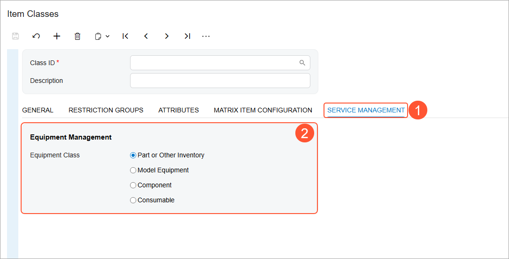

# Stock Items to Be Tracked Post-Sale: General Information {#_0390063b-98f8-42ec-b1e2-30a84db56cfa .concept}

To track equipment after a sale in Acumatica ERP, on the [Stock Items](IN_20_25_00.md) \(IN202500\) form, you need to create a stock item of an equipment class that is designated for model equipment. A stock item of this class represents a piece of equipment that can be sold to a customer and subsequently tracked by your company.

A piece of equipment may or may not include components, which are stock items that belong to an equipment class that is designated for components. You can sell these components along with the equipment or separately, such as when a component of the equipment needs to be replaced or upgraded.

## Learning Objectives {#section_ody_dz5_3dc .section}

In this lesson, you will learn how to do the following:

-   Create a manufacturer record, which will be specified in the stock item settings.
-   Create a stock item of a model equipment class without components \(that is, a record for a piece of equipment to be sold without components\).
-   Create a stock item of a model equipment class with components \(that is, a record for a piece of equipment to be sold with components\). You will also create components \(stock items of a component equipment class\).
-   Record the receipt of stock items to add them to the warehouse inventory.

## Applicable Scenarios { .section}

You configure stock items for post-sale tracking in the following scenarios:

-   Your company needs to track equipment after it has been sold to a customer, ensuring proper maintenance, service, or warranty handling.
-   You sell equipment that includes components and need to manage the sale and tracking of these components as part of the equipment.
-   A customer requires the replacement or upgrade of a component in existing equipment, and the components must be created and managed as separate stock items.
-   Components are sold separately from the equipment—such as for repairs, upgrades, or replacements—and need to be properly recorded in the system.

## Equipment-Related Options of a Stock Item {#section_tv5_4vr_kdc .section}

Before you can create a stock item of a model equipment or component equipment class, you first have to create the applicable item classes on the [Item Classes](IN_20_10_00.md) \(IN201000\) form.

In Acumatica ERP, item classes are used to group stock or non-stock items with similar properties and to provide default settings for new items. When you create a new stock or non-stock item, you select the appropriate item class, and the item’s settings are populated with those defined by the item class.

For an item class intended for equipment to be tracked after the sale, you select one of the following option buttons \(see Item 2 in the screenshot below\) on the **Service Management** tab \(Item 1\) of the [Item Classes](IN_20_10_00.md) form:

-   **Part or Other Inventory** \(default\): Stock items are either equipment parts without warranty and maintenance tracking or stock items not related to equipment records.
-   **Model Equipment**: Stock items that are tracked after the sale, either for preventive maintenance or for warranty purposes.
-   **Component**: Stock items that can be sold as equipment parts. Components may have warranties, serial numbers, and other settings that are independent from those of the equipment.
-   **Consumable**: Stock items that are sold as equipment parts but are not covered by a warranty.

By selecting one of these option buttons, you define the item class as an equipment class.

## Warranty Settings {#section_ddn_k5v_3dc .section}

For a stock item with warranties, you can specify the warranty settings on the **Service Management** tab of the [Stock Items](IN_20_25_00.md) \(IN202500\) form. You can specify the following warranty durations:

-   **Company Warranty**: The duration of the warranty that your company provides to the customer for the stock item
-   **Vendor Warranty**: The duration of the warranty that the vendor provides to your company for the stock item

For each stock item of an equipment class with the **Model Equipment** or **Component** option button selected, you can specify the duration for either of the warranties, both of them, or neither of them.

Also, on the [Equipment Management Preferences](FS_10_03_00.md) \(FS100300\) form, you can select whether the warranty duration is calculated based on the sales order date, the installation date, the earliest of these dates, or the latest of these dates.

**Parent topic:**[Configuring Stock Items to Be Tracked Post-Sale](../UserGuide/EquipMgmt_Configuration_of_Equipment_to_Be_Tracked_Post_Sale_Mapref.md)

