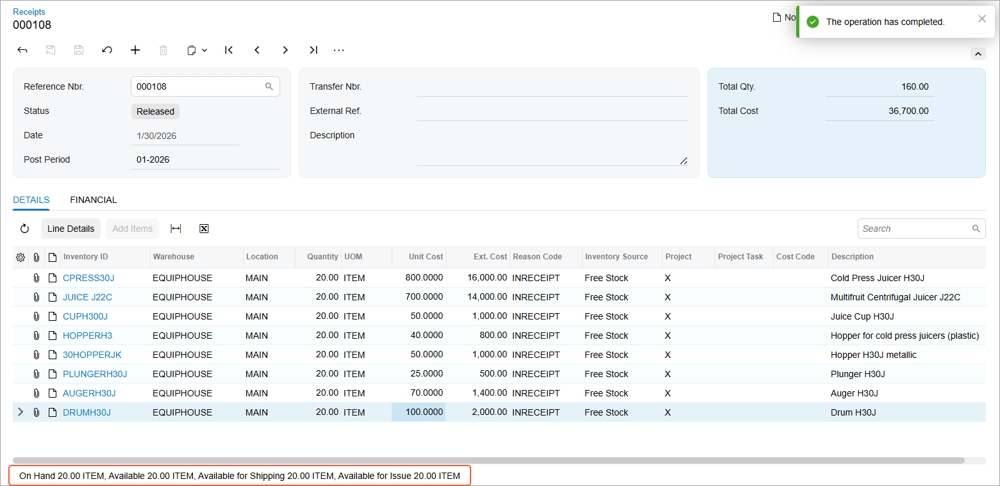

# Stock Items to Be Tracked Post-Sale: To Record the Receipt of Stock Items {#_97035cff-b0d8-4825-8e2e-a7f5d0193e1c .task}

When new stock items are created in Acumatica ERP, you enter a purchase order \(optional\) and a receipt to record the items in the warehouse, making them available for further processing and sale.

## Story {#section_szk_y4s_kdc .section}

Suppose that the SweetLife Service and Equipment Sales Center purchased equipment from the vendor and needs to register the purchase in the system so that the items will be reflected in the warehouse.

Acting as an accountant, you will add a receipt to the system indicating the purchase of the equipment. \(To keep this training streamlined, you do not need to sign in as the accountant; you will complete this step while signed in to the service manager’s user account.\)

## Process Overview {#section_lqv_jf3_jdc .section}

On the [Receipts](IN_30_10_00.md) \(IN301000\) form, you will create and release a receipt listing purchased items so that the items are available in your warehouse.

## System Preparation {#section_z4x_b2b_ldc .section}

Before you begin performing the steps of this lesson, do the following:

1.  On the Acumatica ERP website, sign in to a company with the *U100* dataset preloaded. You should sign in as a service manager by using the *davis* username and the *123* password.
2.  In the info area, in the upper-right corner of the top pane of the Acumatica ERP screen, set the business date to *1/30/2026*. For simplicity, in this activity, you will create and process all documents in the system on this business date.
3.  To perform this activity, make sure that you have performed the following prerequisite activities: [Stock Items to Be Tracked Post-Sale: To Create a Stock Item with No Components](EquipMgmt_Creating_Equipment_with_No_Components_Process_Activity.md), [Stock Items to Be Tracked Post-Sale: To Create Components](EquipMgmt_Creating_Components_Process_Activity.md), and [Stock Items to Be Tracked Post-Sale: To Create Stock Items with Components](EquipMgmt_Creating_Equipment_with_Components_Process_Activity.md).

## Step: Recording the Receipt of Stock Items {#section_pdr_cps_kdc .section}

Perform the following instructions:

1.  On the [Receipts](IN_30_10_00.md) \(IN301000\) form, click **Add New Record**.
2.  On the **Details** tab, add a new row with the following settings:
    -   **Inventory ID**: *CPRESS30J*
    -   **Quantity**: `20`
    -   **Unit Cost**: `800`
3.  Again click **Add Row**, and specify the following settings in the row:
    -   **Inventory ID**: *JUICE\_J22C*
    -   **Quantity**: `20`
    -   **Unit Cost**: `700`
4.  Again click **Add Row**, and specify the following settings in the row:
    -   **Inventory ID**: *CUPH300J*
    -   **Quantity**: `20`
    -   **Unit Cost**: `50`
5.  Click **Add Row** again, and specify the following settings in the row:
    -   **Inventory ID**: *HOPPERH3*
    -   **Quantity**: `20`
    -   **Unit Cost**: `40`
6.  Click **Add Row** again, and specify the following settings in the row:
    -   **Inventory ID**: *30HOPPERJK*
    -   **Quantity**: `20`
    -   **Unit Cost**: `50`
7.  Again click **Add Row**, and specify the following settings in the row:
    -   **Inventory ID**: *PLUNGERH30J*
    -   **Quantity**: `20`
    -   **Unit Cost**: `25`
8.  Click **Add Row** once again, and specify the following settings in the row:
    -   **Inventory ID**: *AUGERH30J*
    -   **Quantity**: `20`
    -   **Unit Cost**: `70`
9.  Click **Add Row** once again, and specify the following settings in the row:
    -   **Inventory ID**: *DRUMH30J*
    -   **Quantity**: `20`
    -   **Unit Cost**: `100`
10. On the form toolbar, click **Save**.

    You have created the receipt for the model equipment in the system.

11. On the form toolbar, click **Release**.

Once the receipt is released, the items of each row are available in your warehouse, as the following screenshot shows.

Now you can proceed to creating a sales order for equipment.

**Parent topic:**[Configuring Stock Items to Be Tracked Post-Sale](../UserGuide/EquipMgmt_Configuration_of_Equipment_to_Be_Tracked_Post_Sale_Mapref.md)

