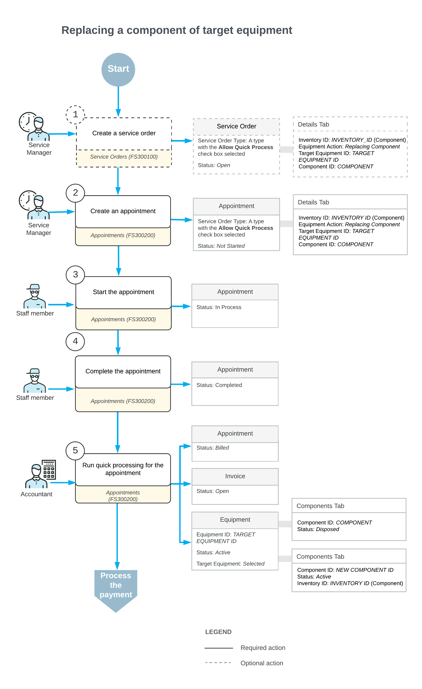

# Replacing a Component of Target Equipment: General Information {#_447d13fd-049a-4518-acf8-acc4e4332851 .concept}

With Acumatica ERP, you can manage customer requests for replacing components in existing equipment and performing the necessary replacement services on-site.

## Learning Objectives { .section}

In this lesson, you will learn how to replace a component of target equipment.

## Applicable Scenarios { .section}

You replace a component of target equipment in the following cases:

-   A customer requests the replacement of a specific component within existing target equipment they already own.
-   Replacement services are required to install the new component in the equipment at the customer’s site.

## Workflow of Target Equipment Component Replacement {#section_pfn_5xj_jdc .section}

In the following diagram, you can see the entire process of a component of target equipment being replaced.

When a customer request is received, a service manager enters a service order by using the [Service Orders](FS_30_01_00.md) \(FS300100\) form. In the service order, the service manager specifies the customer from which the request has been received, the branch and branch location to provide services, and the services that should be performed.

The service manager can instead start by creating an appointment with all these settings; the service order will be created automatically. In [Replacing a Component of Target Equipment: Process Activity](EquipMgmt_Replacing_Component_of_Target_Equipment_Process_Activity.md), the appointment will be created first.

On the [Appointments](FS_30_02_00.md) \(FS300200\) form, the service manager enters the general settings. On the **Details** tab, the service manager adds the component that will replace the old component. To specify that the replacement is being performed, for the new component, the service manager selects *Replacing Component* in the **Equipment Action** column, specifies the target equipment record in which the component has to be replaced in the **Target Equipment ID** column and specifies the component to be replaced in the **Component Ref. Nbr.** column.

The remainder of the process of target equipment being replaced is identical to the process of model equipment being replaced.

**Parent topic:**[Replacing a Component of Target Equipment](../UserGuide/EquipMgmt_Replacing_Component_of_Target_Equipment_Mapref.md)

