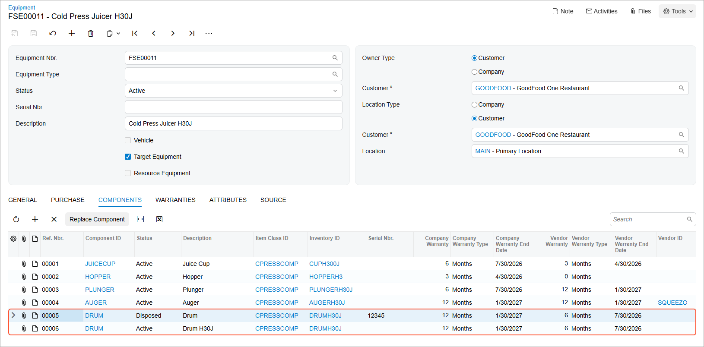

# Replacing a Component of Target Equipment: Process Activity {#_5e63d8d2-c484-4309-9560-f93ab88a344f .task}

The following activity will walk you through the process of replacing a component in existing equipment and coordinating the associated replacement services.

## Story {#section_wpx_mxj_jdc .section}

Suppose that the GoodFood One Restaurant customer has requested a new component \(a new drum\) to replace an old one in the existing target equipment \(*CPRESS30J - Cold Press Juicer H30J*\), along with replacement services from SweetLife Service and Equipment Sales Center.

Acting as a service manager, you will create an appointment. You will then perform further processing, acting as the assigned staff member and then as the accountant who will prepare billing documents for the customer and will process them in the system. To keep this training simple, you will perform all instructions while signed in to the user account of the service manager \(Maia Davis\).

## Process Overview {#section_hh4_1tj_jdc .section}

On the [Appointments](FS_30_02_00.md) \(FS300200\) form, you will create a new appointment, add the service along with the stock item of the **Component** equipment class, specify the required equipment-related action for the item, and then process the appointment.

## System Preparation {#section_ejp_d23_jdc .section}

Before you begin performing the steps of this activity, do the following:

1.  On the Acumatica ERP website, sign in to a company with the *U100* dataset preloaded. You should sign in as a service manager by using the *davis* username and the *123* password.
2.  In the info area, in the upper-right corner of the top pane of the Acumatica ERP screen, set the business date to *1/30/2026*. For simplicity, in this activity, you will create and process all documents in the system on this business date.
3.  To perform this activity, make sure that you have performed the following prerequisite activity: [Stock Items to Be Tracked Post-Sale: To Create Components](EquipMgmt_Creating_Components_Process_Activity.md), [Stock Items to Be Tracked Post-Sale: To Create Stock Items with Components](EquipMgmt_Creating_Equipment_with_Components_Process_Activity.md).

## Step: Replacing a Component of Target Equipment {#section_v5f_pxj_jdc .section}

In this step, you will create an appointment \(causing the system to create the corresponding service order\) that includes the *REPAIR* service and the *DRUMH30J* inventory item, which replaces the target equipment. You will go through the whole process until you release the corresponding invoice for both the service and the replaced component.

Perform the following instructions:

1.  On the [Appointments](FS_30_02_00.md) \(FS300200\) form, click **Add New Record**.
2.  Specify the following settings in the Summary areas:
    -   **Service Order Type**: *INST*
    -   **Customer ID**: *GOODFOOD - GoodFood One Restaurant*
    -   **Description**: `Replacing a part of a juicer`
3.  On the form toolbar, click **Save**.
4.  On the **Details** tab, add a row with the following settings:
    -   **Inventory ID**: *REPAIR*
    -   **Target Equipment ID**: *FSE00011* \(Cold Press Juicer H30J\)
5.  On the form toolbar, click **Save**.
6.  To add a component to this appointment, add another row, and specify the following settings in the row:
    -   **Inventory ID**: *DRUMH30J*
    -   **Equipment Action**: *Replacing Component*
    -   **Target Equipment ID**: *FSE00011* \(Cold Press Juicer H30J\)
    -   **Component ID**: *DRUM*
    -   **Component Ref. Nbr.**: *00005*
    -   **Estimated Quantity**: `1.00`
    -   **Unit Price**: `100.0000`
7.  On the form toolbar, click **Save**.

    Notice that the **Warranty** check box is selected in the *DRUM* row, meaning that it is under warranty.

8.  On the **Staff** tab, click **Add Row**, and specify *EP00000044 - Ricardo Martinez* as the **Staff Member**.
9.  On the form toolbar, click **Save**.
10. On the form toolbar, click **Start**.

    \(As you perform this instruction, you are acting as Ricardo Martinez at the appointment.\)

11. On the **Settings** tab, in the **Actual Date and Time** section, enter the actual start and end times \(for simplicity in this training, set them to match the scheduled start and end times\). Select the **Finished** check box.
12. On the form toolbar, click **Complete**.
13. On the form toolbar, click **Close**.

    \(As you perform this instruction, you are now acting as an accountant.\)

14. On the form toolbar, click **Quick Process**.

    In the **Process Appointment** dialog box, which opens, ensure that the following check boxes are selected:

    -   **Run Billing**
    -   **Release Invoice**
15. In the dialog box, click **OK**.

    Once the billing process is completed, the reference number of the invoice appears in the Processing Results dialog box.

    Notice that the appointment now has the *Billed* status.

16. In the Processing Results dialog box, click the reference number of the created document. The [Invoices](SO_30_30_00.md) \(SO303000\) form opens. Notice the invoice has been released and has the *Open* status, which means that the target equipment record has been updated.
17. In the **Target Equipment** column on the **Details** tab, click the equipment reference number \(which is a link\) to open the [Equipment](FS_20_50_00.md) \(FS205000\) form.
18. On the **Components** tab, verify that the status of the *00005* line is *Disposed* \(see the following screenshot\). It has been replaced with line *00006*.

    **Tip:** You can also replace a component of a piece of target equipment by clicking the **Replace Component** button on the table toolbar of the **Components** tab on the [Equipment](FS_20_50_00.md) form. In the dialog box that opens, you can manually select the installation and sales dates of the component being replaced.

    

19. On the More menu \(under **Inquiries**\), click **Target Equipment History**. On the [Appointment Details](FS_40_05_00.md) \(FS400500\) form, which has opened, verify that the information about the replaced drum is in the list, along with other details related to this equipment.

**Parent topic:**[Replacing a Component of Target Equipment](../UserGuide/EquipMgmt_Replacing_Component_of_Target_Equipment_Mapref.md)

