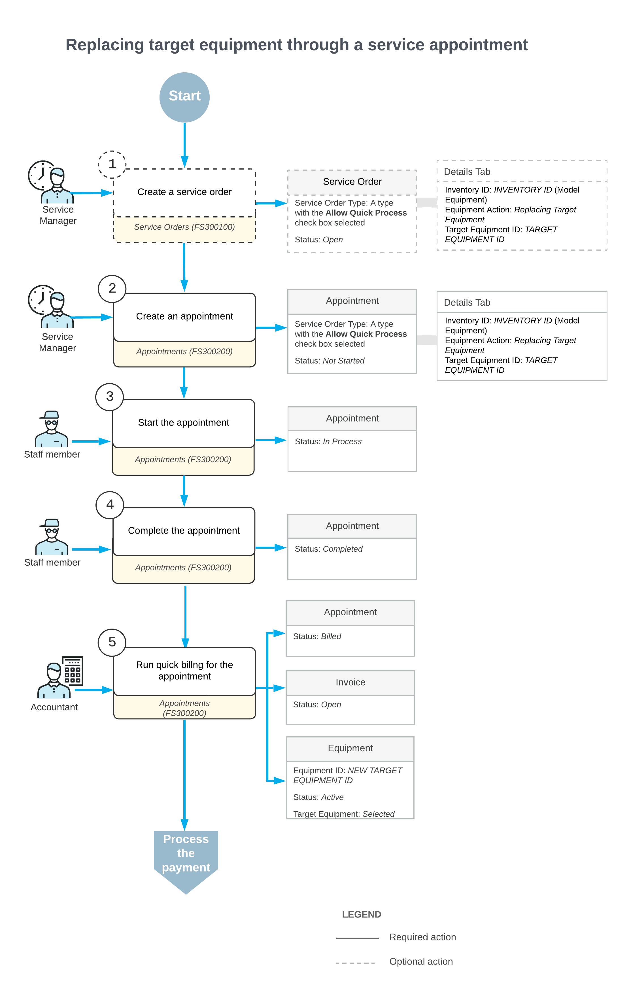

# Replacing Target Equipment: General Information {#_6eb4372a-e69a-42eb-a94d-6ebfd47342c8 .concept}

With Acumatica ERP, you can efficiently manage customer requests for replacing old target equipment with new models and performing the associated services.

## Learning Objectives { .section}

In this lesson, you will learn how to replace target equipment.

## Applicable Scenarios { .section}

You process the replacement of target equipment in the following scenarios:

-   A customer requests a new piece of equipment to replace an older model that is already in use.
-   Replacement services are required to ensure seamless equipment transition at the customer’s location.

In these situations, the service manager schedules an appointment, coordinates service actions, and collaborates with accounting to prepare and process billing documents for the customer.

## Workflow of Target Equipment Replacement {#section_src_cwj_jdc .section}

In the following diagram, you can see the complete process of replacing target equipment.

When a customer request is received, a service manager enters a service order by using the [Service Orders](FS_30_01_00.md) \(FS300100\) form. In the service order, the service manager specifies the customer from which the request has been received, the branch and branch location to provide services, and the services that should be performed.

The service manager can instead start by creating an appointment with all these settings; the service order will be created automatically. In [Replacing Target Equipment: Process Activity](EquipMgmt_Replacing_Target_Equipment_Process_Activity.md), the appointment will be created first.

On the [Appointments](FS_30_02_00.md) \(FS300200\) form, the service manager enters the general settings. On the **Details** tab, the service manager adds the equipment record that will replace the old target equipment record. To specify that the replacement is being performed, for the equipment record, the service manager selects *Replacing Target Equipment* in the **Equipment Action** column and specifies the target equipment record to be replaced in the **Target Equipment ID** column.

**Parent topic:**[Replacing Target Equipment](../UserGuide/EquipMgmt_Replacing_Target_Equipment_Mapref.md)

