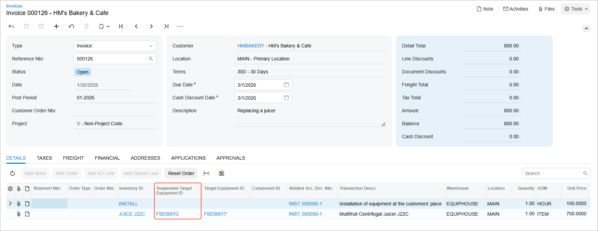
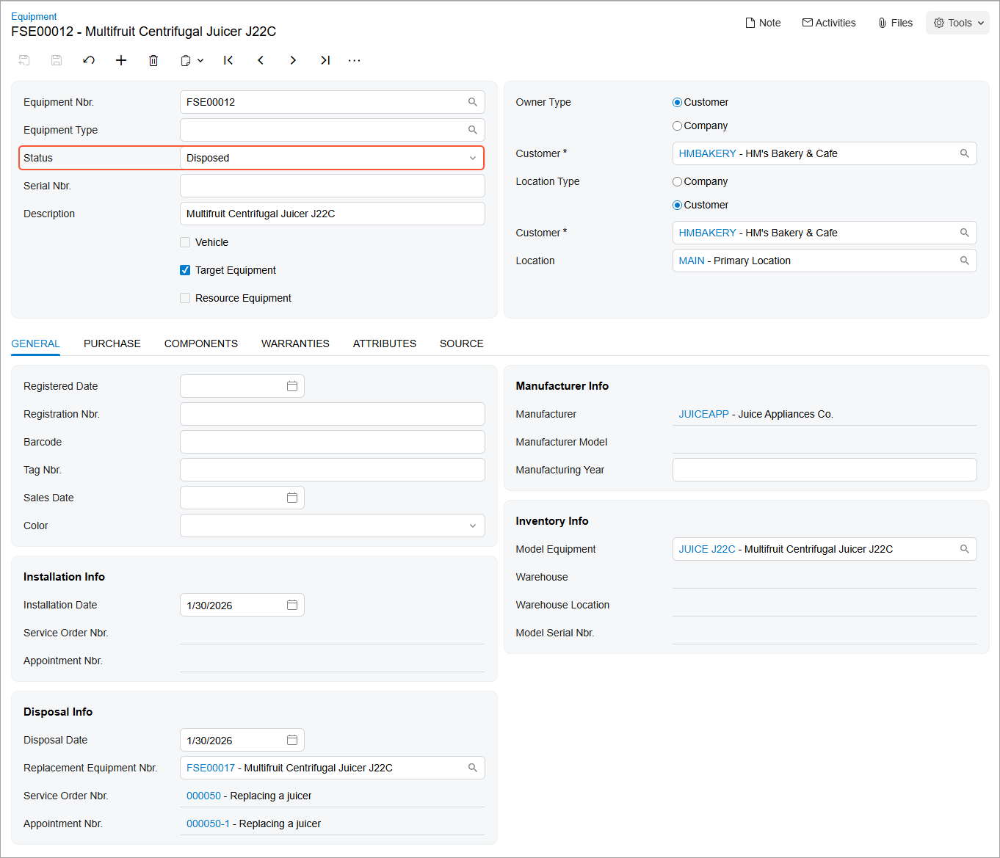
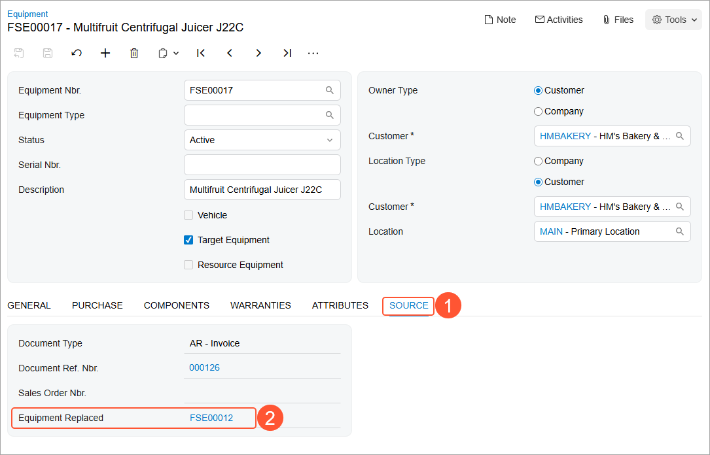

# Replacing Target Equipment: Process Activity {#_3cf2f1ff-8c1d-463d-a3b8-67d917ca8097 .task}

The following activity will walk you through the process of replacing old equipment with a new model and managing the associated service.

## Story {#section_xfp_vvj_jdc .section}

Suppose that the HM's Bakery &amp; Cafe customer has requested a new piece of equipment \(*J22C Multifruit Centrifugal Juicer*\) to replace an old one, along with replacement services from SweetLife Service and Equipment Sales Center.

Acting as a service manager, you will create an appointment. You will then perform further processing, acting as the assigned staff member and then as the accountant who will prepare billing documents for the customer and will process them in the system. To keep this training simple, you will perform all instructions while signed in to the user account of the service manager \(Maia Davis\).

## Process Overview {#section_hh4_1tj_jdc .section}

On the [Appointments](FS_30_02_00.md) \(FS300200\) form, you will create a new appointment, add the service along with the necessary stock item \(which is defined as model equipment\), specify the required equipment-related action for the item, and then process the appointment.

## System Preparation {#section_ejp_d23_jdc .section}

Before you begin performing the steps of this activity, do the following:

1.  On the Acumatica ERP website, sign in to a company with the *U100* dataset preloaded. You should sign in as a service manager by using the *davis* username and the *123* password.
2.  In the info area, in the upper-right corner of the top pane of the Acumatica ERP screen, set the business date to *1/30/2026*. For simplicity, in this activity, you will create and process all documents in the system on this business date.
3.  To perform this activity, make sure that you have performed the following prerequisite activities: [Stock Items to Be Tracked Post-Sale: To Create a Stock Item with No Components](EquipMgmt_Creating_Equipment_with_No_Components_Process_Activity.md), [Stock Items to Be Tracked Post-Sale: To Create Components](EquipMgmt_Creating_Components_Process_Activity.md), and [Stock Items to Be Tracked Post-Sale: To Create Stock Items with Components](EquipMgmt_Creating_Equipment_with_Components_Process_Activity.md).

## Step: Replacing Target Equipment {#section_j52_kwj_jdc .section}

In this step, you will create an appointment \(which causes the system to create the corresponding service order\) that includes the *INSTALL* service and the *Multifruit Centrifugal Juicer J22C* inventory item, which replaces the target equipment. You will go through the whole process until you release the corresponding invoice for both the service and the sold equipment.

Perform the following instructions:

1.  On the [Appointments](FS_30_02_00.md) \(FS300200\) form, click **Add New Record**.
2.  Specify the following settings in the Summary area:
    -   **Service Order Type**: *INST*
    -   **Customer**: *HMBAKERY - HM's Bakery &amp; Cafe*
    -   **Description**: `Replacing a juicer`
3.  On the form toolbar, click **Save**.
4.  On the **Details** tab, do the following:
    1.  Add a row and select *INSTALL* in the **Inventory ID** column.
    2.  To add model equipment to this appointment, add another row and specify the following settings in the row:
        -   **Inventory ID**: *JUICE\_J22C*
        -   **Equipment Action**: *Replacing Target Equipment*
        -   **Target Equipment ID**: *Multifruit Centrifugal Juicer J22C*
        -   **Estimated Quantity**: `1.00`
        -   **Unit Price**: `700.0000`
5.  On the form toolbar, click **Save**.

    Now you can assign the appointment and proceed with the service.

6.  On the **Staff** tab, click **Add Row** and specify *EP00000003 - Jon Waite* as the **Staff Member**.
7.  On the form toolbar, click **Save**.
8.  On the form toolbar, click **Start**.

    As you perform this instruction and the next two instructions, you are acting as Jon Waite at the appointment.

9.  On the **Settings** tab, in the **Actual Date and Time** section, enter the actual start and end times \(for simplicity in this training, set them to match the scheduled start and end times\). Select the **Finished** check box.
10. On the form toolbar, click **Complete**.

    As you perform the remaining instructions in this step, you are now acting as an accountant.

11. On the form toolbar, click **Close**.
12. On the form toolbar, click **Quick Process**.

    In the **Process Appointment** dialog box, which opens, ensure that the following check boxes are selected:

    -   **Run Billing**
    -   **Release Invoice**
13. In the dialog box, click **OK**.

    Once the billing process is completed, the reference number of the invoice appears in the Processing Results dialog box.

    Notice that the appointment now has the *Billed* status.

14. In the Processing Results dialog box, click the reference number of the created document. The [Invoices](SO_30_30_00.md) \(SO303000\) form opens. Notice that the invoice has been released and has the *Open* status, which means that the target equipment record has been assigned the *Disposed* status and the new equipment has been created.
15. On the [Invoices](SO_30_30_00.md) form, in the **Suspended Target Equipment ID** column \(see below\), click the reference number of the equipment \(which is a link\) to open the [Equipment](FS_20_50_00.md) \(FS205000\) form.

    

    **Tip:** If you don't see the **Suspended Target Equipment ID** column, you can add it by using the configuration dialog, which opens when you click the Settings icon in the leftmost column of the table on the **Details** tab.

16. Verify that the status of the equipment is *Disposed* \(see the following screenshot\).

    

17. Close the [Equipment](FS_20_50_00.md) form.
18. On the [Invoices](SO_30_30_00.md) form, click the equipment reference number in the **Target Equipment ID** column.
19. On the [Equipment](FS_20_50_00.md) that opens, review the details of the created equipment. In the **Installation Info** section of the **General** tab, you can find the reference numbers of the related service order and appointment.
20. Go to the **Source** tab \(see Item 1 in the following screenshot\). In the **Equipment Replaced** box \(Item 2\), you can find the reference number of the equipment that was replaced with the current one.

    

**Parent topic:**[Replacing Target Equipment](../UserGuide/EquipMgmt_Replacing_Target_Equipment_Mapref.md)

