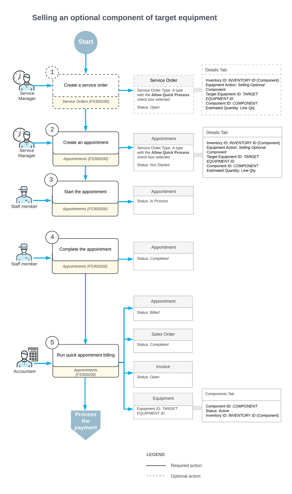

# Selling an Optional Component of Target Equipment: General Information {#_30b8cc28-8ae0-4368-a1b1-a37fde238df2 .concept}

With Acumatica ERP, you can install optional components for existing equipment at a customer site and provide associated installation services as requested.

## Learning Objectives { .section}

In this lesson, you will learn how to sell an optional component that will upgrade target equipment.

## Applicable Scenarios { .section}

You sell an optional component that can become target equipment in the following scenarios:

-   When a customer requests the installation of an optional component for existing equipment already in use at their site.
-   When a customer requires both the component installation and associated installation services to be provided by your company.

In these situations, the service manager initiates the appointment, assigns necessary staff, and coordinates with the accountant to prepare and process billing documents for the customer.

## Workflow of a Sales of an Optional Component for Target Equipment {#section_k23_gqj_jdc .section}

In the following diagram, you can see the process of selling an optional component for target equipment.

When a customer request is received, a service manager enters a service order by using the [Service Orders](FS_30_01_00.md) \(FS300100\) form; see 1 in the diagram above. In the service order, the service manager specifies the customer from which the request has been received, the branch and branch location to provide services, and the services that should be performed.

The service manager can instead start by creating an appointment with all these settings; the service order will be created automatically.

On the [Appointments](FS_30_02_00.md) \(FS300200\) form, the service manager adds the general setting. On the **Details** tab, the service manager adds the optional component to be sold. In the row of this component, the service manager selects *Selling Optional Component* in the **Equipment Action** column, specifies the related target equipment in the **Target Equipment ID** column, and selects the identifier of the equipment component in the **Component ID** column.

**Parent topic:**[Selling an Optional Component of Target Equipment](../UserGuide/EquipMgmt_Selling_Optional_Component_for_Target_Equipment_Mapref.md)

