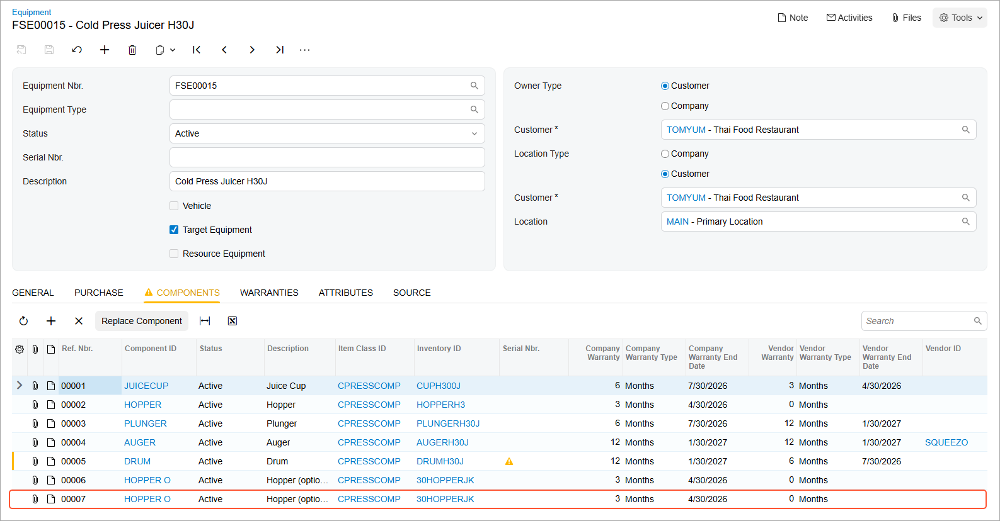

# Selling an Optional Component of Target Equipment: Process Activity {#_6d225630-1f21-4670-979f-bdf681ab0262 .task}

The following activity will guide you through the process of installing an optional component for existing equipment at a customer site and providing the related installation service.

## Story {#section_fjm_lrj_jdc .section}

Suppose that the customer has requested that an optional component \(*30HOPPERJK*\) of target equipment \(*CPRESS30J - Cold Press Juicer H30J*, which the company already has\) be installed at the customer site, along with installation services from SweetLife Service and Equipment Sales Center.

Acting as a service manager, you will create an appointment. The assigned staff member will process it further, and the accountant will prepare billing documents for the customer and process them in the system. To simplify this training, you will perform all instructions while signed in to the user account of the service manager \(Maia Davis\).

## Process Overview {#section_hh4_1tj_jdc .section}

On the [Appointments](FS_30_02_00.md) \(FS300200\) form, you will create a new appointment, add the service along with the required stock item of a component equipment class, specify the equipment-related action for this item, and process the appointment.

## System Preparation {#section_ejp_d23_jdc .section}

Before you begin performing the steps of this activity, do the following:

1.  On the Acumatica ERP website, sign in to a company with the *U100* dataset preloaded. You should sign in as a service manager by using the *davis* username and the *123* password.
2.  In the info area, in the upper-right corner of the top pane of the Acumatica ERP screen, set the business date to *1/30/2026*. For simplicity, in this activity, you will create and process all documents in the system on this business date.
3.  To perform this activity, make sure that you have performed the following prerequisite activities: [Stock Items to Be Tracked Post-Sale: To Create Components](EquipMgmt_Creating_Components_Process_Activity.md) and [Stock Items to Be Tracked Post-Sale: To Create Stock Items with Components](EquipMgmt_Creating_Equipment_with_Components_Process_Activity.md).

## Step: Selling an Optional Component of Target Equipment {#section_jqh_hrj_jdc .section}

In this step, you will create an appointment \(causing the system to create the corresponding service order\) that includes the installation service \(*INSTALL*\) and an additional component, *30HOPPERJK*. You will then generate a sales invoice by using the **Quick Process** button.

Perform the following instructions:

1.  On the [Appointments](FS_30_02_00.md) \(FS300200\) form, click **Add New Record**.
2.  Specify the following settings in the Summary area:
    -   **Service Order Type**: *EQUP*
    -   **Customer**: *TOMYUM - Thai Food Restaurant*
    -   **Description**: `Selling an optional component`
3.  On the form toolbar, click **Save**.
4.  On the **Details** tab, add a row, and in the **Inventory ID** column of the row, select the *INSTALL* service.
5.  Add another row, and specify the following settings in the row to add a component \(a hopper\) to the appointment:
    -   **Inventory ID**: *30HOPPERJK*
    -   **Equipment Action**: *Selling Optional Component*
    -   **Target Equipment ID**: *Cold Press Juicer H30J*
    -   **Component ID**: *HOPPER\_O*
    -   **Estimated Quantity**: `1.00`
    -   **Unit Price**: `50.0000`
6.  Save your changes.
7.  On the table toolbar of the **Staff** tab, click **Add Row**; specify *EP00000003 - Jon Waite* as the **Staff Member**.
8.  Save your changes.
9.  On the form toolbar, click **Start**.

    As you perform this instruction \(and the next three instructions\), you are acting as Jon Waite at the appointment.

10. On the **Settings** tab, in the **Actual Date and Time** section, enter the actual start and end times \(for simplicity in this training, set them to match the scheduled start and end times\). Select the **Finished** check box.
11. On the form toolbar, click **Complete**.

    As you perform the remaining instructions in this step, you are now acting as an accountant.

12. On the form toolbar, click **Close**.
13. On the form toolbar, click **Quick Process**.

    You are now acting as an accountant.

14. In the **Process Appointment** dialog box, which opens, ensure that the following check boxes are selected:
    -   **Prepare Invoice**
    -   **Release Invoice**
15. Click **OK**. Once the billing process has completed, the billing document reference numbers appear in the Processing Results dialog box. Close the dialog box, and notice that the appointment now has the *Billed* status.
16. On the **Billing Documents** tab, review the list of generated documents, and click the reference number of the sales invoice in the **Reference Nbr.** column.

    The system opens the [Invoices](SO_30_30_00.md) \(SO303000\) form. Review the details of the generated invoice. Notice that the invoice has been released and has the *Open* status, which means that the target equipment record has been updated.

17. In the **Target Equipment** column, click the reference number link of the equipment to open the [Equipment](FS_20_50_00.md) \(FS205000\) form.
18. Click the **Components** tab to verify that the system has added the optional component to the target equipment record \(see the following screenshot\).

    

**Parent topic:**[Selling an Optional Component of Target Equipment](../UserGuide/EquipMgmt_Selling_Optional_Component_for_Target_Equipment_Mapref.md)

