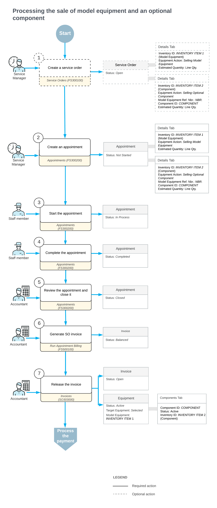

# Selling a Piece of Equipment and an Optional Component: General Information {#_cf52820e-012a-4d0f-a89b-8b93cd5e810a .concept}

With Acumatica ERP, you can sell a piece of equipment along with services and continue to provide services for the equipment after the sale.

## Learning Objectives {#section_lcn_xlj_jdc .section}

In this lesson, you will learn how to sell a piece of equipment, an optional component, and installation services through an appointment.

## Applicable Scenarios {#section_jbd_px3_jdc .section}

You sell a piece of equipment and an optional component in the following scenarios:

-   A customer has asked your company to sell a new piece of equipment.
-   A customer has requested optional components for equipment serviced by your company, along with installation services.

## Workflow of Model Equipment Sale with Optional Component {#section_bxl_wlj_jdc .section}

In the diagram below, you can see the process of selling a piece of equipment and its optional component by using a service order.

When a customer request is received, a service manager enters a service order by using the [Service Orders](FS_30_01_00.md) \(FS300100\) form. In the service order, the service manager specifies the customer from which the request has been received, the branch and branch location to provide services, and the services that should be performed.

The service manager can instead start by creating an appointment with all these settings, and the service order will be created automatically. In [Selling a Piece of Equipment and an Optional Component: Process Activity](EquipMgmt_Selling_Piece_of_Equipment_and_Optional_Component_Process_Activity.md), the appointment will be created first.

On the **Details** tab of the [Appointments](FS_30_02_00.md) \(FS300200\) form, the service manager does the following to add the model equipment record and the optional component to be sold:

1.  In the row with the equipment record \(*CPRESS30J*\), the service manager selects *Selling Model Equipment* in the **Equipment Action** column.
2.  In the row with the optional component \(*30HOPPERJK*\), the service manager selects *Selling Optional Component* in the **Equipment Action** column, specifies the related equipment in the **Model Equipment Ref. Nbr.** column, and selects the identifier of the equipment component in the **Component ID** column.

**Parent topic:**[Selling a Piece of Equipment and an Optional Component](../UserGuide/EquipMgmt_Selling_Piece_of_Equipment_and_Optional_Component_Mapref.md)

