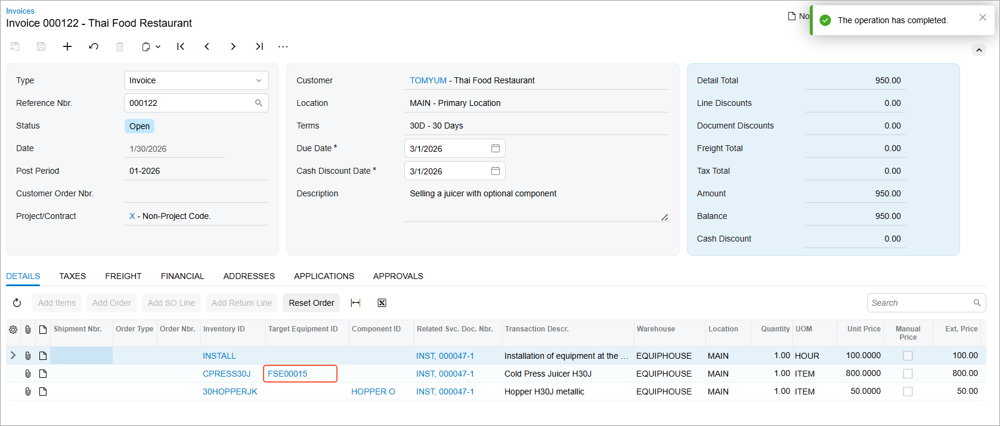
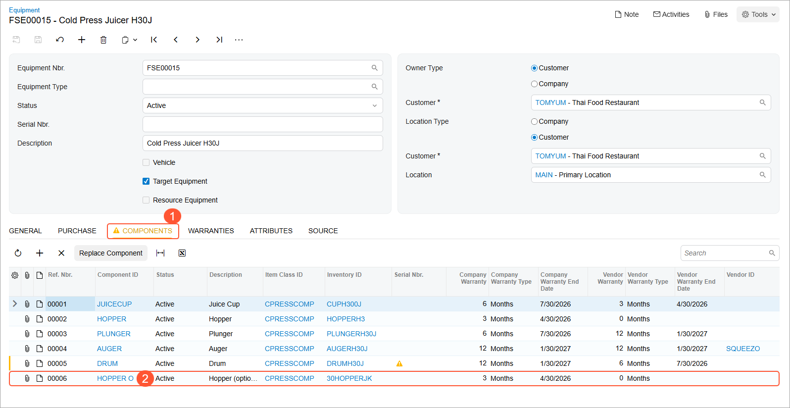

# Selling a Piece of Equipment and an Optional Component: Process Activity {#_d107d05b-49ca-4d7e-9dff-f900a9231dde .task}

The following activity will walk you through the process of selling a piece of equipment, an optional component, and the associated installation service.

## Story {#section_axl_wlj_jdc .section}

Suppose that the customer has contacted the SweetLife Service and Equipment Sales Center to request the following:

-   A cold press juicer—that is, the *CPRESS30J - Cold Press Juicer H30J* equipment \(a stock item of the *Model Equipment* type\)
-   An optional component for the juicer—the *30HOPPERJK - Hopper H30J metallic* component \(a stock item of the *Component* type\)
-   Installation services

Acting as a service manager, you will create an appointment. Further processing will then be performed by the assigned staff member and the accountant, who will prepare and process the billing documents for the customer. To keep this training simple, you will perform all instructions while you are signed in to the user account of the service manager \(Maia Davis\).

## Process Overview { .section}

On the [Appointments](FS_30_02_00.md) \(FS300200\) form, you will create a new appointment, add the required items, specify the equipment-related actions for each item, and process the appointment.

## System Preparation {#section_ejp_d23_jdc .section}

Before you begin performing the steps of this activity, do the following:

1.  On the Acumatica ERP website, sign in to a company with the *U100* dataset preloaded. You should sign in as a service manager by using the *davis* username and the *123* password.
2.  In the info area, in the upper-right corner of the top pane of the Acumatica ERP screen, set the business date to *1/30/2026*. For simplicity, in this activity, you will create and process all documents in the system on this business date.
3.  To perform this activity, make sure that you have performed the following prerequisite activities: [Stock Items to Be Tracked Post-Sale: To Create Components](EquipMgmt_Creating_Components_Process_Activity.md) and [Stock Items to Be Tracked Post-Sale: To Create Stock Items with Components](EquipMgmt_Creating_Equipment_with_Components_Process_Activity.md).

## Step: Selling a Piece of Model Equipment and an Optional Component {#section_qmg_cmj_jdc .section}

In this step, you will create an appointment \(causing the system to create the corresponding service order\) that includes the installation service *INST*, the *CPRESS30J - Cold Press Juicer H30J* equipment, and the optional *30HOPPERJK - Hopper H30J metallic* component. You will go through the whole process until you generate an invoice for both the service and the sold equipment.

Perform the following instructions:

1.  On the [Appointments](FS_30_02_00.md) \(FS300200\) form, click **Add New Record**.
2.  In the Summary area, specify the following settings:
    -   **Service Order Type**: *INST*
    -   **Customer**: *TOMYUM - Thai Food Restaurant*
    -   **Description**: `Selling a juicer with optional component`
3.  On the form toolbar, click **Save**.
4.  On the **Details** tab, add a row, and in the **Inventory ID** column of the row, select *INSTALL*.

    Notice that you do not specify target equipment IDs because the corresponding records in the system have not yet been created.

5.  On the **Details** tab, add a row, and specify the following settings in the row to add a piece of model equipment \(a juicer\) to the appointment:
    -   **Inventory ID**: *CPRESS30J*
    -   **Equipment Action**: *Selling Model Equipment*
    -   **Estimated Quantity**: `1.00`
    -   **Unit Price**: `800.0000`
6.  On the form toolbar, click **Save**.
7.  Click **Add Row** again, and specify the following settings in the row to add another piece of equipment \(an additional component\) to the appointment:
    -   **Inventory ID**: *30HOPPERJK*
    -   **Equipment Action**: *Selling Optional Component*
    -   **Model Equipment Ref. Nbr.**: *0002*
    -   **Component ID**: *HOPPER O*
    -   **Estimated Quantity**: `1.00`
    -   **Unit Price**: `50.0000`
8.  On the form toolbar, click **Save**.

    Notice that for the optional component, you have specified the related model equipment number in the **Model Equipment Ref. Nbr.** column and selected the identifier of the equipment component in the **Component ID** column.

    Now you can assign the appointment and proceed with the services. At this stage, the target equipment corresponding to the model equipment has not yet been created.

9.  On the **Staff** tab, click **Add Row**, and specify *EP00000043 - Edward Smith* as the **Staff Member**.
10. On the form toolbar, click **Save**.
11. On the form toolbar, click **Start**.

    As you perform this instruction and the next two, you are acting as Edward Smith at the appointment.

12. On the **Settings** tab, in the **Actual Date and Time** section, enter the actual start and end times \(for simplicity in this training, set them to match the scheduled start and end times\). Select **Finished**.
13. Click **Complete**.

    As you perform the remaining instructions in this step, you are now acting as an accountant.

14. On the form toolbar, click **Close**.
15. On the form toolbar, click **Run Billing**. The [Invoices](SO_30_30_00.md) \(SO303000\) form opens with the details of the invoice.

    Notice that the **Related Svc. Doc. Nbr.** column contains the link to the appointment document from which the sales invoice has originated.

    **Tip:** You can also open the [Invoices](SO_30_30_00.md) form by clicking the link of the invoice in the **Reference Nbr.** column of the **Billing Documents** tab on the [Appointments](FS_30_02_00.md) form.

16. On the form toolbar of the [Invoices](SO_30_30_00.md) form, click **Remove Hold** and then **Release**.

    When the invoice was released, the target equipment record was created \(as shown in the following screenshot\).

    

17. In the **Target Equipment ID** column, click the equipment reference number link to open the [Equipment](FS_20_50_00.md) \(FS205000\) form.
18. On the **Components** tab \(see Item 1 in the following screenshot\), verify that the system has added the additional component of the model equipment record that has been sold within the same order \(Item 2\).

    

**Parent topic:**[Selling a Piece of Equipment and an Optional Component](../UserGuide/EquipMgmt_Selling_Piece_of_Equipment_and_Optional_Component_Mapref.md)

