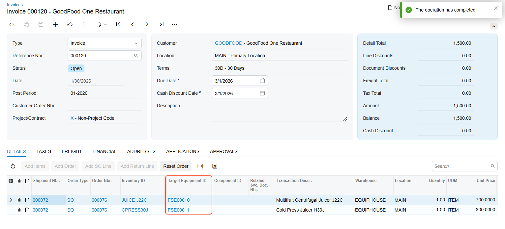
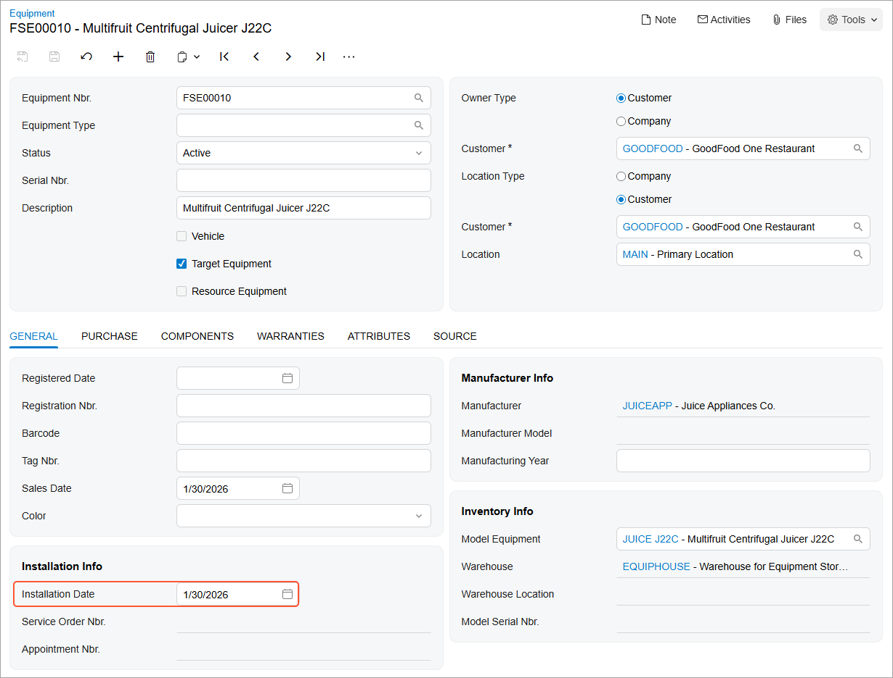
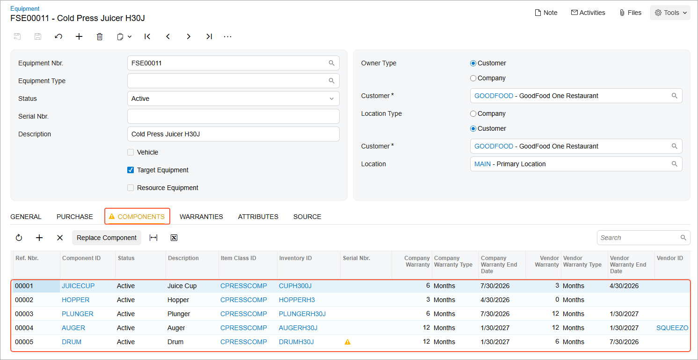

# Target Equipment: To Sell a Stock Item as Target Equipment {#_cbba8e6e-538b-4f3c-b890-62ba9f4e06a4 .task}

The following activity will walk you through the process of selling two stock items with the **Model Equipment** equipment class. When you release the invoice for the sale, the system will automatically create a target equipment record. You will then verify that the stock items sold to the customer are listed as target equipment owned by this customer.

## Story {#section_pvt_zyp_jdc .section}

Suppose that the *GOODFOOD \(GoodFood One Restaurant\)* customer would like to purchase two pieces of equipment, along with installation services, from the SweetLife Service and Equipment Sales Center.

Acting as a service manager, you will receive the request and create a sales order. Then acting as an accountant, you will prepare and release an invoice. \(To keep this training simple, you will perform all instructions by using the user account of the service manager, Maia Davis.\)

## Process Overview {#section_lqv_jf3_jdc .section}

On the [Sales Orders](SO_30_10_00.md) \(SO301000\) form, you will create a new sales order. In this sales order, you will add stock items and specify the *Selling Model Equipment* equipment action for them. Then you will prepare and release a sales invoice. By releasing the invoice, the system will create the target equipment.

## System Preparation {#section_ejp_d23_jdc .section}

Before you begin performing the steps of this activity, do the following:

1.  On the Acumatica ERP website, sign in to a company with the *U100* dataset preloaded. You should sign in as a service manager by using the *davis* username and the *123* password.
2.  In the info area, in the upper-right corner of the top pane of the Acumatica ERP screen, set the business date to *1/30/2026*. For simplicity, in this activity, you will create and process all documents in the system on this business date.

## Step 1: Creating a Sales Order for Equipment {#section_zyb_fzp_jdc .section}

To create a sales order, perform the following instructions:

1.  On the [Sales Orders](SO_30_10_00.md) \(SO301000\) form, add a new sales order and specify the following settings in the Summary area:
    -   **Order Type**: *SO*
    -   **Customer**: *GOODFOOD - GoodFood One Restaurant*
2.  On the form toolbar, click **Save**.
3.  On the **Details** tab, click **Add Row** on the table toolbar, and add a piece of model equipment to the sales order by specifying the following settings in the row:
    -   **Inventory ID**: *JUICE\_J22C*
    -   **Equipment Action**: *Selling Model Equipment*
    -   **Quantity**: `1.00`
    -   **Unit Price**: `700.0000`
4.  On the table toolbar, again click **Add Row**, and specify the following settings in the row to add another piece of model equipment to the sales order:
    -   **Inventory ID**: *CPRESS30J*
    -   **Equipment Action**: *Selling Model Equipment*
    -   **Quantity**: `1.00`
    -   **Unit Price**: `800.0000`
5.  On the form toolbar, click **Save**.
6.  On the form toolbar, click **Create Shipment**.
7.  In the **Specify Shipment Parameters** dialog box, click **OK** to create a shipment for the business date \(*1/30/2026*\) and the default warehouse of your branch location \(which is *EQUIPHOUSE*\).

    The system has opened the [Shipments](SO_30_20_00.md) \(SO302000\) form with the details copied from the corresponding sales order.

8.  On the form toolbar, click **Confirm Shipment** to change the shipment’s status to *Confirmed*.
9.  On the form toolbar, click **Prepare Invoice**; the system has opened the [Invoices](SO_30_30_00.md) \(SO303000\) form with the details copied from the shipment.
10. On the form toolbar of the opened form, click **Release**.

    By releasing the invoice related to the sales order that included the items for which you specified the *Selling Model Equipment* action, you cause the system to create the target equipment in the system that corresponds to the stock items. The system inserts the reference numbers of the equipment in the **Target Equipment ID** column.

    

## Step 2: Reviewing the Target Equipment List {#section_t1w_fzp_jdc .section}

To verify that the equipment has been created, perform the following instructions:

1.  Open the [Equipment Summary](FS_40_02_00.md) \(FS400200\) form.

    This form shows you all the equipment that has been created in the system. Notice that the **Target Equipment** check boxes are selected for the pieces of equipment you have created in the previous step, meaning that your company expects to service this equipment. In the **Model Equipment** column, you can view the inventory ID of the stock item corresponding to the target equipment.

    Notice that the **Customer ID** column displays *GOODFOOD* for both pieces of equipment.

2.  In the table row with *Multifruit Centrifugal Juicer J22C*, click the equipment link in the **Equipment Nbr.** column.

    The [Equipment](FS_20_50_00.md) \(FS205000\) form has been opened in a new window with this target equipment selected.

3.  On the **General** tab, notice that the **Installation Date** box has been filled with the date of the sales invoice \(as shown in the following screenshot\).

    

4.  On the **Components** and **Warranties** tabs, verify that no settings have been filled in. This is because this target equipment has no parts or warranties.
5.  On the **Source** tab, verify that the **Document Ref. Nbr.** and **Sales Order Nbr.** boxes contain links to the documents, which confirm the purchase of this equipment by the customer.
6.  Close the window with the [Equipment](FS_20_50_00.md) form.
7.  On the [Equipment Summary](FS_40_02_00.md) form, for the row with *Cold Press Juicer H30J*, click the equipment link in the **Equipment Nbr.** column.
8.  On the [Equipment](FS_20_50_00.md) form, which the system has opened, click the **Components** tab.

    Notice that the components of the *Cold Press Juicer H30J* equipment are listed on this tab, as shown below. On the **Warranties** tab, the warranty end dates for the components that have warranties are automatically calculated based on the equipment invoice date and the warranty duration that you defined for the corresponding model equipment. You entered these components and their warranty duration in Lesson 1.2.

    

9.  Close the window with the [Equipment](FS_20_50_00.md) form.
10. On the [Component Summary](FS_40_07_00.md) \(FS400700\) form, view the list of components serviced by SweetLife.

    Notice that the target equipment records now all have the *Active* status.

**Parent topic:**[Creating Target Equipment](../UserGuide/EquipMgmt_Creating_Target_Equipment_Mapref.md)

