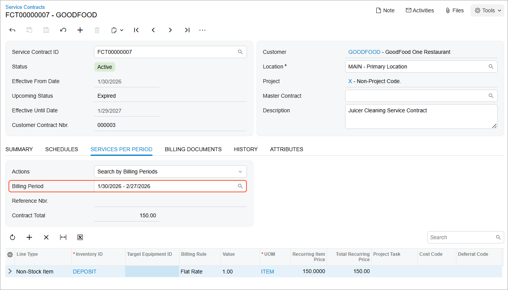

# Service Contracts: To Create and Process a Service Contract with Beginning-Period Fixed Billing {#_33d32bd3-bc50-43f9-89c5-365f9544b492 .task}

In this activity, you will create a service contract with fixed billing at the beginning of the period, and you will generate appointments for the service contract.

**Attention:** This activity is based on the *U100* dataset. If you are using another dataset or if any system settings have been changed in *U100*, these changes can affect the workflow of the activity and the results of the processing. To avoid issues, restore the *U100* dataset to its initial state.

## Story {#section_pzj_f1t_kdc .section}

Suppose that the GoodFood One Restaurant customer has decided to sign an annual maintenance contract with the SweetLife Service and Equipment Sales Center for a fixed price, which will be billed at the beginning of each billing period \(a month\). The contract will cover the full assistance during the contract period. The list of services covered by the service contract has been agreed upon; it includes the cleaning of a customer's equipment twice a week on Tuesday and Friday.

The service manager \(Maia Davis\) needs to create a service contract with fixed billing at the beginning of each month, and to add schedules for the generation of appointments.

## Configuration Overview {#section_tz4_djx_cnb .section}

In the *U100* dataset, the following configuration tasks have been performed to prepare the system for this activity to be performed:

-   On the [Enable/Disable Features](CS_10_00_00.md) \(CS100000\) form, the *Equipment Management* feature \(under *Service Management*\) has been enabled.
-   On the [Branch Locations](FS_20_25_00.md#) \(FS202500\) form, the *WEST BRIGHTON* branch location has been configured.
-   On the [Service Order Types](FS_20_23_00.md) \(FS202300\) form, the *MRO* service order type has been configured to generate sales orders to bill customers for provided services. That is, the *Sales Orders* option has been selected in the **Generated Billing Documents** box in the **Billing Settings** section. Also in this section, the *IN* sales order type has been selected as the **Order Type for Invoice** so that the processing of sales orders does not require shipments.
-   On the [Billing Cycles](FS_20_60_00.md#) \(FS206000\) form, the following settings have been specified for the *AP AP* billing cycle:

    -   **Run Billing For**: **Appointments**
    -   **Group Billing Documents By**: **Appointments**
    Based on these billing cycle settings, a separate billing document is generated for each appointment; this document presents the details of each service of the appointment.

-   On the [Customers](AR_30_30_00.md) \(AR303000\) form, the *GOODFOOD \(GoodFood One Restaurant\)* customer has been defined. The *AP AP* billing cycle has been specified for the customer on the **Billing** tab.
-   On the [Non-Stock Items](IN_20_20_00.md#) \(IN202000\) form, the *CLEANING* and *TRAINING* non-stock items have been created. For the items, *Service* is selected in the **Type** box on the **General** tab, and *Time* is selected in the **Billing Rule** box on the **Price/Cost** tab.
-   On the [Non-Stock Items](IN_20_20_00.md#) \(IN202000\) form, the *DEPOSIT* non-stock item has been created.
-   On the [Equipment](FS_20_50_00.md) \(FS205000\) form, the *FSE00007 \(Commercial citrus juicer with a production rate of 1.5 litres per minute\)* target equipment has been defined.
-   On the [Employees](EP_20_30_00.md#) \(EP203000\) form, *EP00000040 \(Maia Davis\)* has been defined, and the **Staff Member in Service Management** check box has been selected on the **General Info** tab.
-   On the [User Profile](SM_20_30_10.md) \(SM203010\) form, the *SWEETEQUIP* default branch and *WEST BRIGHTON* default branch location have been specified for *Maia Davis*.

## Process Overview { .section}

In this activity, you will create a service contract on the [Service Contracts](FS_30_57_00.md) \(FS305700\) form. Next, you will create two schedules for appointment generation on the [Service Contract Schedules](FS_30_51_00.md) \(FS305100\) form, and activate the contract on the [Service Contracts](FS_30_57_00.md) form. You will then generate a billing document for the first billing period on the [Run Service Contract Billing](FS_50_13_00.md) \(FS501300\) form. Finally, you will review the scheduled appointments on the [Appointment Summary](FS_40_01_00.md) \(FS400100\) form.

## System Preparation {#section_jbg_hk3_1rb .section}

Before you begin performing the steps of this activity, do the following:

1.  Launch the Acumatica ERP website, and sign in to a company with the *U100* dataset preloaded. You should sign in as a service manager by using the *davis* username, and the *123* password.
2.  In the info area, in the upper-right corner of the top pane of the Acumatica ERP screen, click the Business Date menu button, and select the 1/30/2026 date. For simplicity, in this activity, you will create and process all documents in the system on this business date.

## Step 1: Creating a Service Contract with Fixed Billing at the Beginning of the Period {#section_uq1_h1t_kdc .section}

To create the service contract with fixed billing at the beginning of the contract period for the GoodFood One Restaurant, do the following:

1.  On the [Service Contracts](FS_30_57_00.md) \(FS305700\) form, click **Add New Record**.
2.  In the Summary area, specify the following settings:
    -   **Customer**: *GOODFOOD - GoodFood One Restaurant*
    -   **Description**: `Juicer Cleaning Service Contract`
3.  On the **Summary** tab \(**Contract Settings** section\), specify the following settings for the contract:
    -   **Start Date**: 1/30/2026
    -   **Expiration Type**: *Expiring*
    -   **Duration**: `1` *Year*
    -   **Schedule Generation Type**: *Appointments*
4.  In the **Billing Type** box of the **Billing Settings** section, select *Beginning-Period Fixed*.
5.  In the **Period** of the **Billing Type Settings** section, make sure that *Month* is selected.
6.  On the **Services per Period** tab, add a row and specify the following settings in the added row:
    -   **Line Type**: *Non-Stock Item*
    -   **Inventory ID**: *DEPOSIT*
    -   **Recurring Item Price**: `150`
7.  On the form toolbar, click **Save**.
8.  On the More menu \(under **Processing**\), click **Activate**.

    The system changes the status of the contract from *Draft* to *Active*.

The first billing period for the contract is *1/30/2026*–*2/27/2026*, as the following screenshot shows.

## Step 2: Creating an Appointment Schedule for the Cleaning Service and Generating Appointments {#section_emt_h1t_kdc .section}

To add a schedule for the cleaning service to the contract and generate an appointment for the first billing period, do the following:

1.  While you are still viewing the service contract on the [Service Contracts](FS_30_57_00.md) \(FS305700\) form, on the **Schedules** tab, click **Add Schedule**.

    The [Service Contract Schedules](FS_30_51_00.md) \(FS305100\) form opens.

2.  In the Summary area, do the following:
    -   In the **Service Order Type** box, ensure that *MRO* is selected.
    -   In the **Scheduled Start Time** box, select *12:00 PM*.
3.  On the **Details** tab, add a row and specify the following settings in the row:
    -   **Inventory ID**: *CLEANING*
    -   **Target Equipment ID**: *FSE00007*
4.  On the **Recurrence** tab, do the following:
    -   In the **Frequency** box, select **Weekly**.
    -   Leave **Every** *1* **Weeks**.
    -   Select the **Tuesday** and **Friday** check boxes. Clear **Sunday**.
    -   Leave the check boxes cleared for the remaining days of the week.
5.  On the form toolbar, click **Save**.
6.  On the form toolbar, click **Generate from Service Contracts**.

    The [Generate Maintenance from Contract Schedules](FS_50_03_00.md) \(FS500300\) form opens.

7.  In the **Customer** box of the Summary area, select *GOODFOOD - GoodFood One Restaurant*.
8.  In the **Generate Up To** box, select *2/27/2026*.
9.  In the table, select the check box in the row with the schedule you have created \(with the *Juicer Cleaning Service Contract* description\).
10. On the form toolbar, click **Process**.

    The system opens the **Processing** dialog box, in which you can see the status of the processing.

11. After the processing has successfully completed, in the **Processing** dialog box, click **Close**.
12. Close the [Generate Maintenance from Contract Schedules](FS_50_03_00.md) form and the [Service Contract Schedules](FS_30_51_00.md) form.

The system has created a schedule and added it to the **Schedules** tab of the [Service Contracts](FS_30_57_00.md) form.

## Step 3: Reviewing the Generated Appointments {#section_xvg_31t_kdc .section}

To review the generated appointments for the service contract, do the following:

1.  On the [Service Contracts](FS_30_57_00.md) \(FS305700\) form \(to which you returned\), on the More menu \(under **Inquiries**\), click **Appointment History**.
2.  On the [Appointment Summary](FS_40_01_00.md) \(FS400100\) form, which opens, in the Selection area, specify the following settings:

    -   **Staff Member**: Cleared
    -   **To Scheduled Date**: *2/27/2026*
    The list of appointments generated for the selected service contract is shown in the table. The appointments for the cleaning services are generated to be performed each week on Tuesday and Friday during the billing period \(*1/30/2026*–*2/27/2026*\). Open the first appointment by clicking its reference number in the **Appointment Nbr.** column. The [Appointments](FS_30_02_00.md) \(FS300200\) form opens. In the appointment, notice that the *CLEANING* service has been added on the **Details** tab and the **Free Item** check box is selected for it, indicating that **this service is covered by the service contract.** Notice that in the **Summary** area, the appointment total is set to *0*.

## Step 4: Running Service Contract Billing {#section_xyv_31t_kdc .section}

To run service contract billing at the beginning of the contract period, do the following:

1.  On the [Run Service Contract Billing](FS_50_13_00.md) \(FS501300\) form, in the **Billing Customer** box, select *GOODFOOD - GoodFood One Restaurant*.
2.  In the **Up to Date** box of the Summary area, select *1/30/2026*.
3.  Select the unlabeled check box next to the *Juicer Cleaning Service Contract* you have just created.
4.  On the form toolbar, click **Process**.
5.  Once the processing is finished, in the **Processing** dialog box, click the link in the **Service Contract ID** column.
6.  On the [Service Contracts](FS_30_57_00.md) \(FS305700\) form, which opens, on the **Billing Documents** tab, ensure that the generated invoice for the first billing period of the contract is listed.
7.  Click the invoice number in the **Reference Nbr.** column. The [Invoices and Memos](AR_30_10_00.md) \(AR301000\) form opens.

    In the Summary area, review the invoice's total balance, which is *150.00*. This is the fixed price specified in the service contract to be paid in each billing period for the services covered by the contract.

8.  Close the [Invoices and Memos](AR_30_10_00.md) and [Service Contracts](FS_30_57_00.md) forms.

## Step 5: Running Billing for the First Appointment of the Billing Period {#section_vwj_j1t_kdc .section}

In this step, you will run billing for the first appointment of the billing period and review the generated billing documents. Do the following:

1.  Open the [Appointment Summary](FS_40_01_00.md) \(FS400100\) form.
2.  In the Summary area, specify the following settings:
    -   **Customer**: *GOODFOOD - GoodFood One Restaurant*
    -   **Service Contract ID**: *FCT00000007 - Juicer cleaning contract*
    -   **Staff Member**: Cleared
    -   **To Scheduled Date**: *2/4/2026*
3.  In the **Appointment Nbr.** column, click the link of the appointment in the list \(the appointment scheduled for *1/30/2026*\).

    The appointment opens on the [Appointments](FS_30_02_00.md) \(FS300200\) form.

4.  On the form toolbar, click **Start**.
5.  On the **Details** tab, in the row with the *CLEANING* service, notice that the **Free Item** check box is selected.
6.  On the **Settings** tab, in the **Actual Date and Time** section, enter the actual start and end times \(for simplicity in this training, set them to match the scheduled start and end times\). Select the **Finished** check box.
7.  On the form toolbar, click **Complete**. \(You perform this action on behalf of a staff member.\)
8.  On the form toolbar, click **Close**. \(You perform this instruction and the remaining instructions on behalf of an accountant.\)
9.  On the form toolbar, click **Run Billing**.
10. On the [Invoices](SO_30_30_00.md) \(SO303000\) form, which opens, notice that the total of the invoice is 0 because the service in the appointment is covered by the service contract and the appointment line is marked as **Free Item**.

**Parent topic:**[Creating Service Contracts](../UserGuide/EquipMgmt_Service_Contracts_Mapref.md)

