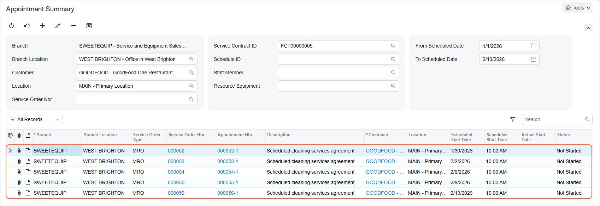

# Service Contracts: To Create and Process a Service Contract Billed at Time of Service {#_28753ecf-0586-43ee-8d3d-68a5bf04c716 .task}

In this activity, you will create and process a service contract that is billed after each appointment has taken place based on what was done during the appointment.

**Attention:** This activity is based on the *U100* dataset. If you are using another dataset or if any system settings have been changed in *U100*, these changes can affect the workflow of the activity and the results of the processing. To avoid issues, restore the *U100* dataset to its initial state.

## Story {#section_d4f_rys_kdc .section}

Suppose that the GoodFood One Restaurant customer requires appointments on Mondays and Fridays of each week for one year, starting next week, and is willing to sign a contract. The service to be performed is the cleaning of the customer's equipment. The service manager of the SweetLife Service and Equipment Sales Center \(Maia Davis\) needs to create a service contract in Acumatica ERP, and create a schedule of appointments, which will allow employees to generate appointments for each upcoming week.

Acting as the service manager, you need to create a contract, create a schedule for the appointment generation, activate the contract, and generate the appointments for the first two weeks.

## Configuration Overview {#section_tz4_djx_cnb .section}

In the *U100* dataset, the following configuration tasks have been performed to prepare the system for this activity to be performed:

-   On the [Enable/Disable Features](CS_10_00_00.md) \(CS100000\) form, the *Equipment Management* feature \(under *Service Management*\) has been enabled.
-   On the [Branch Locations](FS_20_25_00.md#) \(FS202500\) form, the *WEST BRIGHTON* branch location has been configured.
-   On the [Service Order Types](FS_20_23_00.md) \(FS202300\) form, the *MRO* service order type has been configured to generate sales orders to bill customers for provided services. That is, the **Sales Orders** option has been selected under **Generated Billing Documents** in the **Billing Settings** section. Also in this section, the *IN* sales order type has been selected as the **Order Type for Invoice** so that the processing of sales orders does not require shipments.
-   On the [Billing Cycles](FS_20_60_00.md#) \(FS206000\) form, the following settings have been specified for the *AP AP* billing cycle:

    -   **Run Billing For**: **Appointments**
    -   **Group Billing Documents By**: **Appointments**
    Based on these billing cycle settings, a separate billing document is generated for each appointment; this document presents the details of each service of the appointment.

-   On the [Customers](AR_30_30_00.md) \(AR303000\) form, the *GOODFOOD \(GoodFood One Restaurant\)* customer has been defined. The *AP AP* billing cycle has been specified for the customer on the **Billing** tab.
-   On the [Non-Stock Items](IN_20_20_00.md#) \(IN202000\) form, the *CLEANING* non-stock item has been created. For this item, the *Service* is selected in the **Type** box on the **General** tab, and *Time* is selected in the **Billing Rule** box on the **Price/Cost** tab.
-   On the [Equipment](FS_20_50_00.md) \(FS205000\) form, the *FSE00007 \(Commercial citrus juicer with a production rate of 1.5 litres per minute\)* target equipment has been defined.
-   On the [Employees](EP_20_30_00.md#) \(EP203000\) form, *EP00000040 \(Maia Davis\)* has been created, and the **Staff Member in Service Management** check box has been selected on the **General Info** tab.
-   On the [User Profile](SM_20_30_10.md) \(SM203010\) form, the *SWEETEQUIP* default branch and *WEST BRIGHTON* default branch location have been specified for *Maia Davis*.

## Process Overview { .section}

In this activity, you will create a service contract on the [Service Contracts](FS_30_57_00.md) \(FS305700\) form, create an appointment schedule on the [Service Contract Schedules](FS_30_51_00.md) \(FS305100\) form, and then activate the contract on the [Service Contracts](FS_30_57_00.md) form. You will then generate appointments for the contract on the [Generate Maintenance from Contract Schedules](FS_50_03_00.md) \(FS500300\) form.

## Step 1: Creating the Service Contract {#section_rpz_5ys_kdc .section}

To create the service contract billed at the time of service for the GoodFood One Restaurant, do the following:

1.  On the [Service Contracts](FS_30_57_00.md) \(FS305700\) form, click **Add New Record**.
2.  In the Summary area, specify the following settings:
    -   **Customer**: *GOODFOOD - GoodFood One Restaurant*
    -   **Description**: `Scheduled cleaning services agreement`
3.  On the **Summary** tab \(**Contract Settings** section\), specify the following settings for the contract:
    -   **Start Date**: 1/30/2026
    -   **Expiration Type**: *Expiring*
    -   **Duration**: `1` *Year*
    -   **Schedule Generation Type**: *Appointments*
4.  In the **Billing Type** box of the **Billing Settings** section, make sure that *At Time of Service* is selected. This setting means that the service contract will be billed after an appointment generated for it has taken place, based on what was done during the appointment.
5.  On the form toolbar, click **Save**.

## Step 2: Creating an Appointment Schedule and Activating the Contract {#section_ifp_vys_kdc .section}

Add a schedule to the service contract and activate the contract as follows:

1.  While you are still viewing the service contract on the [Service Contracts](FS_30_57_00.md) \(FS305700\) form, on the **Schedules** tab, click **Add Schedule**.

    The [Service Contract Schedules](FS_30_51_00.md) \(FS305100\) form opens in a pop-up window.

2.  In the Summary area, in the **Service Order Type** box, make sure that *MRO* is selected.
3.  In the **Scheduled Start Time** box, select *10:00 AM*.
4.  On the **Details** tab, add a row and specify the following settings in the row:
    -   **Inventory ID**: *CLEANING*
    -   **Target Equipment ID**: *FSE00007*
5.  On the **Recurrence** tab, do the following:
    -   In the **Frequency** box, select **Weekly**.
    -   Leave **Every** *1* **Week\(s\)**.
    -   Select the **Monday** and **Friday** check boxes. Clear **Sunday**.
    -   Leave the check boxes cleared for the remaining days of the week.
6.  Save your changes and close the pop-up window.

    The system has created the schedule and added it to the **Schedules** tab of the [Service Contracts](FS_30_57_00.md) form.

7.  On the [Service Contracts](FS_30_57_00.md) form \(to which you returned when you closed the window with the [Service Contract Schedules](FS_30_51_00.md) form\), on the More menu, click **Activate**.

    The system changes the status of the contract from *Draft* to *Active*.

## Step 3: Generating Appointments from the Contract {#section_fq3_wys_kdc .section}

To generate appointments from the service contract, do the following:

1.  Open the [Generate Maintenance from Contract Schedules](FS_50_03_00.md) \(FS500300\) form.
2.  In the Summary area, specify the following settings:
    -   **Customer**: *GOODFOOD - GoodFood One Restaurant*
    -   **Generate Up To**: *2/13/2026*
3.  In the table, select the check box in the row with the schedule that you have created in the previous step.
4.  On the form toolbar, click **Process**.

    The system opens the **Processing** dialog box, in which you can see the status of the process.

5.  After the processing has successfully completed, in the **Processing** dialog box, click **Close**.

The appointments have been generated for the service contract until *2/13/2026*.

## Step 4: Reviewing the Appointments Generated for the Service Contract {#section_s1d_xys_kdc .section}

Review the appointments that have been generated for the service contract as follows:

1.  Return to the service contract that you created in the previous step on the [Service Contracts](FS_30_57_00.md) \(FS305700\) form.
2.  On the More menu \(under **Inquiries**\), click **Appointment History**.
3.  On the [Appointment Summary](FS_40_01_00.md) \(FS400100\) form, which opens, clear the **Staff Member** box in the Selection area.
4.  In the **To Scheduled Date** box, select *2/13/2026*.

    The list of appointments generated for the selected service contract is displayed in the table \(see the following screenshot\).

    

5.  Click the reference number of any appointment in the **Appointment Nbr.** column. The system opens the [Appointments](FS_30_02_00.md) \(FS300200\) form. On the **Details** tab, confirm that the system has added the line from the **Details** tab of the [Service Contract Schedules](FS_30_51_00.md) \(FS305100\) form. On the **Settings** tab, notice that the reference numbers of the source service contract and source schedule are specified in the **Source Info** section.

**Parent topic:**[Creating Service Contracts](../UserGuide/EquipMgmt_Service_Contracts_Mapref.md)

