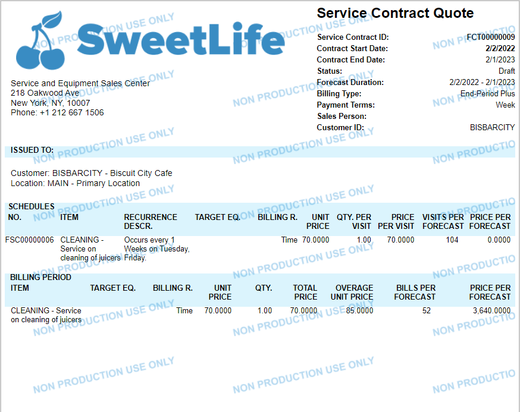

# Copying Service Contracts: Process Activity {#_afecdff7-b9a8-4b26-862c-f338c8215c42 .task}

The following activity will walk you through the process of copying a service contract.

**Attention:** This activity is based on the *U100* dataset. If you are using another dataset or if any system settings have been changed in *U100*, these changes can affect the workflow of the activity and the results of the processing. To avoid issues, restore the *U100* dataset to its initial state.

## Story { .section}

Suppose that HM's Bakery and Cafe customer has opened a new office in a new location, and wants to create a service contract for a new location with similar conditions as those specified in the existing service contract. Acting as the service manager \(Maia Davis\) of the *Service and Equipment Sales Center* branch, you need to make a copy of the service contract. In the copied contract, you need to update the start and end dates, the customer location, and schedule frequency settings. Then you will generate and send the forecast quote report to the customer for approve, and after the customer approves the changes, you will activate the new service contract.

## Configuration Overview {#section_tz4_djx_cnb .section}

In the *U100* dataset, the following configuration tasks have been performed to prepare the system for this activity to be performed:

-   On the [Enable/Disable Features](CS_10_00_00.md) \(CS100000\) form, the *Service Management* and *Equipment Management* features have been enabled.
-   On the [Branch Locations](FS_20_25_00.md#) \(FS202500\) form, the *WEST BRIGHTON* branch location has been configured.
-   On the [Billing Cycles](FS_20_60_00.md#) \(FS206000\) form, the following settings have been specified for the *AP AP* billing cycle:

    -   **Run Billing For**: **Appointments**
    -   **Group Billing Documents By**: **Appointments**
    Based on these billing cycle settings, a separate billing document is generated for each appointment; this document presents the details of each service of the appointment.

-   On the [Service Order Types](FS_20_23_00.md) \(FS202300\) form, the *MRO* service order type has been configured to generate sales orders to bill customers for provided services. That is, the **Sales Orders** option has been selected under **Generated Billing Documents** in the **Billing Settings** section. Also in this section, the *IN* sales order type has been selected as the **Order Type for Invoice** so that the processing of sales orders does not require shipments.
-   On the [Customers](AR_30_30_00.md) \(AR303000\) form, the *HMBAKERY \(HM's Bakery and Cafe\)* customer has been configured. The *AP AP* billing cycle has been specified for a customer on the **Billing** tab.
-   On the [Customer Locations](AR_30_30_20.md) \(AR303020\) form, the *MAIN2* location has been configured.
-   On the [Service Contracts](FS_30_57_00.md) \(FS305700\) form, the *FCT00000001* contract has been created.

## Process Overview { .section}

On the [Service Contracts](FS_30_57_00.md) \(FS305700\) form, you will copy a service contract. In the copied service contract, on the [Service Contracts](FS_30_57_00.md) form, you will change the customer location, and on the [Service Contract Schedules](FS_30_51_00.md) \(FS305100\) form, you will change the schedule settings. Then, on the [Service Contracts](FS_30_57_00.md) form, you will generate a forecast report, and send it to customer for approve. We assume that a customer has approved the new service contract, so that on the [Service Contracts](FS_30_57_00.md) form, you will activate the contract.

## System Preparation { .section}

Do the following:

1.  Launch the Acumatica ERP website, and sign in to a company with the *U100* dataset preloaded. You should sign in as service manager by using the *davis* username and the *123* password.
2.  In the info area at the upper-right corner of the top pane of the Acumatica ERP screen, make sure that the business date is set to *1/30/2026*. If a different date is displayed, click the Business Date menu button and select *1/30/2026* from the calendar. For simplicity, you'll create and process all documents in this activity using this business date.
3.  On the Company and Branch Selection menu, also on the top pane of the Acumatica ERP screen, ensure the *Service and Equipment Sales Center* branch under the *SweetLife Fruits &amp; Jams* company is selected.

## Step 1: Copying a Service Contract { .section}

To copy a service contract, do the following:

1.  Open the [Service Contracts](FS_30_57_00.md) \(FS305700\) form.
2.  In the **Service Contract ID** box, select the service contract to be copied: *FCT00000004*
3.  On the More menu \(under **Other**\), click **Copy**.
4.  In the **Copy** dialog box that opens, specify the start date for the new service contract *02/01/2026*, and click **OK**.

    The system has opened a new service contract with the *Draft* status assigned. The system copied the settings of the original service contract including the summary information \(such as a customer, description, and project\), the schedule generated for the contract added on the **Schedules** tab, and the service included in the contract on the **Services per Period** tab.

## Step 2: Modifying the Settings in the Copied Service Contract { .section}

The customer has asked to specify a new location in the service contract, and to change the frequency settings of the schedule. Do the following:

1.  While you are viewing the service contract on the [Service Contracts](FS_30_57_00.md) \(FS305700\) form, in the Summary area, in the **Location** box, select *MAIN2*.
2.  On the **Schedules** tab, click the reference number of the schedule in the **Schedule ID** column.
3.  On the [Service Contract Schedules](FS_30_51_00.md) \(FS305100\) form that opens, on the **Recurrence** tab, clear **Monday** check box, and select **Tuesday** and **Friday**.
4.  On the form toolbar, click **Save**, and close the [Service Contract Schedules](FS_30_51_00.md) form.

## Step 3: Generating and Emailing a Forecast Report { .section}

Before activating the new service contract, you want to send a service contract quote report to the customer to get approve for the contract terms. To generate a forecast report, and email it to the customer, do the following:

1.  While you are viewing the service contract on the [Service Contracts](FS_30_57_00.md) \(FS305700\) form, on the More menu, click **Forecast &amp; Print Quote**.

    The **Contract Quote** dialog box opens.

2.  In the dialog box, specify the start and end dates for the quote report as *2/2/2026* for the start date, and *1/2/2027* for the end date, and click **OK**.

    The system has generated and opened the quote report in the printed view \(as the following screenshot shows\).

    

3.  Return to the [Service Contracts](FS_30_57_00.md) form, and on the More menu, click **Email Report**.
4.  Click **Activities** at the right top corner of the [Service Contracts](FS_30_57_00.md) form. In the **Tasks &amp; Activities** dialog box that opens, click the link, and review the email sent to the customer.

    The copy of the service contract quote has been attached to the email, and sent to the customer.

    **Tip:** If you have made any changes in the contract after generating the quote, you need to use the **Forecast &amp; Print Quote** command once again before emailing the quote report to the customer.

## Step 4: Activating a Service Contract { .section}

Once the customer has approved the new service contract, you activate the contract. Do the following:

1.  Return to the [Service Contracts](FS_30_57_00.md) \(FS305700\) form and in the **Service Contract ID** box, select the new service contract. Notice that it has the *Draft* status assigned.
2.  On the More menu, click **Activate**.

    The contract status has changed to *Active*.

**Parent topic:**[Copying Service Contracts](../UserGuide/EquipMgmt_Copying_Service_Contracts_Mapref.md)

