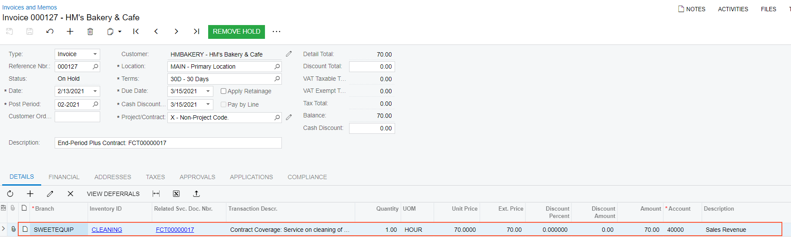

# Service Contracts with End-Period Billing: To Bill a Period with No Appointments {#_7f323d9d-995e-49c3-bb0a-36a06907490a .task}

In this activity, you will learn how to generate an invoice for the billing period of a service contract with the end-period billing if no appointments took place in this period.

## Story { .section}

Suppose that the second billing period \(February 6, 2026 through February 12, 2026\) of the contract with the HM's Bakery and Cafe customer has passed. No appointments have been scheduled because it was canceled by the customer. The accountant of Service Equipment and Sales Center \(Yona Jones\) is generating an invoice for the second billing period. Acting as Yona Jones, you will perform the needed actions in the system.

## Configuration Overview { .section}

In the *U100* dataset, the following configuration tasks have been performed to prepare the system for this activity to be performed:

-   On the [Enable/Disable Features](CS_10_00_00.md) \(CS100000\) form, the *Service Management* and *Equipment Management* features have been enabled.
-   On the [Branch Locations](FS_20_25_00.md#) \(FS202500\) form, the *WEST BRIGHTON* branch location has been configured.
-   On the [Billing Cycles](FS_20_60_00.md#) \(FS206000\) form, the following settings have been specified for the *AP AP* billing cycle:

    -   **Run Billing For**: **Appointments**
    -   **Group Billing Documents By**: **Appointments**
    Based on these billing cycle settings, a separate billing document is generated for each appointment; this document presents the details of each service of the appointment.

-   On the [Customers](AR_30_30_00.md) \(AR303000\) form, the *HMBAKERY \(HM's Bakery and Cafe\)* customer has been configured.
-   On the [Employees](EP_20_30_00.md#) \(EP203000\) form, *EP00000040 \(Maia Davis\)* has been configured, and the **Staff Member in Service Management** check box has been selected on the **General Info** tab.
-   On the [User Profile](SM_20_30_10.md) \(SM203010\) form, the *SWEETEQUIP* default branch, and *WEST BRIGHTON* default branch location has been specified for *Maia Davis*.
-   On the [Employees](EP_20_30_00.md) \(EP203000\) form, the *EP00000012 - Yona Jones* employee has been configured.
-   A service contract has been created according to [Service Contracts: To Create and Process an End-Period Billing Service Contract \(Appointment with No Overage Items\)](EquipMgmt_Service_Contracts_End_Period_Process_Activity.md). For the service contract, the schedule has been created, and two appointments have been generated \(for the next two weeks\) according to the schedule. Then the appointment for *2/7/2026* has been canceled.

## Process Overview { .section}

In this activity, you will specify the start and end date of the billing period and generate an invoice for the service contract by using the [Run Service Contract Billing](FS_50_13_00.md) \(FS501300\) form.

## System Preparation { .section}

Do the following:

1.  Launch the Acumatica ERP website, and sign in to a company with the *U100* dataset preloaded. You should sign in as an accountant by using the *jones* username, and the *123* password.
2.  In the info area, in the upper-right corner of the top pane of the Acumatica ERP screen, click the Business Date menu button, and select the *2/13/2026* date. For simplicity, in this activity, you will create and process all documents in the system on this business date.
3.  On the Company and Branch Selection menu, also on the top pane of the Acumatica ERP screen, select the *Service and Equipment Sales Center* branch under the *SweetLife Fruits &amp; Jams* company.

## Step 1: Reviewing Appointments For the Second Billing Period { .section}

To review an appointment generated for the second billing period of the service contract, do the following:

1.  Open the [Appointment Summary](FS_40_01_00.md) \(FS400100\) form.
2.  In the **Customer** box of the Selection area, select *HMBAKERY \(HM's Bakery and Cafe\)*.
3.  In the **Service Contract ID** box, select *FCT00000002*.
4.  In the **From Scheduled Date** box, select *2/6/2026.*
5.  In the **To Scheduled Date** box, select *2/12/2026.*
6.  Make sure the **Staff Member** box is cleared.

    Notice that only an appointment with *Canceled* status is in the list. It was generated according to contract schedule, but later it was canceled.

## Step 2: Generating a Billing Document for the Second Billing Period { .section}

To generate a billing document for the second billing period, do the following:

1.  Open the [Run Service Contract Billing](FS_50_13_00.md) \(FS501300\) form.
2.  In the **Billing Customer** box of the Selection area, select *HMBAKERY \(HM's Bakery and Cafe\)*.
3.  In the **Up To Date** box, select 02/12/2026.
4.  In the table, select the unlabeled check box in the row with the service contract.
5.  On the form toolbar, click **Process**.

    The system opens the **Processing** pop-up window, in which you can see the status of the process.

6.  After the processing has successfully completed, click the **Processed** card.

    The system displays a table in the dialog box with the processed record.

7.  Click the link in the **Batch Nbr.** column in the row with the processed record.

    The [Service Contract Billing Batches](FS_30_61_00.md) \(FS306100\) form opens with the details of the selected batch.

8.  In the table of this form, click the link in the **Document Nbr.** column.

    The [Invoices and Memos](AR_30_10_00.md) \(AR301000\) form opens, and you can review the generated invoice. The invoice includes the item that has been covered by the contract, as the following screenshot shows. It means that even if there are no appointments in the period, the contract item is billed.

    

9.  On the form toolbar, click **Remove Hold**, and then **Release**.
10. On the [Service Contracts](FS_30_57_00.md) form, select the contract. On the **Billing Documents** tab, review the reference number of the invoice. On the **Service Per Period** tab, in the **Billing Period** box, click the lookup icon. Review that the status of the *02/06/2026 - 02/12/2026* period is *Invoiced*, and the next billing period is automatically created and set as *Active*.

**Parent topic:**[Creating Service Contracts](../UserGuide/EquipMgmt_Service_Contracts_Mapref.md)

