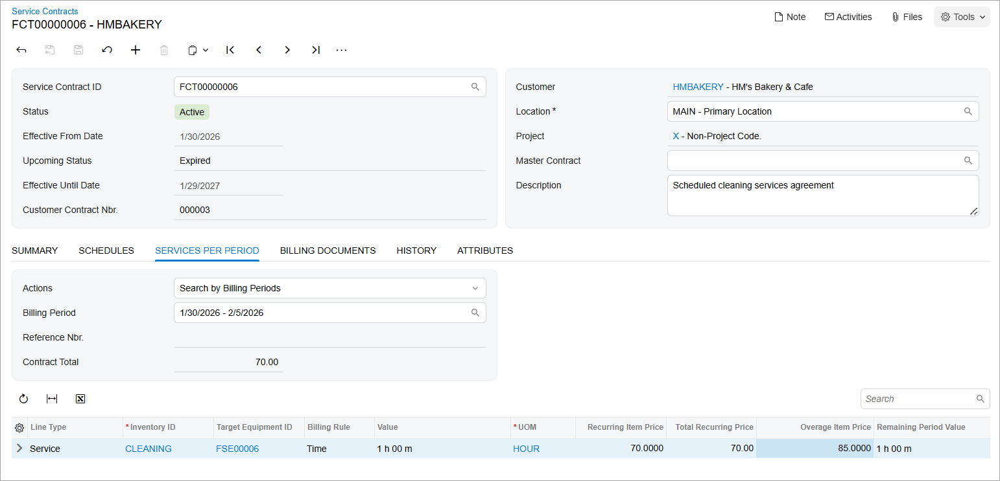
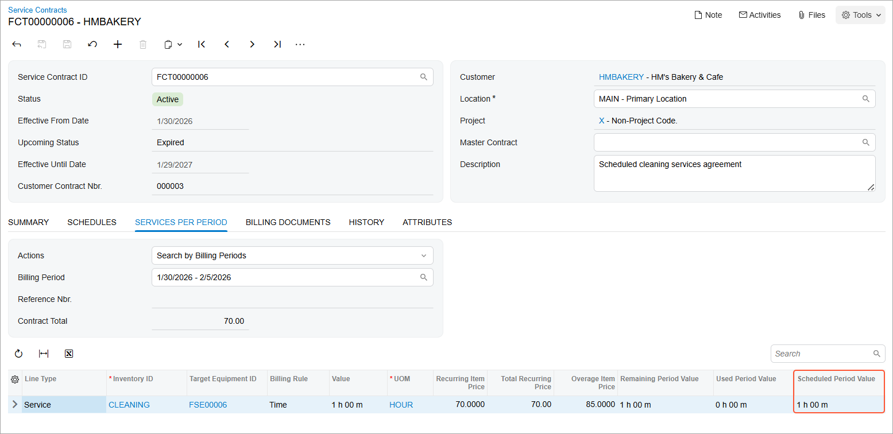
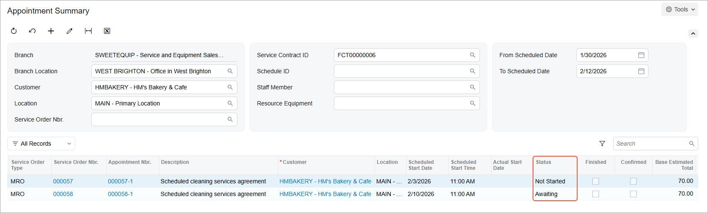

# Service Contracts: To Create and Process an End-Period Billing Service Contract \(Appointment with No Overage Items\) {#_3b04f6bb-1897-4ef2-80d6-af1f8e777957 .task}

In this activity, you will create a service contract that is billed at the end of each billing period for the following:

-   The services and inventory items specified in the contract
-   An overage number of services \(or inventory items\) that has been added to the service document during the billing period but was not covered by the service contract

You will also create a schedule for this service contract and generate appointments from the schedule.

**Attention:** This activity is based on the *U100* dataset. If you are using another dataset or if any system settings have been changed in *U100*, these changes can affect the workflow of the activity and the results of the processing. To avoid issues, restore the *U100* dataset to its initial state.

## Story {#section_ivl_qzs_kdc .section}

Suppose that the HM's Bakery and Cafe customer has agreed to enter into a contract with the SweetLife Service and Equipment Sales Center for one hour of cleaning a juicer every week. The contract states that one hour of service is paid every week at a price of $70; for overage cleaning services \(which are occasionally required\), a price of $85 per hour should be paid. The customer will pay at the end of each week based on the prices that are defined in the contract.

The appointment schedule needs to be specified for the contract, and an appointment for the next week should be generated. You will perform the needed actions in the system, acting as the service manager, Maia Davis.

## Configuration Overview {#section_tz4_djx_cnb .section}

In the *U100* dataset, the following configuration tasks have been performed to prepare the system for this activity to be performed:

-   On the [Enable/Disable Features](CS_10_00_00.md) \(CS100000\) form, the *Service Management* and *Equipment Management* features have been enabled.
-   On the [Branch Locations](FS_20_25_00.md#) \(FS202500\) form, the *WEST BRIGHTON* branch location has been configured.
-   On the [Service Order Types](FS_20_23_00.md) \(FS202300\) form, the *MRO* service order type has been configured to generate sales orders to bill customers for provided services. That is, the *Sales Orders* option has been selected in the **Generated Billing Documents** box in the **Billing Settings** section. Also in this section, the *IN* sales order type has been selected as the **Order Type for Invoice** so that the processing of sales orders does not require shipments.
-   On the [Billing Cycles](FS_20_60_00.md#) \(FS206000\) form, the following settings have been specified for the *AP AP* billing cycle:

    -   **Run Billing For**: **Appointments**
    -   **Group Billing Documents By**: **Appointments**
    Based on these billing cycle settings, a separate billing document is generated for each appointment; this document presents the details of each service of the appointment.

-   On the [Customers](AR_30_30_00.md) \(AR303000\) form, the *HMBAKERY \(HM's Bakery and Cafe\)* customer has been defined. The *AP AP* billing cycle has been specified for the customer on the **Billing** tab.
-   On the [Employees](EP_20_30_00.md#) \(EP203000\) form, *EP00000040 \(Maia Davis\)* has been created, and the **Staff Member in Service Management** check box has been selected on the **General Info** tab.
-   On the [User Profile](SM_20_30_10.md) \(SM203010\) form, the *SWEETEQUIP* default branch and *WEST BRIGHTON* default branch location have been specified for *Maia Davis*.
-   On the [Non-Stock Items](IN_20_20_00.md#) \(IN202000\) form, the *CLEANING* non-stock item has been created. For this item, the *Service* is selected in the **Type** box on the **General** tab, and *Time* is selected in the **Billing Rule** box on the **Price/Cost** tab.
-   On the [Equipment](FS_20_50_00.md) \(FS205000\) form, the *FSE00006 \(Commercial citrus juicer with a production rate of 1.5 liters per minute\)* target equipment has been defined.

## Process Overview { .section}

You will create a service contract with the *End-Period Plus* billing type on the [Service Contracts](FS_30_57_00.md) \(FS305700\) form. In this service contract, you will specify the services to be provided during each billing period, along with the prices for the items covered by the contract and for any overage items. Next, on the [Service Contract Schedules](FS_30_51_00.md) \(FS305100\) form, you will create a contract schedule that includes the services to be provided in appointments. Finally, you will generate an appointment based on the schedule by using the [Generate Maintenance from Contract Schedules](FS_50_03_00.md) \(FS500300\) form.

## System Preparation { .section}

To prepare the system for this activity to be performed, do the following:

1.  Launch the Acumatica ERP website, and sign in to a company with the *U100* dataset preloaded. You should sign in as a service manager by using the *davis* username, and the *123* password.
2.  In the info area, in the upper-right corner of the top pane of the Acumatica ERP screen, click the Business Date menu button, and select the 1/30/2026 date. For simplicity, in this activity, you will create and process all documents in the system on this business date.

## Step 1: Creating a Service Contract with End-Period Billing {#section_khr_mzs_kdc .section}

To create the service contract with end-period billing for HM's Bakery and Cafe, do the following:

1.  On the [Service Contracts](FS_30_57_00.md) \(FS305700\) form, click **Add New Record**.
2.  In the Summary area, specify the following settings:
    -   **Customer**: *HMBAKERY - HM's Bakery and Cafe*
    -   **Description**: `Scheduled cleaning services agreement`
3.  On the **Summary** tab \(**Contract Settings** section\), specify the following settings for the contract:
    -   **Start Date**: 1/30/2026
    -   **Expiration Type**: *Expiring*
    -   **Duration**: `1` *Year*
    -   **Schedule Generation Type**: *Appointments*
4.  In the **Billing Type** box of the **Billing Settings** section, select *End-Period Plus*.
5.  In the **Period** box of the **Billing Type Settings** section, select *Week*.
6.  On the form toolbar, click **Save**.
7.  On the **Services per Period** tab, add a row and specify the following settings in the added row:
    -   **Inventory ID**: *CLEANING*
    -   **Target Equipment ID**: *FSE00006*
    -   **Value**: `1h 00m`
    -   **Recurring Item Price**: `70`
    -   **Overage Item Price**: `85`
8.  On the form toolbar, click **Save**.
9.  On the More menu \(under **Processing**\), click **Activate**.

    The first billing period \(1/30/2026 - 02/05/2026\) has been activated during contract activation, as the following screenshot shows.

## Step 2: Creating a Contract Schedule and Generating Appointments from the Schedule {#section_v4l_nzs_kdc .section}

Now you will add a schedule for the service contract and generate the first two appointments of that schedule. Do the following:

1.  While you are still viewing the service contract on the [Service Contracts](FS_30_57_00.md) \(FS305700\) form, on the **Schedules** tab, click **Add Schedule**.

    The [Service Contract Schedules](FS_30_51_00.md) \(FS305100\) form opens.

2.  In the Summary area, do the following:
    -   In the **Service Order Type** box, ensure that *MRO* is selected.
    -   In the **Scheduled Start Time** box, select *11:00 AM*.
3.  On the **Details** tab, add a row and specify the following settings in the row:
    -   **Line Type**: *Service*
    -   **Inventory ID**: *CLEANING*
    -   **Target Equipment ID**: *FSE00006*
4.  On the **Recurrence** tab, do the following:
    -   In the **Frequency** box, select **Weekly**.
    -   Leave **Every** *1* **Weeks**.
    -   Select the **Tuesday** check box. Clear **Sunday**.
    -   Leave the check boxes cleared for the remaining days of the week.
5.  On the form toolbar, click **Save**.
6.  On the form toolbar, click **Generate from Service Contracts**.

    The [Generate Maintenance from Contract Schedules](FS_50_03_00.md) \(FS500300\) form opens.

7.  In the **Generate Up To** box of the Summary area, select *2/12/2026*.
8.  In the table, select the unlabeled check box in the row with the schedule you have created \(for the *HMBAKERY - HM's Bakery and Cafe* customer\).
9.  On the form toolbar, click **Process**.

    The system opens the **Processing** dialog box, in which you can see the status of the processing.

10. After the processing has successfully completed, in the **Processing** dialog box, click **Close**.
11. Close the [Generate Maintenance from Contract Schedules](FS_50_03_00.md) \(FS500300\) form.
12. Close the [Service Contract Schedules](FS_30_51_00.md) \(FS305100\) form.
13. On the **Services Per Period** tab of the [Service Contracts](FS_30_57_00.md) \(FS305700\) form, notice that the **Scheduled Period Value** is now *1 h 00 m* \(as the following screenshot shows\). This means that 1 hour of services has been scheduled for the selected billing period.

## Step 3: Reviewing the Generated Appointments {#section_kz1_4zs_kdc .section}

Review the appointments generated from the schedule on the previous step by doing the following:

1.  While you are still viewing the service contract on the [Service Contracts](FS_30_57_00.md) \(FS305700\) form, on the More menu, click **Appointment History**. The [Appointment Summary](FS_40_01_00.md) \(FS400100\) form opens.
2.  Clear the **Staff Member** box in the Selection area.
3.  In the **From Scheduled Date** box, ensure that 1/30/2026 is selected.
4.  In the **To Scheduled Date** box, select *2/12/2026*.

    The form displays the appointments generated from the service contract. Notice that the appointment generated for the active billing period has the *Not Started* status, and the appointment generated for the future billing period has the *Awaiting* status \(see the following screenshot\).

    

## Step 4: Processing an Appointment {#section_tkp_4zs_kdc .section}

To process an appointment, do the following:

1.  On the [Appointment Summary](FS_40_01_00.md) \(FS400100\) form, click the reference number of the appointment with the *Not Started* status. The [Appointments](FS_30_02_00.md) \(FS300200\) form opens.
2.  On the form toolbar, click **Start**.

    \(As you perform this instruction and the next two instructions, you are acting as a staff member at the appointment.\)

3.  On the **Settings** tab, in the **Actual Date and Time** section, enter the actual start and end times \(for simplicity in this training, set them to match the scheduled start and end times\). Select **Finished**.
4.  On the form toolbar, click **Complete**.
5.  On the form toolbar, click **Close**.

    \(As you perform this instruction and the remaining instructions in this activity, you are now acting as an accountant.\)

6.  Open the [Run Service Contract Billing](FS_50_13_00.md) \(FS501300\) form.
7.  In the **Up to Date** box, specify *2/12/2026*.
8.  In the list, select a service contract related to an appointment that you have completed \(with the 1/30/2026 - 02/05/2026 billing period specified\), and click **Process** on the form toolbar.
9.  Once the billing process is completed, in the **Processing** dialog box, click the reference number in the **Batch Nbr.** column. The [Service Contract Billing Batches](FS_30_61_00.md) \(FS306100\) form opens in a pop-up window.
10. In the **Document Nbr.** column, click the reference number link. The [Invoices and Memos](AR_30_10_00.md) \(AR301000\) form opens, and you can review the generated invoice.

    Notice that the line in the invoice is for the service covered by the contract. It includes a fixed number of hours at a predefined price, and the number of hours defined in the service contract has not been exceeded, so the invoice amount is equal to the contract's predefined price \($70.00\).

**Parent topic:**[Creating Service Contracts](../UserGuide/EquipMgmt_Service_Contracts_Mapref.md)

