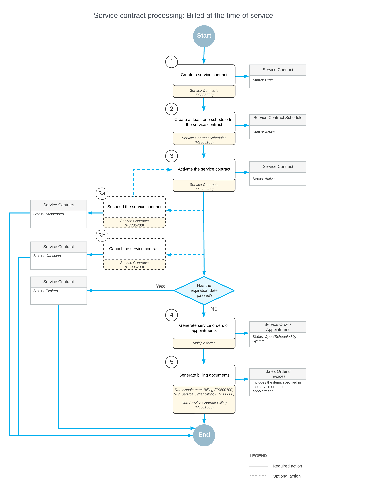

# Service Contracts: General Information {#_cb4c6f7d-739b-4db0-bf6e-bcbfbbf5a5c5 .concept}

In Acumatica ERP, you can create and process contracts for the services requested by your company's customers. A service contract is a document that contains information about the customer, the services to be provided, and the schedule or schedules determining when your service staff will perform these services. You can use service contracts for creating appointment schedules for a piece of target equipment and generating periodic appointments.

In Acumatica ERP, you can create service contracts with different billing options, which you set up depending on the company's needs.

## Learning Objectives {#section_f3t_45s_kdc .section}

In this chapter, you will learn how to create and process a service contract by doing the following:

-   Creating a service contract that is billed at the time of service
-   Creating a service contract that is billed at the end of the billing period and processing an appointment with no additional items \(those that are not covered by a service contract\)
-   Creating and processing a service contract that is billed at the beginning of the billing period

## Applicable Scenarios { .section}

You create a service contract when a customer requires services to be performed periodically at the customer's place.

## Processing Workflow { .section}

This diagram represents the lifecycle of a service contract in service management. It illustrates the key steps—from creating and activating a contract to generating service orders and billing—as well as the possible contract status changes.

The following steps and optional steps are involved in the creation and processing of a service contract:

1.  Creating the service contract: On the [Service Contracts](FS_30_57_00.md) \(FS305700\) form, a service manager enters the service contract.
2.  Creating at least one schedule: By using the [Service Contract Schedules](FS_30_51_00.md) \(FS305100\) form, the service manager creates a schedule \(or multiple schedules\) for the delivery of the services covered by the contract.
3.  Activating the service contract: The service manager activates the service contract so that service orders or appointments can be generated for the contract schedules.
4.  Generating the service orders or appointments: The service manager generates service orders or appointments, which can then be processed.
5.  Generating and processing billing documents: An accountant approves the service orders or appointments of the service contract for the generation of billing documents. The accountant then generates billing documents for the service documents and processes them in the system.
6.  Suspending the contract \(optional\): If it is necessary to pause the service delivery and billing for the contract temporarily, the service manager can suspend the contract.
7.  Canceling the contract \(optional\): If the service manager has activated the contract but the services for the contract will no longer be provided for some reason, the contract can be canceled. This step can be performed before or after your company has started to provide services according to the contract.

## Service Contract Billing Types {#section_myy_1vs_kdc .section}

When you create a service contract, you can select how its billing is performed. On the [Service Contracts](FS_30_57_00.md) \(FS305700\) form, four options are available in the **Billing Type** box:

-   *At Time of Service*: The billing is performed after each appointment based on what was done during the appointment \(that is, the service contract is billed at the time when the services are performed\).
-   *End-Period Plus*: The billing is performed based on what is covered by the contract at the end of the billing period, plus any overage items.
-   *Beginning-Period Fixed*: The billing is performed at the beginning of the billing period at the fixed price specified in the contract. Any usage and overage items used in appointments are covered by the fixed contract price.
-   *Beginning-Period Plus*: The billing is performed at the beginning of the billing period at the fixed price specified in the contract. The overage items used in appointments are billed separately at the time of service.

**Parent topic:**[Creating Service Contracts](../UserGuide/EquipMgmt_Service_Contracts_Mapref.md)

