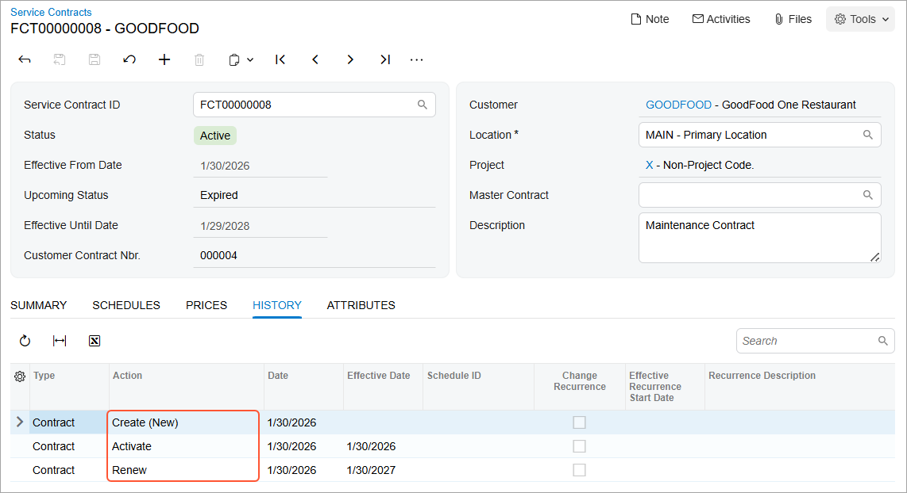
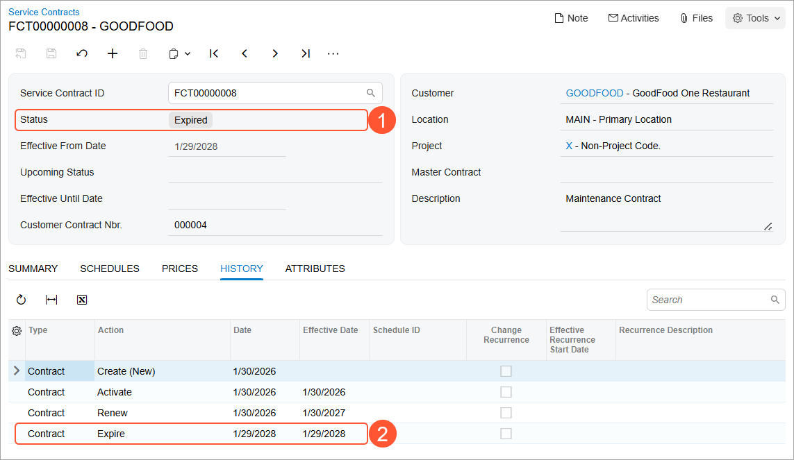

# Renewal of Service Contracts: Process Activity {#_8fe7de14-05b8-42c0-ac68-f471acb9808e .task}

The following activity will walk you through the process of renewing a service contract.

**Attention:** This activity is based on the *U100* dataset. If you are using another dataset or if any system settings have been changed in *U100*, these changes can affect the workflow of the activity and the results of the processing. To avoid issues, restore the *U100* dataset to its initial state.

## Story { .section}

Suppose that SweetLife Fruits &amp; Jams company has signed in a service contract with the GoodFood One Restaurant customer. The customer wants to be able to extend the contract for one year after the contract expiration date.

Acting as the service manager of *Service and Equipment Sales Center* \(Maia Davis\), you need to create a renewable service contract, renew the contract, and then manually update the status of the service contract to *Expired*.

## Configuration Overview {#section_tz4_djx_cnb .section}

In the *U100* dataset, the following configuration tasks have been performed to prepare the system for this activity to be performed:

-   On the [Enable/Disable Features](CS_10_00_00.md) \(CS100000\) form, the *Service Management* and *Equipment Management* features have been enabled.
-   On the [Branch Locations](FS_20_25_00.md#) \(FS202500\) form, the *WEST BRIGHTON* branch location has been configured.
-   On the [Billing Cycles](FS_20_60_00.md#) \(FS206000\) form, the following settings have been specified for the *AP AP* billing cycle:

    -   **Run Billing For**: **Appointments**
    -   **Group Billing Documents By**: **Appointments**
    Based on these billing cycle settings, a separate billing document is generated for each appointment; this document presents the details of each service of the appointment.

-   On the [Customers](AR_30_30_00.md) \(AR303000\) form, the *GOODFOOD \(GoodFood One Restaurant\)* customer has been defined. The *AP AP* billing cycle has been specified for the customer on the **Billing** tab.
-   On the [Service Order Types](FS_20_23_00.md) \(FS202300\) form, the *MRO* service order type has been configured to generate sales orders to bill customers for provided services. That is, the *Sales Orders* option has been selected in the **Generated Billing Documents** box in the **Billing Settings** section. Also in this section, the *IN* sales order type has been selected as the **Order Type for Invoice** so that the processing of sales orders does not require shipments.
-   On the [Employees](EP_20_30_00.md#) \(EP203000\) form, *EP00000040 \(Maia Davis\)* has been created, and the **Staff Member in Service Management** check box has been selected on the **General Info** tab.
-   On the [User Profile](SM_20_30_10.md) \(SM203010\) form, the *SWEETEQUIP* default branch and *WEST BRIGHTON* default branch location have been specified for *Maia Davis*.

## Process Overview { .section}

On the [Service Contracts](FS_30_57_00.md) \(FS305700\) form, you will create a renewable service contract. Then on the same form, you will renew the service contract so that its expiration date will be moved forward by the duration specified in the **Duration** box, and its start date will be modified. Once it is done, you will update the service contract status by using the [Process Service Contracts](FS_50_12_00.md) \(FS501200\) form.

## System Preparation {#section_jbg_hk3_1rb .section}

Before you begin performing the steps of this activity, do the following:

1.  Launch the Acumatica ERP website, and sign in to a company with the *U100* dataset preloaded. You should sign in as a service manager by using the *davis* username, and the *123* password.
2.  In the info area, in the upper-right corner of the top pane of the Acumatica ERP screen, click the Business Date menu button, and select the 1/30/2026 date. For simplicity, in this activity, you will create and process all documents in the system on this business date.

## Step 1: Creating a Renewable Service Contract { .section}

To create a renewable service contract, do the following:

1.  On the [Service Contracts](FS_30_57_00.md) \(FS305700\) form, click **Add New Record**.
2.  In the Summary area, specify the following settings:
    -   **Customer**: *GOODFOOD - GoodFood One Restaurant*
    -   **Description**: `Maintenance Contract`
3.  On the **Summary** tab \(**Contract Settings** section\), specify the following settings for the contract:
    -   **Start Date**: *1/30/2026*
    -   **Expiration Type**: *Renewable*
    -   **Duration**: 1 Year
    -   **Schedule Generation Type**: *Appointments*
4.  In the **Billing Type** box of the **Billing Settings** section, make sure that *At Time of Service* is selected. This setting means that the service contract will be billed after each appointment has taken place, based on what was done during the appointment.
5.  In the **Billing Type Settings** section, leave the *Regular Price* in the **Take Prices From** box. This option means that the system will use the price of the service or inventory item specified in the price list on the [Sales Prices](AR_20_20_00.md) \(AR202000\) form or in the **Default Price** box on the [Non-Stock Items](IN_20_20_00.md) \(IN202000\) or [Stock Items](IN_20_25_00.md) \(IN202500\) form.
6.  On the form toolbar, click **Save**.
7.  On the form toolbar, click **Activate**. The system has inserted *1/30/2026* in the **Effective From Date** box of the Summary area.

## Step 2: Renewing the Service Contract { .section}

Assume that one year has passed since contract activation, the contract expiration date has come, and you, acting as a service manager, are renewing the service contract. Do the following:

1.  While you are still viewing the service contract, on the More menu, click **Renew**.

    The system has updated the dates in the **Renewal Date** and **Expiration Date** boxes. The system has inserted *1/30/2027* in the **Renewal Date** box; this is the day after the previous expiration date. It has also inserted *1/29/2028* in the **Expiration Date** box—the date calculated based on the new renewal date and the period specified in the **Duration** box.

2.  On the **History** tab, review the list of actions that have been performed with the service contract \(see the following screenshot\).

    

## Step 3: Updating the Status of the Service Contract to Expired { .section}

Suppose that once two years have passed, the customer does not want to prolong the service contract. Thus, you need to mark the contract status as *Expired* in the system. In the Summary area of the [Service Contracts](FS_30_57_00.md) \(FS305700\) form, notice that the upcoming status of the contract is *Expired*. To update the status of the contract manually, do the following:

1.  In the info area, in the upper-right corner of the top pane of the Acumatica ERP screen, set the business date to *1/29/2028*; this is the contract expiration date.
2.  Open the [Process Service Contracts](FS_50_12_00.md) \(FS501200\) form.
3.  In the **Action** box of the Selection area, select *Update to Upcoming Status*.
4.  In the table, select the unlabeled check box in the row of the contract to be updated \(the last *Maintenance Contract* you've created\).
5.  Click **Process** on the form toolbar.
6.  In the **Processing** dialog box, click the service contract ID in the **Service Contract ID** column.
7.  On the [Service Contracts](FS_30_57_00.md) \(FS305700\) form, which opens, notice that the status of the contract has changed to *Expired* \(see Item 1 in the following screenshot\).
8.  On the **History** tab of the form, notice that the *Expire* action has been performed on the service contract on *1/29/2027* \(Item 2\).

    

**Parent topic:**[Renewing Service Contracts](../UserGuide/EquipMgmt_Renewal_Service_Contracts_Mapref.md)

