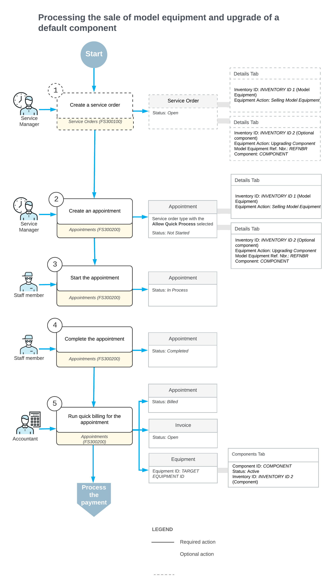

# Upgrading a Default Component of Equipment to Be Sold: General Information {#_46e10edb-7a6e-4f80-884b-6f8a7fa7957b .concept}

With Acumatica ERP, you can handle customer requests for purchasing and installing equipment, upgrading default components \(as described in this topic\), and providing on-site installation services.

## Learning Objectives { .section}

In this lesson, you will learn how to upgrade a default component of a piece of equipment being sold.

## Applicable Scenarios { .section}

You upgrade a default component of equipment in the following cases:

-   A customer requests the sale and installation of a piece of equipment, including an upgrade of one of its default components.
-   A customer requests an upgrade to a component of equipment they already own.

## Workflow of Model Equipment Sale and Default Component Upgrade {#section_b34_ztj_jdc .section}

In the diagram below, you can see the process of selling a piece of equipment and upgrading one of its default components.

When a customer request is received, a service manager enters a service order on the [Service Orders](FS_30_01_00.md) \(FS300100\) form. In the service order, the service manager specifies the customer from which the request has been received, the branch and branch location to provide services, and the services that should be performed.

The service manager can instead start by creating an appointment with all these settings, and the service order will be created automatically. In [Upgrading a Default Component of Equipment to Be Sold: Process Activity](EquipMgmt_Upgrading_Default_Component_of_Equipment_to_Be_Sold_Process_Activity.md), the appointment will be created first.

On the [Appointments](FS_30_02_00.md) \(FS300200\) form, in addition to specifying the general settings, the service manager does the following on the **Details** tab to add the model equipment record and the optional component to be sold:

1.  In the row with the model equipment record, the service manager selects *Selling Model Equipment* in the **Equipment Action** column.
2.  In the row with the component, the service manager selects *Upgrading Component* in the **Equipment Action** column, specifies the related model equipment in the **Model Equipment Ref. Nbr.** column, and selects the identifier of the equipment component in the **Component ID** column.

**Parent topic:**[Upgrading Default Component of Equipment to Be Sold](../UserGuide/EquipMgmt_Upgrading_Default_Component_of_Equipment_to_Be_Sold_Mapref.md)

