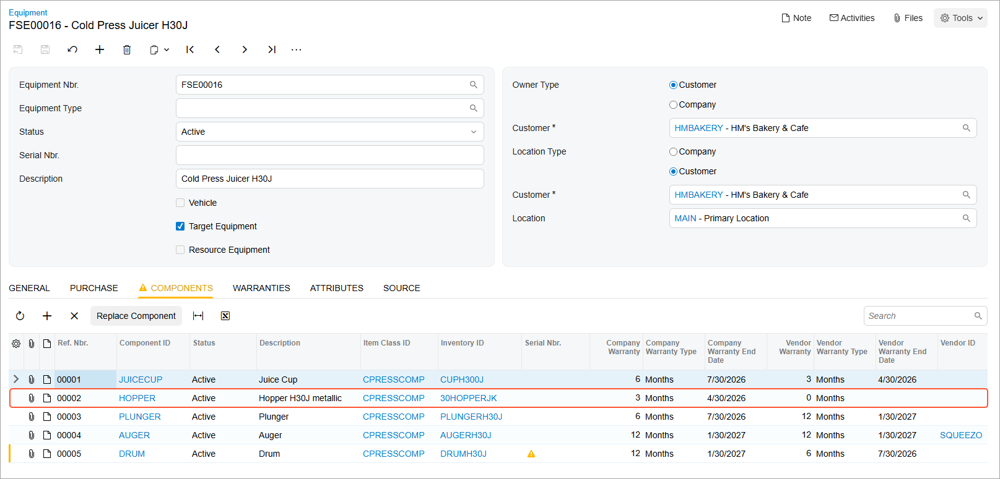

# Upgrading a Default Component of Equipment to Be Sold: Process Activity {#_3b986076-a5fb-45be-893e-0a0a3b09f19b .task}

The following activity will walk you through the process of selling model equipment, upgrading a default component, and providing installation services at the customer site.

## Story {#section_gbk_ytj_jdc .section}

Suppose that the customer has requested the following from the SweetLife Service and Equipment Sales Center:

-   The *CPRESS30J - Cold Press Masticating Juicer H3000J* model equipment.
-   A replacement of one of the default components of the juicer. The customer wants the *30HOPPERJK - Hopper H30J metallic* component instead of the *HOPPERH3 - Hopper for cold press juicers \(plastic\)* component.
-   Installation services for the juicer and component.

Acting as a service manager, you will create an appointment. You will then perform further processing, acting as the assigned staff member and then as the accountant who will prepare billing documents for the customer and will process them in the system. To keep this training simple, you will perform all instructions while signed in to the account of the service manager \(Maia Davis\).

## Process Overview {#section_hh4_1tj_jdc .section}

On the [Appointments](FS_30_02_00.md) \(FS300200\) form, you will create a new appointment, add the service along with the model equipment and component stock items, specify the equipment-related actions for each item, and process the appointment.

## System Preparation {#section_ejp_d23_jdc .section}

Before you begin performing the steps of this activity, do the following:

1.  On the Acumatica ERP website, sign in to a company with the *U100* dataset preloaded. You should sign in as a service manager by using the *davis* username and the *123* password.
2.  In the info area, in the upper-right corner of the top pane of the Acumatica ERP screen, set the business date to *1/30/2026*. For simplicity, in this activity, you will create and process all documents in the system on this business date.
3.  To perform this activity, make sure that you have performed the following prerequisite activities: [Stock Items to Be Tracked Post-Sale: To Create Components](EquipMgmt_Creating_Components_Process_Activity.md) and [Stock Items to Be Tracked Post-Sale: To Create Stock Items with Components](EquipMgmt_Creating_Equipment_with_Components_Process_Activity.md).

## Step: Upgrading a Default Component of Equipment to Be Sold {#section_t24_h5j_jdc .section}

In this step, you will create an appointment \(causing the system to create the corresponding service order\) that includes the following items:

-   The *INSTALL* installation service
-   The *CPRESS30J* inventory item
-   The *30HOPPERJK - Hopper H30J metallic hopper*, which replaces the *HOPPERH3 - Hopper for cold press juicers \(plastic\)* default hopper

You will go through the whole process until you release the corresponding invoice for both the service and the sold equipment.

Perform the following instructions:

1.  On the [Appointments](FS_30_02_00.md) \(FS300200\) form, click **Add New Record**.
2.  Specify the following settings in the Summary area:
    -   **Service Order Type**: *INST*
    -   **Customer ID**: *HMBAKERY - HM's Bakery &amp; Cafe*
    -   **Description**: `Selling a juicer with upgraded hopper`
3.  On the form toolbar, click **Save**.
4.  On the **Details** tab, add a row and select the *INSTALL* service in the **Inventory ID** column of the row.
5.  To add a piece of equipment to this appointment, add another row and specify the following settings in the row:
    -   **Inventory ID**: *CPRESS30J*
    -   **Equipment Action**: *Selling Model Equipment*
    -   **Estimated Quantity**: `1.00`
    -   **Unit Price**: `800.0000`
6.  On the form toolbar, click **Save**.
7.  To add another piece of equipment \(an optional component\) to the appointment, click **Add Row** again and specify the following settings in the row:
    -   **Inventory ID**: *30HOPPERJK*
    -   **Equipment Action**: *Upgrading Component*

        This action registers the component \(which replaces the default component\) of the piece of model equipment.

    -   **Model Equipment Ref. Nbr.**: *0002*

        This is the piece of model equipment that is being upgraded during the sale of the model equipment.

    -   **Component ID**: *HOPPER*

        This is the identifier of the component being upgraded in the model equipment.

    -   **Estimated Quantity**: `1.00`
    -   **Unit Price**: `50.0000`
8.  On the form toolbar, click **Save**.
9.  On the **Staff** tab, click **Add Row** and specify *EP00000003 - Jon Waite* as the **Staff Member**.
10. On the form toolbar, click **Save**.
11. On the form toolbar, click **Start**.

    As you perform this instruction and the next two instructions, you are acting as Jon Waite at the appointment.

12. On the **Settings** tab, in the **Actual Date and Time** section, enter the actual start and end times \(for simplicity in this training, set them to match the scheduled start and end times\). Select the **Finished** check box.
13. Click **Complete**.

    As you perform the remaining instructions in this step, you are now acting as an accountant.

14. Click **Close**.
15. On the form toolbar, click **Quick Process**.

    In the **Process Appointment** dialog box, which opens, ensure that the following check boxes are selected:

    -   **Run Billing**
    -   **Release Invoice**
16. Click **OK**.

    Once the billing process is completed, the reference numbers of the billing documents appear in the Processing Results dialog box. Click **OK**.

    Notice that the appointment now has the *Billed* status.

17. On the **Billing Documents** tab, click the reference number of the sales invoice in the **Reference Nbr.** column. The system opens the [Invoices](SO_30_30_00.md) \(SO303000\) form. Review the details of the generated invoice. Notice that the invoice has been released and has the *Open* status, which means that the target equipment record has been created.
18. In the **Target Equipment** column, click the reference number \(which is also a link\) of the equipment to open the [Equipment](FS_20_50_00.md) \(FS205000\) form.
19. On the **Components** tab, verify that the system has replaced the default hopper with the component \(*30HOPPERJK - Hopper H30J metallic*\) that you selected when you created the appointment \(see the following screenshot\).

    

**Parent topic:**[Upgrading Default Component of Equipment to Be Sold](../UserGuide/EquipMgmt_Upgrading_Default_Component_of_Equipment_to_Be_Sold_Mapref.md)

