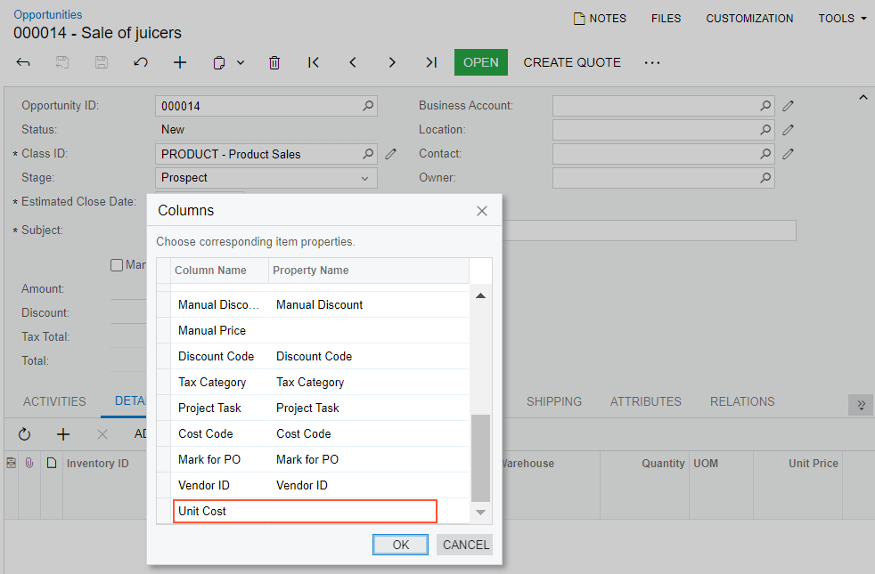

# Integration with Excel {#_d4e757d5-bdf6-4d82-92e3-f26563d48ad4 .concept}

Many users, having worked with Microsoft Excel for years, prefer to perform detailed financial analysis by using a Microsoft Excel spreadsheet on their desktop. For such users, Acumatica ERP supports integration with Microsoft Excel. You can export data from a table on any Acumatica ERP form to Excel or CSV format. The system also supports import from these formats if you have data that you want to process, track, or store in Acumatica ERP.

**Attention:** Acumatica ERP uses the Excel spreadsheet format introduced in Microsoft Office 2007. If you are using an earlier version of Microsoft Office, you should install the appropriate plug-in.

## Excel Export and Import { .section}

You can export data from any table on an Acumatica ERP form to a Microsoft Excel spreadsheet. The general settings your organization uses for export are specified on the [Site Preferences](SM_20_05_05.md) \(SM200505\) form.

You can also easily import data from an Excel spreadsheet into a table on a data entry form—for example, you can import the details of a bill to the **Details** tab of the [Bills and Adjustments](AP_30_10_00.md) \(AP301000\) form. For details, see [To Import Data from a Local File to a Table](GS__how_Import_Data_From_File.md).

## Matching of Columns During Data Import {#section_xgz_fmf_g2c .section}

When you import data from a file to a table on an Acumatica ERP form, the system matches columns based on the names of the columns in this file and in this table. During import, you click **Load Records from File** on the table toolbar and specify the needed values in the **Common Settings** dialog box, which opens. Then you click **OK**, which opens the **Common Settings** dialog box. The field in the **Property Name** column of this dialog box may be empty for the field in the **Column Name** column. In this case, you need to select the matching field the **Property Name** column manually. If you leave this column empty \(see the following screenshot\), the system does not upload the value of this column from the imported file to the table on the form.

Suppose that for a table on a data entry form, you manually add a column from the **Available Columns** pane to the **Selected Columns** pane of the **Column Configuration** dialog box. Further suppose that the column appears in this table only if some feature is enabled on the [Enable/Disable Features](CS_10_00_00.md) \(CS100000\) form. If the feature is disabled, this column does not appear in the list of matching fields in the **Property Name** column. Thus, you cannot match the column in the imported file to the column in the table on the form by using the **Columns** dialog box. As a result, the value of the column from the imported file cannot be inserted into the column in the table on the form.

## Update of Excel Spreadsheets { .section}

If you have exported data from a generic inquiry form to an Excel file, you can update your Excel file with data from the Acumatica ERP database. You can retrieve the data from the web and update the file contents without reexporting data from the system and repeating all post-export configuration steps.

The contents of the file are updated with the filtering criteria you have specified on the generic inquiry form before exporting the data. If the filtering criteria includes the default values, these values will be updated as well. For example, if the filtering criteria includes the current financial period, and the period is changed in the system, it will be automatically updated in the file.

For details on updating a spreadsheet, see [To Update an Excel Spreadsheet](Exporting_to_Excel__how_update.md).

## Aggregation of Excel Spreadsheets { .section}

Additionally, you can aggregate data from multiple forms to one Excel workbook and use the file as you want—for example, as a source for summarizing and analyzing data. To aggregate data in this way, you perform the following general steps:

1.  You export data from each form you want to use.
2.  You copy the sheets from the exported files to an Excel workbook, and save the resulting file.

Once you have performed these steps, when you refresh data in Excel, the data on all spreadsheets will be updated simultaneously.

**Parent topic:**[Importing and Exporting Data to Excel and XML](../UserGuide/GS_Importing_Exporting_to_Excel_XML.md)

