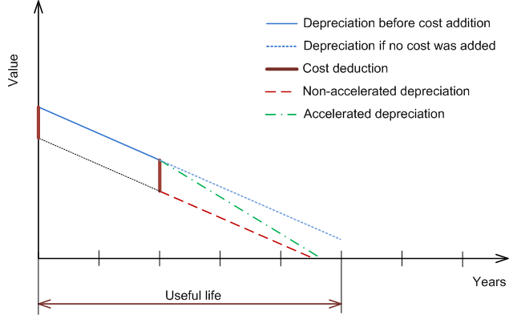
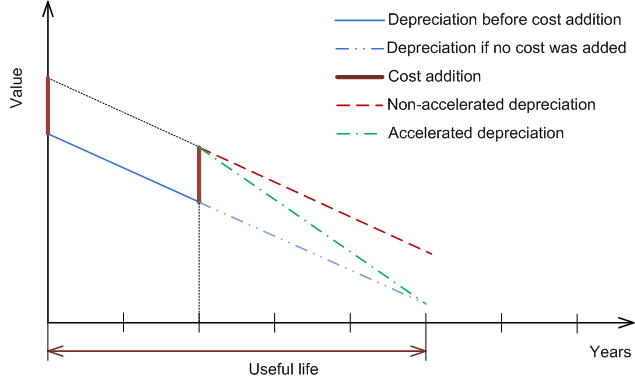

# Depreciation Configuration {#_f3d4ae85-1c86-47f4-8fcd-7ffbc6f7f0af .concept}

You have to select an appropriate depreciation method and select certain depreciation settings for each fixed asset you add to the system. In the topics of this section you can find information on the depreciation methods available in Acumatica ERP and the details on setting up asset depreciation.

## Using Depreciation Methods {#section_xsb_ljv_vxb .section}

The depreciation method determines how the asset cost is allocated over the useful life of the asset. Acumatica ERP provides multiple built-in depreciation methods, and you can create custom methods. You use the [Depreciation Methods](FA_20_25_00.md) \(FA202500\) form to manage formula-based methods and the [Depreciation Table Methods](FA_20_26_00.md) \(FA202600\) form to manage table based methods.

For details on the calculation methods available in the Acumatica ERP, see [Predefined Depreciation Methods](FA__con_Depreciation_Methods.md), [Dutch Depreciation Methods](FA__con_Dutch_Depreciation_Methods.md), [Australian Depreciation Methods](FA__con_Australian_Depreciation_Methods.md), and [New Zealand Depreciation Methods](FA__con_NewZealand_Depreciation_Methods.md). For details on the averaging conventions that determine how fixed assets must be depreciated for the financial period within which they are acquired or disposed of, see [Averaging Conventions](FA__con_Averaging_Conventions.md). For more information on the methods that are permitted by law in the United States, see [U.S.-Based Fixed Asset Depreciation](FA__con_US-Based_Fixed_Asset_Depreciation.md).

## Using Accelerated Depreciation for the Straight-Line Depreciation Method {#section_atb_ljv_vxb .section}

If you change the settings for an asset—for example, you revalue the asset or change its useful life—the system uses the revalued amount as the basis for the depreciation in periods after revaluation.

You can configure the system to accelerate the depreciation for the assets that use the *Straight-Line* method, or you can use the *Remaining Value* method. In this case, the asset depreciation will be reported throughout the entire life of the asset, as shown in the following graphics below.

You can switch on the accelerated depreciation for an asset class, and the setting will be applied to all the assets of the class.

To switch on the accelerated depreciation for the assets that use the *Straight-Line* method, select the **Accelerated Depreciation for SL Depr. Method** check box on the **General** tab of the [Fixed Asset Classes](FA_20_10_00.md) \(FA201000\) form.

**Important:** For depreciation methods that use the *Straight-Line* calculation method with the *Full Period* and *Full Day* averaging conventions, the state of the **Accelerated Depreciation for SL Depr. Method** check box is ignored by the system. If these settings are specified in Acumatica ERP, the asset’s net value may not become zero at the end of its useful life if the useful life was changed or the asset was revalued.

For the asset's net value to become zero at the end of its useful life, you should change the depreciation method to a method based on the *Remaining Value* calculation method. To do this, you change the option in the **Depreciation Method** column on the **Balance** tab of the [Fixed Assets](FA_30_30_00.md) form for every needed asset.

## Configuring the Depreciation of an Asset {#section_jtb_ljv_vxb .section}

The choice of a depreciation method depends on what your company policy is and how accurately the method reflects the physical depreciation of an asset. Acumatica ERP supports assigning multiple books to one asset, with each book using its own depreciation method for different purposes. For more information about setting up books, see [Fixed Assets: To Configure the Fixed Asset Functionality](../ImplementationGuide/config_FixedAssets_Implem_Activity_FixedAssets_Subledger.md). You assign a class to the asset, and then specify the books to be assigned to the asset from the books associated with the asset class. Note that the asset must be assigned to the book that updates the general ledger. Additionally, after you assign a book to an asset, you can change the default depreciation method of the book for the selected asset by using the [Fixed Assets](FA_30_30_00.md) \(FA303000\) form.

-   **[Predefined Depreciation Methods](../UserGuide/FA__con_Depreciation_Methods.md)**  

-   **[To Configure Formula-Based Depreciation Methods](../UserGuide/FA__how_To_Configure_Formula_Based_Methods.md)**  

-   **[Dutch Depreciation Methods](../UserGuide/FA__con_Dutch_Depreciation_Methods.md)**  

-   **[To Configure Dutch Depreciation Methods](../UserGuide/FA__how_To_Configure_Dutch_Depreciation_Methods.md)**  

-   **[Australian Depreciation Methods](../UserGuide/FA__con_Australian_Depreciation_Methods.md)**  

-   **[To Configure Australian Depreciation Methods](../UserGuide/FA__how_To_Configure_Australian_Depreciation_Methods.md)**  

-   **[New Zealand Depreciation Methods](../UserGuide/FA__con_NewZealand_Depreciation_Methods.md)**  

-   **[To Configure New Zealand Depreciation Methods](../UserGuide/FA__how_To_Configure_New_Zealand_Depreciation_Methods.md)**  

-   **[Table Depreciation Methods](../UserGuide/FA__con_Table_Depreciation_Methods.md)**  

-   **[Averaging Conventions](../UserGuide/FA__con_Averaging_Conventions.md)**  

-   **[U.S.-Based Fixed Asset Depreciation](../UserGuide/FA__con_US-Based_Fixed_Asset_Depreciation.md)**  

