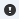

# Room Calendar Board {#_52cfe99e-53ca-425d-ab28-7b2508a1faf7 .reference}

Form ID: \(FS300700\)

On this form, you can view the appointments held in a particular room in your company on an interactive calendar; you can also create, schedule, and modify these appointments.

**Note:** For your company to be able to manage rooms for appointments in the system, the **Enable Rooms** check box must be selected on the [Service Management Preferences](FS_10_01_00.md) \(FS100100\) form.

## Service Orders Tab {#_1f91c44e-9b3a-4e8e-8e06-22d3ce86bd08 .section}

On this tab, which is in the left pane of the form, you can view the service orders and their services that do not have appointments assigned yet, along with various settings that have been specified for each service order on the [Service Orders](FS_30_01_00.md) \(FS300100\) form. The service orders are displayed for the period of time that is defined in the **Show Service Orders in a Period of x Days** box of the [Service Management Preferences](FS_10_01_00.md) \(FS100100\) form.

To create an appointment for a service order or a particular service, you can click the necessary service order or service on this tab and drag it to the necessary date, start time, and staff member on the dashboard. When you do, the system creates the appointment and keeps it selected. You can press the E key to open the [Appointments](FS_30_02_00.md) \(FS300200\) form and edit the created appointment. You can also select D to delete the appointment.

The table toolbar includes standard element and form-specific buttons. The form-specific buttons are listed below.

|Button|Description|
|------|-----------|
|**Filter**|Opens the **Service Order Filters** dialog box, which you can use to define a new filter. After you create and save the filter, the information on the dashboard is updated.|
|**Clear Filter**|Clears the filter settings.

This button appears on the table toolbar only if a filter has been applied to the table.

|

|Element|Description|
|-------|-----------|
|The Selector area of the dialog box includes the following box.|
|**Supervisor**|The staff member to whom the service orders you want to view are assigned in the **Supervisor** box on the **Settings** tab of the [Service Orders](../Shared/../UserGuide/FS_30_01_00.md) \(FS300100\) form. You can leave the box blank to view the service orders assigned to all staff members.|
|The dialog box contains the following tabs.|
|**Skills**|A tab that contains check boxes representing the skills that have been added on the [Skills](../Shared/../UserGuide/FS_20_06_00.md) \(FS200600\) form. If you select the check boxes that represent the needed skills, when you apply the filter, the system filters the service orders by the presence of the selected skills.|
|**License Type**|A tab that contains check boxes representing the license types that have been added on the [License Types](../Shared/../UserGuide/FS_20_09_00.md) \(FS200900\) form. If you select the check boxes that represent the needed licenses, when you apply the filter, the system filters the service orders by the presence of the licenses of the selected types.|
|**Problems**|A tab that contains check boxes representing the problems that have been added on the [Problem Codes](../Shared/../UserGuide/FS_20_12_00.md) \(FS201200\) form. If you select the check boxes that represent the needed problems, when you apply the filter, the system filters the service orders by the presence of the selected problems.|
|**Service Classes**|A tab that contains check boxes representing the service classes that have been added in the [Service Classes](../Shared/../UserGuide/FS_40_09_00.md) \(FS400900\) form. If you select the check boxes that represent the needed service classes, when you apply the filer, the system filters the service orders by the selected service class.|
|The dialog box contains the following buttons.|
|**Filter**|Applies the selected filtering criteria.|
|**Filter &amp; Close**|Applies the selected filtering criteria and closes the dialog box.|
|**Close**|Closes the dialog box without applying the selected filtering criteria.|

|Column|Description|
|------|-----------|
|**Service Order**|The identifier of the service order. If services have been assigned to the service order, you can expand the list to display them by clicking the arrow to the right of the service order identifier.|
|**Quantity**|The number of services assigned to the service order.|
|Unlabeled|An unlabeled column with an icon that represents the status of the service. The column contains one of the following icons: -   : The service is scheduled.
-   : The service is not scheduled.

|
|**Customer**|The customer that ordered the services of the service order.|
|**Service Order Type**|The type of the service order.|
|**Priority**|The priority to perform the service order. The column contains one of the following options:-   *L*: Low priority
-   *M*: Medium priority
-   *H*: High priority

|
|**Severity**|The severity associated with the service order. The column contains one of the following options:-   *L*: Low severity
-   *M*: Medium severity
-   *H*: High severity

|
|**SLA**|The deadline or service-level agreement.|
|**Date**|The date when the service order document was created.|
|**Source Type**|The type of the source of the service order \(*Service Order*, *Sales Order*, *Case*, or *Opportunity*\).|
|**Source Ref.**|The reference number of the document that is a source of the service order.|
|**Supervisor**|The staff member assigned as a supervisor for the service order.|

The table footer includes only standard elements.

## Unassigned Appointments Tab {#_8a65f6f1-c2c5-414c-9ba5-052e5fb46a18 .section}

On this tab, which is in the left pane of the form, you can view the appointments that have been assigned to any room yet, along with various settings that have been specified for each appointment on the [Appointments](FS_30_02_00.md) \(FS300200\) form.

To assign an appointment to a particular staff member, you can click the necessary appointment on this tab and drag it to the necessary staff member on the dashboard. The system displays the appointment for the staff member and keeps it selected. You can press the E key to open the [Appointments](FS_30_02_00.md) \(FS300200\) form and edit the created appointment. You can also select D to delete the appointment.

The table toolbar includes standard element and form-specific buttons. The form-specific buttons are listed below.

|Button|Description|
|------|-----------|
|**Filter**|Opens the **Unassigned Appointment Filters** dialog box, which you can use to define a new filter. After you create and save the filter, the information on the dashboard is updated.|
|**Clear Filter**|Clears the filter settings.

 This button appears on the table toolbar only if a filter has been applied to the table.

|

|Element|Description|
|-------|-----------|
|The dialog box contains the following tab.|
|**Skills**|A tab that contains check boxes representing the skills that have been added on the [Skills](FS_20_06_00.md) \(FS200600\) form. If you select the check boxes that represent the needed skills, when you apply the filter, the system filters the appointments by the presence of the selected skills.|
|The dialog box contains the following buttons.|
|**Filter**|Applies the selected filtering criteria.|
|**Filter &amp; Close**|Applies the selected filtering criteria and closes the dialog box.|
|**Close**|Closes the dialog box without applying the selected filtering criteria.|

|Column|Description|
|------|-----------|
|**Appointment**|The number of the appointment in the system.|
|**Customer**|The customer with which the appointment takes place.|
|**Service Order Type**|The service order type of the appointment.|
|**Quantity**|The number of unique services that will be performed in the appointment.|
|**Date**|The scheduled day of the appointment.|
|**Start Time**|The time when the appointment is scheduled to start.|
|**End Time**|The time when the appointment is scheduled to end.|

The table footer includes only standard elements.

## Dashboard { .section}

The dashboard is a pane that displays in calendar format the appointments assigned to the rooms of the branch for a specific day, week, or month. You can drag services, service orders, and unassigned appointments to the appropriate room and start time and date on the dashboard, and you can create an appointment \(if the appointment has not been created yet\).

|Element|Description|
|-------|-----------|
|**Appointments**|Opens one of the following, based on whether the **Select Service Order Type on Creation from Calendars** check box is selected on the [User Profile](../Shared/../UserGuide/SM_20_30_10.md#) \(SM203010\) form for the current user:

-   If the check box is cleared, the [Appointments](../Shared/../UserGuide/FS_30_02_00.md) \(FS300200\) form. On this form, you can create a new appointment.
-   If the check box is selected, the **Create Appointment** dialog box. Here you can select the service order type of the appointment to be created and proceed to creating a new appointment.

|
|**Branch**|The branch for you want to view data on the form. By default, the branch to which you are signed in is selected.

 Based on the branch specified in this box, the system displays data on the current form as follows:

 -   On the dashboard, a room is displayed only if it is related to the branch location for which the branch is selected in the **Branch** box of the [Branch Locations](FS_20_25_00.md) \(FS202500\) form.
-   On the **Service Orders** tab of the left pane, a service order is listed only if for this service order, this branch is selected in the **Branch** box on the **Financial Settings** tab of the [Service Orders](FS_30_01_00.md) \(FS300100\) form.
-   On the **Unassigned Appointments** tab of the left pane, an appointment is displayed only if for this appointment, this branch is selected in the **Branch** box on the **Financial Settings** tab of the [Appointments](FS_30_02_00.md) \(FS300200\) form.

|
|**Branch Location**|The branch location for you want to view data on the form.

 Based on the branch location specified in this box, the system displays data on the current form as follows:

 -   On the dashboard, the system displays the rooms that are assigned to the branch location on the **Rooms** tab of the [Branch Locations](FS_20_25_00.md) \(FS202500\) form.
-   On the **Service Orders** tab of the left pane, a service order is listed only if for this service order, this branch location is selected in the **Branch Location** box in the Summary area of the [Service Orders](FS_30_01_00.md) \(FS300100\) form.
-   On the **Unassigned Appointments** tab of the left pane,an appointment is displayed only if for this appointment, this branch location is selected in the **Branch** box on the **Financial Settings** tab of the [Appointments](FS_30_02_00.md) \(FS300200\) form.

|
|**Time Interval**|The time range for which the data is displayed on the dashboard. You can select one of the following options:

 -   *Day*
-   *Week*
-   *Month*

 You can set the default time interval in the **Time Range** box on the **Calendars and Maps** tab of the [Service Management Preferences](FS_10_01_00.md) \(FS100100\) form.

|

|Element|Description|
|-------|-----------|
|The dialog box contains the following box.|
|**Service Order Type**|The service order type of the appointment to be created.

 By default, the system inserts the service order type that has been specified for the user on the [User Profile](../Shared/../UserGuide/SM_20_30_10.md#) form \(if applicable\) or the default service order type that has been specified for the system on the [Service Management Preferences](../Shared/../UserGuide/FS_10_01_00.md) form \(if applicable\). The default service order type can be overridden.

|
|The dialog box contains the following buttons.|
|**OK**|Opens the [Appointments](../Shared/../UserGuide/FS_30_02_00.md) form with the selected service order type.|
|**Close**|Closes the dialog box without creating an appointment.|

You can invoke the following commands by right-clicking an appointment on the calendar board.

|Element|Description|
|-------|-----------|
|**OK/Unconfirm**|Confirms or removes the confirmation of the selected appointment with the customer. The color of the appointment box changes based on the confirmation status.|
|**Validate by Dispatcher/Clear Validation**|Validates the selected appointment or removes the validation from the selected appointment.|
|**Unassign**|Removes a staff member from the appointment and moves the appointment to the **Unassigned** row on the calendar board.|
|**Clone**|Opens the [Clone Appointments](../Shared/../UserGuide/FS_50_02_01.md) \(FS500201\) form, where you can create a cloned copy of the selected appointment.|
|**Delete**|Deletes the appointment from the system.|

The dashboard footer includes elements that you use to navigate through dashboard pages \(if there are multiple pages\), set time filters, change the time resolution \(in the *Horizontal* view mode\), and change the view mode.

**Parent topic:**[Service Management Forms](../UserGuide/FS__FS_Form_Reference.md)

