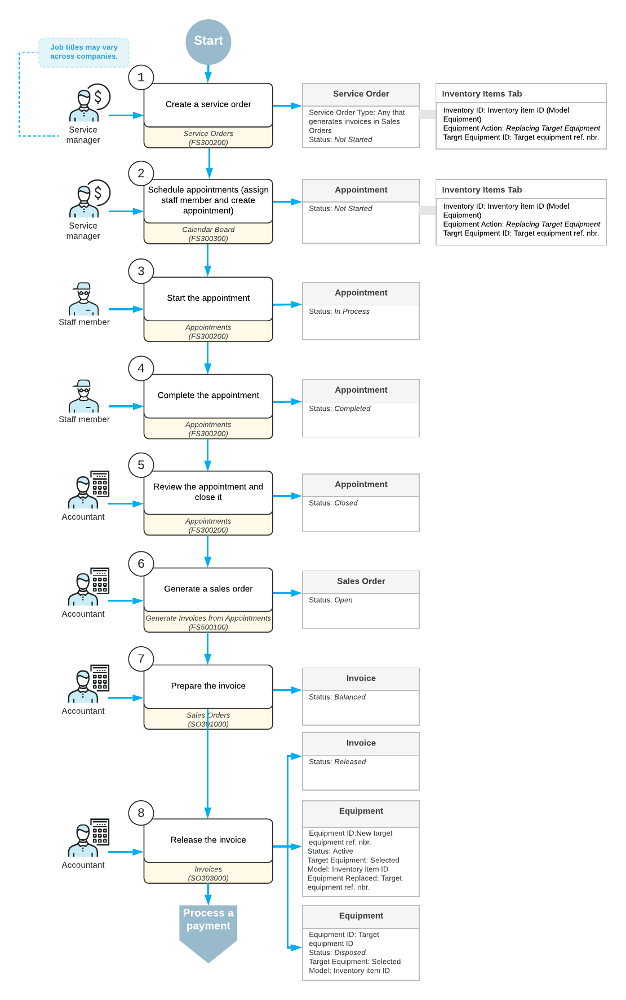

# Replacing Target Equipment {#_bd6d12f4-efed-4775-b34c-7c0fff2c6a63 .concept}

In Acumatica ERP, while you are working with a sales order, service order, or appointment on the applicable form, you can easily register the replacement of an existing target equipment entity with a new entity.

For the use case considered in this topic, suppose that the customer has requested a new equipment entity to replace an old one, along with replacement services from your company. A service manager of your company receives the request and enters it into Acumatica ERP. Further processing is then performed by the scheduler, the assigned staff members, and the accountant who prepares invoices for the customer and processes them in the system.

In this topic, you will read about the steps involved in processing the service order and replacing the target equipment.

## Applying the System Settings of the Use Case { .section}

In this example, settings are applied in the system as follows:

-   On the [Billing Cycles](../Shared/../UserGuide/FS_20_60_00.md) \(FS206000\) form, the billing cycle assigned to the customer is configured to generate billing documents and group them by appointment \(that is, in the Summary area, the **Appointments** option button is selected under both **Run Billing For** and **Group Billing Documents By**\).
-   For the service order type, on the **General** tab of the [Service Order Types](../Shared/../UserGuide/FS_20_23_00.md) \(FS202300\) form, the applicable service order type is configured as follows:
    -   In the **Billing Settings** section, the option button to create sales orders \(**Sales Orders** under **Generated Billing Documents**\) is selected.
    -   In the **General Settings** section, the **Complete Service Order When Its Appointments Are Completed** check box is selected, so that service orders of the type are completed automatically when their appointments are completed. Also, the **Complete Service Order When Its Appointments Are Closed** check box is selected, meaning that service orders of the type are closed automatically when their appointments are closed.

In the diagram below, you can see the entire process of replacing target equipment within a service order.

In the following sections, you will read about each step of the process.

## Entering an Order { .section}

When a service manager receives a customer request for replacement of target equipment, he or she enters a service order by using the [Service Orders](FS_30_01_00.md) \(FS300100\) form \(see 1 in the diagram above\). In the service order, the service manager specifies the customer from which the request has been received, the branch and branch location where the services are delivered, the services that should be performed.

In addition, on the **Inventory Item** tab of this form, the service manager adds a model equipment entity that will replace the old target equipment entity. To specify that the replacement is being performed, for the model equipment entity, the service manager selects *Replacing Target Equipment* in the **Equipment Action** column and specifies the target equipment entity to be replaced in the **Target Equipment ID** column.

## Creating Appointments { .section}

After the service order has been created in the system, a scheduler of your company \(that is, a person who is responsible for planning the appointments\) uses the [Calendar Board](../Shared/../UserGuide/FS_30_03_00.md) \(FS300300\) form to schedule the appointments \(2 in the diagram above\) that are needed to perform the services requested by the customer.

When the scheduler selects a staff member to attend an appointment, he or she takes into consideration the work schedule of the staff member and filters the displayed staff members by the skills and licenses needed to perform the service and the service area where the services are provided. The scheduler checks the information on each appointment and enters additional information, such as the resource equipment used to perform the services and the stock items purchased by the customer along with the service. \(The system assigns the *Not Started* status to the created appointments.\)

## Attending an Appointment { .section}

The staff member who is assigned to an appointment looks through his or her upcoming appointments on the [Staff Calendar Board](../Shared/../UserGuide/FS_30_04_00.md) \(FS300400\) form, identifies which appointment he or she has to attend currently, and goes to the location where the service has to be performed, which usually is the customer location\). When the staff member starts to perform the service, he or she starts the appointment on the [Appointments](../Shared/../UserGuide/FS_30_02_00.md) \(FS300200\) form \(3 in the diagram above\). The appointment is assigned the *In Process* status.

While the services are being performed, the staff member adds the information on services \(such as statuses, quantities, and extra stock items that were used\) to the appointment on the [Appointments](../Shared/../UserGuide/FS_30_02_00.md) form. When the services are done, the staff member checks the details of the appointment. When everything is correct and complete, the staff member completes the appointment \(4\), which gives it the *Completed* status.

When all appointments of a particular service order are completed, the system assigns the service order the *Completed* status.

## Processing Invoices {#_9b0ac57d-2514-419a-88f3-2517e5031ec6 .section}

Further processing of the service order is performed by an accountant. On the [Appointments](FS_30_02_00.md) \(FS300200\) form, the accountant opens the completed appointment and verifies quantities and prices. When all information is verified and the appointments are ready for invoicing, the accountant closes the appointments and the service order \(5\). \(The appointments and service order get the *Closed* status.\)

The accountant generates a sales order document with the *Open* status by using the [Run Appointment Billing](FS_50_01_00.md) \(FS500100\) form \(6 in the diagram above\).

The accountant then prepares the invoice \(7\) by using the [Sales Orders](SO_30_10_00.md) \(SO301000\) form, and processes and releases the invoice on the [Invoices](SO_30_30_00.md) \(SO303000\) form \(8\).

When the invoice related to the service order is released, the system adds a record for the new target equipment entity on the [Equipment](FS_20_50_00.md) \(FS205000\) form and changes the status of replaced target equipment entity to *Disposed* on the same form.

**Parent topic:**[Equipment Management Use Cases](../UserGuide/FS__MNG_EM_Use_Cases.md)

