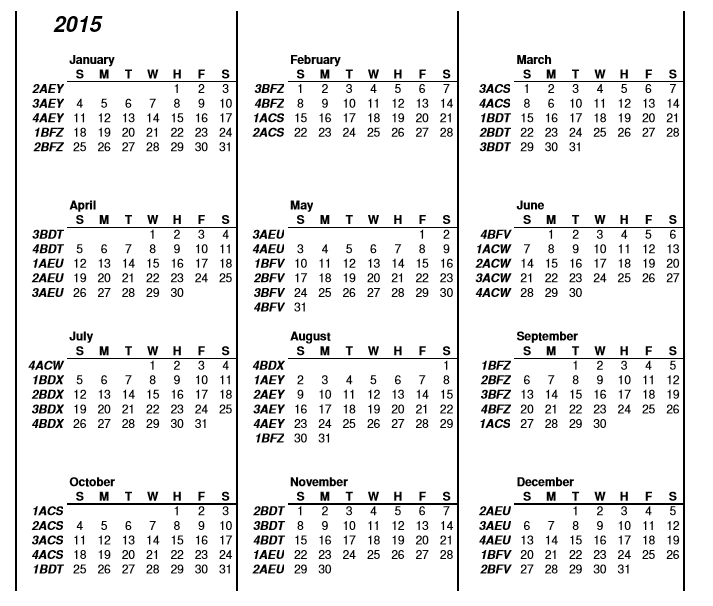

# Creating Week Codes {#_b2ebd3eb-4c9e-4dc0-bc89-960a0743bcee .concept}

The week code is a one- to four-digit recurrence system that you can use to reschedule the appointment in a multiple of four-week intervals.

The week code is directly related to the calendar. If a week with a 4-digit recurrence is defined, the rest of the calendar can be calculated.

The advantage of the week code system is that without generating a recurrence of an appointment, you can easily calculate the previous and next recurrences that have taken place or will take place. The disadvantage is that the recurrence can be set only in multiples of four weeks \(that is, for example, every four or eight weeks.

**Attention:** The week codes are currently used for validation purposes in the Route Management module. The recurrence of the route will be taken from the Route Management recurrence form.

## Generation of the Calendar { .section}

Because the week code is calculated on a fixed calendar, the first step is to generate the calendar. This will define the correspondence between the week code and the calendar weeks.

To generate the weekcode calendar, you use the [Calendar Week Codes](FS_20_59_00.md) \(SD205900\) form.

## Structure of the week codes { .section}

The digits in the week codes indicate the following:

-   P1: The first digit can be 1, 2, 3 or 4, and this recurrence will happen every four weeks.

    For example, if a route is set for week code 1, starting on the fourth week of January, the route will happen every 4 weeks. But if the week code is 2, it will also happen every four weeks but starting in the fifth week of January.

    **Tip:** The recurrence can be more than one week code. For example, a route can be on the week codes 1, 2, 3, or 4, meaning that it will be every week, or it can be 1, 3 or 2, 4, meaning it will be every two weeks, starting on the first or second week of the year.

-   P2: The second digit can be *A* or *B*, and the combination of the first and second digit will happen every eight weeks.

    For example, if a route is set to *1B*, the first appointment of the year will be in the fourth week of January, and the second appointment will be in the third week of March \(that is, eight weeks later\).

-   P3: The third digit can be *C*, *D*, *E*, or *F*, and the combination of the first, second, and third digits will happen every 16 weeks.

    For example, if a route is set to *1BF*, the first appointment of the year will be in the fourth week of Januar,y and the second appointment will be in the third week of May \(that is, 16 weeks later\).

-   P4: The fourth digit can be *S*, *T*, *U*, *V*, *W*, *X*, *Y*, or *Z*. The combination of the first, second, third, and fourth digits will happen every 32 weeks.

    For example, if a route is set to *1BFZ*, the first appointment of the year will be in the fourth week of January, and the second appointment will be in the last week of August or first week of September \(that is, 32 weeks later\).

**Parent topic:**[Managing Week Codes](../UserGuide/FS__MNG_Week_Codes.md)

