# Scheduling Appointments: Calendar Board {#_42742860-763d-405c-b88d-af5190a58195 .concept}

In field services, appointments are at the core of daily operations, and the calendar is the main tool for managing them. In this topic, you’ll learn how the calendar board helps you schedule, view, and manage appointments efficiently to support smooth service delivery.

**Important:** This topic describes the calendar board available in the modern UI of Acumatica ERP.

## From Unscheduled to Scheduled: Easy Appointment Creation {#section_iss_fbm_dgc .section}

On the [Calendar Board](FS_30_03_00.md) \(FS300300\) form, the left pane shows these tabs:

-   **Unscheduled**: All service orders that have not yet been scheduled with appointments
-   **Scheduled**: All appointments that have been created in the system

**Tip:** You can collapse or expand the left pane.

In this section, we will explore the **Unscheduled** tab.

The **Unscheduled** tab \(Item 1 below\) lists all service orders where the **Appointment Needed** check box is selected and at least one service has the *Requiring Scheduling* status on the **Details** tab of the [Service Orders](FS_30_01_00.md) \(FS300100\) form. Each service order appears as a tile \(Item 2 and Item 3\) displaying the service order’s general information and included services. The services associated with an order are listed at the bottom of the tile.

You can create an appointment for either a service order or a specific service by dragging the entire tile or an individual service to either the desired time slot in a staff member’s row or the **Unassigned** row. A service that has already been scheduled is shaded in gray and preceded by a check mark on the tile \(Item 2\). If you drag only a service, the new appointment includes just that service.

**Tip:** Gray dotted time blocks on the calendar represent a staff member’s non-working hours. The white area represents working hours, which are configured on the [Staff Schedule Rules](FS_20_20_01.md) \(FS202001\) form.

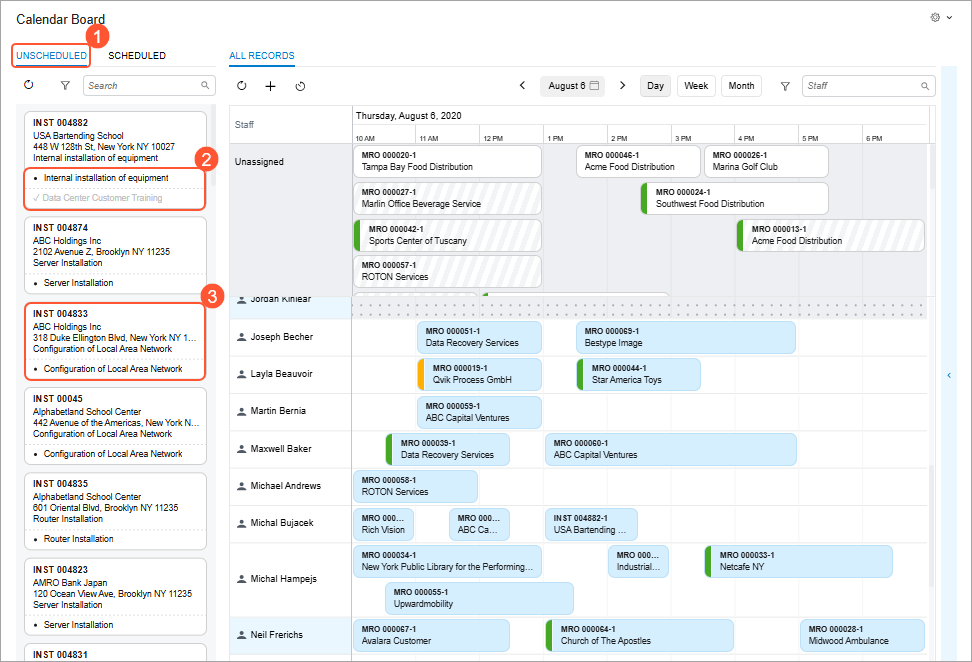

You can search for a service order by using the **Search** box. The system will search based on the string you enter, which can include the service order number, description, customer ID, customer name, address, phone number, email, service order detail description, and problem description. Additionally, you can filter the list of service orders by using the Acumatica ERP’s simple or advanced filtering capabilities.

To view more details about a service order, simply click its reference number in the tile to open the quick view panel \(see below\).

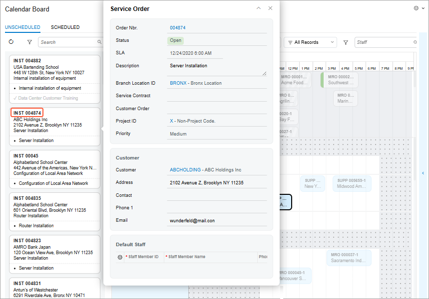

## Appointments at a Glance {#section_ikb_422_kfc .section}

The **Scheduled** tab of the left pane of the [Calendar Board](FS_30_03_00.md) \(FS300300\) form shows a complete list of all scheduled appointments. Click an appointment tile in the list to:

-   Highlight the appointment on the calendar in its corresponding day and time slot
-   Highlight the appointment location on the map \(see below\)

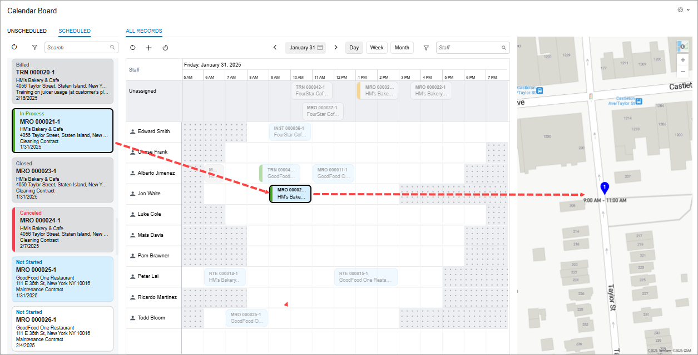

You can search for the needed appointment in the list by using the appointment number, description, related service order description, customer ID, customer name, address \(from the service order’s address line 1\), phone, email, and problem description. Additionally, you can filter the list of appointments by using Acumatica ERP’s simple or advanced filtering capabilities.

To quickly review appointments scheduled for today, click today's date at the bottom of the Date Picker window \(see below\), which opens when you click the date on the calendar pane toolbar. The system updates the calendar to display today’s appointments.

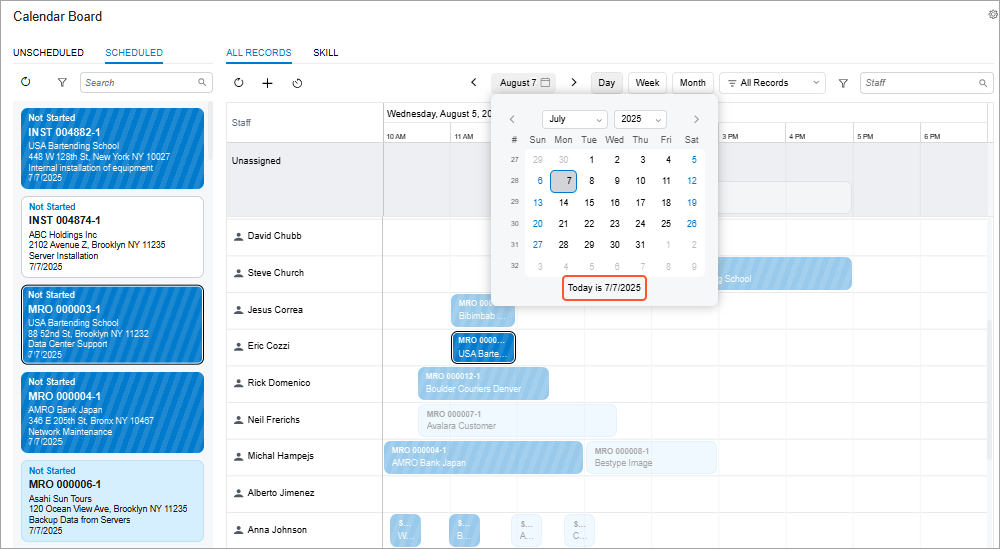

## Appointment Viewing and Management {#section_kdm_ylh_yfc .section}

For efficient management of your appointments on the [Calendar Board](FS_30_03_00.md) \(FS300300\) form, you can quickly perform actions for an appointment. To view the corresponding menu commands, right-click the appointment tile on the **Scheduled** tab or the calendar pane \(see below\).

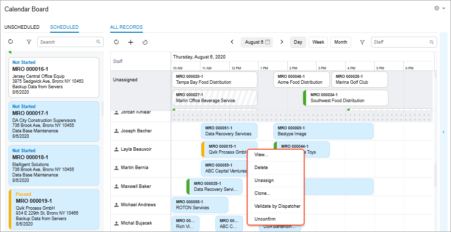

Click one of these menu commands:

-   **View**: Opens the quick view panel, where you can briefly review the appointment’s general information. You can then open it on the [Appointments](FS_30_02_00.md) \(FS300200\) form by clicking the link with its reference number. On the toolbar of the quick view panel, all the actions listed below are available as buttons too.
-   **Delete**: Deletes the appointment from the system.
-   **Unassign**: Removes the assigned staff member and moves the appointment tile to the **Unassigned** row of the calendar.
-   **Clone**: Opens the [Clone Appointments](FS_50_02_01.md) \(FS500201\) form.
-   **Validate by Dispatcher**/**Clear Validation**: Validates or removes validation for the appointment. The system selects or clears the **Validated by Dispatcher** check box on **Settings** tab of the [Appointments](FS_30_02_00.md) form.
-   **Confirm**/**Unconfirm**: Confirms or removes confirmation for the appointment. The system selects or clears the **Confirmed** check box on **Settings** tab of the [Appointments](FS_30_02_00.md) form.

## Unassigned Appointments on the Calendar {#section_t5z_pj2_yfc .section}

If no staff member is assigned to an appointment, it appears in the **Unassigned** row at the top of the calendar on the [Calendar Board](FS_30_03_00.md) \(FS300300\) form \(see below\). You can easily assign a staff member by dragging the appointment tile from the **Unassigned** row to the staff member's row. The appointment will then appear in the corresponding staff member's row, within the appropriate time slot.

Note that the **Unassigned** row is always locked in the Calendar Pane. As you scroll vertically through the staff members, this row remains visible at all times, helping you quickly view and assign appointments without losing sight of the **Unassigned** row.

The list of staff members displayed in the calendar area is sorted alphabetically—by the first name specified on the [Employees](EP_20_30_00.md#) \(EP203000\) form for employees, or the account name specified on the [Vendors](AP_30_30_00.md) \(AP303000\) form for vendors.

The size of the appointment tile reflects the scheduled duration. You can adjust the duration by resizing the tile, as well as change the scheduled start time and date by dragging the appointment to the needed time slot.

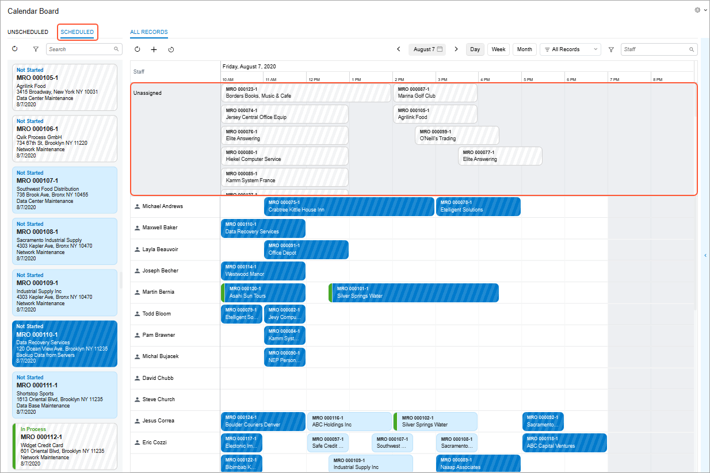

## Color Coding of Appointments {#section_s25_hth_yfc .section}

On the [Calendar Board](FS_30_03_00.md) \(FS300300\) form, the color and pattern of the appointment tiles displayed on the **Scheduled** tab and in the calendar pane can vary, providing a quick visual cue about the appointment's state. These variations depend on whether the appointment:

-   Has been confirmed
-   Is assigned to a staff member

|Indicator|Description|Meaning|
|---------|-----------|-------|
|**Plain tile colors without stripes** indicate that the appointment **is confirmed**—meaning that the **Confirmed** check box is selected on the [Appointments](FS_30_02_00.md) \(FS300200\) form. The color reflects whether the appointment is assigned.|
||White tile \(Item 1 below\)|The appointment is confirmed and unassigned.|
||Light blue tile \(Item 2\)|The appointment is confirmed and assigned to a staff member.|
|**Zebra-striped** tiles always indicate that the appointment is **not confirmed**—meaning the **Confirmed** check box is cleared on the [Appointments](FS_30_02_00.md) \(FS300200\) form.|
||White zebra-striped tile \(Item 3\)|The appointment is unconfirmed and unassigned to any staff member.|
||Dark blue zebra-striped tile \(Item 4\)|The appointment is unconfirmed but assigned to a staff member.|
|A gray tile indicates that the appointment is finalized.|
||Gray tile \(Item 5\)|The appointment is completed, closed, billed, or canceled.|

The **colored vertical bar** \(Item 6\) on the tile indicates the appointment's status \(for example, *Not Started*, *In Process*, *Paused*, and *Billed*\). On the **Status Color** tab of [Calendar Preferences](FS_10_05_00.md) \(FS100500\) form, you can change:

-   The colors of each bar and the corresponding status text.
-   The visibility of each status indicator: Just select or clear the check boxes in the **Visible** column for each status.

Below you can see the color coding applied to appointment tiles.

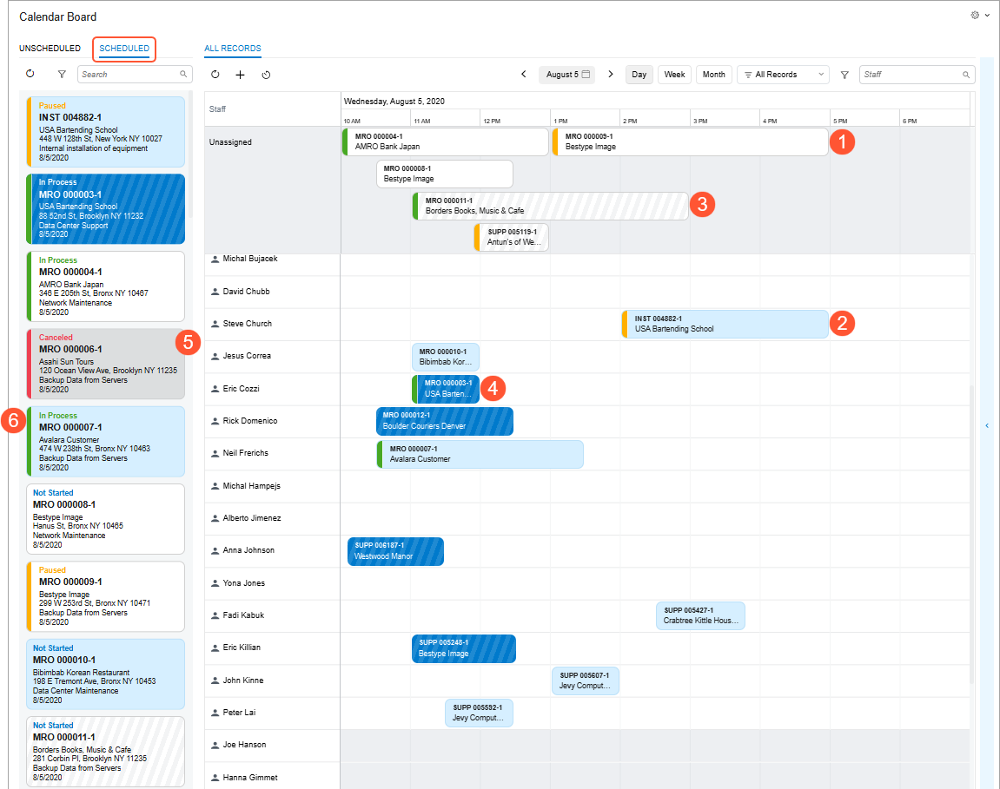

## Appointment Viewing on the Map {#section_gl3_lrw_xfc .section}

Map functionality is built into the new calendar on the [Calendar Board](FS_30_03_00.md) \(FS300300\) form. This visual representation of appointments helps you easily track and manage staff locations, optimize routes, and enhance scheduling efficiency.

**Important:** To display the map on the calendar, specify the map settings on the **Calendars &amp; Maps** tab of the [Service Management Preferences](FS_10_01_00.md) \(FS100100\) form. A registered Azure Maps API key is required.

By using the map, you can:

-   **See the location of any appointment**. By clicking an appointment tile on either the calendar \(Item 1 below\) or the **Scheduled** tab, you can view its precise position on the map \(Item 2\).

    **Tip:** You can collapse or expand the map pane.

    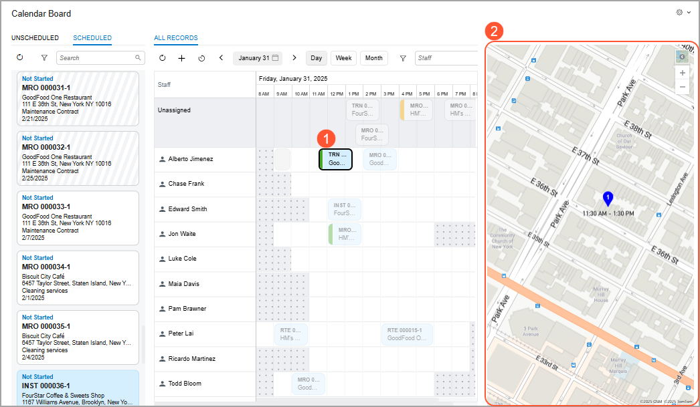

-   **View the route on the map between appointments** for the selected staff member. If you click the staff member's name on the calendar \(Item 1 below\), the system shows the route between the appointments assigned to that staff member for the selected day, based on the scheduled start times.

    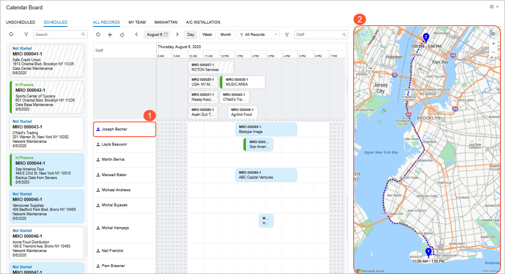

-   **View routes on the map for multiple selected staff members**. By holding the Shift or Ctrl key, you can select multiple staff members on the calendar \(Item 1 below\). The system displays the routes between their appointments for the selected day, based on the scheduled start times. Each staff member's route is identified by a distinct color \(Item 2\).

    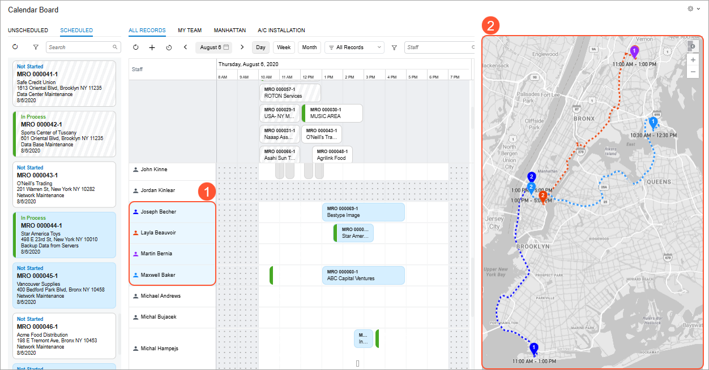

**Tip:** You can customize the map theme by selecting an icon of your favorite style in the top-right corner of the map pane.

## See Where Your Staff Members Are Right Now {#section_zch_f2h_bgc .section}

In Acumatica ERP 2026 R1, you can configure real-time GPS tracking for staff members who are using the Acumatica mobile app. With this functionality in place, the new calendar —integrated with Azure Maps —displays the current locations of staff members. This gives the field service manager a clear view of where technicians are at this moment.

You can view the current location of a staff member on the map only if the following conditions are met:

-   The **Show Location Tracking** check box is selected on the **Calendars &amp; Maps** tab on the [Service Management Preferences](FS_10_01_00.md) \(FS100100\) form.
-   A valid key is specified in the **Map API Key** box on the **Calendars &amp; Maps** tab of the [Service Management Preferences](FS_10_01_00.md) form.
-   On the **Location Tracking** tab of the [Users](SM_20_10_10.md) \(SM201010\) form, both of these are true for the user account associated with the staff member:
    -   The **Track Location** check box is selected.
    -   Working hours are specified
-   The staff member uses a mobile device with the Acumatica mobile app installed.
-   Location permissions for the Acumatica mobile app are allowed on the staff member’s mobile device.

Each selected **staff member** is displayed as an icon on the calendar, shown in a **unique**, system-assigned **color**. This color coding helps you distinguish staff members on the calendar. When a staff member is selected, the system highlights their appointments and the routes between them by using the same color as their icon, making it easier to track their schedule and daily routes.

## Smart Assignments {#section_ycd_dyf_kfc .section}

To ensure that the right staff member is assigned to the right appointment, you can control the assignment of appointments based on their skills, licenses, and service areas directly on the calendar board. This enhances service quality and reduces the risk of errors or delays. You can:

-   Assign appointments without restrictions to a staff member without checking their skills, licenses, and service areas.
-   Assign an appointment to any staff member but receive a warning when there's a skill, license, and service area mismatch.
-   Prevent appointments from being assigned to a staff member if the staff member's skills, licenses, or service areas don't match the appointment’s requirements.

Here's how it works: On the [Service Management Preferences](FS_10_01_00.md) \(FS100100\) form, you specify *Do Not Validate*, *Warn*, or *Prevent* in any \(or all\) of these boxes: **Skills**, **Service Areas**, and **Licenses** box \(see below\).

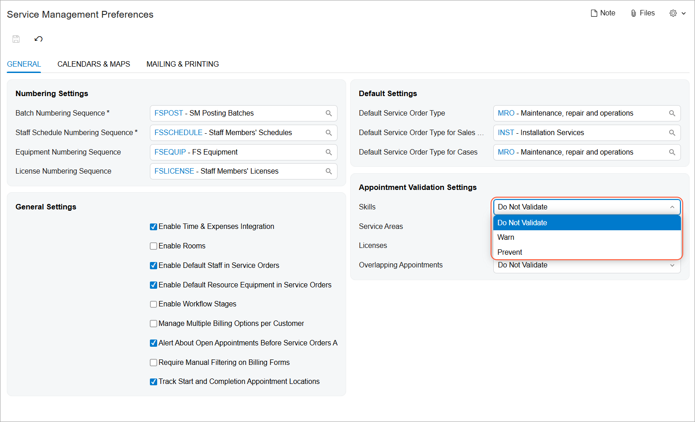

The options mean the following:

-   *Do Not Validate*: You’ll be able to assign an appointment **to any staff member** on the calendar without restrictions.
-   *Warn*: You’ll still be able to assign an appointment to any staff member, even if the skills required for the appointment services do not match the staff member’s skills. In this case, the *Skill Mismatch* **warning will appear** next to the staff member, and the staff member will be highlighted in yellow on the board \(see below\).

    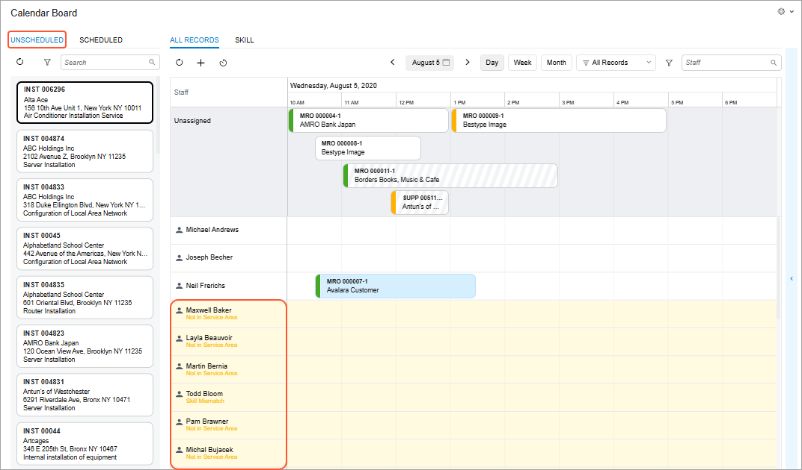

-   *Prevent*: You can assign an appointment to a staff member **only if their skills, service areas, or licenses match** the ones required for the appointment. If there’s a mismatch, the system will display the corresponding warning next to the staff member and highlight them in red on the calendar \(see below\). The system will prevent you from scheduling the appointment if the staff member doesn’t have the required skills, service areas, or licenses for the services to be scheduled.

    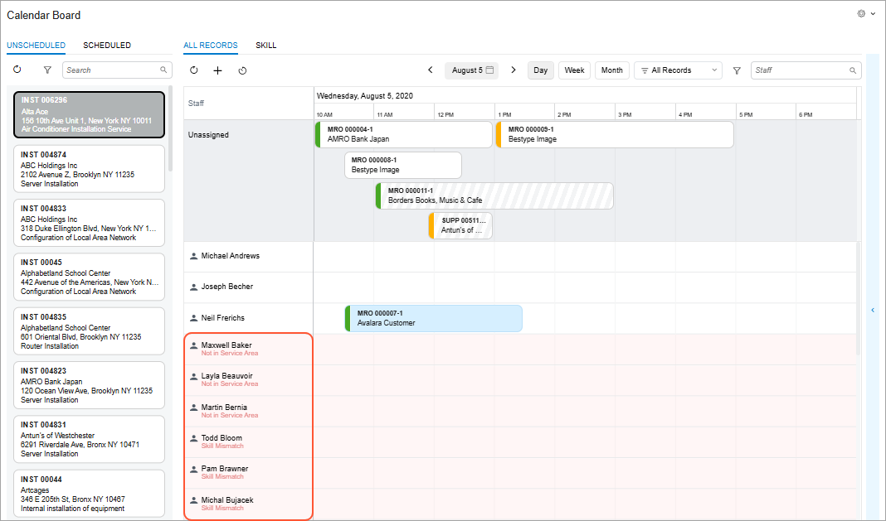

## Customized Calendar View {#section_wg1_dz4_xfc .section}

On the new [Calendar Board](FS_30_03_00.md) \(FS300300\) form, you can create customized calendar views that align with your needs. You can easily switch between different filtered views \(such as **My Team**, **All Staff**, or specific skills or branch locations\). See the following items in the example shown below:

-   Item 1: Some **filter tabs** you can create to display different calendar views.
-   Items 2 and 3: The **filter criteria** for a created filter tab.
-   Item 4: A **filtered list of staff members**, limited by the specified criteria.

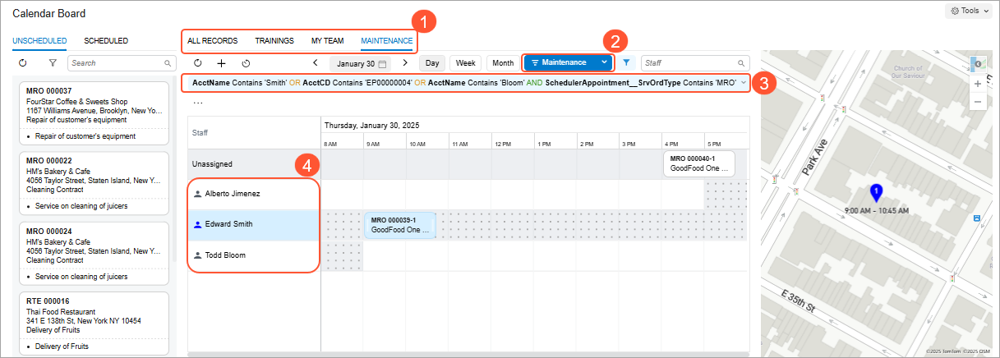

If a filter is created based on the branch and branch location settings, appointments assigned to branches not selected in the filter will still appear on the calendar board in gray. This ensures that appointments are not double-booked.

## Scheduling of the Project-Related Appointments {#section_vgm_1m2_yfc .section}

**Important:** This functionality is available when the *Projects* feature is enabled in your system.

To ensure that only the appropriate staff members are assigned to appointments linked to specific projects, based on their qualifications and project involvement, you can configure the system to determine whether a staff member can be assigned to an appointment associated with a specific project. By using the **Restrict Employee** check box on the [Projects](PM_30_10_00.md) \(PM301000\) form, you can avoid assigning the wrong staff to an appointment.

If the check box is selected, the system displays *Not in Project* next to any staff member not added to the **Employees** tab of the specified project. These staff members are highlighted in red \(shown below\), and the system will prevent you from assigning the appointment to them.

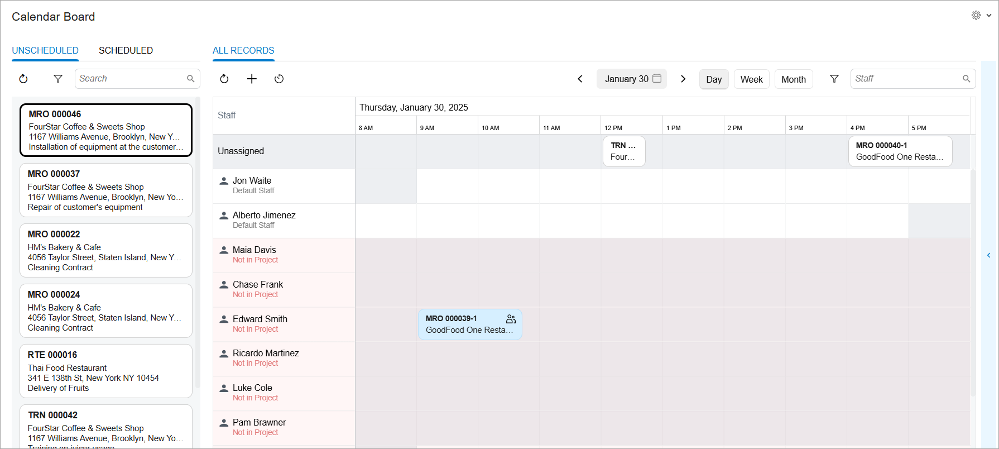

**Parent topic:**[Scheduling with Modern Calendar Board](../UserGuide/ServMgmt_Scheduling_with_Calendar_Board_mapref.md)

