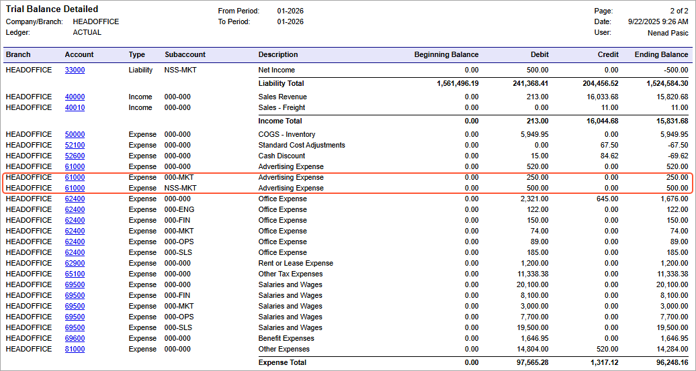

# Bill with Combined Subaccounts: Process Activity {#_e919195f-b5f4-48a0-b6c4-9da90d43a849 .task}

The following activity will walk you through the process of creating and releasing an AP bill that contains combined subaccounts.

## Story {#section_w23_njv_vxb .section}

Suppose that the SweetLife Fruits &amp; Jams company purchased billboard advertising from the Blueline Advertisement company and additional printed booklets that are not tracked in the system as non-stock items.

Acting as a SweetLife accountant, you need to create an AP bill on behalf of Bill Owen, who works in the Marketing department. You then need to release the bill and then review the balances of the involved accounts, which are broken down by subaccounts.

## Configuration Overview {#section_z23_njv_vxb .section}

In the *U100* dataset, the following tasks have been performed for the purposes of this activity:

-   On the [Companies](CS_10_15_00.md) \(CS101500\) form, the *SWEETLIFE* company has been defined.
-   On the [Branches](CS_10_20_00.md) \(CS102000\) form, the *HEADOFFICE* branch of the *SWEETLIFE* company has been created.
-   On the [Credit Terms](CS_20_65_00.md) \(CS206500\) form, the *30D - 30 Days* credit terms have been defined.
-   On the [Chart of Accounts](GL_20_25_00.md) form, the *61000 - Advertising Expense* account has been created.
-   On the [Ledgers](GL_20_15_00.md) \(GL201500\) form, the *ACTUAL* ledger has been defined.
-   On the [Vendors](AP_30_30_00.md) \(AP303000\) form, the *BLUELINE* vendor has been defined.
-   On the [Employees](EP_20_30_00.md#) \(EP203000\) form, the *EP00000015* employee \(*Bill Owen*\) has been created.
-   On the [Non-Stock Items](IN_20_20_00.md) \(IN202000\) form, the *ADVERT* and *CONSULT* non-stock items have been defined.
-   On the [Segmented Keys](CS_20_20_00.md) \(CS202000\) form, the *SUBACCOUNT* segmented key has been defined.
-   On the [Accounts Payable Preferences](AP_10_10_00.md) \(AP101000\) form, the subaccount mask to be used in AP documents has been defined.

## Process Overview {#section_df3_njv_vxb .section}

In this activity, you will create an AP bill on the [Bills and Adjustments](AP_30_10_00.md) \(AP301000\) form. In the bill, you will specify the vendor, the document details, and the owner. When the bill is ready, you will release the document. Finally, on the [Trial Balance Detailed](GL_63_25_00.md) \(GL632500\) form, you will run a report to review the balance of the *61000* account.

## System Preparation {#section_ff3_njv_vxb .section}

Before you begin performing the steps of this activity, do the following:

1.  Launch the Acumatica ERP website with the *U100* dataset preloaded, and sign in as an accountant Nenad Pasic by using the *pasic* username and the *123* password.
2.  In the info area, in the upper-right corner of the top pane of the Acumatica ERP screen, make sure that the business date in your system is set to *1/30/2026*. If a different date is displayed, click the Business Date menu button and select *1/30/2026*. For simplicity, in this process activity, you will create and process all documents in the system on this business date.
3.  On the Company and Branch Selection menu on the top pane of the Acumatica ERP screen, make sure that the *SweetLife Head Office and Wholesale Center* branch is selected. If it is not selected, click the selection menu to view the list of branches that you have access to, and then click *SweetLife Head Office and Wholesale Center*.
4.  Make sure that the *SUBACCOUNT* segmented key has been modified, as described in [Subaccounts: Implementation Activity](../ImplementationGuide/config_Subaccounts_Implem_Activity.md).
5.  Make sure that you have performed the [Combined Subaccounts: To Define a Subaccount Mask for AP Documents](../ImplementationGuide/config_Combined_Subaccounts_Implem_Activity_2.md) prerequisite activity.

## Step 1: Creating an AP Bill {#section_hf3_njv_vxb .section}

To create an AP bill to see how the combined subaccount functionality works, do the following:

1.  On the [Bills and Adjustments](AP_30_10_00.md) \(AP301000\) form, add a new record.
2.  In the Summary area, specify the following settings:
    -   **Type**: *Bill*
    -   **Vendor**: *BLUELINE*
    -   **Terms**: *30D* \(inserted by default based on the selected vendor\)
    -   **Date**: *1/30/2026* \(the current business date, which is inserted by default\)
    -   **Post Period**: *01-2026* \(inserted by default based on the selected date\)
    -   **Description**: `Advertising services`
3.  On the **Financial** tab, in the **Owner** box, select *Bill Owen*.
4.  On the **Details** tab, click **Add Row**, and specify the following settings for the added row:

    -   **Branch**: *HEADOFFICE*
    -   **Inventory ID**: *ADVERT*
    -   **Quantity**: `1.00`
    -   **Unit Cost**: `500`
    Notice that the system has inserted the *61000 - Advertising Expense* account, which is the expense account of the item, in the **Account** column for the line.

    Also, notice that the system has inserted the *NSS-MKT* subaccount in the **Subaccount** column for this row. The system has composed this expense subaccount based on the subaccount mask specified on the [Accounts Payable Preferences](AP_10_10_00.md) \(AP101000\) form, which is *III-EEE*. The first segment of the combined subaccount was copied from the non-stock item of the line \(as indicated by *III* in the mask\). The second segment was copied from the employee account \(as indicated by *EEE* in the mask\), which is *MKT* for Bill Owen, the document’s owner, indicating that he works in the Marketing department.

5.  On the **Details** tab, click **Add Row** again, and specify the following settings in the added row:

    -   **Branch**: *HEADOFFICE*
    -   **Transaction Description**: `Printed booklets`
    -   **Ext. Cost**: `250.00`
    Notice the *000-MKT* subaccount inserted in the **Subaccount** column for this row. Because no item has been specified for this row, the system inserted *000* as the first segment of the combined subaccount. The second segment, *MKT*, was again copied from the employee account of the document’s owner.

6.  On the form toolbar, click **Save**.

## Step 2: Releasing the AP Bill {#section_nf3_njv_vxb .section}

To release the bill, do the following while you are still viewing the bill on the [Bills and Adjustments](AP_30_10_00.md) \(AP301000\) form:

1.  On the form toolbar, click **Remove Hold**.
2.  On the form toolbar, click **Release** to release the bill.

    The system changes the status of the bill to *Open*.

## Step 3: Reviewing the Expense Account {#section_qf3_njv_vxb .section}

To review the balance of the *61000* account, which was used as the expense account, and check the amounts the system tracked for each subaccount, do the following:

1.  Open the [Trial Balance Detailed](GL_63_25_00.md) \(GL632500\) report form.
2.  On the **Report Parameters** tab, make sure that the following settings are specified:
    -   **Company/Branch**: *HEADOFFICE - SweetLife Head Office and Wholesale Center*
    -   **Ledger**: *ACTUAL*
    -   **From Period**: *01-2026*
    -   **To Period**: *01-2026*
    -   **Suppress Zero Balances**: Cleared
3.  On the form toolbar, click **Run Report**.
4.  In the generated report, on the report toolbar, click the **Go to Next Page** arrow button, and review the balances of the *61000* account. Notice the amount in the **Debit** column for the *000-MKT* and *NSS-MKT* subaccounts of this account \($250 and $500, respectively\), as shown in the following screenshot.

    

**Parent topic:**[Processing AP Bills with Combined Subaccounts](../UserGuide/Finance_APBills_w_Combined_Subacc_Mapref.md)

