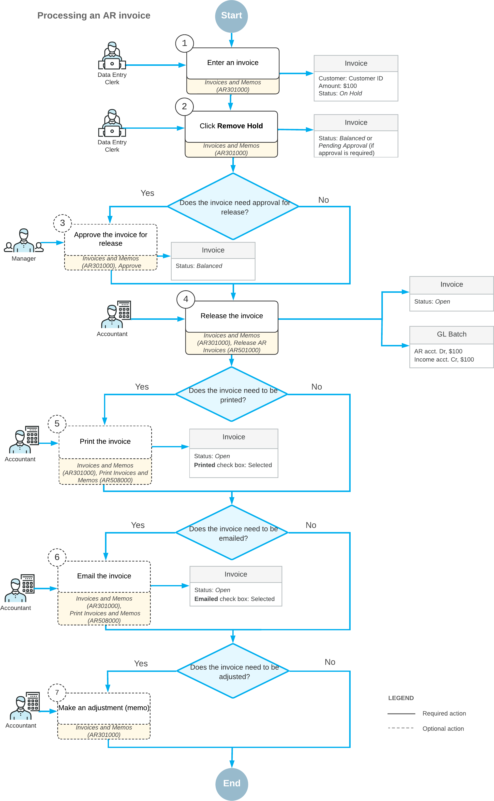
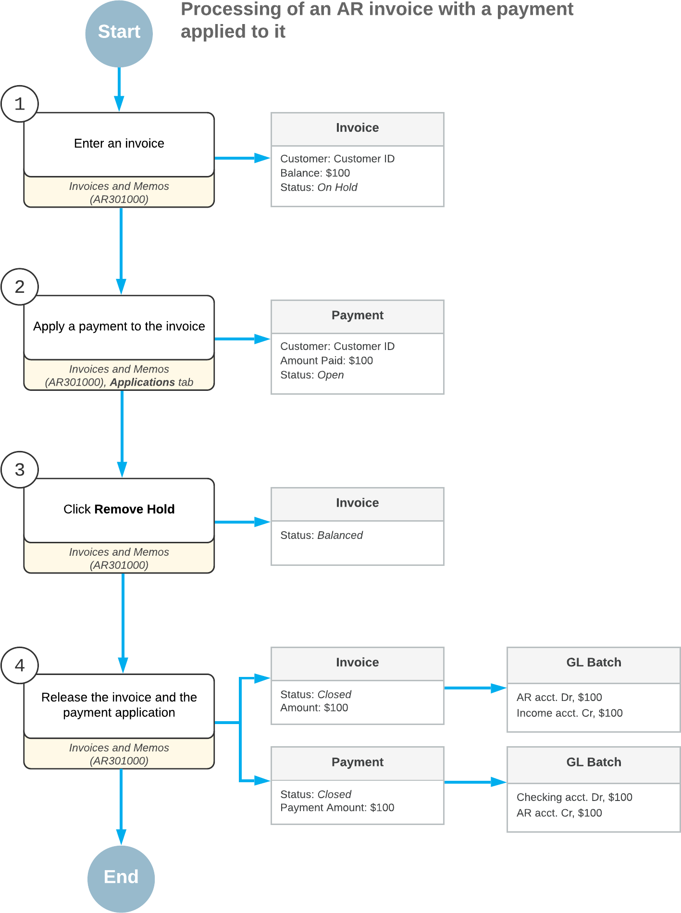

# AR Invoices: General Information {#_1474c546-53f9-499c-9ef3-88c2c69a893e .concept}

An invoice is a request for payment for goods sold or services rendered. In Acumatica ERP, an accounts receivable invoice contains the quantities and costs of the products or services that have been provided by your company, as well as the due date by which the customer should send payment for the goods or services that have been purchased.

In this chapter, you will read about the processes that result in invoice creation, the groups of settings that make up an AR invoice, and the way the system uses the settings of the related entities to automatically fill in settings for the invoice, thus saving you time.

## Learning Objectives {#section_oxm_4jv_vxb .section}

In this chapter, you will learn how to do the following:

-   Create an AR invoice
-   Release the AR invoice
-   Create an AR invoice and apply a payment to it
-   Release the AR invoice and the payment application

## Applicable Scenarios {#section_rxm_4jv_vxb .section}

You create an invoice manually when you need to enter an AR invoice for a particular customer into the system; the system can create invoices automatically as a result of other processes as well. You then release the invoice that you have created and complete its processing in the system.

You create an invoice and apply a payment \(or another document such as a prepayment or credit memo\) to it if a payment or prepayment has been already received from a customer.

## Ways an Invoice Can Be Created {#section_uxm_4jv_vxb .section}

In Acumatica ERP, a user can manually enter an accounts receivable invoice by using the [Invoices and Memos](AR_30_10_00.md) \(AR301000\) form. For step-by-step instructions on recording an invoice manually, see [AR Invoices: To Create an AR Invoice](Finance_ARInvoices_Process_Activity.md).

An invoice can also be generated by the system \(and is available for editing and processing on the same form\) as a result of the following processes:

-   Billing of a contract, as described in [Contract Billing: General Information](Billing_Contracts_Contract_Billing_GeneralInfo.md)
-   Billing of a project, as described in [Project Billing Preparation: General Information](Projects_Project_Billing_Preparation_GeneralInfo.md)
-   Processing of a sales invoice, as described in [Processing Sales of Stock Items](OrderMgmt_Sale_of_Stock_Items_Mapref.md)
-   Scheduling of a recurring invoice, as described in [Recurring AR Documents: Process Activity](Finance_Creating_Recurring_ARDocuments_Activity.md)
-   Uploading the details of invoices from an Excel file

## Settings of an AR Invoice {#section_xxm_4jv_vxb .section}

On the [Invoices and Memos](AR_30_10_00.md) \(AR301000\) form, most primary settings of an AR invoice fit into the following categories:

-   *Summary settings*: The settings in the Summary area of the form define the general information used when the invoice is processed. When you create a new document, the system inserts the current business date and the corresponding post period automatically.
-   *Processing settings*: This group of settings, which are found on all tabs of the form except **Details**, define how the invoice is to be processed further and how the taxes and sales commissions are to be calculated. The system fills in the values for these settings automatically when you select a customer account, but most default settings can be overridden before the invoice is released.
-   *Document details*: Each product or service that you sell to the customer is specified in a separate line of the **Details** tab. An invoice may have one line or multiple lines. Each line includes settings that define the item to be sold, the sales account used for the transaction, the tax category, and the line discount.

    When you add a line, the system uses the values from the customer account to automatically fill in the default sales account, tax category, and salesperson. For each line, you can specify a non-stock item or stock item and the quantity to be sold. If you select an item, the system automatically fills in the unit price of the item and then calculates the total price and the applicable taxes and discounts.

## Statuses of AR Invoices During Processing {#section_aym_4jv_vxb .section}

During processing, an invoice can have the following statuses:

-   *On Hold*: The invoice is being edited and cannot be released. You can apply another document \(a payment, prepayment, or credit memo\) to the invoice.
-   *Credit Hold*: The system has performed credit verification and has placed the document on credit hold because the validation has failed. If the document has this status, the **Remove Credit Hold** action becomes available on the form toolbar.
-   *Balanced*: The invoice is ready to be released or scheduled. You can apply another document \(a payment, prepayment, or credit memo\) to the invoice.
-   *Pending Print*: The invoice is ready and must be printed before it can be released. You can schedule an invoice that has the *Pending Print* status, if needed. You should print invoices to send them to the customer before release if the **Require Invoice/Memo Printing Before Release** check box is selected on the [Accounts Receivable Preferences](AR_10_10_00.md) \(AR101000\) form and the settings of the customer require the printing of these documents—that is, the **Print Invoices** check box is selected on the [Customers](AR_30_30_00.md) \(AR303000\) form. For customers with this check box selected, each invoice that is created and is not on hold is assigned the *Pending Print* status. After you have printed the document, its status is changed to *Balanced*, and you can release it if the invoice should not be emailed.
-   *Pending Email*: The invoice is ready and must be sent by email before it can be released. You can schedule an invoice that has the *Pending Email* status, if needed. You should email invoices to the customer before release if the **Require Invoice/Memo Emailing Before Release** check box is selected on the [Accounts Receivable Preferences](AR_10_10_00.md) form and the settings of the customer require emailing of these documents—that is, the **Send Invoices by Email** check box is selected on the [Customers](AR_30_30_00.md) \(AR303000\) form. For customers with this check box selected, each invoice that is created and is not on hold is assigned the *Pending Email* status. After you have emailed the document, its status is changed to *Balanced*, and you can release it.
-   *Pending Approval*: The document needs to be approved by the responsible approvers, which are assigned according to the approval map specified on the **Approval** tab of the [Accounts Receivable Preferences](AR_10_10_00.md) form.
-   *Rejected*: The document has been rejected by at least one assigned approver. A user can delete a document with this status or click the **Hold** button on the form toolbar, edit the document, and again submit it for approval.
-   *Open*: The invoice has been released. This status indicates that the document has an outstanding balance to be paid by the customer. The invoice retains the *Open* status until the customer has paid the full balance of the invoice.
-   *Reserved*: The document has been released and then put on hold to be temporarily excluded from processing.
-   *Closed*: The full balance of the invoice has been paid, and the document balance is zero.
-   *Scheduled*: The invoice is a template for generating recurring invoices according to a schedule. Based on the template, the system generates recurring invoices, which can be edited and then released. The scheduled invoice itself cannot be released; it can be edited as a template.
-   *Voided*: The previously scheduled invoice is no longer being used as a template for generating recurring invoices.

## Release of an Invoice {#section_cym_4jv_vxb .section}

In Acumatica ERP, when you release an invoice, the system does the following:

-   Changes the status of the invoice to *Open* if another document has not been fully applied to it, so it appears in the list of the customer's outstanding documents. In an open invoice, you can edit the cash discount date and the due date until the document is settled.

    If another document \(payment, prepayment, or credit memo\) has been applied in full to the invoice, changes the status of the invoice to *Closed*. In this case, the customer's balance is decreased by the amount of the applied payment or prepayment.

-   Increases the outstanding balance to be paid by the customer.
-   Generates a GL batch of transactions to update the asset and income accounts.

**Tip:** A document with the *Credit Memo* type can be also released manually on the [Invoices and Memos](AR_30_10_00.md) \(AR301000\) form, but the release of a credit memo affects the balances of GL accounts and customers differently. For details, see [AR Invoice Correction: General Information](Finance_CorrectingARInvoices_GeneralInfo.md).

You can release an invoice only if it has the *Balanced* status.

## Invoice Processing Overview {#section_hym_4jv_vxb .section}

This section provides an overview of the processing of an AR invoice in Acumatica ERP. The diagram below shows the processing actions, the employees who generally perform them, and the involved forms and documents. For details, see [AR Invoices: To Create an AR Invoice](Finance_ARInvoices_Process_Activity.md).

When a data entry clerk creates a new invoice \(see 1 on the diagram below\), the invoice has the *On Hold* status if the **Hold Documents on Entry** check box is selected on the [Accounts Receivable Preferences](AR_10_10_00.md) \(AR101000\) form or approvals are set up for AR invoices. When the invoice is ready, the clerk has to click the **Remove Hold** button on the form toolbar to give the invoice the *Balanced* status \(2 on the diagram\) so that it can be released. If the invoice requires approval, an assigned employee approves the invoice \(3\) and the invoice is ready to be released. When the accountant releases the invoice \(4\), the system assigns it the *Open* status \(pending customer payment\) and generates a batch to debit the accounts receivable account and credit the income account in the amount of the invoice. The system also updates the customer balance by this amount. The accountant can print the open document \(5\) and can send it to the customer by email \(6\) if the settings in the system require this. The amount of the invoice cannot be edited once the invoice is open. If the accountant needs to correct the balance of the open invoice, this employee can make an adjustment \(7\) or reverse the invoice.

The following diagram illustrates the processing workflow for invoices.

The following diagram illustrates the processing of an invoice with a payment applied to it. For details, see [AR Invoices: To Create an AR Invoice and Apply a Payment to It](Finance_ARInvoices_Process_Activity2.md).

**Parent topic:**[Processing AR Invoices](../UserGuide/Finance_ARInvoices_Mapref.md)

