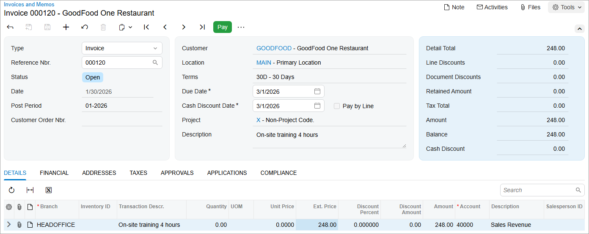

# AR Invoices: To Create an AR Invoice {#_ccf2a101-5493-43d8-8d28-ccb906ce8150 .task}

The following activity will walk you through the process of creating and releasing an AR invoice.

**Attention:** This activity is based on the *U100* dataset. If you are using another dataset or if any system settings have been changed in *U100*, these changes can affect the workflow of the activity and the results of the processing. To avoid issues, restore the *U100* dataset to its initial state.

## Story {#section_vdn_4jv_vxb .section}

Suppose that today the GoodFood One Restaurant purchased four hours of on-site training from the SweetLife Fruits &amp; Jams company for the amount of $248. Acting as a SweetLife accountant, you need to create an AR invoice for the customer and release the invoice.

## Configuration Overview {#section_xdn_4jv_vxb .section}

For the purposes of this activity, the following features have been enabled on the [Enable/Disable Features](CS_10_00_00.md) \(CS100000\) form:

-   *Standard Financials*, which provides the standard financial functionality
-   *Multibranch Support*, which supports multiple branches in your instance of Acumatica ERP
-   *Multicompany Support*, which supports multiple companies within one tenant

On the [Accounts Receivable Preferences](AR_10_10_00.md) \(AR101000\) form, the **Hold Documents on Entry** check box has been selected in the **Data Entry Settings** section.

On the [Customers](AR_30_30_00.md) \(AR303000\) form, the *GOODFOOD \(GoodFood One Restaurant\)* customer has been configured.

## Process Overview {#section_b2n_4jv_vxb .section}

In this activity, you will create an invoice for the customer purchase on the [Invoices and Memos](AR_30_10_00.md) \(AR301000\) form. In the invoice, you will specify all relevant settings, including the customer and the credit terms, and the document details on the **Details** tab. When the invoice is ready, you will release the document.

## System Preparation {#section_d2n_4jv_vxb .section}

To prepare the system, do the following:

1.  Launch the Acumatica ERP website, and sign in to a company with the *U100* dataset preloaded. To sign in as an accountant, use the following credentials:
    -   Username: *johnson*
    -   Login: *123*
2.  In the info area, in the upper-right corner of the top pane of the Acumatica ERP screen, make sure that the business date in your system is set to *1/30/2026*. If a different date is displayed, click the Business Date menu button and select *1/30/2026*. For simplicity, in this process activity, you will create and process all documents in the system on this business date.
3.  On the Company and Branch Selection menu, also on the top pane of the Acumatica ERP screen, make sure that the *SweetLife Head Office and Wholesale Center* branch is selected. If it is not selected, click the Company and Branch Selection menu to view the list of branches that you have access to, and then click *SweetLife Head Office and Wholesale Center*.

## Step 1: Creating an AR Invoice {#section_f2n_4jv_vxb .section}

To create an AR invoice, do the following:

1.  Open the [Invoices and Memos](AR_30_10_00.md) \(AR301000\) form.

    **Tip:** To open the form for creating a new record, type the form ID in the Search box, and on the Search form, point at the form title and click **New** right of the title.

2.  Click **Add New Record** on the form toolbar, and specify the following settings in the Summary area:
    -   **Type**: *Invoice*
    -   **Customer**: *GOODFOOD*
    -   **Terms**: *30D* \(inserted by default based on the selected customer\)
    -   **Date**: *1/30/2026* \(the current business date, which is inserted by default\)
    -   **Post Period**: *01-2026* \(inserted by default based on the selected date\)
    -   **Description**: `On-site training 4 hours`
3.  On the **Details** tab, click **Add Row**, and specify the following settings for the added row:
    -   **Branch**: *HEADOFFICE* \(inserted by default\)
    -   **Transaction Descr.**: `On-site training 4 hours`
    -   **Ext. Price**: `248`
4.  On the form toolbar, click **Save**.

## Step 2: Releasing the AR Invoice {#section_i2n_4jv_vxb .section}

To release the AR invoice, do the following:

1.  While you are still on the [Invoices and Memos](AR_30_10_00.md) \(AR301000\) form, click **Remove Hold** on the form toolbar.

    The system changes the status of the invoice to *Balanced*. You can release an invoice only if it has this status.

2.  On the form toolbar, click **Release**.

    The system changes the status of the invoice to *Open*. The released invoice is shown in the following screenshot.

    

## Step 3: Reviewing the GL Transaction Generated when the Invoice Is Released {#section_q2n_4jv_vxb .section}

To review the GL transaction generated on invoice release, do the following:

1.  On the [Invoices and Memos](AR_30_10_00.md) \(AR301000\) form with the invoice opened, open the **Financial** tab, and click the link in the **Batch Nbr.** box.

    When you released the invoice, the system generated and released this batch in the general ledger. The system assigned the batch the next number in the sequence specified in the **GL Batch Numbering Sequence** box on the [Accounts Receivable Preferences](AR_10_10_00.md) \(AR101000\) form, which determines the numbers assigned to batches generated from the accounts receivable subledger.

2.  On the [Journal Transactions](GL_30_10_00.md) \(GL301000\) form, which is opened, review the transaction that has been generated on the release of the invoice.

    The *11000 \(Accounts Receivable\)* AR account specified in the invoice has been debited with $248, while the *40000 \(Sales Revenue\)* income account has been credited in the same amount.

**Parent topic:**[Processing AR Invoices](../UserGuide/Finance_ARInvoices_Mapref.md)

