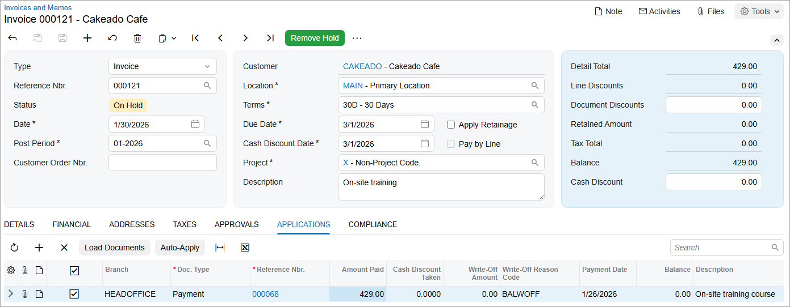

# AR Invoices: To Create an AR Invoice and Apply a Payment to It {#_98ae7b16-40ff-4829-b480-c32f819ad61b .task}

The following activity will walk you through the process of creating an AR invoice, applying a payment to it, and releasing the invoice and its application.

**Attention:** This activity is based on the *U100* dataset. If you are using another dataset or if any system settings have been changed in *U100*, these changes can affect the workflow of the activity and the results of the processing. To avoid issues, restore the *U100* dataset to its initial state.

## Story {#section_hfn_4jv_vxb .section}

Suppose that on January 26, 2026, Cakeado Cafe made a payment of $429 to SweetLife Fruits &amp; Jams for a training course that its employees were going to take on January 30, 2026. Acting as a SweetLife accountant, you need to create an AR invoice for the customer, apply the payment to it, and release the invoice and the payment application.

## Configuration Overview {#section_tz4_djx_cnb .section}

In the *U100* dataset, the following configuration tasks have been performed to prepare the system for this activity to be performed:

-   On the [Enable/Disable Features](CS_10_00_00.md) \(CS100000\) form, the *Standard Financials*, *Multibranch Support*, and *Multicompany Support* features have been enabled.
-   On the [Accounts Receivable Preferences](AR_10_10_00.md) \(AR101000\) form, the **Hold Documents on Entry** check box has been selected in the **Data Entry Settings** section.
-   On the [Customers](AR_30_30_00.md) \(AR303000\) form, the *CAKEADO \(Cakeado Cafe\)* customer has been configured.

## Process Overview {#section_kfn_4jv_vxb .section}

In this activity, on the [Invoices and Memos](AR_30_10_00.md) \(AR301000\) form, you will create an AR invoice, and apply a payment to it. You will then release the invoice and the payment application to close both the invoice and the payment. On the [Payments and Applications](AR_30_20_00.md) \(AR302000\) form, you will review the payment to make sure that its status is *Closed*.

## System Preparation {#section_mfn_4jv_vxb .section}

To prepare the system, do the following:

1.  Launch the Acumatica ERP website, and sign in to a company with the *U100* dataset preloaded. You should sign in as Anna Johnson by using the *johnson* username and the *123* password.
2.  In the info area at the upper-right corner of the top pane of the Acumatica ERP screen, make sure that the business date is set to *1/30/2026*. If a different date is displayed, click the Business Date menu button and select *1/30/2026* from the calendar. For simplicity, you'll create and process all documents in this activity using this business date.
3.  On the Company and Branch Selection menu, on the top pane of the Acumatica ERP screen, select the *SweetLife Head Office and Wholesale Center* branch.

## Step 1: Creating an AR Invoice {#section_ofn_4jv_vxb .section}

To create an AR invoice, do the following:

1.  Open the [Invoices and Memos](AR_30_10_00.md) \(AR301000\) form.

    **Tip:** To open the form for creating a new record, type the form ID in the Search box, and on the Search form, point at the form title and click **New** right of the title.

2.  On the form toolbar, click **Add New Record**.
3.  Specify the following settings in the Summary area:
    -   **Type**: *Invoice*
    -   **Customer**: *CAKEADO*
    -   **Terms**: *30D* \(inserted by default based on the selected customer\)
    -   **Date**: *1/30/2026* \(the current business date, which is inserted by default\)
    -   **Post Period**: *01-2026* \(inserted by default based on the selected date\)
    -   **Description**: `On-site training`
4.  On the **Details** tab, click **Add Row** on the table toolbar.
5.  Specify the following settings for the added row:
    -   **Branch**: *HEADOFFICE* \(inserted by default\)
    -   **Transaction Descr.**: `On-site training`
    -   **Ext. Price**: `429`
6.  On the form toolbar, click **Save**.

The invoice has been saved with the *On Hold* status.

## Step 2: Applying the Payment to the Invoice {#section_sfn_4jv_vxb .section}

To apply the payment that has been already created in the system to the invoice, do the following:

1.  While you are still on the [Invoices and Memos](AR_30_10_00.md) \(AR301000\) form with the invoice opened, on the **Applications** tab, click **Add Row** on the table toolbar.
2.  In the added row, specify the following settings:
    -   **Doc. Type**: *Payment*
    -   **Reference Nbr.**: A payment for $429 dated 1/26/2026
    -   **Amount Paid**: `429`
3.  On the form toolbar, click **Save**.

    The following screenshot illustrates the unreleased AR invoice to which the payment has been applied.

    

## Step 3: Releasing the Invoice and Payment Application {#section_vfn_4jv_vxb .section}

To release the invoice and its application to the payment, do the following:

1.  While you are still on the [Invoices and Memos](AR_30_10_00.md) \(AR301000\) form, click **Remove Hold** on the form toolbar. The system changes the status of the invoice to *Balanced*.
2.  On the form toolbar, click **Release**. The system changes the status of the invoice to *Closed* because it has been fully applied to the payment.
3.  On the **Applications** tab, click the link in the **Reference Nbr.** column for the payment. The system opens the payment on the [Payments and Applications](AR_30_20_00.md) \(AR302000\) form.
4.  Notice that the payment's status is *Closed*, because it has been fully applied to the invoice.

**Parent topic:**[Processing AR Invoices](../UserGuide/Finance_ARInvoices_Mapref.md)

