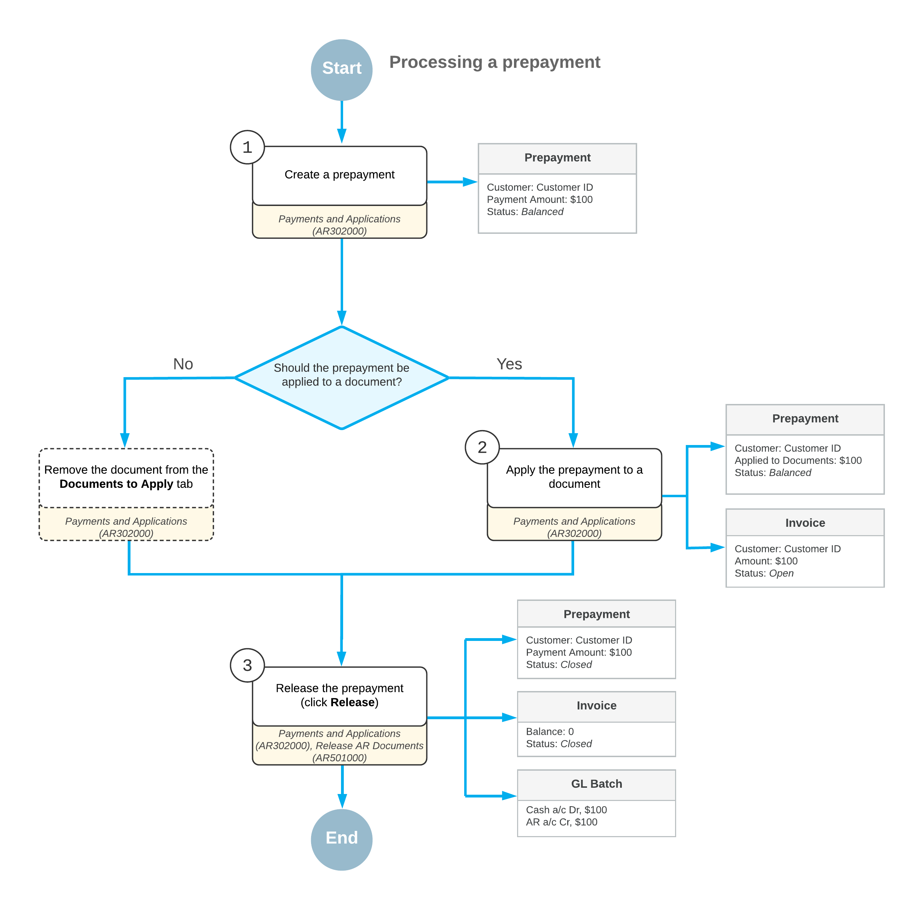

# Invoice Prepayments: General Information {#_e2bac985-0856-4c34-96c6-6b5605772cba .concept}

A *prepayment* is a type of manual AR document \(that is, a document created by a user\) that records a company's financial relationship with customers. You use this document type if you want to distinguish customer payments from prepayments. The system displays the sum of all open customer payment documents with the *Prepayment* type separately in the **Prepayment Balance** box on the [Customers](AR_30_30_00.md) \(AR303000\) form. You can apply outstanding documents to a prepayment before or after you release it.

**Tip:** The customer prepayment balance is displayed with a minus sign in the **Prepayment Balance** box on the [Customers](AR_30_30_00.md) form.

You use the [Payments and Applications](AR_30_20_00.md) \(AR302000\) form to create and process a document of this type.

To identify prepayments, the system uses the numbering sequence specified in the **Payment Numbering Sequence** box on the **General** tab of the [Accounts Receivable Preferences](AR_10_10_00.md) \(AR101000\) form.

**Attention:** If the **Manual Numbering** check box is selected for the specified numbering sequence on the [Numbering Sequences](../Shared/../UserGuide/CS_20_10_10.md) \(CS201010\), the system validates each new reference number you enter in order to prevent the creation of payments and prepayments with the same reference number.

## Learning Objectives {#section_vdp_4jv_vxb .section}

From reading the topics in this chapter and completing the process activities, you will learn how to do the following:

-   Enter a prepayment
-   Apply the prepayment to an AR invoice
-   Reverse an application of a prepayment to the wrong invoice

## Applicable Scenarios {#section_ydp_4jv_vxb .section}

Prepayments can be created in the following cases:

-   When you received a prepayment from a customer without applying it to any outstanding document
-   When you want to enter a prepayment and apply it to AR documents

## Workflow of Processing a Prepayment {#section_a2p_4jv_vxb .section}

This section provides an overview of the processing of a prepayment in Acumatica ERP. The diagram below shows the processing actions and the involved forms and documents.

Prepayment processing includes the following steps.

1.  A user creates a prepayment from a customer on the [Payments and Applications](AR_30_20_00.md) \(AR302000\) form, and the system assigns the prepayment document the *Balanced* status.
2.  The user applies the created prepayment to a document or multiple documents that the system has loaded on the **Documents to Apply** tab.

    If the prepayment should not be applied to any documents, the user clicks **Delete Row** on the **Documents to Apply** tab to remove the documents.

3.  The user releases the prepayment and its application to the document by clicking **Release** on the [Payments and Applications](AR_30_20_00.md) form.

The following diagram illustrates the workflow of processing a prepayment.

**Parent topic:**[Processing Prepayments](../UserGuide/Finance_ARProcessing_Prepayments_Mapref.md)

