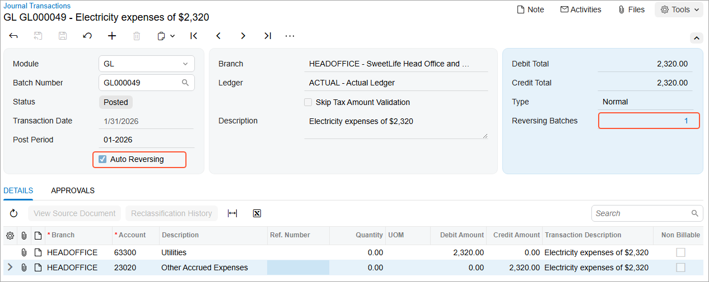

# Adjusting Transactions: Process Activity {#_49bcaea1-3f1d-4ceb-924f-84fbba1cc3f3 .task}

In this activity, you will learn how to process an auto-reversing batch.

**Attention:** This activity is based on the *U100* dataset. If you are using another dataset or if any system settings have been changed in *U100*, these changes can affect the workflow of the activity and the results of the processing. To avoid issues, restore the *U100* dataset to its initial state.

## Story {#section_clh_mjv_vxb .section}

Suppose that by the end of January 2026, the electricity used by the SweetLife Head Office and Wholesale Center in January has not yet been billed by the vendor. Acting as a SweetLife accountant, you need to create an auto-reversing batch for the amount of $2,320, which will be posted on January 31 and reversed at the beginning of the next financial period.

## Process Overview {#section_elh_mjv_vxb .section}

In this activity, to process an auto-reversing batch, you will create and release an auto-reversing batch on the [Journal Transactions](GL_30_10_00.md) \(GL301000\) form, and then check the ending balance the [Account Details](GL_40_40_00.md) \(GL404000\) form.

## System Preparation {#section_glh_mjv_vxb .section}

To prepare the system, do the following:

1.  Launch the Acumatica ERP website with the *U100* dataset. Sign in as an accountant by using the following credentials:
    -   Username: *johnson*
    -   Password: *123*
2.  In the info area, in the upper-right corner of the top pane of the Acumatica ERP screen, make sure that the business date in your system is set to *1/31/2026*. If a different date is displayed, click the Business Date menu button and select *1/31/2026*. For simplicity, in this lesson, you will create and process all documents in the system on this business date.
3.  On the Company and Branch Selection menu, also on the top pane of the Acumatica ERP screen, make sure that the *SweetLife Head Office and Wholesale Center* branch is selected. If it is not selected, click the Company and Branch Selection menu to view the list of branches that you have access to, and then click *SweetLife Head Office and Wholesale Center*.

## Step 1: Creating and Releasing an Auto-Reversing Batch {#section_ilh_mjv_vxb .section}

To process an auto-reversing batch, do the following:

1.  Open the [Journal Transactions](GL_30_10_00.md) \(GL301000\) form, and create a new record.
2.  In the Summary area, specify the following settings:
    -   **Transaction Date**: *1/31/2026* \(inserted by default\)
    -   **Post Period**: *01-2026* \(inserted by default\)
    -   **Description**: `Electricity expenses of $2,320`
    -   **Auto Reversing**: Selected
3.  On the table toolbar of the **Details** tab, click **Add Row** and specify the following settings for the added row:
    -   **Branch**: *HEADOFFICE* \(inserted by default\)
    -   **Account**: *63300 - Utilities*
    -   **Debit Amount**: `2320`
4.  Click **Add Row** again and add another row with the following settings:
    -   **Branch**: *HEADOFFICE* \(inserted by default\)
    -   **Account**: *23020 - Other Accrued Expenses*
    -   **Credit Amount**: `2320`
5.  Click **Save** on the form toolbar, and note that the status of the batch is *On Hold*.
6.  On the form toolbar, click **Remove Hold** and save the batch. The batch's status has changed to *Balanced*.
7.  On the form toolbar, click **Release** to release the batch.

    This causes the original batch to be posted. The system has also generated a new batch with the next sequential number and posted the batch to the first day of the next financial period. The released batch is shown in the following screenshot.

    

8.  In the **Reversing Batches** box of the Summary area, click *1* \(the number of the reversing batches\).

    The system opens the [GL Reversing Batches](GL_69_00_10.md) \(GL690010\) report with the created reversing batch and its details.

## Step 2: Reviewing the Posted Transaction {#section_mlh_mjv_vxb .section}

To review the account balance and the posted transactions, do the following:

1.  Open the [Account Details](GL_40_40_00.md) \(GL404000\) form.
2.  In the **Period Range** boxes of the Summary area, select *01-2026* to *02-2026*.
3.  In the **Account** box, select *23020 - Other Accrued Expenses*.
4.  In the table, review the account's ending balance in the **Ending Balance** column for both periods.
5.  In the **Account** box, select *63300 - Utilities*.
6.  In the table, review the account's ending balance in the **Ending Balance** column for both periods.

**Parent topic:**[Processing Adjusting Transactions](../UserGuide/Finance_Adjusting_Transactions_Mapref.md)

