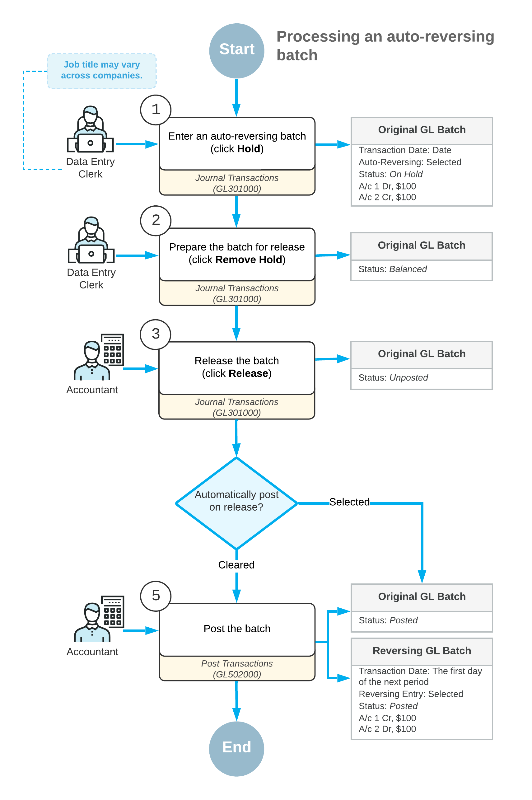

# Adjusting Transactions: General Information {#_9266ecdd-2dfd-4a6f-9ab1-7ae826b8303c .concept}

At the end of the period, you may need to post some adjusting transactions to adjust income and expense accounts. In Acumatica ERP, for this purpose, you create auto-reversing batches that are reversed at the beginning of the next period.

## Learning Objectives {#section_jgh_mjv_vxb .section}

You will learn how to create an auto-reversing batch in the system.

## Applicable Scenarios {#section_lgh_mjv_vxb .section}

You create an auto-reversing batch if you need to post a batch at the current period and reverse these entries at the beginning of the next period. For example, you create auto-reversing batches in the following cases:

-   When you record accrual-type adjusting entries
-   When you revalue in the base currency the accounts maintained in foreign currencies at the end of the period, and the adjusting entries are posted to the unrealized gain and loss accounts

## Creation of Auto-Reversing Batches {#section_ngh_mjv_vxb .section}

You create an auto-reversing batch on the [Journal Transactions](GL_30_10_00.md) \(GL301000\) form. At the beginning of the next period, the system automatically creates the reversing batch as follows:

-   All transactions are reversed—that is, each debit entry is reversed as a credit entry and each credit entry is reversed as a debit entry.

    **Attention:** On the [Journal Transactions](GL_30_10_00.md) form, the **Reversing Entry** check box is selected for the reversing batches.

-   The first day of the next financial period is set as the date of the reversing transactions.
-   Each reversing transaction has the *Posted* status.

**Attention:** The financial periods for which auto-reversing transactions will be created and the next periods must have a status of *Open*.

## Workflow of Processing Auto-Reversing Batches {#section_rgh_mjv_vxb .section}

The typical processing workflow of auto-reversing batches involves the actions and generated batches shown in the following diagram.

**Parent topic:**[Processing Adjusting Transactions](../UserGuide/Finance_Adjusting_Transactions_Mapref.md)

