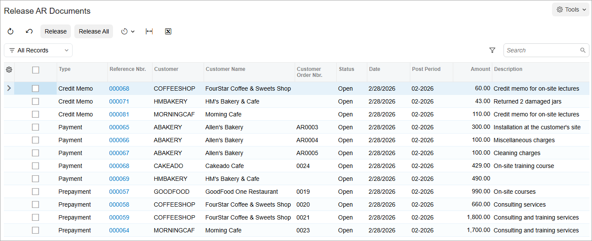
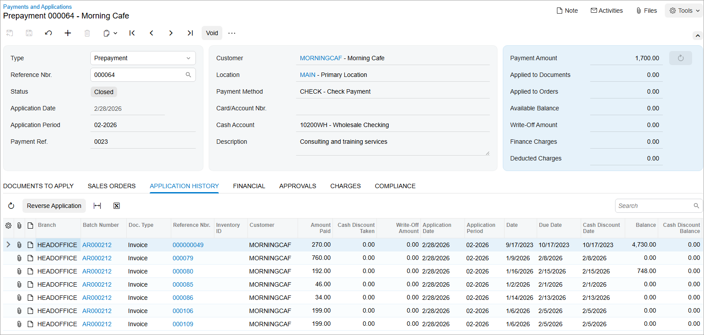

# Auto-Applying Payments: Process Activity {#_648d7f92-c928-4499-bd82-6acc2f3f2a3a .task}

The following activity will walk you through the process of configuring autoapplication of open payments and prepayments to documents, and of including credit memos to the autoapplication.

**Attention:** This activity is based on the *U100* dataset. If you are using another dataset or if any system settings have been changed in *U100*, these changes can affect the workflow of the activity and the results of the processing. To avoid issues, restore the *U100* dataset to its initial state.

## Story {#section_bfq_4jv_vxb .section}

Suppose that the SweetLife Fruits &amp; Jams company wants to introduce the autoapplication process to automatically apply open payments and prepayments to outstanding invoices and memos received from all its customers.

Acting as a SweetLife accountant, you want to set up the automatic application of the open payments and prepayments from the customers of the *EOM* statement cycle to open documents, and also include credit memos in the autoapplication process.

## Configuration Overview {#section_efq_4jv_vxb .section}

For the purposes of this lesson, the following features have been enabled on the [Enable/Disable Features](CS_10_00_00.md) \(CS100000\) form:

-   *Standard Financials*, which provides the standard financial functionality
-   *Multibranch Support*, which supports multiple branches in your instance of Acumatica ERP
-   *Multicompany Support*, which supports multiple companies within one tenant

On the [Customers](AR_30_30_00.md) \(AR303000\) form, for multiple customers, the *End of Month* statement cycle has been configured on the [Statement Cycles](AR_20_28_00.md) \(AR202800\) form, which has then been selected in the **Statement Cycle ID** box in the **Financial Settings** section on the **Financial** tab of the [Customers](AR_30_30_00.md) form.

## Process Overview {#section_hfq_4jv_vxb .section}

In this activity, you will run the autoapplication process on the [Auto-Apply Payments](AR_50_60_00.md) \(AR506000\) form. When the process is complete, you will review the list of the payments being applied on the [Release AR Documents](AR_50_10_00.md) \(AR501000\) form, review the applications generated for a particular prepayment on the [Payments and Applications](AR_30_20_00.md) \(AR302000\) form, and release the applications on the [Release AR Documents](AR_50_10_00.md) form.

## System Preparation {#section_jfq_4jv_vxb .section}

To prepare the system, do the following:

1.  Launch the Acumatica ERP website, and sign in as an accountant by using the following credentials:
    -   Username: *johnson*
    -   Password: *123*
2.  In the info area, in the upper-right corner of the top pane of the Acumatica ERP screen, make sure that the business date in your system is set to *2/28/2026*. If a different date is displayed, click the Business Date menu button and select *2/28/2026*.
3.  On the Company and Branch Selection menu, also on the top pane of the Acumatica ERP screen, make sure that the *SweetLife Head Office and Wholesale Center* branch is selected. If it is not selected, click the Company and Branch Selection menu to view the list of branches that you have access to, and then click *SweetLife Head Office and Wholesale Center*.

## Step 1: Running Automatic Payment Application {#section_lfq_4jv_vxb .section}

To run automatic payment application, do the following:

1.  Open the [Auto-Apply Payments](AR_50_60_00.md) \(AR506000\) form.
2.  In the Selection area, specify the following parameters:
    -   **Application Date**: *2/28/2026* \(inserted by default\)
    -   **Apply Credit Memos**: Selected
    -   **Release Batch When Finished**: Cleared
3.  In the table, select the unlabeled check box for the *EOM* statement cycle and, on the form toolbar, click **Process**.
4.  In the **Processing** pop-up window, which is opened, make sure that the processing ended successfully and click **Close**.

## Step 2: Reviewing the List of Applications {#section_nfq_4jv_vxb .section}

To review the list of applications, do the following:

1.  Open the [Release AR Documents](AR_50_10_00.md) \(AR501000\) form.
2.  In the table, review the list of documents that have the *Open* status, as shown in the following screenshot.

    

3.  Locate the prepayment for the Morning Cafe customer in the amount of $1,700 and click the link in the **Reference Nbr.** column.
4.  On the **Documents to Apply** tab of the [Payments and Applications](AR_30_20_00.md) \(AR302000\) form that opens, review the list of invoices to which the prepayment will be applied.
5.  To review the application for a credit memo, on the [Release AR Documents](AR_50_10_00.md) form, click the link in the **Reference Nbr.** column for the row with the $110 credit memo of the *MORNINFCAF* customer. The credit memo opens on the [Invoices and Memos](AR_30_10_00.md) \(AR301000\) form.
6.  On the **Applications** tab, review the application of the credit memo. The system has automatically applied the credit memo to the most recent outstanding invoice with a balance of $940.

    **Attention:** Because you did not select the **Release Batch When Finished** check box on the [Auto-Apply Payments](AR_50_60_00.md) \(AR506000\) form, the applications to the documents have not been released yet and the prepayment still has the *Open* status.

## Step 3: Releasing the Prepared Applications {#section_qfq_4jv_vxb .section}

To release the prepared applications, do the following:

1.  While you are still on the [Release AR Documents](AR_50_10_00.md) \(AR501000\) form, on the form toolbar, click **Release All** to release the applications.
2.  In the **Processing** pop-up window, which is opened, click the **Processed** tab and review the processed documents.
3.  Click the link in the **Reference Nbr.** column for the $1,700 prepayment to open it on the [Payments and Applications](AR_30_20_00.md) \(AR302000\) form.

    Notice that the prepayment's status has changed to *Closed*.

4.  On the **Application History** tab, review the application of the prepayment to the invoices, also shown in the following screenshot.

    

5.  In the **Processing** pop-up window, click the link in the **Reference Nbr.** column for the $110 credit memo to open it on the [Invoices and Memos](AR_30_10_00.md) \(AR301000\) form.
6.  On the **Applications** tab, review the application of the credit memo to the invoice.
7.  Close the **Processing** pop-up window.

**Parent topic:**[Auto-Applying Payments to Documents](../UserGuide/Finance_AutoApplication_to_Documents_Mapref.md)

