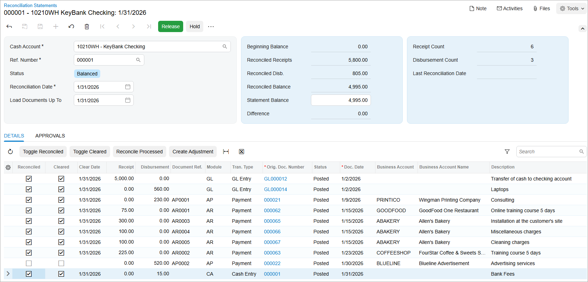

# Bank Reconciliation: To Reconcile a Cash Account {#_c5e018e0-46db-4f21-802d-5ce13b5c5ded .task}

In this activity, you will learn how to perform bank reconciliation—that is, to match the balances in the company's accounting records for a cash account to the corresponding information on a bank statement.

**Attention:** This activity is based on the *U100* dataset. If you are using another dataset or if any system settings have been changed in *U100*, these changes can affect the workflow of the activity and the results of the processing. To avoid issues, restore the *U100* dataset to its initial state.

## Story {#section_ih2_kjv_vxb .section}

Suppose that on January 31, 2026 the accounting department of the SweetLife Fruits &amp; Jams company received a bank statement from KeyBank for the amount of $4,995 \([EU\_FinBasic\_Bank\_Statement\_KeyBank\_01\_31\_2026.xlsx](Files/EU_FinBasic_Bank_Statement_KeyBank_01_31_2026.xlsx)\).

Acting as a SweetLife accountant, you need to perform bank reconciliation for January 2026 as you prepare to close the *01-2026* financial period in the general ledger. During reconciliation, you will match the records in the system \(the book balance\) and in the statement for the bank account \(the bank balance\).

## Configuration Overview {#section_lh2_kjv_vxb .section}

For the purposes of this activity, the following features have been enabled on the [Enable/Disable Features](CS_10_00_00.md) \(CS100000\) form:

-   *Standard Financials*, which provides the standard financial functionality
-   *Multibranch Support*, which supports multiple branches in your instance of Acumatica ERP
-   *Multicompany Support*, which supports multiple companies within one tenant

On the [Cash Accounts](CA_20_20_00.md) \(CA202000\) form, the *10210WH - KeyBank Checking* account has been configured for the *HEADOFFICE \(SweetLife Head Office and Wholesale Center\)* branch.

## Process Overview {#section_oh2_kjv_vxb .section}

In this activity, you will find the ending balance of the cash account on the [Cash Account Details](CA_30_30_00.md) \(CA303000\) form. Then you will create a reconciliation statement on the [Reconciliation Statements](CA_30_20_00.md) \(CA302000\) form and review the difference between the bank balance and the book balance. On the same form, you will enter a quick transaction for an amount that is included in the bank statement but has not been entered in the system. Finally, you will release the reconciliation statement.

## System Preparation {#section_qh2_kjv_vxb .section}

To prepare the system, do the following:

1.  Launch the Acumatica ERP website, and sign in as an accountant by using the following credentials:
    -   Username: *johnson*
    -   Password: *123*
2.  In the info area, in the upper-right corner of the top pane of the Acumatica ERP screen, make sure that the business date in your system is set to *1/31/2026*. If a different date is displayed, click the Business Date menu button and select *1/31/2026*. For simplicity, in this activity, you will create and process all documents in the system on this business date.
3.  On the Company and Branch Selection menu, also on the top pane of the Acumatica ERP screen, make sure that the *SweetLife Head Office and Wholesale Center* branch is selected. If it is not selected, click the Company and Branch Selection menu button to view the list of branches that you have access to, and then click *SweetLife Head Office and Wholesale Center*.

## Step 1: Finding the Ending Balance of the Cash Account {#section_sh2_kjv_vxb .section}

To find the ending balance of the cash account for 01/31/2026, do the following:

1.  Open the [Cash Account Details](CA_30_30_00.md) \(CA303000\) form.
2.  In the Selection area, specify the following settings:

    -   **Cash Account**: *10210WH - KeyBank Checking*
    -   **Start Date**: *1/1/2026*
    -   **End Date**: *1/31/2026*
    -   **Show Summary**: Cleared
    -   **Include Unreleased**: Cleared
    The table shows all the transactions that match the specified criteria.

3.  Note the amount in the **Ending Balance** box in the Selection area. This is the ending balance of your cash account as of 1/31/2026.

    **Attention:** Although this step is not needed for reconciliation, it is presented here to illustrate how to check the cash account balance and payments processed for the cash account for the selected date range.

## Step 2: Creating a Reconciliation Statement {#section_wh2_kjv_vxb .section}

To create a reconciliation statement, do the following:

1.  Open the Reconciliation Statements \(CA3020PL\) list of records.
2.  On the form toolbar, click **New Record** to open the [Reconciliation Statements](CA_30_20_00.md) \(CA302000\) form and create a new statement.
3.  In the Selection area, specify the following settings:

    -   **Cash Account**: *10210WH - KeyBank Checking*
    -   **Reconciliation Date**: *1/31/2026*
    -   **Load Documents Up To**: *1/31/2026*
    All unreconciled payments with a date not later than 1/31/2026 are loaded to the table.

4.  Look through the payments in the table and match them against the respective transactions from the [EU\_FinBasic\_Bank\_Statement\_KeyBank\_01\_31\_2026.xlsx](Files/EU_FinBasic_Bank_Statement_KeyBank_01_31_2026.xlsx) file. For every payment loaded to the table, select the **Reconciled** check box once you have matched it to a record in the bank statement. Note the amount in the **Reconciled Balance** box; it is the amount of all transactions for which this check box is selected.

    **Tip:** If any unreleased transactions are displayed in the table, the system warns you that an unreleased document cannot be added to the reconciliation.

5.  To match the invoice payment of $500 from the bank statement to respective transactions in the system, select the **Reconciled** check boxes for three payments of $300, $100, and $100 dated 1/15/2026.
6.  Leave the **Reconciled** check box cleared for the payment in the amount of $520 dated 1/30/2026.

    This means that the payment in the amount of $520 for the *BLUELINE* vendor posted on *1/30/2026* was not included in the bank statement dated *1/31/2026*.

7.  In the table, click the link in the **Orig. Doc. Number** column for this payment, and review it on the [Checks and Payments](AP_30_20_00.md) \(AP302000\) form, which opens in a separate window. Close the window to return to the [Reconciliation Statements](CA_30_20_00.md) form.
8.  In the **Statement Balance** box, enter the bank statement balance you have received from the bank \(`4995`\).

    In the **Difference** box, you can see the difference between the statement balance and the balance calculated based on the payments marked as reconciled. Notice that the box contains *–15.00*, meaning that the bank charge in the amount of $15 included in the bank statement has not been entered in the system.

9.  On the table toolbar, click **Create Adjustment**. You use this action to enter the settings for a line with bank charges that were included in the bank statement but have not been entered in the system.
10. In the **Quick Transaction** dialog box, which opens, specify the following settings:
    -   **Entry Type**: *BANKFEE*
    -   **Doc. Date**: *1/31/2026* \(inserted by default\)
    -   **Fin. Period**: *01/2026* \(inserted by default\)
    -   **Amount**: `15`
    -   **Hold**: Cleared
    -   **Description**: `Bank Fees` \(inserted by default\)
11. Click **Release** to release the transaction and close the dialog box.

    The system has added the created transaction to the table on the [Reconciliation Statements](CA_30_20_00.md) form.

    **Tip:** If you click **Save** and close the dialog box without releasing the transaction, the system will add a line with the *Cash Entry* type to the bank reconciliation statement and will display a warning that unreleased documents cannot be added to a reconciliation statement. You would release the transaction on the [Cash Transactions](CA_30_40_00.md) \(CA304000\) form by clicking **Release** on the form toolbar.

12. In the table, select the **Reconciled** check box for the row with the $15 bank fee.
13. On the form toolbar, click **Remove Hold**; then click **Save** on the form toolbar to save the reconciliation statement. The reconciliation statement before release is shown in the following screenshot.

    

14. On the form toolbar, click **Release** to release the reconciliation statement.

**Parent topic:**[Performing Bank Reconciliation](../UserGuide/Finance_Bank_Reconciliation_Mapref.md)

