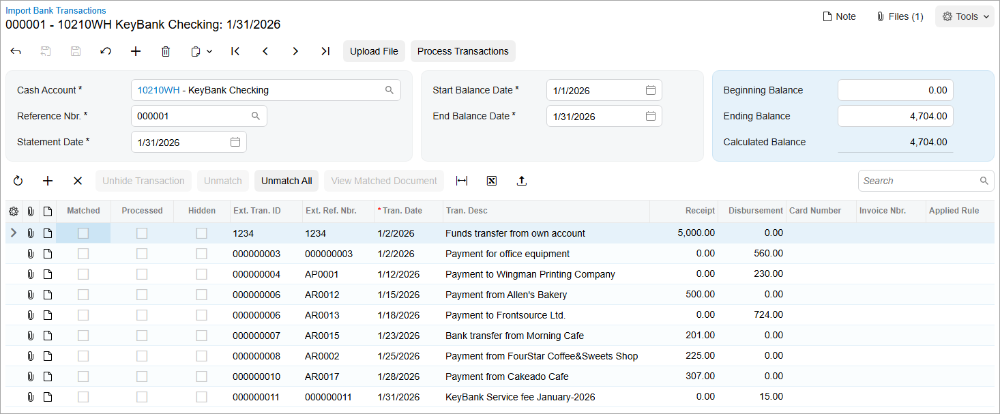
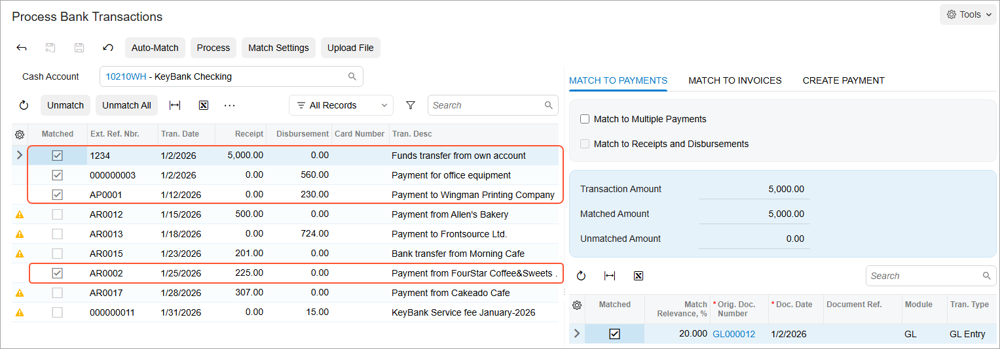
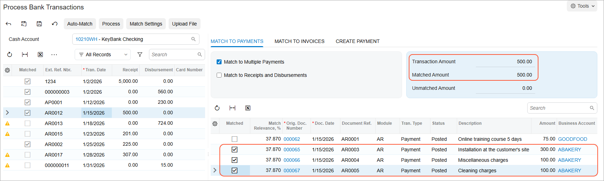
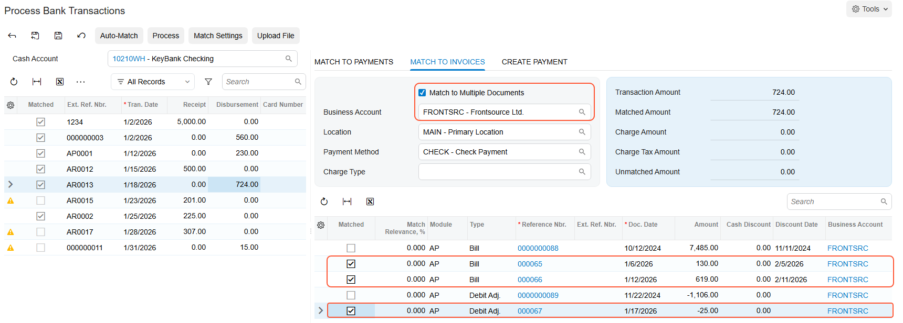
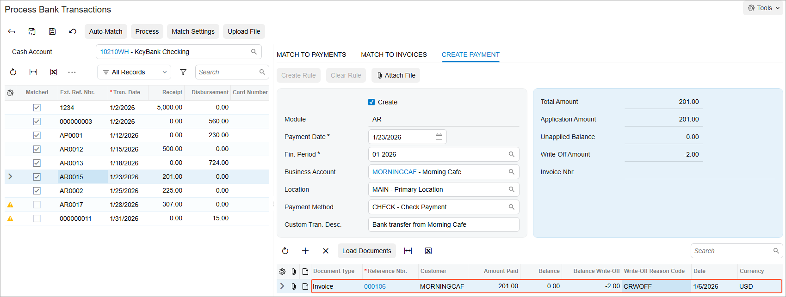
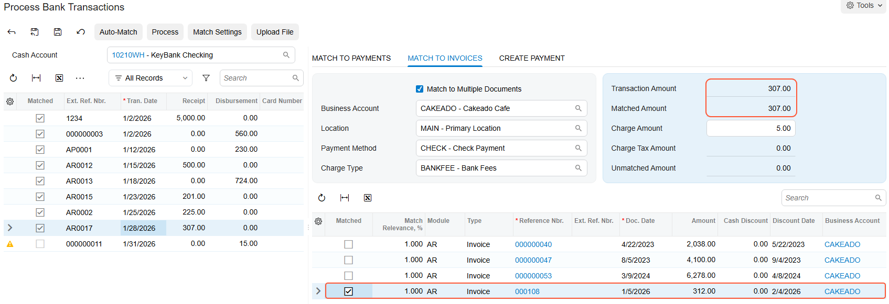
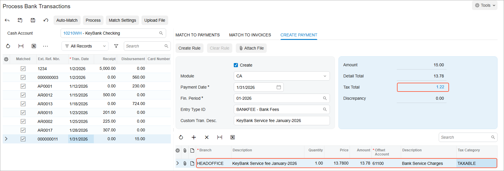
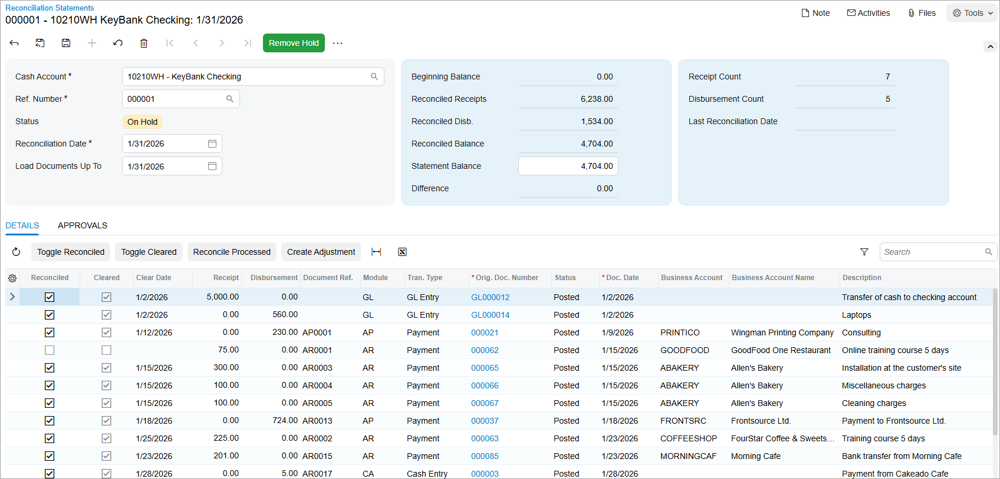

# Bank Reconciliation: To Process a Bank Statement in OFX Format \(Part 1\) {#_61c25905-e211-4bfa-b4b3-0751c1428712 .task}

In this activity, you will learn how to upload the first bank statement and match the uploaded transactions to the existing documents or transactions in the system. This bank statement is in OFX format.

**Attention:** This activity is based on the *U100* dataset. If you are using another dataset or if any system settings have been changed in *U100*, these changes can affect the workflow of the activity and the results of the processing. To avoid issues, restore the *U100* dataset to its initial state.

## Story {#section_kj2_kjv_vxb .section}

Suppose that on January 31, 2026, the accounting department of SweetLife Fruits &amp; Jams received a bank statement in Open Financial Exchange \(OFX\) format from KeyBank in the amount of $4,704.

Acting as a SweetLife accountant, you need to perform bank statement reconciliation for January 2026 as you prepare to close the *01-2026* financial period in the general ledger. During reconciliation, you will match the records in the system \(the book balance\) and in the statement for the bank account \(the bank balance\).

## Configuration Overview {#section_nj2_kjv_vxb .section}

For the purposes of this lesson, the following features have been enabled on the [Enable/Disable Features](CS_10_00_00.md) \(CS100000\) form:

-   *Standard Financials*, which provides the standard financial functionality
-   *Multibranch Support*, which supports multiple branches in your instance of Acumatica ERP
-   *Multicompany Support*, which supports multiple companies within one tenant

On the [Cash Accounts](CA_20_20_00.md) \(CA202000\) form, the *10210WH - KeyBank Checking* account has been configured for the *HEADOFFICE \(SweetLife Head Office and Wholesale Center\)* branch.

On the [Tax Zones](TX_20_60_00.md) \(TX206000\) form, the *NYSTATE* tax category has been added with the *NYSTATETAX* applied to it on the **Applicable Taxes** tab.

On the [Reason Codes](CS_21_10_00.md) \(CS211000\) form, the *CRWOFF \(Credit Write Off\)* reason code has been defined.

## Process Overview {#section_sj2_kjv_vxb .section}

In this activity, you will review the system settings on the [Cash Management Preferences](CA_10_10_00.md) \(CA101000\) form and the settings of the cash account whose balance you will reconcile on the [Cash Accounts](CA_20_20_00.md) \(CA202000\) form. Then you will upload the OFX bank statement on the [Import Bank Transactions](CA_30_65_00.md) \(CA306500\) form and match the uploaded transactions with the existing transactions in the system on the [Process Bank Transactions](CA_30_60_00.md) \(CA306000\) form.

On the [Process Bank Transactions](CA_30_60_00.md) form, you will enter a transaction that reflects an amount included in the bank statement that has not been entered into the system. You will match one bank transaction to several payments in the system. You will match a *Disbursement* bank transaction to multiple bills and a debit adjustment of the same vendor. You will also match a bank payment to an invoice and create a write off to record an amount overpaid by a customer, match a bank transaction to an invoice and create a bank charge, and create a disbursement cash transaction with a tax. Finally, you will prepare a reconciliation statement on the [Reconciliation Statements](CA_30_20_00.md) \(CA302000\) form and review the transactions that have been reconciled.

## System Preparation {#section_vj2_kjv_vxb .section}

To prepare the system, do the following:

1.  Launch the Acumatica ERP website, and sign in to a company with the *U100* dataset preloaded. To sign in as an accountant, use the following credentials:
    -   Username: *johnson*
    -   Password: *123*
2.  In the info area, in the upper-right corner of the top pane of the Acumatica ERP screen, make sure that the business date in your system is set to *2/1/2026*. If a different date is displayed, click the Business Date menu button and select *2/1/2026*. For simplicity, in this activity, you will create and process all documents in the system on this business date.
3.  On the Company and Branch Selection menu, also on the top pane of the Acumatica ERP screen, make sure that the *SweetLife Head Office and Wholesale Center* branch is selected. If it is not selected, click the Company and Branch Selection menu button to view the list of branches that you have access to, and then click *SweetLife Head Office and Wholesale Center*.
4.  Download the `Bank_Statement_KeyBank_01312026.ofx` file, which you will import in Step 2.

## Step 1: Reviewing System Settings and Preparing the Cash Account for Uploading Bank Statements {#section_xj2_kjv_vxb .section}

You need to be sure that the system settings and the needed cash account are configured so that a bank statement for the cash account can be uploaded. Perform the following instructions:

1.  Open the [Cash Management Preferences](CA_10_10_00.md) \(CA101000\) form.
2.  On the **Bank Statements** tab, review the following settings in the **Import Settings** section:
    -   **Import Bank Statement to Single Cash Account**: Selected

        This check box indicates whether the system should import a bank statement to a specific cash account, as opposed to importing a bank statement for multiple cash accounts. When the check box is selected, you can import the data on the [Import Bank Transactions](CA_30_65_00.md) \(CA306500\) form only after you select the applicable cash account.

    -   **Statement Import Service**: *PX.Objects.CA.OFXStatementReader*

        The statement import service is the application service that reads the data being imported. The *PX.Objects.CA.OFXStatementReader* service is used for importing bank statements from OFX files.

        **Attention:** You can import bank statements from OFX, QBO, QFX, and Excel files.

3.  Open the [Cash Accounts](CA_20_20_00.md) \(CA202000\) form.
4.  In the **Cash Account** box, select the *10210WH - KeyBank Checking* cash account, and specify the following settings, which are required for accounts for which bank statements will be imported from OFX:
    -   **External Ref. Number**: `001-204-00289-01` \(the bank account number that is specified in `ACCTID` in the OFX file\)
    -   **Statement Import Service**: *PX.Objects.CA.OFXStatementReader*
5.  On the **Entry Types** tab, for the *BANKFEE* entry type, select *NYSTATE* in the **Tax Zone** column.

    This setting is needed if you want to create a disbursement cash transaction with a tax applied during bank reconciliation.

6.  On the form toolbar, click **Save** to save your changes.

## Step 2: Uploading the Bank Statement for the Cash Account {#section_dk2_kjv_vxb .section}

To upload the 1/31/2026 bank statement for the *10210WH - KeyBank Checking* cash account, do the following:

1.  On the [Import Bank Transactions](CA_30_65_00.md) \(CA306500\) form, click **Add New Record** on the form toolbar.
2.  In the **Cash Account** box, select *10210WH - KeyBank Checking*.
3.  On the form toolbar, click **Upload File**, and in the **Statement File Upload** dialog box, which opens, click **Choose File**, and select the `Bank_Statement_KeyBank_01312026.ofx` file you downloaded during system preparation. Click **Upload** to close the dialog box and upload the file.

    The system uploads the transactions from the file to the current form for the cash account. The OFX file contains the 1/31/2026 bank statement with the transactions in the bank account at KeyBank from 1/1/2026 to 1/31/2026, as shown in the screenshot below.

    **Tip:** The uploaded OFX file is now attached to the form; if you ever needed to download the file, you could do so by clicking **Files** on the form title bar while viewing the form.

    The **Statement Date**, **Start Balance Date**, **End Balance Date**, and **Ending Balance** values have been imported from the file. The OFX format does not provide the beginning balance in bank statements, so for the first imported bank statement for a particular cash account, you have to manually specify the beginning balance of the statement. In the subsequent statements for the cash account, the system uses the **Ending Balance** value of the previous bank statement as the current **Beginning Balance** value.

    

4.  Leave the **Beginning Balance** box as is \(*0.00*\) because you have just started using this bank account.

## Step 3: Processing the Imported Bank Transactions {#section_ik2_kjv_vxb .section}

To process the imported bank transactions, do the following:

1.  While you are still on the [Import Bank Transactions](CA_30_65_00.md) \(CA306500\) form with the bank statement uploaded, click **Process Transactions** on the form toolbar.

    The system opens the [Process Bank Transactions](CA_30_60_00.md) \(CA306000\) form.

2.  On the form toolbar, click **Auto-Match** to run the auto-matching process for the bank transactions.

    The following screenshot illustrates the transactions after auto-matching.

    

3.  In the left pane, click the row with the $5,000 transaction, and on the right pane, review the **Match to Payments** tab. Notice that for the transaction, the system has found only one matching GL batch.
4.  In the left pane, click the row with the $225 transaction. On the right pane, review the **Match to Payments** tab. The system has found one AR payment that matches the receipt transaction. On the **Match to Invoices** tab, notice that the system has also found an outstanding invoice for the same amount, the same customer, but for a different date.

    Separately from the search for the matching payments, the system searches for outstanding documents. To find a document to which the payment could be applied, the system compares the payment amount with the amount of any outstanding documents with the same transaction sign \(indicating whether it is a receipt or disbursement\).

    Notice that the invoice on the **Match to Invoices** tab has a lower match relevance than the payment on the **Match to Payments** tab, so the system has selected the payment as the best match.

    **Attention:** The system will always try to find the best match among payments; only if a match is not found will it try to find the best match among invoices. Thus, even if an invoice has a higher match relevance than a payment but the payment's match relevance passed the threshold, the system will match the transaction to the payment.

## Step 4: Matching a Transaction to Multiple Payments {#section_sk2_kjv_vxb .section}

To match the $500 transaction to three payments, while remaining on the [Process Bank Transactions](CA_30_60_00.md) \(CA306000\) form, do the following:

1.  In the left pane, click the $500 transaction.
2.  Optional: On the **Create Payment** tab of the right pane, clear the **Create** check box.
3.  On the **Match to Payments** tab of the right pane, select the **Match to Multiple Payments** check box, and review the table in the Detail area. The system fills it in with outstanding payments that you can match to the selected bank transaction.
4.  Select the **Matched** check box in the rows of the three payments from *ABAKERY* with the date of *1/15/2026*. Notice that with every payment for which you select the **Matched** check box for, the system updates the values in the **Matched Amount** and **Unmatched Amount** boxes, respectively, as shown in the screenshot below. Once **Matched Amount** and **Transaction Amount** are equal \(in this case, *$500*\), you can process the transaction.

    

5.  On the form toolbar, click **Save**.

## Step 5: Matching a Disbursement Transaction to Multiple AP Documents {#section_uk2_kjv_vxb .section}

To match a $724 disbursement transaction to multiple bills and a debit adjustment, while remaining on the [Process Bank Transactions](CA_30_60_00.md) \(CA306000\) form, do the following:

1.  In the left pane, click the $724 transaction.
2.  Optional: On the **Create Payment** tab of the right pane, clear the **Create** check box.
3.  On the **Match to Invoices** tab of the right pane, select the **Match to Multiple Documents** check box.
4.  In the **Business Account** box, select *FRONTSRC*.

    In the table, the system loads all AP documents for the specified business account, regardless of the document amount.

5.  Select the **Matched** check box in the rows of the two bills with the amounts of $130.00 and $619.00 and the debit adjustment with the amount of –$25.00, as shown in the following screenshot.

    

6.  Notice that the **Transaction Amount** and **Matched Amount** values are now equal \(*$724*\).
7.  On the form toolbar, click **Save**.

## Step 6: Processing a Payment from a Customer and Creating a Write Off {#section_xk2_kjv_vxb .section}

To process a payment from a customer and create a write off, while remaining on the [Process Bank Transactions](CA_30_60_00.md) \(CA306000\) form, do the following:

1.  In the left pane, select the $201 transaction.
2.  On the **Create Payment** tab of the right pane, specify the following settings to match the bank transaction to a customer's invoice:
    -   **Create**: Selected
    -   **Module**: *AR*
    -   **Payment Date**: *1/23/2026* \(inserted by default by the bank transaction information\)
    -   **Business Account**: *MORNINGCAF*
3.  On the table toolbar, click **Add Row**.
4.  In the **Reference Nbr.** column, click the magnifier button and select a $199 invoice dated 1/6/2026.
5.  In the row with the $199 invoice, specify the following settings:

    -   **Amount Paid**: `201` \(the amount from the bank statement\)
    -   **Balance Write-Off**: `-2` \(the overpaid amount to be written off\)
    -   **Write-Off Reason Code**: *CRWOFF - Credit Write Off*
    The following screenshot illustrates the AR payment with a credit write off.

    

6.  On the form toolbar, click **Save**.

## Step 7: Matching a Bank Transaction to an Invoice and Creating a Charge {#section_dl2_kjv_vxb .section}

To match a bank transaction to a customer invoice and create a bank charge, while remaining on the [Process Bank Transactions](CA_30_60_00.md) \(CA306000\) form, do the following:

1.  In the left pane, select the $307 transaction.
2.  On the **Create Payment** tab of the right pane, clear the **Create** check box.
3.  On the **Match to Invoices** tab, specify the following settings:
    -   **Match to Multiple Documents**: Selected
    -   **Business Account**: *CAKEADO*
    -   **Charge Type**: *BANKFEE*
    -   **Charge Amount**: `5.00`
4.  In the table, select the **Matched** check box in the row of the $312 invoice to match it to the selected bank transaction.

    Notice that the amounts in the **Transaction Amount** and **Matched Amount** boxes in the Summary area of the **Match to Invoices** tab are equal, as shown in the following screenshot.

    

5.  On the form toolbar, click **Save**.

## Step 8: Creating a Disbursement Cash Transaction with a Tax {#section_gl2_kjv_vxb .section}

To create a disbursement cash transaction with a tax automatically applied to it, while remaining on the [Process Bank Transactions](CA_30_60_00.md) \(CA306000\) form, do the following:

1.  In the left pane, select the $15 transaction.
2.  On the **Create Payment** tab of the right pane, specify the following settings to create the cash transaction in the system:
    -   **Create**: Selected
    -   **Module**: *CA*
    -   **Payment Date**: *1/31/2026* \(inserted by default from the bank transaction information\)
    -   **Fin. Period**: *01-2026*
    -   **Entry Type ID**: *BANKFEE*
3.  In the table with the only row, select *Taxable* in the **Tax Category** column.

    Once you specify the tax category for the document line, the system automatically applies the tax. The $15 amount now includes the tax amount, as shown in the following screenshot.

    

4.  Click the link in the **Tax Total** box of the Summary area to review the applied tax.

    The **Tax Details** dialog box shows the tax zone of the selected entry type and the tax applied to the document line.

5.  Click **OK** to close the dialog box.
6.  On the form toolbar, click **Save** to save your changes.

    The $15 bank service fee transaction is no longer marked with a warning icon because you have specified the information the system will use to create the document when you run the processing of transactions.

## Step 9: Preparing Bank Transactions for Reconciliation {#section_ll2_kjv_vxb .section}

To process the bank transactions in preparation for reconciliation, while remaining on the [Process Bank Transactions](CA_30_60_00.md) \(CA306000\) form, do the following:

1.  On the form toolbar, click **Process**.

    The system creates cash transactions, AR payments, and AP payments based on the information you specified in the previous steps. The system then releases the document and the transactions, and selects the read-only **Cleared** check box for every created document and transaction on the [Reconciliation Statements](CA_30_20_00.md) \(CA302000\) form.

    **Important:** The results of the bank transaction processing cannot be reverted or changed. Although you can unmatch bank transactions, the documents that were created during processing will remain in the system.

2.  In the left pane of the [Process Bank Transactions](CA_30_60_00.md) form, notice that the transactions have been marked as processed.
3.  On the [Import Bank Transactions](CA_30_65_00.md) \(CA306500\) form, open the bank statement for the *10210WH - KeyBank Checking* cash account, and review the transactions. Notice that all transactions have been processed; for these transactions, the **Processed** check box is selected.
4.  On the [Cash Transactions](CA_30_40_00.md) \(CA304000\) form, open the disbursement cash entry that was created from the $15 bank fee transaction and the disbursement cash entry for the $5 bank charge, and make sure these transactions have been released.
5.  On the [Checks and Payments](AP_30_20_00.md) \(AP302000\) form, open the document with the *Payment* type that is dated *1/18/2026* and has an amount of $724.

    On the **Application History** tab, notice that three documents have been fully applied to this payment—two bills and a debit adjustment.

6.  On the [Bank Transactions History](CA_40_20_00.md) \(CA402000\) form, specify the following settings, and review the bank transactions that appear in the table:

    -   **Cash Account**: *10210WH*
    -   **Date Range**: *1/1/2026* to *1/31/2026*
    **Attention:** In the **Reference Nbr.** column, you can find the reference numbers of the documents to which the bank transactions have been matched. If you have matched several documents to one bank transaction, the table displays a line for each document matched to that transaction specifying the matched amounts in the **Matched Receipt** and **Matched Disbursement** columns.

## Step 10: Preparing the Reconciliation Statement {#section_sl2_kjv_vxb .section}

To prepare the reconciliation statement for January 2026, do the following:

1.  Open the Reconciliation Statements \(CA3020PL\) list of records, and click **New Record** on the form toolbar. The system opens the [Reconciliation Statements](CA_30_20_00.md) \(CA302000\) form.
2.  In the **Cash Account** box, select *10210WH - Key Bank Checking*.
3.  Specify the following settings in the Summary area:
    -   **Reconciliation Date**: *1/31/2026*
    -   **Statement Balance**: `4704.00`
4.  On the form toolbar, click **Save** to save the reconciliation statement.
5.  Select the **Reconciled** check box for the AP, AR, and cash documents that have the **Cleared** check box selected. Alternatively, you can click **Reconcile Processed** and all cleared documents will have the **Reconciled** check box selected.

    **Tip:** You can select and clear the **Cleared** check box for transactions until they are involved in bank transaction processing on the [Process Bank Transactions](CA_30_60_00.md) \(CA306000\) form. After you have processed a bank transaction, the **Cleared** check box is selected and read-only for the corresponding document or transaction in the system. Therefore, once you have processed all transactions from a bank statement, reconciliation with the bank statement becomes easy: You select the **Reconciled** check box for all transactions that have the **Cleared** check box selected in the reconciliation statement, and the bank reconciliation is complete.

    **Attention:** The cash account balance in the system is not affected by the result of the processing of bank transactions.

    The **Reconciled Balance** is equal to the **Statement Balance**, as shown in the following screenshot; now you can release the reconciliation statement.

    

6.  On the form toolbar, click **Save** to save the reconciliation statement.
7.  On the form toolbar, click **Remove Hold**, and then click **Release** to release the reconciliation statement.

**Parent topic:**[Performing Bank Reconciliation](../UserGuide/Finance_Bank_Reconciliation_Mapref.md)

