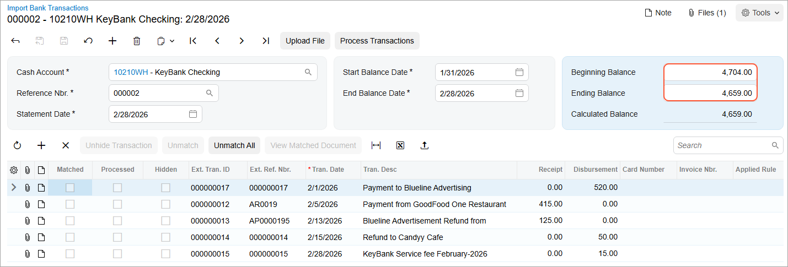
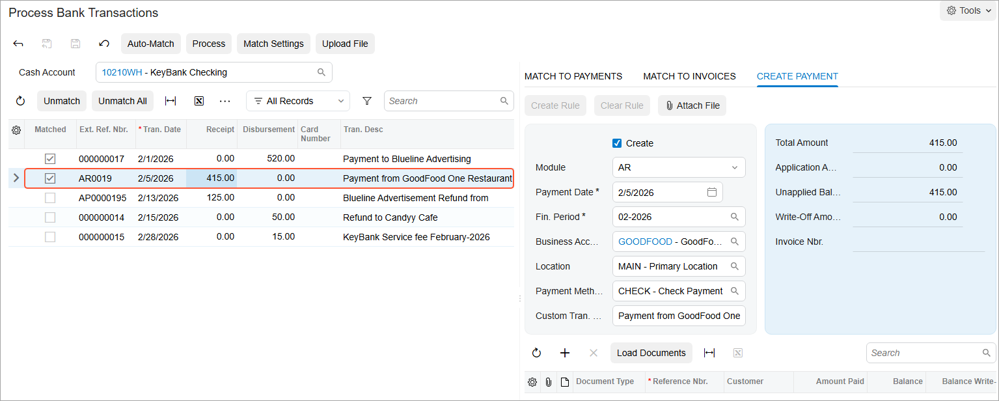
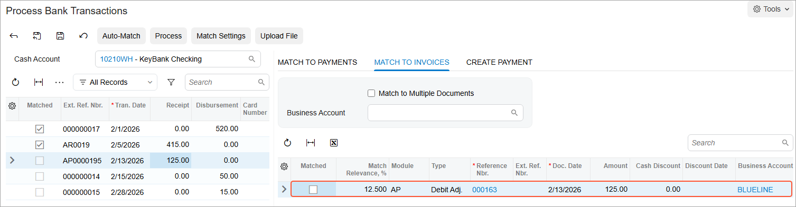
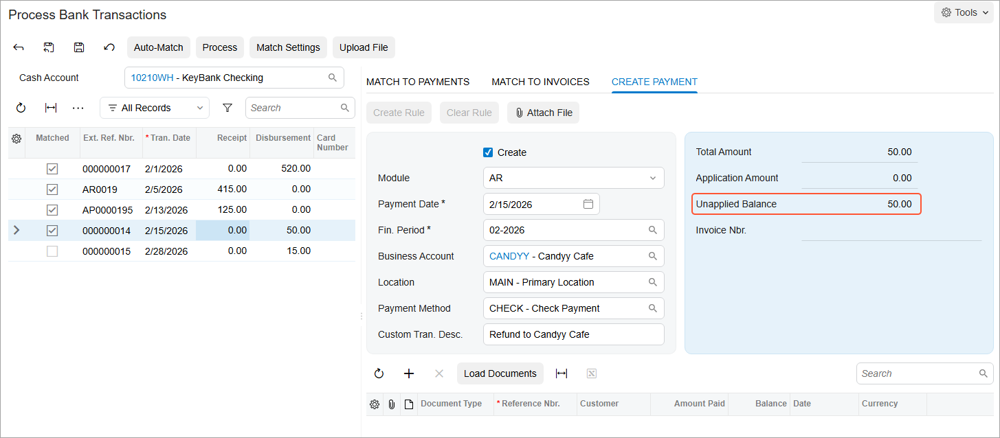
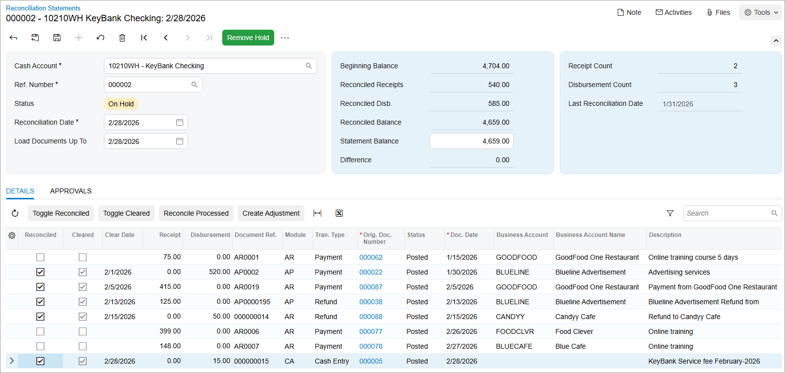

# Bank Reconciliation: To Process a Bank Statement in OFX Format \(Part 2\) {#_0df7bd04-aac7-4cf7-ab1a-1b2d150e9ca5 .task}

In this activity, you will learn how to upload the second bank statement \(after the one that you worked with in [Bank Reconciliation: To Process a Bank Statement in OFX Format \(Part 1\)](Finance_Bank_Reconciliation_Activity2.md)\) and match the uploaded transactions to the existing documents or transactions in the system. This bank statement is also in OFX format.

## Story {#section_kj2_kjv_vxb .section}

Suppose that on February 28, 2026, the accounting department of SweetLife Fruits &amp; Jams received another bank statement in Open Financial Exchange \(OFX\) format from KeyBank in the amount of $4,659.

Acting as a SweetLife accountant, you need to perform bank statement reconciliation for February 2026 as you prepare to close the *02-2026* financial period in the general ledger. During reconciliation, you will match the records in the system \(the book balance\) and in the statement for the bank account \(the bank balance\).

## Configuration Overview {#section_nj2_kjv_vxb .section}

For the purposes of this lesson, the following features have been enabled on the [Enable/Disable Features](CS_10_00_00.md) \(CS100000\) form:

-   *Standard Financials*, which provides the standard financial functionality
-   *Multibranch Support*, which supports multiple branches in your instance of Acumatica ERP
-   *Multicompany Support*, which supports multiple companies within one tenant

Also, on the [Cash Accounts](CA_20_20_00.md) \(CA202000\) form, the *10210WH - KeyBank Checking* account has been created for the *HEADOFFICE \(SweetLife Head Office and Wholesale Center\)* branch.

## Process Overview { .section}

In this activity, you will upload the OFX bank statement on the [Import Bank Transactions](CA_30_65_00.md) \(CA306500\) form and match the uploaded transactions with the transactions in the system on the [Process Bank Transactions](CA_30_60_00.md) \(CA306000\) form.

On this form, you will enter a transaction that reflects an amount included in the bank statement that has not been entered into the system. You will also create a disbursement cash transaction and match a receipt transaction to a debit adjustment found in the system. Finally, you will prepare a reconciliation statement on the [Reconciliation Statements](CA_30_20_00.md) \(CA302000\) form and review the transactions that have been reconciled.

## System Preparation {#section_vj2_kjv_vxb .section}

To prepare the system, do the following:

1.  Launch the Acumatica ERP website and sign in to a company with the *U100* dataset preloaded. To sign in as an accountant, use the following credentials:
    -   **Username**: *johnson*
    -   **Password**: *123*
2.  In the info area, in the upper-right corner of the top pane of the Acumatica ERP screen, make sure that the business date in your system is set to *2/28/2026*. If a different date is displayed, click the Business Date menu button and select *2/28/2026*. For simplicity, in this activity, you will create and process all documents in the system on this business date.
3.  On the Company and Branch Selection menu, also on the top pane of the Acumatica ERP screen, make sure that the *SweetLife Head Office and Wholesale Center* branch is selected. If it is not selected, click the Company and Branch Selection menu button to view the list of branches that you have access to, and then click *SweetLife Head Office and Wholesale Center*.
4.  Download the `Bank_Statement_KeyBank_02282026.ofx` file, which you will import in Step 2.
5.  Be sure that you have completed the following prerequisite activity: [Bank Reconciliation: To Process a Bank Statement in OFX Format \(Part 1\)](Finance_Bank_Reconciliation_Activity2.md).

## Step 1: Uploading the Bank Statement for the Cash Account {#section_dk2_kjv_vxb .section}

To upload the 2/28/2026 bank statement for the *10210WH - KeyBank Checking* cash account, do the following:

1.  On the [Import Bank Transactions](CA_30_65_00.md) \(CA306500\) form, click **Add New Record** on the form toolbar.
2.  In the **Cash Account** box, select *10210WH - KeyBank Checking*.
3.  On the form toolbar, click **Upload File**.
4.  In the **Statement File Upload** dialog box, which opens, click **Choose File** and select the `Bank_Statement_KeyBank_02282026.ofx` file that you downloaded during system preparation. Click **Upload** to close the dialog box and upload the file.

    The system uploads the transactions from the file to the current form for the cash account. The OFX file contains the 2/28/2026 bank statement with the transactions in the bank account at KeyBank from 2/1/2026 to 2/28/2026, as shown in the screenshot below.

    **Tip:** The uploaded OFX file is now attached to the form; if you ever needed to download the file, you could do so by clicking **Files** on the form title bar while viewing the form.

    The **Statement Date**, **Start Balance Date**, **End Balance Date**, and **Ending Balance** values have been imported from the OFX file. Because this is not the first statement for the cash account, the system uses the **Ending Balance** value of the previous bank statement as the current **Beginning Balance** value, as shown in the following screenshot.

    

5.  Leave the **Beginning Balance** box as is \(*4,704.00*\).
6.  On the form toolbar, click **Process Transactions**.

    The system opens the [Process Bank Transactions](CA_30_60_00.md) \(CA306000\) form.

7.  In the left pane, click the $520 transaction.
8.  On the **Match to Payments** tab, review the payment that the system has found. Select the check box in the **Matched** column for this payment.

## Step 2: Processing a Payment from a Customer {#section_pk2_kjv_vxb .section}

To process the $415 payment from a customer, while remaining on the [Process Bank Transactions](CA_30_60_00.md) \(CA306000\) form, do the following:

1.  In the left pane, click the $415 payment transaction.
2.  To create the AR payment in the system, on the **Create Payment** tab of the right pane, specify the following settings:
    -   **Create**: Selected
    -   **Module**: *AR*
    -   **Payment Date**: *2/5/2026* \(inserted by default from the bank transaction information\)
    -   **Fin. Period**: *02-2026*
    -   **Business Account**: *GOODFOOD*
    -   **Payment Method**: *CHECK* \(inserted by default\)
3.  On the form toolbar, click **Save** to save your changes.

    The $415 payment transaction has the **Matched** check box selected because you have specified the information from which the system will create a payment when you run the processing of transactions. The following screenshot shows the matched transaction.

    

## Step 3: Matching a Transaction to a Debit Adjustment { .section}

To match a $125 receipt transaction to a debit adjustment, while remaining on the [Process Bank Transactions](CA_30_60_00.md) \(CA306000\) form, do the following:

1.  On the form toolbar, click **Match Settings**.
2.  In the **Transaction Matching Settings** dialog box, which is opened, select the **Allow Matching to Debit Adjustment** check box in the **Receipt Matching** section.
3.  Click **Save &amp; Close** in the dialog box.
4.  In the left pane, click the $125 transaction.
5.  On the **Match to Invoices** tab, the system has displayed a debit adjustment, as shown in the following screenshot.

    

6.  In the right pane, select the **Matched** check box for the debit adjustment.
7.  On the form toolbar, click **Save**.

## Step 4: Creating an AR Refund with an Open Balance {#section_al2_kjv_vxb .section}

To create an AR refund with an open balance—that is, unapplied to any document—while remaining on the [Process Bank Transactions](CA_30_60_00.md) \(CA306000\) form, do the following:

1.  In the left pane, select the $50 transaction.
2.  On the **Create Payment** tab of the right pane, specify the following settings:
    -   **Create**: Selected
    -   **Module**: *AR*
    -   **Payment Date**: *2/15/2026* \(inserted by default by the bank transaction information\)
    -   **Business Account**: *CANDYY*
3.  Leave the table on the **Create Payment** tab empty.

    Notice the $50 amount in the **Unapplied Balance** box in the Summary area, as shown in the following screenshot. When the system creates an AR refund based on the disbursement transaction, the document with the *Refund* type will not be applied to any document and will have an open balance.

    

4.  On the form toolbar, click **Save**.

## Step 5: Creating a Disbursement Cash Transaction {#section_gl2_kjv_vxb .section}

To create a disbursement cash transaction, while remaining on the [Process Bank Transactions](CA_30_60_00.md) \(CA306000\) form, do the following:

1.  In the left pane, click the $15 transaction.
2.  On the **Create Payment** tab of the right pane, specify the following settings to create the cash transaction in the system:
    -   **Create**: Selected
    -   **Module**: *CA*
    -   **Payment Date**: *2/28/2026* \(inserted by default from the bank transaction information\)
    -   **Fin. Period**: *02-2026*
    -   **Entry Type ID**: *BANKFEE*
3.  On the form toolbar, click **Save** to save your changes.

    The $15 bank service fee transaction has the **Matched** check box selected because you have specified the information the system will use to create the document when you run the processing of transactions.

## Step 6: Preparing Bank Transactions for Reconciliation {#section_ll2_kjv_vxb .section}

To process the bank transactions in preparation for reconciliation, while remaining on the [Process Bank Transactions](CA_30_60_00.md) \(CA306000\) form, do the following:

1.  On the form toolbar, click **Process**.

    The system creates a cash transaction, an AR payment, an AP refund, and an unapplied refund based on the information you have specified in the previous steps. The system then releases the document and the transactions and selects the read-only **Cleared** check box for every created document and transaction on the [Reconciliation Statements](CA_30_20_00.md) \(CA302000\) form.

    **Important:** The results of the bank transaction processing cannot be reversed or changed.

2.  In the left pane of the [Process Bank Transactions](CA_30_60_00.md) form, notice that the transactions have been marked as processed.
3.  On the [Import Bank Transactions](CA_30_65_00.md) \(CA306500\) form, open the bank statement for the *10210WH - KeyBank Checking* cash account and the 2/28/2026 statement date and review the transactions. Notice that all transactions have been processed; for these transactions, the **Processed** check box is selected.
4.  On the [Cash Transactions](CA_30_40_00.md) \(CA304000\) form, open the disbursement cash entry that was created from the $15 bank fee transaction in 02-2026 and make sure this transaction has been released.
5.  On the [Payments and Applications](AR_30_20_00.md) \(AR302000\) form, open the document with the *Refund* type dated *2/15/2026* for the Candyy Cafe customer.

    Notice that the document has the *Open* status and an available balance of $50 because it has not been applied to any document.

6.  On the [Bills and Adjustments](AP_30_10_00.md) \(AP301000\) form, open the $125 debit adjustment for the *BLUELINE* vendor and make sure that its status is *Closed*.
7.  On the [Bank Transactions History](CA_40_20_00.md) \(CA402000\) form, specify the following settings and review the bank transactions that appear in the table:

    -   **Cash Account**: *10210WH*
    -   **Date Range**: *2/1/2026* to *2/28/2026*
    **Attention:** In the **Reference Nbr.** column, you can find the reference numbers of the documents to which the bank transactions have been matched.

## Step 7: Preparing the Reconciliation Statement {#section_sl2_kjv_vxb .section}

To prepare the reconciliation statement for February 2026, do the following:

1.  Open the Reconciliation Statements \(CA3020PL\) list of records and click **New Record** on the form toolbar. The system opens the [Reconciliation Statements](CA_30_20_00.md) \(CA302000\) form.
2.  In the **Cash Account** box, select *10210WH - Key Bank Checking*.
3.  Specify the following settings in the Summary area:
    -   **Reconciliation Date**: *2/28/2026*
    -   **Statement Balance**: `4659`
4.  On the form toolbar, click **Save** to save the reconciliation statement.
5.  Select the **Reconciled** check box for the transactions that have the **Cleared** check box selected.

    **Tip:** You can select and clear the **Cleared** check box for transactions until they are involved in bank transaction processing on the [Process Bank Transactions](CA_30_60_00.md) \(CA306000\) form. After you have processed a bank transaction, the **Cleared** check box is selected and read-only for the corresponding document or transaction in the system. Therefore, once you have processed all transactions from a bank statement, reconciliation with the bank statement becomes easy: You select the **Reconciled** check box for all transactions that have the **Cleared** check box selected in the reconciliation statement, and the bank reconciliation is complete.

    **Attention:** The cash account balance in the system is not affected by the result of the processing of bank transactions.

    The **Reconciled Balance** is the same as the **Statement Balance**, as shown in the following screenshot; now you can release the reconciliation statement.

    

6.  On the form toolbar, click **Save** to save the reconciliation statement.
7.  On the form toolbar, click **Remove Hold** and then click **Release** to release the reconciliation statement.

**Parent topic:**[Performing Bank Reconciliation](../UserGuide/Finance_Bank_Reconciliation_Mapref.md)

