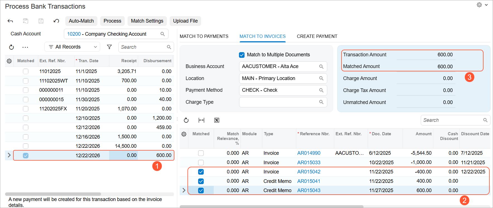
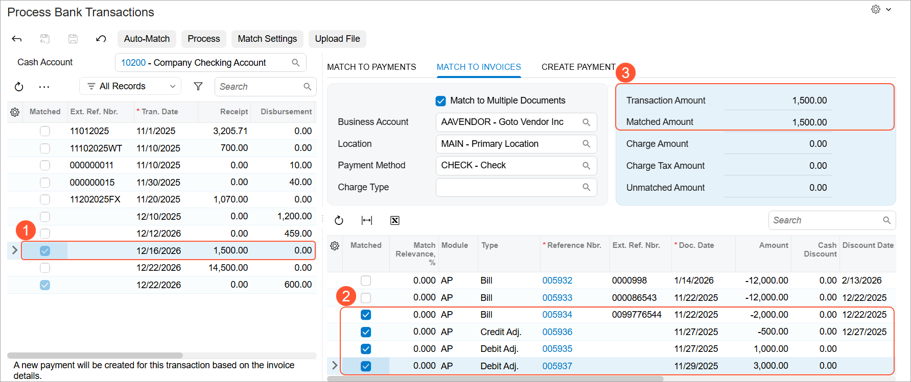

# Bank Reconciliation: Creating Refunds Directly from Bank Transactions {#_0daf3538-39d0-4c89-b606-357a84534f03 .concept}

In Acumatica ERP, you can apply refunds directly to bills and invoices—even when the total of related credits exceeds the document amount. Similarly, you can settle bills and invoices with refunds in a single transaction on the [Process Bank Transactions](CA_30_60_00.md) \(CA306000\) form.

## Customer Refunds from Disbursement Transactions { .section}

When matching a disbursement on the [Process Bank Transactions](CA_30_60_00.md) \(CA306000\) form, you can create a customer refund and match it to multiple document types. If the **Match to Multiple Documents** check box is selected on the **Match to Invoices** tab, you can match a refund to invoices, debit memos, credit memos, and overdue charges. The refund’s application history reflects all selected documents.

**Tip:** For credit memos to appear in the table on the **Match to Invoices** tab, you must select the **Allow Matching to Credit Memo** check box in the **Transaction Matching Settings** dialog box. It's selected automatically if on the [Cash Management Preferences](CA_10_10_00.md) \(CA101000\) form, the check box with the same name is selected on the **Bank Statements** tab \(**Disbursement Matching** section\).

Below you can see a $600 disbursement \(Item 1\) matched to three AR documents \(Item 2\). The transaction amount matches the total amount of the documents \(Item 3\). When you click **Process** on the form toolbar, the system creates a $600 customer refund.

You can also create customer refunds and match them to multiple documents when creating an AR payment for a disbursement on the **Create Payment** tab of the [Process Bank Transactions](CA_30_60_00.md) form.

For more details about customer refunds, see [Refunds: General Information](Finance_ProcessingCustomerRefunds_GeneralInfo.md).

## Vendor Refunds from Receipt Transactions { .section}

Similarly, when matching a receipt, you can create a vendor refund and apply it to bills, credit adjustments, and debit adjustments in one step. To be able to match a receipt to multiple AP documents, you must select the **Match to Multiple Documents** check box on the **Match to Payments** tab.

The system ensures that the matched document amounts balance with the bank transaction amount.

**Tip:** For debit adjustments to appear in the table on the **Match to Invoices** tab, you must select the **Allow Matching to Debit Adjustment** check box in the **Transaction Matching Settings** dialog box. It's selected automatically if on the [Cash Management Preferences](CA_10_10_00.md) \(CA101000\) form, the check box with the same name is selected on the **Bank Statements** tab \(**Disbursement Matching** section\).

Below you can see a $1500 receipt \(Item 1\) matched to four AP documents \(Item 2\). The transaction amount matches the total amount of the documents \(Item 3\). When you click **Process** on the form toolbar, the system creates a $1500 vendor refund.

You can also create vendor refunds and match them to multiple documents when creating an AP payment for a receipt on the **Create Payment** tab of the [Process Bank Transactions](CA_30_60_00.md) form.

For more details about vendor refunds, see [Debit and Credit Adjustments: Refunds](AP__con_Debit_Adjustments_Vendor_Refunds.md).

**Parent topic:**[Performing Bank Reconciliation](../UserGuide/Finance_Bank_Reconciliation_Mapref.md)

